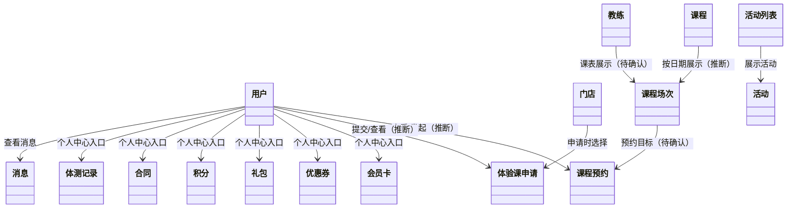

# 一水·瑜伽普拉提（微信小程序）· 页面与对象

## 1. 文档说明

本文从《页面与跳转梳理.md》提取用户端页面中出现的业务对象，并记录对象出现在哪些页面、页面能证明什么。本文描述的是页面证据下的业务概念，不代表已经确认数据库表、字段、实体基数或后台实现。

标记说明：

- **页面可见**：页面或交互明确出现该对象/信息。
- **业务推断**：为解释页面行为而归纳出的对象关系，仍需需求或接口确认。
- **TODO-待确认**：页面没有提供足够证据确认对象结构、规则或完整生命周期。

## 2. 业务对象清单

| 对象 | 对象说明（页面证据） | 出现页面 | 状态与边界 |
|---|---|---|---|
| 用户 | 小程序中的使用者；个人中心展示用户信息，部分入口要求登录。 | 首页、在约、我的、登录注册页 | **页面可见**。用户资料字段、账号合并规则及身份模型为 **TODO-待确认**。 |
| 门店 | 首页展示当前门店信息；支持切换门店、查看地址，体验课申请可选择门店。 | 首页、切换门店、申请体验、微信地图页 | **页面可见**。门店与课程、教练的归属及可选范围为 **TODO-待确认**。 |
| 课程 | 约课页按团课、精品课、私教课、特色课分类展示课程/教练内容；首页也展示可约课程。 | 首页、约课、约教练、在约 | **页面可见**。课程分类、课程定义与实际开课场次之间的关系为 **TODO-待确认**。 |
| 课程场次 / 排课 | 约课页有日期选择和课程列表，约教练页显示按日期浏览的课表。 | 约课、约教练 | 作为承载日期与课程安排的业务概念，属**业务推断**；场次、排课、容量及状态字段为 **TODO-待确认**。 |
| 教练 | 首页展示金牌教练；可从教练卡查看课程；约课页私教课中也展示教练卡。 | 首页、约课、约教练 | **页面可见**。教练与门店、课程、场次的关联规则为 **TODO-待确认**。 |
| 课程预约 | 在约页按预约状态筛选并展示预约卡片；约课页存在预约入口。 | 约课、在约 | **页面可见**。预约创建、取消、签到、候补、支付/扣卡及资格校验规则均为 **TODO-待确认**。 |
| 体验课申请 | 申请体验页收集姓名、手机号、留言和所选门店；我的体验课页展示申请状态。 | 首页、申请体验、我的体验课 | **页面可见**。页面体现申请待审核、审核通过、审核拒绝状态；审核角色、审核流程及申请限制为 **TODO-待确认**。 |
| 会员卡 | 我的页提供会员卡入口，截图目录包含会员卡页面。 | 我的、会员卡 | **页面可见**。卡种、余额/次数、有效期、消费规则与课程预约的关系为 **TODO-待确认**。 |
| 优惠券 | 我的页提供优惠券入口，截图目录包含优惠券页面。 | 我的、优惠券 | **页面可见**。领取、使用、适用范围、有效期及与预约的关系为 **TODO-待确认**。 |
| 礼包 | 我的页提供礼包入口，截图目录包含我的礼包页面。 | 我的、我的礼包 | **页面可见**。礼包内容、领取与核销规则为 **TODO-待确认**。 |
| 积分 | 我的页提供积分入口，截图目录包含积分页面。 | 我的、积分 | **页面可见**。积分来源、账户余额、变更明细和兑换规则为 **TODO-待确认**。 |
| 合同 | 我的页提供合同入口，截图目录包含我的合同页面。 | 我的、我的合同 | **页面可见**。合同类型、签署状态、签署主体及与会员卡的关系为 **TODO-待确认**。 |
| 体测记录 | 我的页提供体测入口。 | 我的、体测 | 入口已在页面梳理中记录；体测项目、记录结构、录入角色和历史记录为 **TODO-待确认**。 |
| 消息 | 我的页铃铛进入消息页，消息页展示消息列表/空态。 | 我的、消息 | **页面可见**。消息类型、已读状态、来源与通知渠道为 **TODO-待确认**。 |
| 活动 | 首页活动专区进入活动列表，列表可展示活动卡片。 | 首页、活动列表 | **页面可见**。活动详情、报名/参与及状态规则为 **TODO-待确认**。 |
| 分享海报 | 首页“我要打卡”进入海报页，页面支持轮播、下载和分享；二维码属于图片内容。 | 首页、分享海报 | **页面可见**。当前证据支持静态海报素材，不支持推定为动态分享记录或裂变对象。 |
| 用户协议 / 隐私协议 | 登录页和我的页可进入协议内容。 | 我的、快速登录、手机号登录/注册、协议页 | **页面可见**。它们是业务规则/告知内容，不据此推定为用户业务数据对象。 |

## 3. 页面与对象对应

| 页面 | 涉及对象 | 页面体现的业务动作或信息 |
|---|---|---|
| 首页 | 用户、门店、课程、教练、活动、分享海报 | 展示门店与课程/教练/活动入口；切换门店、查看地址、打开体验课/分享/活动/教练相关页面。 |
| 约课 | 课程、课程场次/排课、教练、课程预约、用户 | 按课程类型和日期浏览内容；预约操作受到登录拦截。 |
| 在约 | 用户、课程预约、课程/课程场次 | 按预约状态、课种和卡种筛选预约卡片；详情与取消操作尚待确认。 |
| 我的 | 用户、会员卡、优惠券、礼包、积分、合同、体测记录、消息、协议 | 汇总个人信息和个人资产/记录入口。 |
| 切换门店 | 门店、用户 | 选择门店；页面梳理记录该操作需要登录。 |
| 申请体验 | 用户、门店、体验课申请 | 填写申请信息并提交；可进入我的体验课查看进度。 |
| 我的体验课 | 用户、体验课申请 | 按申请审核状态查看记录。 |
| 分享海报 | 分享海报、用户（分享操作发起者） | 浏览海报，保存或调用微信分享能力。 |
| 活动列表 | 活动 | 浏览活动；活动详情入口尚待确认。 |
| 约教练 | 教练、课程、课程场次/排课 | 按教练查看课表；页面梳理记录课程卡无响应，当前为只读展示。 |
| 会员卡 / 优惠券 / 礼包 / 积分 / 合同 / 体测 | 对应个人资产或记录、用户 | 个人中心入口指向的对象详情；除截图/入口外，业务规则尚未确认。 |
| 消息 | 用户、消息 | 查看消息列表；当前记录为空态。 |
| 快速登录 / 手机号登录注册 / 忘记密码 | 用户、登录凭证、用户协议、隐私协议 | 微信手机号授权或手机号密码/验证码登录注册；凭证和账号规则不在页面证据范围内。 |

## 4. 对象关系（页面证据下的概念关系）

> 图中连线表达页面体现的业务语义或待确认的概念关系，不代表数据库外键、所有权模型或已确认的存储结构。会员卡、优惠券等连线仅表示个人中心入口关系。

## 5. 待确认问题

1. 课程、排课/场次和教练之间分别以什么业务关系组织？课程预约实际关联课程还是具体场次？
2. 预约的资格校验、名额、取消、签到、候补、支付/扣卡规则是什么？
3. 体验课申请与正式课程预约是否共享用户、门店或预约对象？申请审核由谁处理，审核后如何转化？
4. 会员卡、优惠券、礼包、积分和合同分别有哪些状态及生命周期，是否参与预约结算？
5. 体测记录由哪个角色创建/维护，包含哪些测量项目，是否需要历史追踪或审计？
6. 消息由哪些业务事件产生，是否包含已读状态、站内/微信通知及跳转目标？
7. 活动是否支持报名、名额、签到或优惠关联？
8. 页面梳理中的页面编号和部分跳转目标仍有旧编号残留；完成对象到页面编号的稳定映射前，本文暂用页面名称引用。
