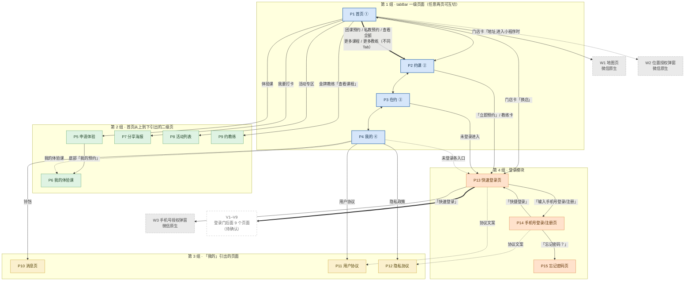

# 一水·瑜伽普拉提（微信小程序）· 页面与跳转梳理

**当前版本：v2.1**

| 版本 | 主要变化 |
|---|---|
| v1.x | 截图反推 → 多轮真机实测 → 地图页剔除非本产品页面 → 补齐登录模块 |
| v2.0 | 按"心智模型"重排全部编号与顺序；统一编码规则；补充登录后 `navigateBack` 约定 |
| **v2.1** | **§4.1 分层总览改用 Mermaid**；首页出口清单改回**严格空间顺序**；修正「小程序码」性质；移除 Q3 |

---

## 0. 阅读约定

### 0.2 编码规则

| 前缀 | 含义 | 英文锚点 |
|---|---|---|
| `P` | 自研页面 | **P**age |
| `V` | 待确认页面（未验证存在） | to **V**erify |
| `C` | 实测确认的跳转 | **C**onfirmed |
| `T` | 待确认的跳转 | **T**o verify |
| `N` | 实测无响应 / 非入口 | **N**o-op |
| `S` | 页内状态切换 / 页内交互（不换页） | **S**tate |
| `A` | 假设（非实测，按用户口径采纳） | **A**ssumption |

### 0.3 交付形态约定

文本、Mermaid、PlantUML

### 0.4 页面计数

| 口径 | 数量 |
|---|---|
| 截图张数 | 29 张 |
| **本产品自研页面** | **15 个** |

---

## 2. 页面清单

### 2.1 自研页面（15 个，`P`）

**排序逻辑**：4 个 一级页面 → 首页从上到下引出的页面 → 「我的」引出的页面 → 登录等琐碎模块。

#### 第 1 组 · 一级页面（4 个）

| 编号 | 页面 | 类型 | 截图 |
|---|---|---|---|
| P1 | 首页 | 一级页面 | `P1-首页(1).png` `P1-首页(2).png` `P1-首页(3).png` |
| P2 | 约课 | 一级页面 | `P2-约课.png` |
| P3 | 在约 | 一级页面 | `P3-在约.png` |
| P4 | 我的 | 一级页面 | `P4-我的.png` |

#### 第 2 组 · 由「首页」从上到下引出的页面（5 个）

首页视觉顺序：门店卡（头图 / 门店名 / 换店 / 地址）→ 公告栏 →「团课预约 / 私教预约」→「体验课 / 我要打卡 / 活动专区」→ 今日可约团课 → 热门课程 → 金牌教练 → 门店实景图区。

| 编号 | 页面 | 类型 | 截图 |
|---|---|---|---|
| P5 | 申请体验 | 二级页面 | `P1-首页-02-体验课.png` |
| P | 切换门店 | 二级页面 | `P1-首页-01-切换门店` |
| P6 | 我的体验课 | 二级页面 | `P2-约课-01-我的体验课.png` |
| P7 | 分享海报 | 二级页面 | `P1-首页-03-分享.png` |
| P8 | 活动列表 | 二级页面 | `P1-首页-04-活动列表.png` |
| P9 | 约教练 | 二级页面 | `P1-首页-06-约教练.png` |

#### 第 3 组 · 由「我的」从上到下引出的页面（3 个）

「我的」页视觉顺序：左上角铃铛 → 用户信息 → 四宫格 → 列表组一 → 列表组二（我的体验课 / 用户协议 / 隐私政策）。

| 编号 | 页面 | 截图 |
|---|---|---|
| P10 | 消息页 | `P4-我的-01-消息.png` |
| P11 | 我的会员卡 | `P4-我的-04-会员卡.png` |
| P12 | 我的优惠券 | `P4-我的-05-优惠券.png` |
| P13 | 我的礼包 | `P4-我的-06-我的礼包.png` |
| P14 | 我的积分 | `P4-我的-07-积分.png` |
| P15 | 我的合同 | `P4-我的-08-我的合同.png` |
| P16 | 已约课程 |`P2-约课-01-我的体验课.png`|
| P17 | 我的体测 ||
| P18 | 用户协议 | `P4-我的-09-用户协议.png` |
| P19 | 隐私协议 | `P4-我的-10-隐私协议.png` |

#### 第 4 组 · 登录模块

| 编号 | 页面 | 类型 | 截图 |
|---|---|---|---|
| P13 | 快速登录页 | 独立页 | `登录注册.png` |
| P14 | 手机号登录/注册页 | 独立页 | `登录注册-手机号登录.png` `登录注册-手机号注册.png` |
| P15 | 忘记密码页 | 独立页 | `登录注册-手机号登录-忘记密码.png` |

---

## 3. 跳转关系

### 3.1 实测确认（**C**onfirmed → `C`）

**排序逻辑**：先按来源页面在 tabBar 中的顺序，再按**来源页面内从上到下的空间顺序**；返回 / tabBar / 系统能力统一归纳到末尾。

#### （1）来源：首页 `P1`（按首页从上到下）

| 编号 | 触发元素（按空间顺序） | 目标 | 方式 |
|---|---|---|---|
| C1 | 门店卡「**换店**」 | P13 快速登录页 | 登录拦截 |
| C2 | 门店卡「**地址**」 | **W1 微信内置地图页** | 调起微信原生页 |
| C3 | 「**团课预约**」（第 3 行左） | P2 约课页（团课 Tab） | 跳转 |
| C4 | 「**私教预约**」（第 3 行右） | P2 约课页（私教课 Tab） | 跳转 |
| C5 | 「**体验课**」（第 4 行左） | **P5 申请体验** | 跳转 |
| C6 | 「**我要打卡**」（第 4 行中） | **P7 分享海报** | 跳转 |
| C7 | 「**活动专区**」（第 4 行右） | **P8 活动列表** | 跳转 |
| C8 | 今日可约团课·「**查看全部**」 | P2 约课页（团课 Tab） | 跳转 |
| C9 | 热门课程·「**更多课程**」 | P2 约课页（团课 Tab） | 跳转 |
| C10 | 金牌教练·「**更多教练**」 | P2 约课页（私教课 Tab） | 跳转 |
| C11 | 金牌教练·**教练卡本体** / 「**查看课程**」 | **P9 约教练**（带该教练参数） | 跳转 |

#### （2）来源：约课页 `P2`（按页内从上到下）

| 编号 | 触发元素 | 目标 | 方式 |
|---|---|---|---|
| C12 | 左上「**返回箭头**」 | 进入本页的来源页（从首页进则回首页） | 返回 |
| C13 | 私教课·「**立即预约**」 | P13 快速登录页 | 登录拦截 |
| C14 | 私教课·**教练卡本体** | P13 快速登录页 | 登录拦截 |

#### （3）来源：「在约」页 `P3`

| 编号 | 触发元素 | 目标 | 方式 |
|---|---|---|---|
| C15 | tabBar 入口（未登录时进入本页） | P13 快速登录页 | 登录拦截 |

#### （4）来源：我的页 `P4`（按页内从上到下）

| 编号 | 触发元素 | 目标 | 方式 |
|---|---|---|---|
| C16 | 左上角「**铃铛**」 | **P10 消息页** | 跳转 |
| C17 | 列表组二「**用户协议**」 | **P11 用户协议页** | 跳转 |
| C18 | 列表组二「**隐私政策**」 | **P12 隐私协议页** | 跳转 |

#### （5）来源：申请体验页 `P5`

| 编号 | 触发元素 | 目标 | 方式 |
|---|---|---|---|
| C19 | 底部「**我的预约**」 | **P6 我的体验课**（≠ 我的预约页） | 跳转 |

#### （6）来源：分享海报页 `P7`

| 编号 | 触发元素 | 目标 | 方式 |
|---|---|---|---|
| C20 | 左上「**首页**」 | P1 首页 | 跳转 |

#### （7）来源：登录模块 `P13 / P14`（按页内从上到下）

| 编号 | 触发元素 | 目标 | 方式 |
|---|---|---|---|
| C21 | 快速登录页「**快速登录**」 | **W3 手机号授权弹窗** | 调起微信原生弹窗 |
| C22 | 快速登录页「**输入手机号登录/注册**」 | **P14 手机号登录/注册页** | 跳转 |
| C23 | 快速登录页协议文案「**用户协议**」 | P11 用户协议页 | 跳转（高置信，同文案同行为） |
| C24 | 快速登录页协议文案「**隐私政策**」 | P12 隐私协议页 | 跳转（高置信） |
| C25 | 手机号登录/注册页「**快捷登录**」(左下) | **P13 快速登录页**（回到入口，形成闭环） | 跳转 |
| C26 | 手机号登录/注册页「**忘记密码？**」(右下) | **P15 忘记密码页** | 跳转 |
| C27 | 手机号登录/注册页协议文案 | P11 / P12 | 跳转（高置信） |

#### （8）归纳 · 各二级页「返回」

| 编号 | 来源页 | 目标 |
|---|---|---|
| C28 | P5 申请体验页 | 上一页 |
| C29 | P9 约教练页 | 上一页 |
| C30 | P8 活动列表页 | 上一页 |
| C31 | P6 我的体验课页 | 上一页 |
| C32 | P10 消息页 | 上一页 |
| C33 | P11 用户协议页 | 上一页 / 首页（微信原生「返回 / 首页」） |
| C34 | P12 隐私协议页 | 上一页 / 首页（微信原生「返回 / 首页」） |
| C35 | P13 快速登录页 | 上一页 / 首页（微信原生「返回 / 首页」） |
| C36 | P14 手机号登录/注册页 | 上一页 / 首页（微信原生「返回 / 首页」） |
| C37 | P15 忘记密码页 | 上一页 / 首页（微信原生「返回 / 首页」） |
| C38 | W1 地图页 | 上一页（微信原生悬浮返回） |

#### （9）归纳 · tabBar 互通

| 编号 | 说明 |
|---|---|
| C39 | P1 首页 ⇄ P2 约课 ⇄ P3 在约 ⇄ P4 我的（**任意两页可互相切换**） |

#### （10）归纳 · 微信系统能力

| 编号 | 触发元素 | 行为 |
|---|---|---|
| C40 | 右上角「**···**」 | 转发 / 分享（微信原生菜单） |
| C41 | 分享海报页「**下载**」/「**分享**」 | 保存相册 / 微信转发 |

> ⚠️ **修正**：分享海报页右下角的**小程序码是「海报图片自带」的内容**，**不是微信功能、也不是本产品功能**。它是静态图片的一部分，**换一张海报图就没有了**。因此它不在本表中。

### 3.3 实测「无响应」与「非入口」（**N**o-op → `N`）

| 编号 | 页面 | 元素 | 结果 |
|---|---|---|---|
| N1 | P1 首页 | 门店卡「**头图 / 图片**」 | **点击无任何响应**（可左右滑动，但不是轮播） |
| N2 | P1 首页 | 门店卡「**门店名**」 | **点击无任何响应** |
| N3 | P1 首页 | **公告栏** | **不是入口**，是服务端数据驱动的动态滚动展示区（有「加载中」态） |
| N4 | P9 约教练页 | **课程卡片** | **点击无任何响应** → 该页为**只读课表** |
| N5 | P9 约教练页 | 「**教练相册**」 | **无内容、不可点**（几个教练都没相册图）。用户判断：内容应属后台可配置项（假设 A5） |
| N6 | P2 约课页 | **团课 / 精品课 / 特色课** Tab | 空态「**暂无数据**」（换日期后仍无数据） |

> ✅ **已修正的误读**：曾把「我的」页左上角图标记为「免打扰 / 静音图标」。**实际是消息铃铛，点击进入消息页**（v1.8 修正）。
>
> ❌ **已撤销的误判**：曾记录「申请体验·选择门店选不出门店」并疑似缺陷，**实际是断网假象**。联网后门店**可上下滚动切换**，集中在上海市。

### 3.4 待确认（**T**o verify → `T`）

| 编号 | 来源页 | 触发元素 | 推测目标 |
|---|---|---|---|
| T1 | P4 我的 | 未登录头像 | P13 快速登录页 |
| T2 | P4 我的 | 四宫格：会员卡 / 优惠券 / 礼包 / 积分 | V2–V5 |
| T3 | P4 我的 | 列表组一：合同 / 已约课程 / 体测 | V6–V8 |
| T4 | P4 我的 | 列表组二：「我的体验课」 | P6（**假设 A2：同一页**） |
| T5 | P2 约课页（**登录后**） | 「立即预约」/ 教练卡 | V9 预约确认 |
| T6 | P3 在约 | 预约卡片（有数据时） | 预约详情 / 取消预约 |
| T7 | P5 申请体验页 | 填完手机号后提交「立即预约」 | V9（**假设 A3：预约成功页**） |
| T8 | P8 活动列表页 | 活动卡片（有数据时） | 活动详情 |
| T9 | P14 手机号登录/注册页 | 「登录」/「注册」提交成功之后 | **回触发登录的来源页（假设 A7）** |
| T10 | P13 快速登录页 | 「快速登录」授权「允许」之后 | **回触发登录的来源页（假设 A7）** |
| T11 | P15 忘记密码页 | 「修改密码」提交后 | 成功提示 / 返回登录 |

### 3.5 页内状态切换 / 页内交互（**S**tate → `S`）

| 编号 | 页面 | 控件 | 取值 |
|---|---|---|---|
| S1 | P1 首页 | 门店卡片头图 | 可左右滑动（多张图），**但不是自动轮播图** |
| S2 | P2 约课页 | 课程类型 Tab | 团课 / 精品课 / 私教课 / 特色课 |
| S3 | P2 约课页 | 日期条 | **今天起 14 天可横向滑动**（实测 9/20 → 10/3）。**选中日**=带勾的大圆圈；**未选中日**=小圆点（**无业务含义**） |
| S4 | P3 在约 | 状态 Tab | 全部 / 已预约 / 已取消 / 已签到 |
| S5 | P3 在约 | 课种下拉 / 卡种下拉 | 按课种、卡种筛选 |
| S6 | P5 申请体验页 | 「选择门店」 | **页内滚动选择器**（上海门店）；选择后主按钮由置灰变蓝 |
| S7 | P5 申请体验页 | 必填校验 | 数据不完整时点提交，表单下方出现提示 |
| S8 | P6 我的体验课 | 状态 Tab | 全部 / 申请待审核 / 审核通过 / 审核拒绝 |
| S9 | P7 分享海报页 | 海报轮播 | 可左右滑动切换多张 |
| S10 | P9 约教练页 | 课程类型 Tab | 团课 / 精品课 / 私教课 / 特色课（与约课页同构） |
| S11 | P11 用户协议页 / P12 隐私协议页 | 正文滚动 | 长文可上下滚动 |
| S12 | P13 快速登录页 | 协议勾选框 | **默认未勾选** |
| S13 | P14 手机号登录/注册页 | 顶部「登录 / 注册」分段切换 | **同一页面的两个 Tab** |
| S14 | P14 手机号登录/注册页 | 协议勾选框 | **默认未勾选**（两个 Tab 下都有） |
| S15 | P14 手机号登录/注册页、P15 忘记密码页 | 密码可见性切换 | 密码框内有**眼睛图标**（显示/隐藏密码） |
| S16 | P15 忘记密码页 | 「修改密码」按钮 | **未填时置灰** |

---

## 4. 跳转地图

> **图例**：`───→` 实测确认 ｜ `···→` 待确认 ｜ `✗` 无响应 / 非入口 ｜ `【】` 门或非本产品页 ｜ `◇` 页内交互（不换页）

### 4.1 分层总览（Mermaid）



> **图例**：蓝=tabBar 一级页面 ｜ 绿=首页引出的二级页 ｜ 黄=「我的」引出的页面 ｜ 橙=登录模块 ｜ 灰虚线=微信原生（非本产品） ｜ 白虚线=V1–V9 待确认
> **线型**：粗实线=主入口 ｜ 实线=实测确认 ｜ 虚线=待确认 / 假设
> **说明**：Mermaid 是纯文本代码，在上面渲染成图；**本阶段以代码（文字）为准**，后续出图时直接用这段代码渲染。

### 4.2 逐页出口清单

> **顺序 = 页面编号顺序 P1 → P15**，与 §2.1 完全一致；每个页面内部**严格按视觉从上到下**。

**P1 首页**（出口最密集，按页面从上到下）

```
P1 首页
├─ 门店卡片
│   ├─ ◇ 头图 / 图片 ──── 可左右滑（多张），但点击无响应；非自动轮播
│   ├─ ✗ 门店名 ──────── 点击无响应
│   ├─「换店」─────────────────────→ 【快速登录页 P13】
│   └─「地址」─────────────────────→ 【地图页 W1】微信原生
├─ ✗ 公告栏 ─────────────────────── 不是入口（服务端动态滚动展示区）
├─「团课预约」─────────────────────→ 约课页 P2（落在【团课 Tab】）
├─「私教预约」─────────────────────→ 约课页 P2（落在【私教课 Tab】）
├─「体验课」───────────────────────→ 申请体验 P5
├─「我要打卡」─────────────────────→ 分享海报 P7
├─「活动专区」─────────────────────→ 活动列表 P8
├─「查看全部」(今日可约团课)───────→ 约课页 P2（落在【团课 Tab】）
├─「更多课程」(热门课程)───────────→ 约课页 P2（落在【团课 Tab】）
├─「更多教练」(金牌教练)───────────→ 约课页 P2（落在【私教课 Tab】）
├─ 教练卡本体 /「查看课程」────────→ 约教练 P9（带该教练参数）
├─ 门店实景图区 ─────────────────── 静态图片展示（实测未发现交互）
├─ tabBar ─────────────────────────→ 约课 P2 / 在约 P3 / 我的 P4
└─ ◎ 进入小程序时 ─────────────────→ 【位置授权弹窗 W2】微信原生
```

**P2 约课**（全产品业务枢纽）

```
P2 约课
├─ 左上「返回箭头」───────────────→ 回进入本页的来源页（从首页进则回首页）
├─ ◇ 品类 Tab：团课 / 精品课 / 私教课 / 特色课
│     ├─ 团课、精品课、特色课 ──→ 空态「暂无数据」
│     └─ 私教课 ──────────────→ 教练卡列表（头像 / 名称 / 描述）
├─ ◇ 日期条：今天起 14 天可横向滑动
├─「立即预约」(私教课)────────────→ 【快速登录页 P13】
├─ 教练卡本体 (私教课)────────────→ 【快速登录页 P13】
└─ tabBar ────────────────────────→ 首页 P1 / 在约 P3 / 我的 P4
```

**P3 在约**（tabBar 文案「已约」）

```
P3 在约
├─ 未登录进入 ────────────────────→ 【快速登录页 P13】
├─ ◇ 状态 Tab：全部 / 已预约 / 已取消 / 已签到
├─ ◇ 筛选：课种下拉 + 卡种下拉
├─ 预约卡片（有数据时）···········→ ❓ 预约详情 / 取消预约
└─ tabBar ────────────────────────→ 首页 P1 / 约课 P2 / 我的 P4
```

**P4 我的**（按页内从上到下）

```
P4 我的
├─ 左上角「铃铛」─────────────────→ 消息页 P10
├─ 未登录头像 ────────────────────→ ❓【快速登录页 P13】
├─ 我的会员卡 / 我的优惠券
│  我的礼包 / 我的积分 ···········→ ❓ V2–V5（需登录）
├─ 我的合同 / 已约课程 / 我的体测 ·→ ❓ V6–V8（需登录）
├─ 我的体验课 ────────────────────→ 我的体验课 P6（假设 A2：同一页）
├─「用户协议」────────────────────→ 用户协议页 P11
├─「隐私政策」────────────────────→ 隐私协议页 P12
└─ tabBar ────────────────────────→ 首页 P1 / 约课 P2 / 我的预约 P3
```

**P5 申请体验**（二级页 · 表单）

```
P5 申请体验
├─ ◇「选择门店」── 页内滚动选择器（门店全部在上海市）
│     └─ 选择后主按钮由【置灰】变【蓝色可点】
├─ ◇ 姓名 / 手机号码* / 留言 ── 输入项
│     └─ 必填校验：数据不完整时点提交，表单下方出现提示
├─ 底部「我的预约」───────────────→ 我的体验课 P6（≠ 我的预约页）
├─「立即预约」提交 ···············→ ❓ V9 预约成功页（假设 A3）
│                                    （页上有「返回首页」，后续可查看进度）
└─ 左上「← 返回」─────────────────→ 上一页
```

**P6 我的体验课**（二级页 · 4 个状态 Tab）

```
P6 我的体验课
├─ ◇ 状态 Tab：全部 / 申请待审核 / 审核通过 / 审核拒绝
│     └─ 说明体验课走【审核制】，不是即时预约
├─ 空态「暂无数据」
├─ 从「我的」页「我的体验课」也可进入（假设 A2：同一页）
└─ 左上「← 返回」─────────────────→ 上一页
```

**P7 分享海报**（二级页 · 轮播）

```
P7 分享海报
├─ ◇ 海报轮播 ── 可左右滑动切换多张
├─「下载」/「分享」───────────────→ 微信系统能力
├─ 右下角小程序码 ── 属【海报图片自带】，非微信功能（换图即无）
└─ 左上「首页」───────────────────→ 首页 P1
```

**P8 活动列表**（二级页）

```
P8 活动列表
├─ 空态「暂无数据」
├─ 活动卡片（有数据时）···········→ ❓ 活动详情
└─ 左上「← 返回」─────────────────→ 上一页
```

**P9 约教练**（二级页 · 带教练参数）

```
P9 约教练
├─ 顶部教练名随来源变化（点"媛媛"的查看课程就显示媛媛）
├─ ◇ 品类 Tab：团课 / 精品课 / 私教课 / 特色课
├─ 课程卡（哈他瑜伽 / 流瑜伽 / 核心流瑜伽）
│     └─ ✗ 点击无任何响应 ──→ 该页是【只读课表】，无预约入口
├─「教练相册」──────────────────── ✗ 无内容、不可点（内容应属后台可配置）
└─ 左上「← 返回」─────────────────→ 上一页
```

**P10 消息页**（二级页）

```
P10 消息页
├─ 空态「暂无数据」
└─ 左上「← 」────────────────────→ 上一页
```

**P11 用户协议页**（二级页 · 长文）

```
P11 用户协议页
├─ 标题「用户协议」；更新日期 / 生效日期 = 2024-09-19
├─ 正文：运营主体「上海翼水忻河体育管理有限公司」旗下「一水瑜伽」
├─ ◇ 正文可上下滚动
├─ 入口有 3 处：我的页 / 快速登录页协议文案 / 手机号登录注册页协议文案
└─ 左上微信原生「返回 / 首页」────→ 上一页 / 首页
```

**P12 隐私协议页**（二级页 · 长文）

```
P12 隐私协议页
├─ 标题「隐私协议」；更新日期 / 生效日期 = 2024-12-02
├─ 正文：定义解释、个人信息收集声明、收集方式与权限范围
├─ ◇ 正文可上下滚动
├─ 入口有 3 处：我的页 / 快速登录页协议文案 / 手机号登录注册页协议文案
└─ 左上微信原生「返回 / 首页」────→ 上一页 / 首页
```

**P13 快速登录页**（登录模块入口）

```
P13 快速登录页
├─ 品牌区：logo（瑜伽人像 + 水滴波纹）/「一水·瑜伽普拉提」/「练瑜伽普拉提就来一水」
├─「快速登录」(蓝色主按钮) ───────→ 【手机号授权弹窗 W3】微信原生
│     └─ 弹窗内容：申请获取并验证你的手机号 / 关联你的账户信息
│                  / 175****0993 微信绑定号码 / 不允许 / 使用其它号码
├─「输入手机号登录/注册」─────────→ 手机号登录/注册页 P14
├─ ◇「已阅读并同意…」勾选框 ── 默认未勾选
│     ├─「用户协议」──────────────→ 用户协议页 P11
│     └─「隐私政策」──────────────→ 隐私协议页 P12
├─ 登录成功 → 回触发登录的来源页（假设 A7：navigateBack）
└─ 左上微信原生「返回 / 首页」────→ 上一页 / 首页
```

**P14 手机号登录/注册页**（一个页面 · 两个 Tab）

```
P14 手机号登录/注册页
├─ ◇ 顶部「登录 | 注册」分段切换
│    ├─【登录 Tab】手机号 + 密码(眼睛图标) + [登录]
│    │     ├─「快捷登录」(左下角) ──→ 快速登录页 P13  ← 回到入口，形成闭环
│    │     └─「忘记密码？」(右下角) → 忘记密码页 P15
│    └─【注册 Tab】手机号 + 验证码[获取验证码] + 密码 + [注册]
├─ ◇ 协议勾选框（两个 Tab 下都有，默认未勾选）
│     ├─「用户协议」──────────────→ 用户协议页 P11
│     └─「隐私政策」──────────────→ 隐私协议页 P12
├─ [登录]/[注册] 提交 ············→ ❓ 回触发登录的来源页（假设 A7）
└─ 左上微信原生「返回 / 首页」────→ 上一页 / 首页
```

**P15 忘记密码页**（独立页）

```
P15 忘记密码页
├─ 手机号 + 验证码[获取验证码] + 新密码(眼睛图标) + 再次输入新密码
├─ ◇「修改密码」按钮 ── 未填时置灰
├─「修改密码」提交 ···············→ ❓ 成功提示 / 返回登录
└─ 左上微信原生「返回 / 首页」────→ 上一页 / 首页
```

**W1 地图页**（微信原生页 · 非本产品开发）

```
W1 地图页（wx.openLocation 调起）
├─ 底部门店卡：店名 / 地址 / 距你 6 公里 / 20 分钟
├─「导航」/「打车」───────────────→ 微信内置地图页能力
├─「收藏」────────────────────────→ 微信收藏
├─「更多」────────────────────────→ 唤醒腾讯地图小程序
└─ 悬浮圆形「返回」───────────────→ 上一页
```

### 4.3 反向索引：每个页面「从哪来」

> 归纳用。**顺序同样按目标页面编号 P1 → P15**。

| 目标页 | 可从哪些入口到达 |
|---|---|
| P1 首页 | tabBar；分享海报「首页」；各二级页「返回」；协议页「首页」按钮；地图页返回 |
| P2 约课 | tabBar；首页「团课预约」「查看全部」「更多课程」（团课 Tab）；首页「私教预约」「更多教练」（私教课 Tab） |
| P3 在约 | tabBar「已约」（未登录被拦） |
| P4 我的 | tabBar「我的」 |
| P5 申请体验 | 首页「体验课」 |
| P6 我的体验课 | 申请体验页底部「我的预约」；我的页「我的体验课」（假设 A2） |
| P7 分享海报 | 首页「我要打卡」 |
| P8 活动列表 | 首页「活动专区」 |
| P9 约教练 | 首页 教练卡本体 /「查看课程」 |
| P10 消息页 | 我的页左上角铃铛 |
| P11 用户协议页 | 我的页「用户协议」；快速登录页协议文案（高置信）；手机号登录/注册页协议文案（高置信） |
| P12 隐私协议页 | 我的页「隐私政策」；快速登录页协议文案（高置信）；手机号登录/注册页协议文案（高置信） |
| P13 快速登录页 | 首页「换店」；约课页「立即预约」/教练卡；tabBar「已约」；**手机号登录/注册页「快捷登录」**；我的页未登录头像（待确认） |
| P14 手机号登录/注册页 | 快速登录页「输入手机号登录/注册」 |
| P15 忘记密码页 | 手机号登录/注册页「忘记密码？」 |
| W1 地图页 | 首页 门店卡「地址」 |
| W2 位置授权弹窗 | 进入小程序时自动请求 |
| W3 手机号授权弹窗 | 快速登录页「快速登录」 |

---
