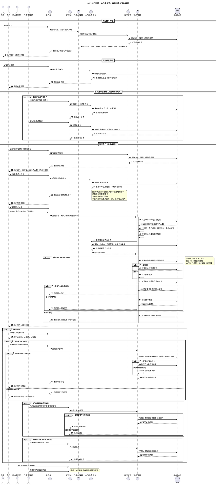
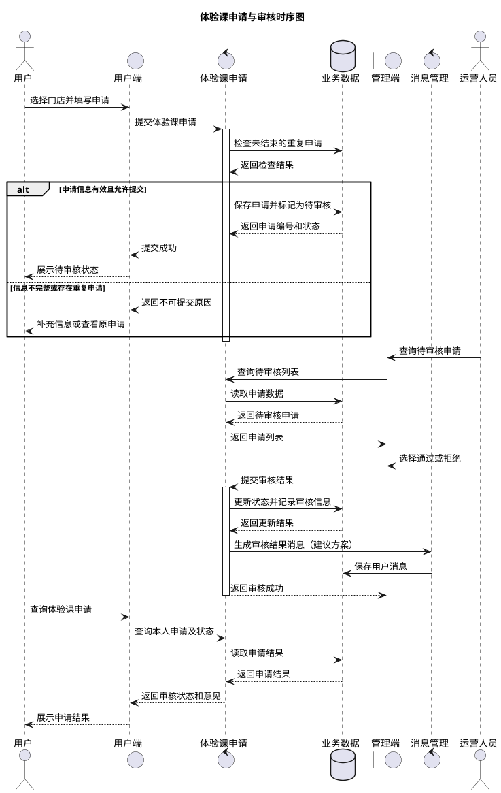
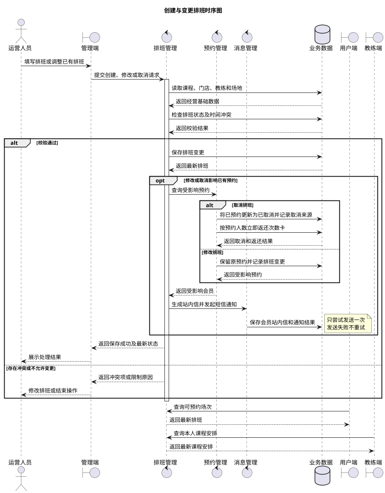
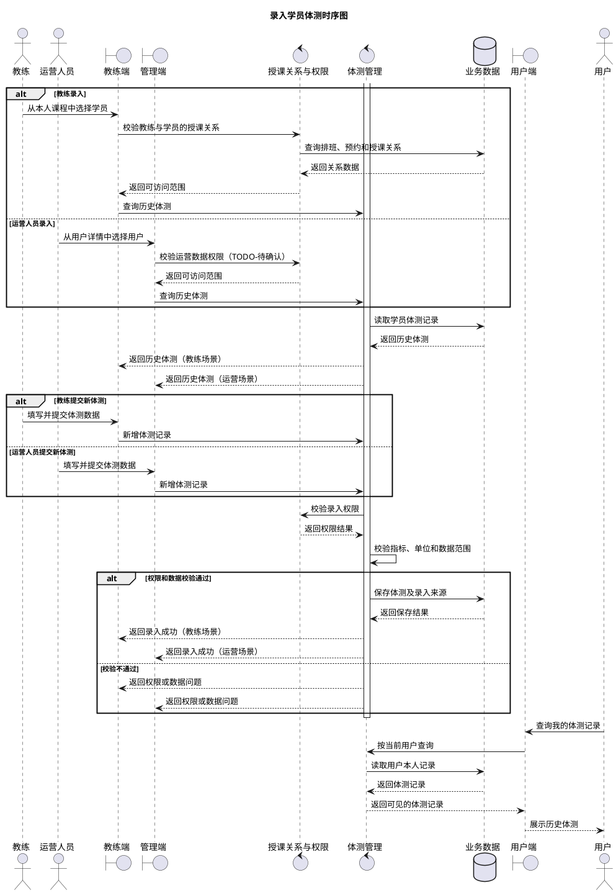

# 瑜伽普拉提概要设计文档

**版本：v0.5**（2026-09-29）
**本版范围：仅运行架构**

> 本文依据 `docs/需求分析/需求分析.md` v0.9 编写。当前项目处于需求与原型阶段，图中的“用户端”“管理端”及各业务模块表示逻辑职责，不代表已经确定的进程、微服务或部署单元。

# 3、运行架构

## 3.1 设计口径

运行架构用于说明用户端、平台管理员、门店管理员、管理端及核心业务模块在 MVP 主流程中的协作关系。本版只展开一条可以端到端验证的主流程：

1. 游客浏览门店、课程和当天排班；
2. 游客登录成为会员；首次没有可用卡时，门店管理员完成开卡和激活；
3. 系统按课种筛选已激活且可用的会员卡，会员确认候选卡；
4. 会员填写预约人数；预约模块通过 MySQL 行级锁控制排班容量，并在同一事务内生成一条预约记录、按预约人数扣减次数卡及更新人数；期限卡只校验有效期；
5. 门店管理员在预约管理中处理本店代取消和手工签到。

简单的单端查询和基础资料维护不逐项绘制时序图，其运行方式统一为“客户端发起请求—业务模块校验权限和参数—读取或写入业务数据—返回处理结果”。待业务规则和技术架构稳定后，再在详细设计中补充接口、事务、缓存、消息队列和数据库表等实现细节。

本文沿用需求分析中的三类标记：

| 标记 | 含义 |
|---|---|
| **已确认事实** | 来自当前功能清单或现有小程序实测，可作为本版设计输入 |
| **建议方案** | 为形成完整业务闭环提出的设计，确认后才能进入详细设计 |
| **TODO-待确认** | 现有资料未明确，可能改变流程或数据边界的事项 |

## 3.2 核心流程与职责概览

| 核心流程 | 发起端 | 主要业务模块 | 结果使用方 |
|---|---|---|---|
| MVP 预约主链路 | 用户端、门店管理员 | 门店与课程、排班、会员与会员卡、预约 | 会员、门店管理员 |
| 基础资料维护 | 管理端 | 门店、课程、教练、排班 | 用户端、预约模块 |
| 会员卡开卡与激活 | 管理端 | 会员与会员卡 | 会员、预约模块 |
| 预约取消与签到 | 用户端、门店管理员 | 预约、会员与会员卡、排班 | 会员、门店管理员 |

> **已确认事实：** 排班关联门店、课程和教练，并向用户端提供当天课程、课种、总容量、已预约人数、时间和地点。预约关联会员、排班和会员卡。
> **已确认规则：** 系统按课种、激活状态、剩余次数或有效期筛选候选会员卡，多张候选卡默认选中列表第一张。同一会员对同一排班只能有一条预约记录，但一条记录可以包含多人；次数卡按预约人数扣减和返还，期限卡只校验有效期。预约必须校验容量，并通过 MySQL 行级锁和事务防止并发超卖。会员和门店管理员均不能突破开课前两小时的取消限制。

## 3.3 系统核心流程时序图

### 3.3.1 MVP 核心链路 Happy Path 时序图

**已确认事实：** 游客和会员可以浏览门店、课程及当天排班；排班关联门店、课程和教练并设置开始时间、结束时间和总容量；门店管理员首次为会员开卡并激活，激活后后续预约不需要管理员介入。团课和精品课可以使用普拉提次数卡或适用的期限卡，私教课只能使用私教次数卡。

**设计方案：** 会员卡模块先返回符合课种的已激活可用卡；只有一张时自动选中，多张时展示全部候选卡并默认选中列表第一张。预约提交后，预约模块在事务中对排班记录加 MySQL 行级锁，按预约人数重新校验容量和会员卡状态，原子完成一条预约记录、次数卡按预约人数扣减及已预约人数更新；期限卡只校验有效期，预约记录本身代表本次使用。

**已确认规则：** 同一会员对同一排班只能生成一条预约记录，但记录可以包含多人；次数卡预约几人扣几次，取消时按预约人数返还；期限卡只校验有效期，预约记录本身代表使用。任一步失败则预约、会员卡和人数变更整体回滚。会员和门店管理员都不能在开课前两小时内取消。平台管理员和门店管理员本期只作为页面角色，菜单、按钮和数据权限后续设计。

### 3.3.2 体验课申请与审核时序图（本期不纳入）

> 以下内容为历史候选流程，本期不进入 MVP、Mock 数据或开发验收范围。

**已确认事实：** 用户向指定门店提交体验课申请并查询审核状态；运营人员可以查询申请并将其设置为通过或拒绝。

**建议方案：** 申请提交时进入“待审核”，审核操作记录审核人、审核时间和审核意见，结果通过站内消息通知用户。

**TODO-待确认：** 申请是否必须登录、重复申请的判断范围、拒绝是否必须填写原因，以及审核通过后是否自动形成课程预约。

### 3.3.3 创建与变更排班时序图（辅助草稿）

> 本节保留原排班变更草稿，当前 MVP 以 3.3.1 的核心链路和需求分析中的门店/课程/教练/排班关系为准；排班表字段及预约人数同步规则待详细设计重画。

**已确认事实：** 运营人员可以为课程创建排班，修改或取消尚未完成的排班；用户根据排班查询可预约课程；教练查询自己的课程安排。

**已确认规则：** 保存前校验课程、门店、教练、场地、时间和人数。排班修改影响已有预约时保留预约并发送短信和站内信；排班取消时，将关联的“已预约”记录自动更新为“已取消”，记录取消来源为“排班取消”，按预约人数立即返还次数卡，再发送短信和站内信。消息发送只尝试一次，失败不重试。

**TODO-待确认：** 教练和场地冲突规则，以及允许修改或取消排班的截止时间。

### 3.3.4 录入学员体测时序图（本期不纳入）

> 以下内容为历史候选流程，本期不进入 MVP、Mock 数据或开发验收范围。

**已确认事实：** 教练可以查询相关学员的体测并录入新记录；运营人员可以从用户侧查询并新增体测；用户只能查询自己的体测记录。

**建议方案：** 教练的学员访问范围由授课关系控制，运营用于线下补录或纠错；每条体测记录保留录入人、录入端和录入时间。

**TODO-待确认：** 体测指标和单位、附件支持、记录发布时点、修改与作废规则、历史版本留痕、运营人员的数据范围，以及健康数据的授权和保存期限。

## 3.4 非核心用例的运行方式

本版不为每个简单用例重复绘制时序图，按职责归纳如下：

| 用例类型 | 统一运行方式 | 关键约束 |
|---|---|---|
| 登录与账号 | 客户端提交身份凭证，账号认证模块验证后建立会话并返回身份信息 | 微信快捷登录依赖微信平台；手机号登录的具体认证方式仍待确认 |
| 门店、课程、教练和当天排班查询 | 客户端携带门店、日期等条件，业务模块读取并返回公开资料 | 游客和会员均可浏览；预约仍需会员身份和已激活会员卡 |
| 会员卡查询与激活 | 会员端查询本人卡片，管理端点击激活按钮 | 新增会员卡初始为未激活；激活按钮属于管理端操作 |
| 门店、课程、教练和排班维护 | 管理端提交新增或修改请求，业务模块校验关联关系后保存 | 本期先完成平台管理员和门店管理员页面，菜单、按钮、数据权限及操作日志暂不设计 |
| 预约与会员卡校验 | 用户端按课种取得候选会员卡、填写预约人数并确认，预约模块锁定排班后重新校验卡片和容量 | 同一会员同一排班一条记录；次数卡按预约人数扣减，期限卡只校验有效期 |
| 预约取消与签到 | 会员或门店管理员在允许时限内取消；门店管理员手工签到 | 取消不得突破开课前两小时；次数卡按预约人数返还，期限卡不处理次数 |

## 3.5 进入详细设计前的阻断项

以下事项会改变核心流程、状态或事务边界，应优先由产品和业务确认：

1. 教练和场地冲突规则；
2. 允许修改或取消排班的截止时间；
3. 会员卡重复激活处理。
