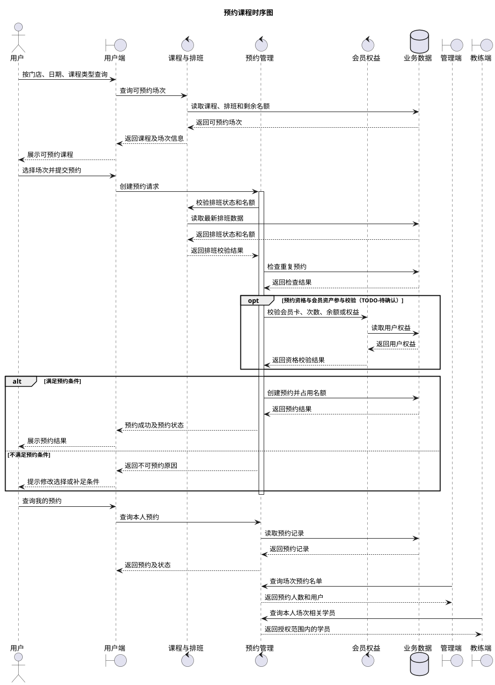
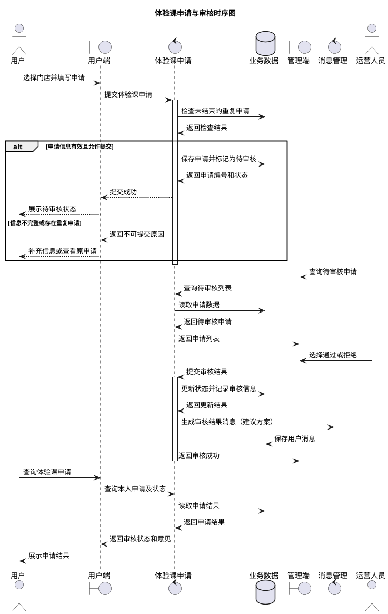
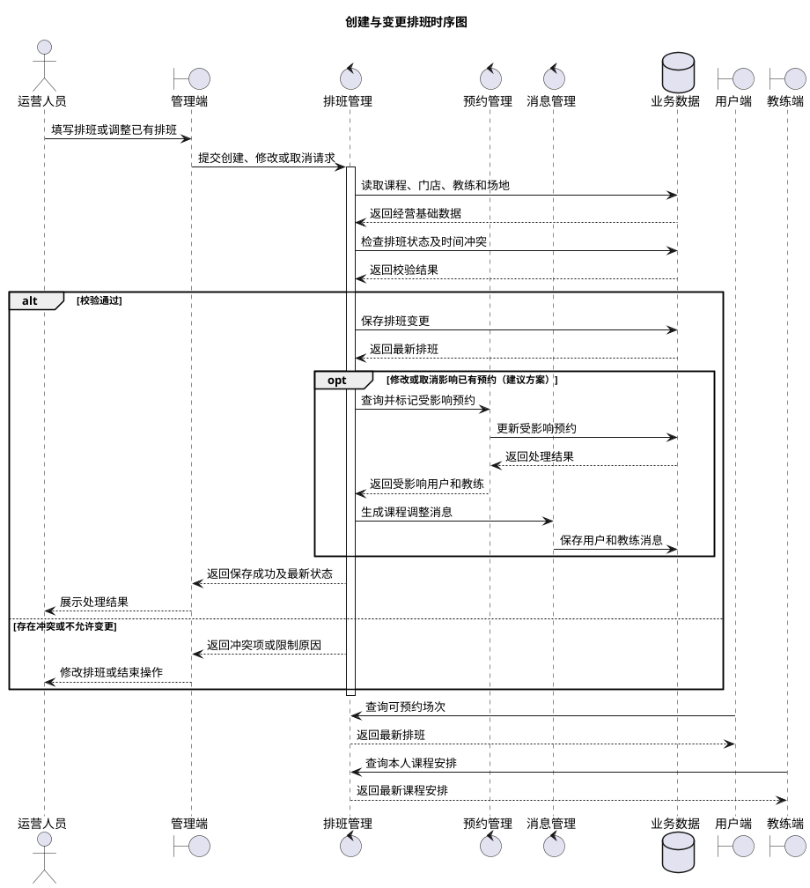
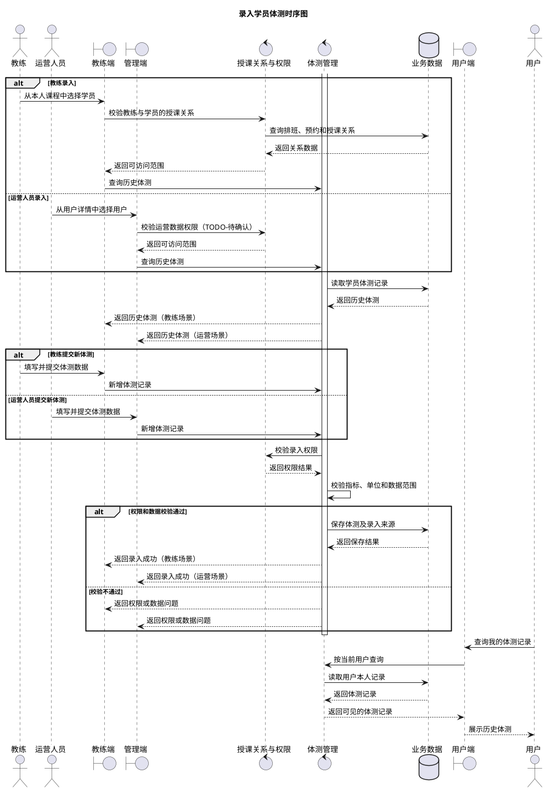

# 一水·瑜伽普拉提概要设计文档

**版本：v0.1**（2026-09-22）  
**本版范围：仅运行架构**

> 本文依据 `docs/需求分析/需求分析.md` v0.2 编写。当前项目处于需求与原型阶段，尚无可用于反向验证的应用代码，因此图中的“用户端”“教练端”“管理端”及各业务模块表示逻辑职责，不代表已经确定的进程、微服务或部署单元。

# 3、运行架构

## 3.1 设计口径

运行架构用于说明用户端、教练端、管理端及核心业务模块在主要业务流程中的协作关系。本版只展开需求分析中已经识别出的四条跨端核心流程：

1. 用户预约课程；
2. 用户申请、运营审核体验课；
3. 运营创建、修改或取消排班；
4. 教练或运营录入学员体测。

简单的单端查询和基础资料维护不逐项绘制时序图，其运行方式统一为“客户端发起请求—业务模块校验权限和参数—读取或写入业务数据—返回处理结果”。待业务规则和技术架构稳定后，再在详细设计中补充接口、事务、缓存、消息队列和数据库表等实现细节。

本文沿用需求分析中的三类标记：

| 标记 | 含义 |
|---|---|
| **已确认事实** | 来自当前功能清单或现有小程序实测，可作为本版设计输入 |
| **建议方案** | 为形成完整业务闭环提出的设计，确认后才能进入详细设计 |
| **TODO-待确认** | 现有资料未明确，可能改变流程或数据边界的事项 |

## 3.2 核心流程与职责概览

| 核心流程 | 发起端 | 主要业务模块 | 结果使用方 |
|---|---|---|---|
| 预约课程 | 用户端 | 课程与排班、预约管理 | 用户、运营人员、授课教练 |
| 体验课申请与审核 | 用户端、管理端 | 体验课申请、消息管理 | 用户、运营人员 |
| 创建与变更排班 | 管理端 | 排班管理、预约管理、消息管理 | 用户、教练、运营人员 |
| 录入学员体测 | 教练端、管理端 | 授课关系与权限、体测管理 | 用户、教练、运营人员 |

> **建议方案：** 预约关联具体排班场次，而不是直接关联课程基础信息；教练查看学员的范围由授课关系确定；业务状态变化通过消息管理形成站内通知。  
> **TODO-待确认：** 消息是同步生成还是异步投递、失败后如何补偿，以及各模块最终采用单体模块还是独立服务，均留到技术架构和详细设计阶段确定。

## 3.3 系统核心流程时序图

### 3.3.1 预约课程时序图

**已确认事实：** 用户可以查询课程、提交预约并查询预约状态；运营人员可以查询预约及场次名单；教练可以查看本人课程安排中的相关学员。

**建议方案：** 系统在创建预约前统一校验排班状态、剩余名额、重复预约和用户预约资格，并以服务端预约记录作为最终结果。

**TODO-待确认：** 预约是否需要支付或扣卡、名额占用时点、并发超额处理、重复预约限制、取消、签到、爽约和候补规则。以上规则会直接影响预约事务边界。

### 3.3.2 体验课申请与审核时序图

**已确认事实：** 用户向指定门店提交体验课申请并查询审核状态；运营人员可以查询申请并将其设置为通过或拒绝。

**建议方案：** 申请提交时进入“待审核”，审核操作记录审核人、审核时间和审核意见，结果通过站内消息通知用户。

**TODO-待确认：** 申请是否必须登录、重复申请的判断范围、拒绝是否必须填写原因，以及审核通过后是否自动形成课程预约。

### 3.3.3 创建与变更排班时序图

**已确认事实：** 运营人员可以为课程创建排班，修改或取消尚未完成的排班；用户根据排班查询可预约课程；教练查询自己的课程安排。

**建议方案：** 保存前校验课程、门店、教练、场地、时间和人数；排班变更影响已有预约时，识别受影响用户和教练并生成消息。

**TODO-待确认：** 教练和场地冲突规则、允许修改或取消的截止时间、排班取消后预约状态如何变化、是否返还会员资产，以及通知渠道和失败补偿方式。

### 3.3.4 录入学员体测时序图

**已确认事实：** 教练可以查询相关学员的体测并录入新记录；运营人员可以从用户侧查询并新增体测；用户只能查询自己的体测记录。

**建议方案：** 教练的学员访问范围由授课关系控制，运营用于线下补录或纠错；每条体测记录保留录入人、录入端和录入时间。

**TODO-待确认：** 体测指标和单位、附件支持、记录发布时点、修改与作废规则、历史版本留痕、运营人员的数据范围，以及健康数据的授权和保存期限。

## 3.4 非核心用例的运行方式

本版不为每个简单用例重复绘制时序图，按职责归纳如下：

| 用例类型 | 统一运行方式 | 关键约束 |
|---|---|---|
| 登录与账号 | 客户端提交身份凭证，账号认证模块验证后建立会话并返回身份信息 | 微信快捷登录依赖微信平台；手机号登录的具体认证方式仍待确认 |
| 公告、课程、教练及个人资产查询 | 客户端携带查询条件和当前身份，业务模块按数据范围读取并返回结果 | 用户只能查询本人资产；教练只能查询授课相关数据 |
| 门店、课程、教练及会员权益配置 | 管理端提交新增或修改请求，业务模块校验后保存并返回最新状态 | 管理端 RBAC、审批和操作审计尚未确认 |
| 公告、活动和消息发布 | 管理端维护内容和目标范围，内容或消息模块保存并向目标端提供查询 | 活动是否在用户端展示、消息自动触发范围和发送失败处理尚未确认 |
| 用户注销 | 用户端发起本人注销申请，账号模块验证身份并执行注销流程 | 冷静期、审批、数据保留和恢复规则尚未确认，暂不进入详细设计 |

## 3.5 进入详细设计前的阻断项

以下事项会改变核心流程、状态或事务边界，应优先由产品和业务确认：

1. 预约资格、支付或扣卡、名额占用、重复预约、取消、签到、爽约和候补规则；
2. 排班修改或取消对已有预约、会员资产及通知的处理规则；
3. 体验课审核通过后是否自动生成预约；
4. 教练查看学员的授权范围及手机号、体测等敏感数据边界；
5. 教练和运营共同录入体测时的分工、修改或作废权限及审计要求；
6. 管理端账号、角色、权限和数据范围控制；
7. 消息的自动触发场景、已读状态、投递方式及失败补偿。
