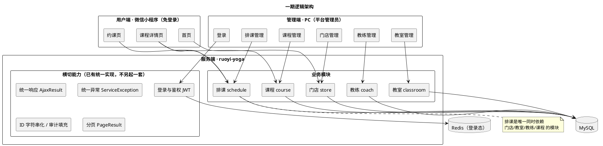
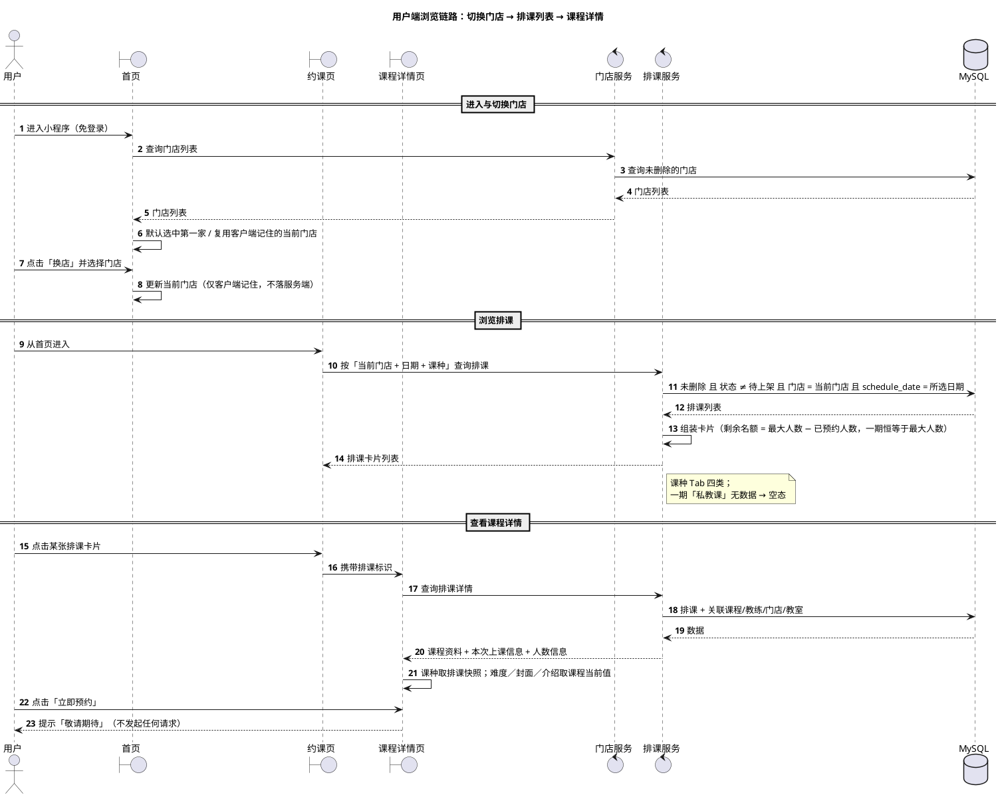
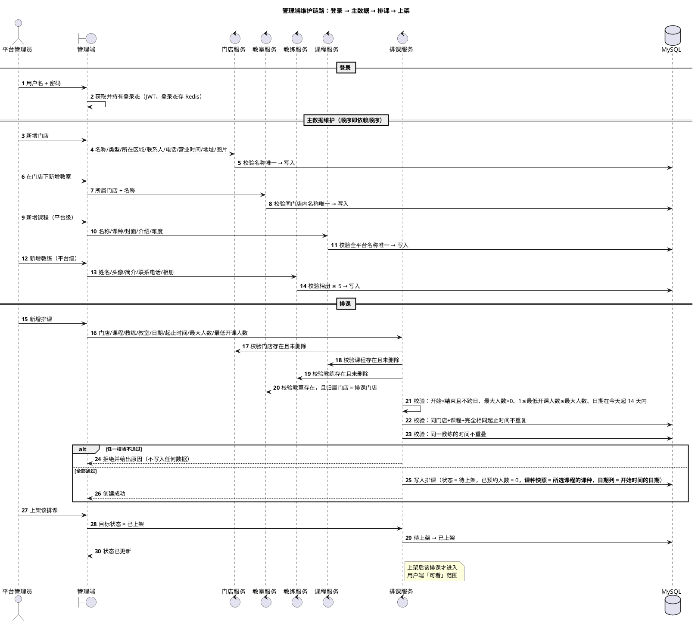
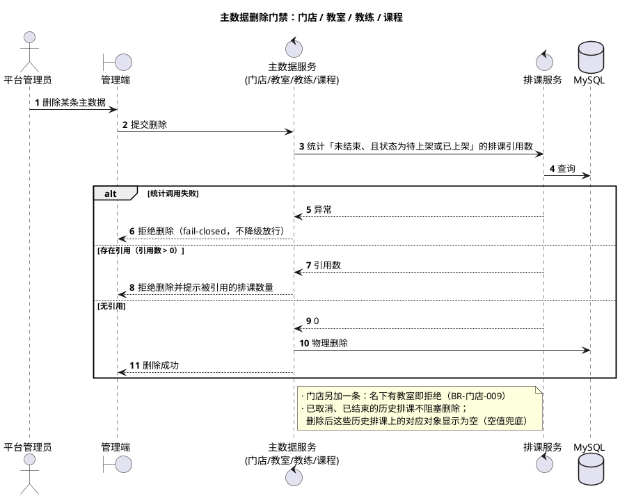
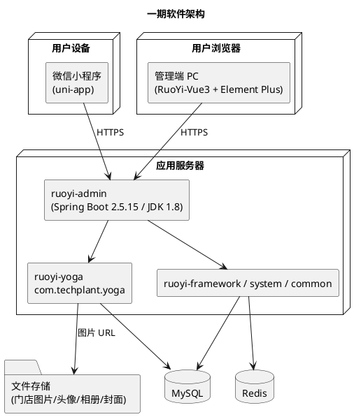

# 瑜伽普拉提概要设计文档

**版本：v2.0（重置版）**（2026-10-01）
**本版范围：** 一期 —— 门店、教室、教练、课程、排课 ＋ 用户端（免登录浏览）＋ 管理端（登录与五个管理模块）

> **依据：**
> 1. [`需求分析.md`](../需求分析/需求分析.md) v2.0 与 [`用例/`](../需求分析/用例/)（9 条用例，UC-001 ~ UC-009）；
> 2. [`业务规则.md`](../需求文档/业务规则.md) v2.1（本文只引用编号，不复制条文）；
> 3. `docs/产品分析/`（对标真实 App 的用户端实测截图与页面跳转梳理）。
>
> **说明：** 本文是**重置版**，与旧版（v0.8「仅运行架构」，内容是会员卡与预约链路）没有继承关系。旧版仍在 git 历史中。
> 图中的"用户端""管理端"与各业务模块表示**逻辑职责**，不代表已经确定的进程或部署单元。

---

# 1、引言

## 1.1 编写目的

本文说明一期在**逻辑架构、运行架构、物理架构与数据架构**上的总体设计，作为详细设计与编码开发的输入。

一期只解决一件事：**把"能看"做通**——管理端维护门店、教室、教练、课程并排出排课，用户端**免登录**按门店看到排课并进入课程详情。**一期不产生任何预约数据。**

## 1.2 面向对象

后端开发、管理端前端开发、用户端小程序开发、测试与验收人员。

## 1.3 参考文档

| 文档 | 用途 |
|---|---|
| [`业务规则.md`](../需求文档/业务规则.md) v2.1 | **业务口径依据**（`BR-*`） |
| [`需求分析.md`](../需求分析/需求分析.md) v2.0、[`用例总览.md`](../需求分析/用例总览.md) | 功能结构、参与者边界、领域类图、用例 |
| [`功能清单汇总.md`](../需求文档/功能清单汇总.md) v2.0 | 一期 51 项功能与优先级 |
| `docs/产品分析/` | 用户端界面与跳转的第一手证据 |
| [`backend/AGENTS.md`](../../backend/AGENTS.md) | **后端技术栈与横切能力的现行口径**（统一响应、统一异常、ID 序列化、审计填充、分页、MyBatis-Plus 装配） |
| [`frontend/uni-app/AGENTS.md`](../../frontend/uni-app/AGENTS.md) | 用户端小程序工程的现行口径 |

---

# 2、逻辑架构

## 2.1 逻辑架构图

## 2.2 设计细节

| 项 | 设计 |
|---|---|
| **两个端** | 用户端 = 微信小程序（`frontend/uni-app`，**免登录**）；管理端 = PC（`frontend/pc`，**用户名 ＋ 密码登录**） |
| **一个服务端** | `backend` 的 `ruoyi-yoga` 业务模块（包名 `com.techplant.yoga`），一期在现有 `store` / `coach` / `course` / `schedule` 四个模块基础上**新增 `classroom`（教室）**；既有的 `booking`（预约）模块**一期不启用** |
| **分层** | controller（只装配响应）→ service（业务规则、存在性校验、**跨模块引用检查**、事务边界）→ dao → mapper；**出参一律 VO，DO 不出 service 层** |
| **跨模块调用** | **不跨模块读表**。排课模块不直接查门店/教室/教练/课程的表，只依赖对方模块暴露的 query service（如 `StoreQueryService`）；主数据删除时反向依赖排课模块的统计接口 |
| **横切能力** | 统一响应（`AjaxResult` / `TableDataInfo`）、统一异常（抛 `ServiceException`，交给框架唯一的全局处理器）、ID 字符串化（雪花 ID → String）、审计字段自动填充、逻辑删除、分页（MP `IPage` → `PageResult`）——**全部沿用现有实现**，详见 `backend/AGENTS.md` 第 8 节 |
| **用户端接口** | 一期用户端**免登录**，其查询接口必须放行（`@Anonymous`），且**只读**：不接受任何写操作 |
| **管理端鉴权** | 一期**不做菜单／按钮权限与数据范围**（`BR-全局-003`）；管理端接口只要求**已登录**，**不发明权限串** |

---

# 3、运行架构

## 3.1 设计口径

一期的可验主链路只有两条，外加一条横切门禁：

1. **用户端浏览链路**：进入首页 → 切换门店 → 进入约课页看排课卡片 → 点卡片看课程详情。
2. **管理端维护链路**：登录 → 维护门店（含教室）、教练、课程 → 排出排课 → 上架。
3. **横切：主数据删除门禁**：门店／教室／教练／课程被"未结束且待上架或已上架"的排课引用时拒绝删除。

简单的单条维护（改名、改资料等）统一为"客户端发起请求 → 校验登录态与参数 → 读写业务数据 → 返回结果"，不逐项绘制时序图。

## 3.2 核心流程与职责概览

| 核心流程 | 发起端 | 主要业务模块 | 结果使用方 |
|---|---|---|---|
| 用户端浏览链路 | 用户（免登录） | 门店、排课、课程 | 用户 |
| 管理端登录 | 平台管理员 | 若依脚手架（账号与登录，**本期不改造**） | 全部管理端模块 |
| 主数据维护 | 平台管理员 | 门店、教室、教练、课程 | 排课、用户端 |
| 排课的创建、上架与状态流转 | 平台管理员 | 排课、门店、教室、教练、课程 | 用户端 |
| 主数据删除门禁 | 平台管理员 | 门店／教室／教练／课程 ＋ 排课 | — |

## 3.3 系统核心流程时序图

### 3.3.1 用户端浏览链路 Happy Path

**依据：** `BR-全局-002`、`BR-门店-002`／`005`／`007`、`BR-排课-015`／`016`／`017`／`018`／`020`、`BR-用户端-001`~`009`。

### 3.3.2 管理端维护链路与排课上架

**依据：** `BR-全局-003`／`004`、`BR-门店-003`~`010`、`BR-教室-001`~`006`、`BR-教练-001`~`006`、`BR-课程-001`~`009`、`BR-排课-001`~`014`。

### 3.3.3 主数据删除门禁（横切）

**依据：** `BR-全局-007`、`BR-全局-009`、`BR-门店-009`、`BR-教室-006`、`BR-教练-006`、`BR-课程-008`。

## 3.4 非核心用例的运行方式

| 场景 | 统一运行方式 |
|---|---|
| 单条查询（教练详情、门店详情、排课详情） | 校验登录态（用户端免登录）→ 校验主体存在且未删除 → 返回 VO |
| 列表查询 | 同上 → 按 `Query` 对象分页与筛选 → 装配 `TableDataInfo`；分页必须有**稳定排序** |
| 新增 / 修改 | 校验登录态 → 校验参数与唯一性 → 写入 → 返回结果 |
| 状态流转（排课上架／下架／取消） | 校验当前状态与目标状态的合法性 → 重复设置同一状态按**成功**处理（`BR-全局-008`）→ 更新状态 |

## 3.5 已定口径（原「进入详细设计前的阻断项」，**8 条全部已定**）

> 详细设计已完成，当年列的这 8 条阻断项**全部有了结论**，此处留作追溯；逐条口径见 [详细设计总览 §5](../详细设计/详细设计总览.md) 的关键设计决策登记。

| # | 事项 | **结论** |
|---|---|---|
| 1 | **物理删除 vs 逻辑删除** | **一律物理删除**：5 张业务表**不建 `deleted`、不用 `@TableLogic`**（与 `backend/AGENTS.md` §6 的旧约定**有意不同**） |
| 2 | 「已结束」的推导落在哪一层 | **在 service 层判定**（返回 controller 前一次判定，`end_time <= 当前时间`），产出 `finished`／`statusText`／`bookable`；**唯一例外**是删除门禁的 **count 查询**把 `end_time > 当前时间` 写在 SQL 条件里 |
| 3 | 教练时间不重叠的判定范围 | 按**时间区间相交**判定（日期 ＋ 起止时刻构成区间），同一天自然覆盖 |
| 4 | 图片上传的存储与回存方式 | **用若依自带的 `POST /common/upload`**，**存本地文件**，返回 URL，**库里只存 URL**；门店图片／教练头像／教练相册／课程封面四处复用。⚠️ `ruoyi.profile` 目前是 Windows 硬编码，部署前要改 |
| 5 | 上海市 16 个市辖区的落库形态 | **存行政区划 code（6 位）＋ 字典表翻译**：`sys_dict_data`，`dict_type = store_region`，16 条；代码里**不另维护 Java 枚举** |
| 6 | 「已预约人数」字段是否先建 | **先建并固定为 0**，管理端表单只读；用户端"剩余名额"由它算出（一期恒等于最大人数） |
| 7 | 管理端登录账号的来源 | **沿用脚手架自带账号体系**；**改密本期不做**，上线前统一处理 |
| 8 | 用户端"当前门店"的客户端存储 | **小程序本地存储**，不落服务端、不登录（`BR-全局-010`） |

---

# 4、物理架构

## 4.1 软件架构（组件图）

## 4.2 硬件架构（配置图）

一期为**单实例部署**，不引入网关、消息队列与微服务：

| 环境 | 配置 |
|---|---|
| 开发环境 | 本机：后端 8080、MySQL、Redis；小程序用 HBuilderX 编译后在微信开发者工具运行；管理端本地 dev |
| 测试 / 验收环境 | 单台应用服务器 ＋ 单实例 MySQL ＋ 单实例 Redis；后端与数据库可同机 |
| 线上环境 | 同上，另需**已备案的 https 域名**（小程序 `request` / `uploadFile` / `downloadFile` 合法域名，见 `frontend/uni-app/AGENTS.md` 第 7 节） |

> 一期**不需要**：负载均衡、读写分离、分库分表、消息队列、定时任务（`BR-排课-005` 已明确不做自动取消）。

---

# 5、数据架构概要

一期的业务表（命名与字段约定沿用 `backend/AGENTS.md` 第 6 节：表名 `t_` ＋ 业务名、主键 bigint 雪花 ID、审计字段）：

| 表 | 业务对象 | 关键说明 |
|---|---|---|
| `t_store` | 门店 | 名称唯一；门店类型与所在区域为固定枚举；**无状态字段** |
| `t_classroom` | 教室 | 归属门店；同一门店内名称唯一；**无状态字段**；不建容量/设备等字段 |
| `t_coach` | 教练 | 平台级；名称**可重名**；相册（最多 5 张）；**不建**技能、头衔、金牌、排序字段；**不建**门店关联表 |
| `t_course` | 课程 | 平台级；名称**全平台唯一**；课种四类；难度 1~5；封面单图；**不建**门店字段、状态字段、展示排序字段 |
| `t_schedule` | 排课 | 门店 ＋ 课程 ＋ **课种快照** ＋ 教练 ＋ 教室 ＋ **上课日期（派生列，筛选按它）** ＋ 起止时间 ＋ 最大人数 ＋ 最低开课人数 ＋ **已预约人数（一期固定 0）** ＋ 状态（待上架／已上架／已取消） |

**关系：** 门店 1—N 教室；门店 1—N 排课；教室 1—N 排课；课程 1—N 排课；教练 1—N 排课。

**不复用的旧设计：** 旧版设计里的会员、会员卡、预约、私教排班、教练×门店关联表、教练技能表、营业时间登记表**一期都不建**（`BR-全局-005`）。

> 具体的 DDL、索引、字段类型与 SQL 写在**详细设计**里，本文只定对象与关系。
