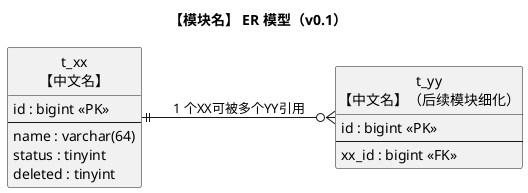
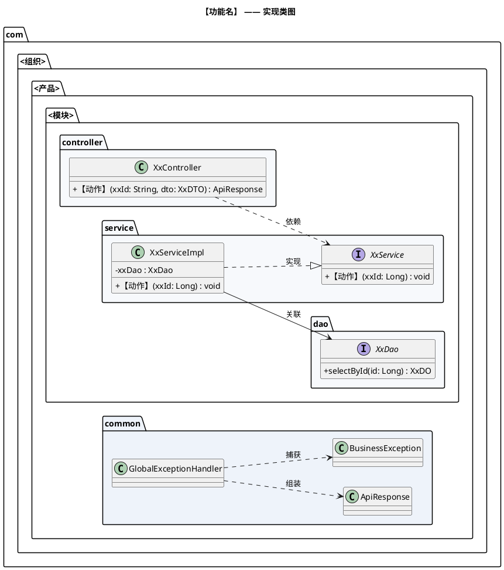
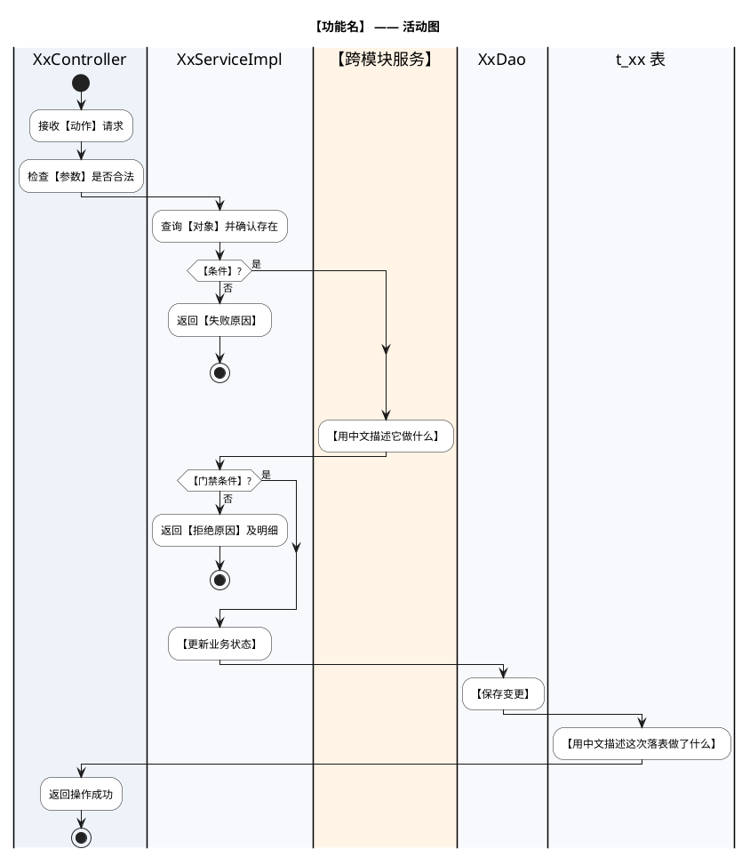

# 【模块名称】详细设计文档

**版本：v0.1**（YYYY-MM-DD）
**本版范围：**【例如：管理端经营基础 —— 课程管理】
**上游依据：**

| 文档 | 版本 | 本模板引用内容 |
|---|---|---|
| `docs/需求分析/需求分析.md` | v0.2 | 【引用了哪些用例、E 编号】 |
| `docs/概要设计/概要设计.md` | v0.1 | 【引用了哪些流程、§编号】 |
| `docs/需求文档/<端>/<模块>功能清单.md` | v1 | 【本模块的功能条目】 |

> **模板说明**
> 本模板由《详细设计模板》与《接口设计模板》**整合而成**，是本项目详细设计的唯一骨架，后续模块一律复用。
> 固定章节：**1 数据架构 → 2 接口 → 3 开发架构 → 4 运行流程 → 5 测试用例设计 → 6 日志设计**。
> 其中**第 2 章「接口」采用《接口设计模板》的格式**：每个接口给出「请求参数表 → 请求/返回示例 → 返回结果表 → 返回数据结构表」，章末统一收一节「数据模型」。
> 正式提交文档前，请删除所有「写作指引」「使用说明」引用块，以及未选用的示例内容。

> **使用说明（按这个顺序做，不要跳步）**
> 1. **复制**本文件为 `docs/详细设计/<模块名>.md`，填写文档头与上游依据。
> 2. **先只写第 1 章**（数据架构），把字段列表评审确认。**字段没确认前不要写第 2 章** —— 接口和测试用例都会跟着字段返工。
> 3. 字段确认后，把 1.4 从「待确认清单」改写为「确认结论」，再写第 2 章接口。
> 4. 依次写第 3、4、5、6 章。**每写完一章就做一次自检**（见附录 A 的检查清单）。
> 5. 每收到一条评审意见，就在 `详细设计记录.md` 里登记一条 R 编号（来源 / 意见 / 处理 / 理由 / 影响），**不要只改正文不记录**。
> 6. 附录 A 是**跨模块复用的写作口径**（图怎么画、活动图怎么写、用例怎么排、日志埋什么），写每一章前先扫一眼对应小节。

**标记口径**（全项目统一，不要自造标记）：

| 标记 | 含义 | 使用规则 |
|---|---|---|
| **已确认事实** | 功能清单已列出，或现有系统已实测 | 可作为设计输入 |
| **建议方案** | 为形成可落地的设计而提出 | 确认后才能转为正式设计 |
| **TODO-待确认** | 资料未明确，或不同资料冲突 | 必须编号（Q1、A1…），不得据此直接开发 |

---

# 1、数据架构

> **写作指引**
> 本章回答：**这个模块的功能，需要哪些表来承载？**
> 只设计**本模块拥有的表**；被别的模块拥有的表，只登记表名、不细化字段（避免两个模块同时改一张表）。
> 字段必须**可溯源**：要么来自上游文档，要么来自评审拍板。**上游没有的字段一律不建**，要建就走 1.4 评审。

## 1.1 数据库ER模型

### 1.1.1 建模口径（全局约定）

> **写作指引**
> 整份文档**只在第一个模块写一次**，后续模块直接沿用，不要重定义。若某模块需要例外，在正文里写明「例外 + 理由」。
> 下面这份表是**本项目已定的全局约定**，照抄即可；新项目请重新评审。

| 项 | 约定 | 说明 |
|---|---|---|
| 数据库 | MySQL 8.0 | 技术栈已确认 |
| 存储引擎 / 字符集 | InnoDB / `utf8mb4` / `utf8mb4_general_ci` | 中文与 emoji 兼容 |
| 表命名 | `t_` + 业务名，全小写下划线 | 例：`t_course` |
| 主键 | `id` `bigint unsigned`，雪花ID，应用侧生成 | 不使用数据库自增 |
| 主键与前端 | **接口返回的 64 位整数必须序列化为字符串** | 前端 JS 数字只有 53 位精度 |
| 逻辑删除 | 统一 `deleted`，0 正常 / 1 已删除 | 用框架的逻辑删除能力自动过滤 |
| 审计字段 | `create_by` / `create_time` / `update_by` / `update_time` | 由框架自动填充，数据库默认值兜底 |
| 时间类型 | `datetime`，不用 `timestamp` | 避免 2038 与时区隐式转换 |
| 状态字段 | `tinyint` + 代码内枚举常量，不用数据库 `enum` | 加值不需要改表 |
| 金额字段 | `decimal(10,2)` | — |
| Java 包名 | `com.<组织>.<产品>.<模块>` | 例：`com.techplant.yoga.course` |
| 分层 | `controller` / `service` / `dao` / `mapper` / `domain` / `dto` / `vo` / `query` / `convert` / `exception` | 见 3.2 |
| ORM | MyBatis-Plus；复杂查询写 XML mapper | — |

### 1.1.2 本版范围与表清单

> **写作指引**
> 列出**本模块相关的全部表**，并标明本版细化到哪一张。未细化的表只登记表名与所属模块，避免 ER 图空洞。

| 表名 | 中文名 | 所属模块 | 本版状态 |
|---|---|---|---|
| `t_xx` | 【中文名】 | 【本模块 / 其他模块】 | **本版细化** / 后续模块细化（仅登记） |

### 1.1.3 ER 模型图

> **写作指引**
> 用 PlantUML 表达（纯文本、可 diff、本地可渲染）。**画完必须实际渲染一次**，确认没有语法错误、中文没有乱码。
> 关系用 crow's foot：`A ||--o{ B`（1 对多）、`A ||--o| B`（1 对 0..1）。
> 上游未细化但本模块要引用的表，画出来并标注「后续模块细化」。



### 1.1.4 实体与关系说明

> **写作指引**
> 一句话说清每个实体是什么、与其他实体的关系；**业务规则写在下面，不要只画图不说规则**。

| 实体 | 说明 | 与其他实体的关系 |
|---|---|---|
| 【实体】 | 【一句话】 | 【1 : N …】 |

**已确认事实：**【来自功能清单或实测的规则】
**建议方案：**【为闭环而提的设计】
**TODO-待确认 Q1：**【未定事项 + 若按不同选择会有什么结构性影响】

## 1.2 数据库逻辑模型

### 1.2.1 【表名】表字段定义

> **写作指引**
> **「依据」列是本节的灵魂** —— 每个字段都要能指回上游文档或评审结论。评审人靠这一列判断字段是不是凭空造的。
> 「默认值」列要写明是自增、当前时间、还是固定值。

| 字段 | 中文名 | 逻辑类型 | 必填 | 默认值 | 说明 | 依据 |
|---|---|---|---|:--:|---|---|
| `id` | 【中文名】 | 长整型 | 是 | 雪花ID | 主键，应用侧生成 | 建模口径 |
| 【字段】 | 【中文名】 | 【类型】 | 【是/否】 | 【默认】 | 【说明】 | 【功能清单 / 页面结构图 / 评审 Qn】 |

> **写作指引**
> 字段表后面补一段「**本版不建的字段**」：把上游存在但本版不做的字段（如价格、排序、多图）列出来并说明为什么不做 ——
> 这比什么都不写更能证明边界是**想过**的，而不是**漏了**。

### 1.2.2 枚举值定义

> **写作指引**
> 每个枚举给出**取值 + 来源**。若上游只给了字段名没给取值，标明「上游未定义」，并在 1.4 立一条待确认。

| 枚举 | 取值 | 来源 |
|---|---|---|
| 【字段】 | 1 【中文】、2 【中文】 … | 【实测 / 功能清单 / 建议方案】 |

## 1.3 数据库物理模型

### 1.3.1 建表语句（MySQL 8.0）

> **写作指引**
> 建表语句**必须与 1.2.1 的字段表逐字段对齐**（写完用脚本或肉眼对一遍字段名和类型）。
> 若本环境没有数据库可执行，**明确写一句「未在 MySQL 实例上执行验证」**，不要假装验过。

```sql
DROP TABLE IF EXISTS `t_xx`;
CREATE TABLE `t_xx` (
  `id`          bigint unsigned NOT NULL          COMMENT '主键（雪花ID，应用侧生成）',
  `name`        varchar(64)     NOT NULL          COMMENT '【中文名】',
  `status`      tinyint         NOT NULL DEFAULT 1 COMMENT '状态：1启用 0停用',
  `deleted`     tinyint         NOT NULL DEFAULT 0 COMMENT '逻辑删除：0正常 1已删除',
  `create_by`   bigint unsigned          DEFAULT NULL COMMENT '创建人ID',
  `create_time` datetime        NOT NULL DEFAULT CURRENT_TIMESTAMP COMMENT '创建时间',
  `update_by`   bigint unsigned          DEFAULT NULL COMMENT '更新人ID',
  `update_time` datetime        NOT NULL DEFAULT CURRENT_TIMESTAMP ON UPDATE CURRENT_TIMESTAMP COMMENT '更新时间',
  PRIMARY KEY (`id`),
  KEY `idx_xx` (`status`)
) ENGINE=InnoDB DEFAULT CHARSET=utf8mb4 COLLATE=utf8mb4_general_ci COMMENT='【表说明】';
```

### 1.3.2 索引设计

> **写作指引**
> 本阶段只给**能明确对应查询的基础索引**。真实索引要等 mapper SQL 写出来再复核，并在 code review 时请人专门 review。
> 若某个字段**故意不建唯一索引**（例如名称允许重复），把理由写出来，否则会被当成漏了。

| 索引 | 字段 | 支撑的查询 |
|---|---|---|
| 主键 | `id` | 按ID查详情、更新 |
| 【索引名】 | 【字段】 | 【哪个查询会用到】 |

## 1.4 字段确认结论

> **写作指引**
> 这是**评审关卡**：把第 1 章里所有拿不准的点编号（Q1、Q2…），每条给一个**建议默认值**，让评审人能一句话回复
> （例如「Q1~Q5 按默认」）。**确认后不要删掉本表**，把它改写成「结论」列留档 —— 将来有人问「为什么这么建」，
> 答案就在这里，日期和结论都齐全。

| 编号 | 问题 | 建议默认 | 评审结论（确认后填） |
|---|---|---|---|
| Q1 | 【问题】 | 【建议】 | 【结论 + 日期】 |

---

# 2、接口

> **写作指引**
> 本章回答：**这个模块对外提供哪些接口，每个接口的入参出参是什么。**
> **格式来自《接口设计模板》**：每个接口固定四段 —— 请求参数表 → 请求/返回示例 → 返回结果表 → 返回数据结构表；章末统一收「数据模型」。
> **三种边界不要混：**
> - **三端 ↔ 服务端**（REST 接口）→ 写在本章；
> - **服务端 ↔ 第三方**（支付、短信、地图）→ 写在本章，并在说明里标明「依赖外部服务」；
> - **模块 ↔ 模块**（跨模块接口，例如 A 模块要读 B 模块的数据）→ **不写在本章，写在第 3 章类图里**（见 3.1.5）。
>
> **原始《接口设计模板》顶部的 YAML front-matter**（`language_tabs`、`generator`、多语言代码页签）是 **Widdershins 生成器的配置**，不是接口内容。
> 作为设计文档**不搬运**；将来要用生成器出 API 站点时再补。

## 2.1 通用约定

> **写作指引**
> 通用约定是**全模块共享**的：第一个模块定好之后，后续模块只写「沿用 XX 模块的 2.1」，只列差异。

### 2.1.1 服务地址与环境

| 项 | 值 |
|---|---|
| 接口前缀 | 【管理端 `/admin`、用户端 `/api`、教练端 `/coach`】 |
| 本地开发地址 | `http://localhost:8080` |
| 测试 / 线上地址 | **TODO-待确认** |

### 2.1.2 认证

> **写作指引**
> 写清「哪些接口需要登录态、怎么带」。若认证方案依赖尚未设计的模块（例如账号模块），**明确写 TODO 并把依赖点出来**，不要含糊过去。

- HTTP Authentication, scheme: **bearer**，请求头 `Authorization: Bearer <token>`
- **TODO-待确认：**【令牌形态、有效期、刷新机制】【依赖哪个模块】

### 2.1.3 统一响应结构

> **写作指引**
> 统一响应是**全项目一份**。定好之后每个接口的「返回示例」都要包这一层，不要再退回裸对象。
> 并且**明确 HTTP 状态码与业务码的关系**（是「HTTP 200 + 业务码」还是「业务码与 HTTP 状态码同值」），否则前端要判两个字段。

```json
{
  "code": 0,
  "message": "success",
  "data": {}
}
```

| 字段 | 说明 |
|---|---|
| `code` | 业务码，0 表示成功 |
| `message` | 提示信息 |
| `data` | 业务数据；无返回值时为 `null` |

### 2.1.4 分页约定

> **写作指引**
> 固定请求参数名（`pageNum` / `pageSize`）与响应结构，并写明**默认值与上限**。
> 提醒一句：不要把 ORM 的分页对象直接暴露给前端。

- 请求：`pageNum`（从 1 开始，默认 1）、`pageSize`（默认 10，最大 100）
- 响应：`PageResult`，结构 `{ total, pageNum, pageSize, list }`

### 2.1.5 命名与序列化约定

| 项 | 约定 | 说明 |
|---|---|---|
| URL 风格 | 资源名词复数 + kebab-case | `/admin/xx-items` |
| JSON 字段 | lowerCamelCase | — |
| **ID 序列化** | **64 位整数一律序列化为字符串** | 前端数字精度只有 53 位 |
| 时间格式 | `yyyy-MM-dd HH:mm:ss` | 【建议方案，待确认】 |
| 枚举 | 只返回 code，不返回翻译文案 | 中文由前端映射，后端不耦合展示层 |

### 2.1.6 对象命名口径

> **写作指引**
> 固定 DO / DTO / VO / Query 的职责边界，避免同一个类被当三种用。用不到的词汇（PO / BO / AO）明确写「不使用」。

| 类型 | 用途 | 示例 |
|---|---|---|
| DO | 与表一一对应，只在 mapper 与 service 间传递 | `XxDO` |
| DTO | service 入参（请求体） | `XxCreateDTO`、`XxUpdateDTO` |
| Query | 复杂查询条件 | `XxQuery` |
| VO | 接口返回给前端 | `XxListItemVO`、`XxDetailVO` |

## 2.2 【模块名】模块

> **写作指引**
> 开头放一张**接口总览表**（接口 → 对应功能清单条目 → 是否需要登录），评审人一眼能看出覆盖面与遗漏。
> 下面逐个接口展开，**接口编号 = 2.2.x**。
> 若某类操作**故意不提供**（例如功能清单里没有删除），**明确写出来**并说明依据 —— 不写等于没想。

| # | 接口 | 对应功能清单 | 需要登录 |
|---|---|---|---|
| 1 | `GET /admin/xx` | 【功能条目】 | 是 |

> **本模块不提供的接口：**【例如「没有删除接口」+ 依据】

### 2.2.1 查询【对象】列表

<a id="opIdlistXx"></a>

`GET /admin/xx`

【一句话说明这个接口做什么、有哪些筛选、是否分页。】

#### 请求参数

|名称|位置|类型|必选|说明|
|---|---|---|---|---|
|【name】|query|string| 否 |【说明】|
|pageNum|query|integer| 否 |页码，从 1 开始，默认 1。|
|pageSize|query|integer| 否 |每页条数，默认 10，最大 100。|

#### 枚举值

|属性|值|
|---|---|
|【字段】|【值】|

> 返回示例

> 200 Response

```json
{
  "code": 0,
  "message": "success",
  "data": {
    "total": 1,
    "pageNum": 1,
    "pageSize": 10,
    "list": []
  }
}
```

#### 返回结果

> **写作指引**
> 把该接口**所有可能的状态码**列全 —— 每一个非 200 都要在第 5 章有对应用例，这是「接口文档驱动测试」的衔接点。

|状态码|状态码含义|说明|数据模型|
|---|---|---|---|
|200|[OK](https://tools.ietf.org/html/rfc7231#section-6.3.1)|查询成功|[ApiResponse](#schemaapiresponse)|
|400|[Bad Request](https://tools.ietf.org/html/rfc7231#section-6.5.1)|参数不合法|[ApiResponse](#schemaapiresponse)|
|401|[Unauthorized](https://tools.ietf.org/html/rfc7235#section-3.1)|未登录或登录态失效|[ApiResponse](#schemaapiresponse)|

#### 返回数据结构

状态码 **200**

> **写作指引**
> 用 `»` 表示嵌套层级（与《接口设计模板》一致）。类型写法：`integer(int64)`、`string`、`[[XxVO](#schemaxxvo)]`。

|名称|类型|必选|约束|中文名|说明|
|---|---|---|---|---|---|
|code|integer|true|none||业务码，0 表示成功。|
|message|string|true|none||提示信息。|
|data|[PageResult](#schemapageresult)|true|none||分页结果。|
|» total|integer(int64)|true|none||总记录数。|
|» list|[[XxListItemVO](#schemaxxlistitemvo)]|true|none||列表数据。|

### 2.2.2 查询【对象】详情

<a id="opIdgetXx"></a>

`GET /admin/xx/{xxId}`

【说明。**路径参数若是雪花ID，类型必须写 string**，并在说明里点明原因。】

#### 请求参数

|名称|位置|类型|必选|说明|
|---|---|---|---|---|
|xxId|path|string| 是 |【对象】ID（雪花ID 以字符串传递）。|

#### 返回结果

|状态码|状态码含义|说明|数据模型|
|---|---|---|---|
|200|[OK](https://tools.ietf.org/html/rfc7231#section-6.3.1)|查询成功|[ApiResponse](#schemaapiresponse)|
|404|[Not Found](https://tools.ietf.org/html/rfc7231#section-6.5.4)|【对象】不存在或已被删除|[ApiResponse](#schemaapiresponse)|

> 其余段落（返回示例 / 返回数据结构）同 2.2.1 的写法，略。

### 2.2.3 新增【对象】

<a id="opIdcreateXx"></a>

`POST /admin/xx`

【说明。若某些字段**不由本接口设置**（例如状态、编号），在这里明确写出来，并指向真正负责它的接口。】

> Body 请求参数

```json
{
  "name": "【示例值】"
}
```

#### 请求参数

|名称|位置|类型|必选|说明|
|---|---|---|---|---|
|body|body|[XxCreateDTO](#schemaxxcreatedto)| 是 |【对象】信息。|

#### 返回结果

|状态码|状态码含义|说明|数据模型|
|---|---|---|---|
|200|[OK](https://tools.ietf.org/html/rfc7231#section-6.3.1)|新增成功，返回新对象ID。|[ApiResponse](#schemaapiresponse)|
|400|[Bad Request](https://tools.ietf.org/html/rfc7231#section-6.5.1)|参数校验失败|[ApiResponse](#schemaapiresponse)|

### 2.2.4 修改【对象】

<a id="opIdupdateXx"></a>

`PUT /admin/xx/{xxId}`

【说明。**必须写清可选字段为空时是「清空」还是「不更新」** —— 这是最容易实现错的地方。】

### 2.2.5 【特定状态操作】（如启用 / 停用 / 审核）

<a id="opIdupdateXxStatus"></a>

`PUT /admin/xx/{xxId}/status`

【说明。**前置校验要写全**：什么条件下允许、什么条件下拒绝、拒绝时返回什么。】

> **写作指引**
> 这类「状态流转」接口最容易漏两件事，务必写出来：
> ① **门禁条件**（例如「有未完成的关联数据就不允许停用」）及其判定口径（哪些状态算「未完成」）；
> ② **依赖外部/跨模块校验失败时怎么办** —— 建议 **fail-closed：校验失败就操作失败，不降级放行**，
> 否则下游服务一抖动就会造成误操作。

#### 返回结果

|状态码|状态码含义|说明|数据模型|
|---|---|---|---|
|200|[OK](https://tools.ietf.org/html/rfc7231#section-6.3.1)|设置成功。|[ApiResponse](#schemaapiresponse)|
|400|[Bad Request](https://tools.ietf.org/html/rfc7231#section-6.5.1)|状态取值非法|[ApiResponse](#schemaapiresponse)|
|404|[Not Found](https://tools.ietf.org/html/rfc7231#section-6.5.4)|【对象】不存在或已被删除|[ApiResponse](#schemaapiresponse)|
|409|[Conflict](https://tools.ietf.org/html/rfc7231#section-6.5.8)|【门禁未通过，例如仍被引用】|[ApiResponse](#schemaapiresponse)|

> **写作指引**
> 失败时**给出可行动的明细**（例如「仍有 3 个未完成排班、5 条未结束预约」），让运营知道卡在哪，
> 而不是只回一句「操作失败」。明细同时要能落日志（见第 6 章）。

## 2.3 数据模型

> **写作指引**
> 把本章出现的 VO / DTO / Query **集中在这里定义一次**，接口里只引用名字。
> 每个模型固定三段：JSON 示例 → 一句话说明 → 属性表。
> **不要返回前端用不到的字段**（例如审计字段 `create_by`），页面结构图里没有的字段就不要出现在 VO 里。

### 2.3.1 ApiResponse

<a id="schemaapiresponse"></a>

```json
{
  "code": 0,
  "message": "success",
  "data": null
}
```

统一响应结构。

#### 属性

|名称|类型|必选|约束|中文名|说明|
|---|---|---|---|---|---|
|code|integer|true|none||业务码。|
|message|string|true|none||提示信息。|
|data|object|false|none||业务数据，随接口而定。|

### 2.3.2 PageResult

<a id="schemapageresult"></a>

```json
{
  "total": 0,
  "pageNum": 1,
  "pageSize": 10,
  "list": []
}
```

分页结果结构。

#### 属性

|名称|类型|必选|约束|中文名|说明|
|---|---|---|---|---|---|
|total|integer(int64)|true|none||总记录数。|
|pageNum|integer|true|none||当前页码。|
|pageSize|integer|true|none||每页条数。|
|list|array|true|none||当前页数据。|

### 2.3.x 【XxVO / XxDTO / XxQuery】

<a id="schemaxxlistitemvo"></a>
<a id="schemaxxdetailvo"></a>
<a id="schemaxxcreatedto"></a>
<a id="schemaxxupdatedto"></a>
<a id="schemaxxvo"></a>

> **写作指引**
> **每个模型给一个锚点**，命名规范：`schema` + 模型名小写（例：`XxListItemVO` → `schemaxxlistitemvo`）。
> 接口章节里用 `[XxListItemVO](#schemaxxlistitemvo)` 引用，这样在 Markdown 渲染器和 API 生成器里都能跳转。
> 新增模型时**记得同时补锚点**，否则第 2 章会出现点不动的链接（自检项见附录 A8）。
> 建议至少拆四个模型：**列表项 VO**（不含长文本）、**详情 VO**、**新增 DTO**、**修改 DTO**。

```json
{
  "id": "【雪花ID字符串】",
  "name": "【示例】"
}
```

【一句话说明这个模型用在哪。】

#### 属性

|名称|类型|必选|约束|中文名|说明|
|---|---|---|---|---|---|
|id|string|true|none||主键（雪花ID，字符串）。|
|name|string|true|maxLength 64||【中文名】。|

## 2.4 错误码

> **写作指引**
> 全项目一份错误码表。**业务码与 HTTP 状态码的关系在 2.1.3 定死，这里只列取值**。

| HTTP | code | 含义 | 说明 |
|---|---|---|---|
| 200 | 0 | 成功 | 唯一与 HTTP 状态码不同的取值 |
| 400 | 400 | 参数校验失败 | 由 `@Valid` 统一拦截 |
| 401 | 401 | 未登录 / 登录态失效 | 见 2.1.2 |
| 403 | 403 | 无权限 | 【RBAC 确认后启用】 |
| 404 | 404 | 资源不存在 | — |
| 409 | 409 | 状态冲突 | 门禁未通过 |
| 500 | 500 | 系统异常 | 不向前端暴露堆栈 |

## 2.5 接口级待确认清单

> **写作指引**
> 与 1.4 同构，只是范围换成接口层。**每条给建议默认值**，确认后改写为结论。

| 编号 | 待确认 | 建议默认 | 影响面 |
|---|---|---|---|
| A1 | 【问题】 | 【建议】 | 【影响哪些接口】 |

---

# 3、开发架构

> **写作指引**
> 本章回答：**为了实现这些接口，需要哪些类、类之间什么关系、代码放在哪些包里。**
> **不是每个接口都要画类图**：按经验，最普通的增删改查**可以不画** —— 只要接口、数据模型、运行流程清楚，实现就没问题。
> **判断标准：这一个接口里有没有「非显然的协作」？** 有（跨模块调用、跨表校验、事务边界、状态机）就画；纯单表 CRUD 就不用画，写文字即可。

## 3.1 实现类图

### 3.1.1 【功能名】实现类图

> **写作指引**
> 每个模块**挑一到两条最有代表性的链路**画类图即可，不必逐接口画。
> 画之前先决定用哪几种关系（下表），并在 3.1.3 里**明确写出「哪几种关系没用到」** —— 否则评审人会以为你漏画了。

| 关系 | 画法 | 用在什么情况 |
|---|---|---|
| 实现 | 虚线 + 空心箭头 `..|>` | 实现类 → 接口 |
| 继承 | 实线 + 空心箭头 `--|>` | 子类 → 父类 |
| 关联 | 实线 + 简单箭头 `-->` | 持有成员变量 |
| 依赖 | 虚线 + 简单箭头 `..>` | 调用/使用，不持有 |
| 组合 | 实心菱形 + 实线 | 强归属，生命周期一致 |
| 聚合 | 空心菱形 + 实线 | 弱归属 |
| 泛化/实现之外的继承 | 同上 | — |



### 3.1.2 类与职责

> **写作指引**
> **「本版状态」列很重要**：区分「本版新建」与「接口先行、实现随别的模块落地」，否则评审人以为缺实现。

| 类 / 接口 | 包 | 职责 | 本版状态 |
|---|---|---|---|
| `XxController` | 【模块】.controller | 接收请求、参数校验、装配响应；不写业务逻辑 | 本版新建 |
| 【跨模块接口】 | 【别的模块】.service | 【提供什么能力】 | **接口先行**，实现在【模块】 |
| `ApiResponse` | common.response | 统一响应结构 | 待公共模块建立 |

### 3.1.3 类之间的关系

> **写作指引**
> 把 3.1.1 用到的关系列出来，**并把没用到的那几种也列出来写「本模块未使用 + 原因」**。

| 关系 | 画法 | 本图中的实例 |
|---|---|---|
| 实现 | 虚线 + 空心箭头 | 【…】 |
| 依赖 | 虚线 + 简单箭头 | 【…】 |
| 关联 | 实线 + 简单箭头 | 【…】 |
| 组合 / 聚合 | — | **本模块未使用**：【原因】 |

### 3.1.4 其余接口的实现说明（不画类图）

> **写作指引**
> 对没画类图的接口，给出「调用链 + 事务」一张表 + 逐条文字。
> **文字里必须点出容易实现错的地方**（空值语义、影响行数为 0 的处理、幂等），这些正是第 5 章要用例锁住的点。

| 接口 | 调用链 | 事务 |
|---|---|---|
| 【接口】 | 控制器 → 业务服务 → 数据访问 | 【需要 / 不需要】 |

**【接口名】：**【分步说明实现逻辑，含边界处理】

### 3.1.5 跨模块调用约定

> **写作指引**
> 只要本模块**要用别的模块的数据**，就必须在这里定接口签名，并写清三条：
> ① 不跨模块读表；② 接口先行，实现随对方模块落地；③ 并发窗口怎么兜底。
> 这一节是本模板里**最容易被跳过、又最容易出事故**的一节。

1. **不跨模块读表。** 本模块不直接查别人的表，只依赖对方暴露的查询接口。理由：直接读表会把两个模块的库表结构绑死。
2. **接口先行。** 本版先定签名，实现随对方模块落地。**这些签名需要同步给对应模块的实现者。**
3. **并发窗口。** 【本模块的校验与写入之间，对方模块可能插入新数据】→ 兜底方案二选一：
   - **双向校验**（建议）：对方模块在写入时反向校验本模块的状态；
   - 行锁串行化：对本模块的行加锁。取舍：【性能 / 死锁风险】。

## 3.2 包设计

### 3.2.1 包结构

> **写作指引**
> 包结构要**全**：包含本版没有画类的包（dto / vo / query / convert / exception），否则后面有人会往 `domain` 里塞请求体。
> 用文本树而不是包图：文本树**能 diff**，评审时看得见改了什么。

```text
com.<组织>.<产品>
├── common/                    公共模块（不依赖任何业务模块）
│   ├── response/              ApiResponse、PageResult
│   └── exception/             BusinessException、GlobalExceptionHandler
├── <模块>/                    本模块
│   ├── controller/            XxController
│   ├── service/               XxService
│   │   └── impl/              XxServiceImpl
│   ├── dao/                   XxDao
│   ├── mapper/                XxMapper
│   ├── domain/                XxDO
│   ├── dto/                   XxCreateDTO、XxUpdateDTO
│   ├── vo/                    XxListItemVO、XxDetailVO
│   ├── query/                 XxQuery
│   ├── convert/               XxConverter
│   └── exception/             【模块异常】
└── resources/mapper/<模块>/   XxMapper.xml（与 mapper 包同构）
```

### 3.2.2 类清单

| 包 | 类 / 接口 | 说明 |
|---|---|---|
| 【包】 | 【类】 | 【说明】 |

### 3.2.3 分层调用规则

| 规则 | 说明 |
|---|---|
| controller 只调 service | 不得直接调 dao / mapper |
| service 之间可以互调 | 跨模块调用对方 **service 接口** |
| **service 不把 DO 返回给 controller** | 出参一律 VO |
| dao 只被 service 调用 | dao 返回 DO |
| mapper 只被 dao 调用 | 复杂 SQL 写 XML，不用注解堆 SQL |

---

# 4、运行流程

> **写作指引**
> 本章回答：**每个功能按什么顺序发生、数据怎么流转、边界条件在哪。**
> **画什么：** 有复杂业务逻辑的功能**必须画活动图**；简单增删改查**用文字说清代码逻辑即可**。
> **不画什么：** 横切基础设施（全局异常处理）与框架自动行为（主键生成、字段填充）**不进活动图** —— 它们不是业务步骤，
> 分别在 3.1 的类图与 3.1.4 的实现说明里体现。
> **泳道怎么写：** 泳道**标题**用类名（`XxServiceImpl`）或表名（`t_xx 表`）；泳道里的**每一步用中文业务语言**描述
> （「接收停用请求」「统计该课程下未完成的排班数量」），**不写方法名、不写 SQL、不写框架名**。表操作保留 ——
> 活动图要体现「类与**表**之间的交互」。
> **与 3.1.4 的分工：** 3.1.4 回答「谁调用谁」（静态），本章回答「按什么顺序发生」（动态），不要互相抄。

## 4.1 【模块名】模块

> **写作指引**
> 开头放一张取舍表：哪个接口画图、哪个写字、**为什么**。评审人一眼能判断你是「想过了」还是「漏了」。

| 接口 | 本章处理方式 | 理由 |
|---|---|---|
| 【有复杂逻辑的】 | **活动图** | 【跨模块校验 / 嵌套分支 / 事务边界】 |
| 【简单 CRUD 的】 | 文字 | 单表查询 / 单表更新 |

### 4.1.1 【复杂功能名】



**步骤说明**

> **写作指引**
> 「动作」列继续用中文业务语言；「执行者」列放类名（这里允许出现类名）；「异常分支」列**把接口状态码对回来**（400/404/409），
> 这样评审人可以拿它和 2.2.x 的「返回结果」表对账。

| 步 | 执行者 | 动作 | 异常分支 |
|---|---|---|---|
| 1 | `XxController` | 接收【动作】请求，检查【参数】是否合法 | 不合法 → 400 |
| 2 | `XxServiceImpl` | 【中文动作】 | 【不存在 → 404】 |

**涉及的表**

| 表 | 操作 | 说明 |
|---|---|---|
| `t_xx` | `SELECT` / `UPDATE` | 【说明；逻辑删除条件由框架附加，不手写】 |
| `t_zz` | `SELECT COUNT` | 由【模块】的【服务】代理，**本模块不直接查这张表**（见 3.1.5） |

### 4.1.2 【另一个复杂功能名】

【同上：活动图 + 步骤说明 + 涉及的表】

### 4.1.3 其余接口的实现逻辑（文字）

> **写作指引**
> 简单 CRUD 用**分步文字 + 关键 SQL** 说明即可（模板对活动图的要求是「体现类与表的交互」，文字版就用 SQL 体现）。
> 每一步都要写出**边界处理**：空值语义、影响行数为 0、幂等。

#### 4.1.3.1 查询【对象】列表

1. 【控制器】接收请求并装配查询条件；【非法参数 → 400】。
2. 【业务服务】构造查询条件：**【逻辑删除条件不手写，由框架附加】**。
3. 【数据访问】执行分页查询，落到表上：
   ```sql
   SELECT 【字段】 FROM t_xx
    WHERE deleted = 0 /* AND 【条件】 */
    ORDER BY 【稳定排序字段】
    LIMIT ?, ?
   ```
4. 【分页对象在 service 层转成项目自己的分页结构，不外泄框架类型】。
5. 【控制器】返回统一响应。

> **写作指引**
> **分页接口必须定死排序**（例如 `sort_no ASC, id DESC`），否则翻页会重复或漏项 —— 这是最常见的分页缺陷。

#### 4.1.3.2 查询【对象】详情

【分步 + SQL】

#### 4.1.3.3 修改【对象】

> **写作指引**
> 有「可选字段」的更新接口，必须写明**空值是「清空」还是「不更新」**，并提示实现时不能写成「非空才更新」。

【分步 + SQL】

### 4.1.4 事务与并发

| 接口 | 事务 | 说明 |
|---|---|---|
| 【跨表校验 + 写入的】 | **必须** | 校验与写入必须在同一事务 |
| 【单表写入的】 | 建议 | 统一风格，便于后续扩展 |
| 【查询的】 | 不需要 | 只读 |

**并发窗口的兜底：**【说明窗口在哪、用哪个方案兜底，见 3.1.5】

**幂等：**【重复调用同一操作的行为；注意「影响行数为 0」不能一律当 404】

---

# 5、测试用例设计

> **写作指引**
> 本章回答：**怎么证明这些接口按设计工作了。**
> **四要素固定**：每条用例都写「（1）数据准备 →（2）输入 →（3）输出 →（4）资源清理」。
> **覆盖要求**：**每个类都要有测试类，每个方法都要有用例**。用一张**覆盖表**把「类 → 方法 → 用例编号」对应起来，让人能核对有没有漏。
> **排序口径**：大类按「业务实现类 → 接口层 → 数据访问层 → 转换层」排；类内部按「**正常分支 → 边界 → 异常分支**」排；
> **同一方法的用例必须相邻**。
> **写法**：用例用**中文业务语言**描述，**不写测试代码**；关键数据给**具体值**，便于直接转成测试方法。
>
> **怎么想出用例的（推法，按顺序做）：**
> 1. 从第 3 章类图取**被测类清单**，从类图取**每个类的公开方法** → 这是「每个方法一条」的底；
> 2. 每个方法切**输入域**：正常值 / 边界值 / 非法值；
> 3. 把第 2 章每个接口「返回结果」表里的**非 200 行**逐个变成异常用例 —— 有几个错误码就该有几个异常用例；
> 4. 把前面各章**承诺过的契约**各写一条**契约锁定用例**（空值语义、ID 序列化、门禁只在该分支生效、分页稳定排序…）——
>    这类用例价值最高，因为它们锁的是「实现者很容易违反、且违反了不容易被发现」的约定；
> 5. 划界：**真实 SQL、跨模块真实调用不进单元测试**，放到冒烟测试。

## 5.1 单元测试用例设计

**测试框架：**【JUnit 5 + Mockito 等】。依赖全部用模拟对象隔离，**单元测试不连数据库**。

### 5.1.1 【模块名】模块

**覆盖表**（每个类、每个方法都有对应用例）：

| 被测类 | 测试类 | 被测行为 | 用例编号 |
|---|---|---|---|
| `XxServiceImpl` | `XxServiceImplTest` | 【中文动作，不写方法名】 | 5.1.1.1 ~ 5.1.1.N |

#### 5.1.1.1 【用例名：条件 → 预期】

| 要素 | 内容 |
|---|---|
| （1）数据准备 | 【模拟对象返回什么；初始数据是什么状态】 |
| （2）输入 | 【具体值】 |
| （3）输出 | 【返回值 / 抛什么异常 / **且不调用什么**（负向断言很关键）】 |
| （4）资源清理 | 【单元测试一般为「无」；造了临时数据才要写】 |

> **写作指引**
> 用例名写「条件 → 预期」的句式，评审人扫标题就知道覆盖了什么。
> **多写负向断言**（「且不调用保存」「且不调用跨模块统计」）—— 它们能锁住「只在该分支生效」这类规则。

#### 5.1.1.2 【用例名】

【同上四要素】

## 5.2 冒烟测试用例设计

**前置条件**

| 项 | 说明 |
|---|---|
| 环境 | 【测试环境；真实数据库；通过 HTTP 调用接口】 |
| 登录态 | 【怎么拿 token；若依赖未完成的模块，写明临时方案】 |
| 数据制造 | 【优先走接口造数；依赖未落地模块的表，暂时只能用 SQL 造数，并标出来】 |

### 5.2.1 【模块名】模块

| 用例编号 | 用例名称 |
|---|---|
| 5.2.1.1 | 【主链路】 |

#### 5.2.1.1 【用例名】

| 要素 | 内容 |
|---|---|
| （1）数据准备 | 【造什么数据】 |
| （2）输入 | 【调哪个接口、什么参数】 |
| （3）输出 | 【响应 + **再查一次确认数据状态**（验证事务没有留副作用）】 |
| （4）资源清理 | 【删掉本用例造的数据】 |

> **写作指引**
> 冒烟用例至少覆盖：主链路走通、门禁被拒绝（并核对明细）、状态可回退、分页稳定、跨模块依赖可用。
> 每条用例**必须能自己清理数据**，否则测试库会被污染成「跑一次好一次、跑两次就错」。

---

# 6、日志设计

> **写作指引**
> 本章回答：**出问题时靠什么日志定位。**
> **一条判断先行：查询类接口不写业务日志** —— 查询是高频只读操作，逐次埋点会淹没真正需要审计的写操作；
> 「谁查了什么、耗时多少、状态码」交给公共模块的**统一访问日志**。只保留慢查询告警。
> 每条埋点写清**四件事**：触发时机、级别、内容（字段）、用途。
> **级别口径**：INFO = 写操作成功；WARN = **可预期的业务失败**（参数校验失败、对象不存在、门禁拦截、跨模块调用失败）；
> ERROR = 非预期异常；DEBUG = 跨模块细节与循环体内，默认关闭。
> **不写进日志**：长文本字段、完整附件地址、请求全量报文。
> **审计落库**：管理端操作若需要「谁改了什么」可追溯，评估是否额外落审计表；若落库，**与业务同事务**以保证不丢。

## 6.1 【模块名】模块

### 6.1.1 【功能名】

| 埋点 | 触发时机 | 级别 | 内容 | 用途 |
|---|---|---|---|---|
| （1） | 请求进入、校验前 | INFO | 操作人、动作、关键字段明细 | 链路追踪；定位「提交了但没入库」 |
| （2） | 参数校验失败 | WARN | 操作人、失败字段、原始取值 | 定位前端传参问题 |
| （3） | 操作成功 | INFO | 操作对象、变更前后值、耗时 | 审计 |
| （4） | 非预期异常 | ERROR | 异常摘要 + 链路标识 | 告警与排查 |

> **写作指引**
> - **修改类**：记录**变更字段的前后值**，且**只记变化了的字段**（全量记会让审计日志看不出改了什么）。
> - **状态流转类**：记录**原状态 → 新状态**；**门禁拦截单独埋一条 WARN**，带上阻塞明细 ——
>   这是唯一「用户会来问为什么」的分支，没有它只能靠猜。
> - **查询类**：写一句「本功能不写业务日志 + 理由 + 由谁覆盖」，**不要留空**。

### 6.1.2 跨模块调用

| 埋点 | 触发时机 | 级别 | 内容 | 用途 |
|---|---|---|---|---|
| （1） | 调用完成 | DEBUG | 入参摘要、返回结果、耗时 | 排查门禁判定依据 |
| （2） | 调用失败或超时 | WARN | 被调模块、异常摘要、耗时 | 跨模块故障定位 |

> **写作指引**
> 这里必须把 **fail-closed** 写清楚：**跨模块校验失败时本操作要失败，不能降级放行** ——
> 否则一旦「查不到就当没有」，下游一抖动就会造成误操作。该契约同时写进 2.2.5。

---

# 附录 A · 跨模块复用的写作口径

> **写作指引**
> 本附录是**方法论**，不是某个模块的内容。写每一章前扫一眼对应小节；新模块直接沿用，若要偏离必须写明理由。

## A1 标记口径

**已确认事实 / 建议方案 / TODO-待确认** 三种标记全项目统一，见文档头。TODO 必须编号，确认后改写为结论并保留日期。

## A2 图表口径

| 图 | 用什么 | 要求 |
|---|---|---|
| ER 模型 | PlantUML（`entity` + crow's foot） | 画完**实际渲染一次** |
| 实现类图 | PlantUML（`package` + `class` + `interface`） | 明确列出「没用到哪几种关系」 |
| 活动图 | PlantUML（泳道按类/表分） | 泳道内容用中文业务语言 |
| 包结构 | 文本树 | 便于 diff |
| 分层/流程总览 | 需要时用 Mermaid | 与 PlantUML 并存不冲突 |

## A3 活动图口径（由评审沉淀）

1. **画什么：** 只画**业务步骤与其落表操作**。
2. **不画什么：** 横切基础设施（全局异常处理）与框架自动行为（主键生成、字段填充）。
3. **怎么写：** 泳道标题可用类名/表名；泳道内容用中文业务语言，不写方法名、SQL、框架名。
4. 两条判据：
   - 这一步是不是「这个功能要实现的事」？是 → 画；只是「框架顺手做的」或「全局兜底的」→ 不画。
   - 这行字是给业务看的还是给代码看的？「谁做」用类名（标题），「做什么」用中文（内容）。

## A4 测试用例口径

1. 四要素固定（数据准备 / 输入 / 输出 / 资源清理）。
2. 顺序：类 → 方法 → 分支；同一方法用例相邻。
3. 中文业务语言描述，不写测试代码。
4. 必须有一类**契约锁定用例**：锁住「实现者容易违反、违反了不容易发现」的约定。
5. 单元测试不连数据库；真实 SQL 交给冒烟测试。

## A5 日志口径

1. 查询不埋业务日志，由统一访问日志覆盖。
2. 修改记「变更字段的前后值」，只记变化了的。
3. 门禁拦截单独 WARN，带阻塞明细。
4. **fail-closed**：跨模块校验失败 → 操作失败，不降级放行。

## A6 数据与序列化口径

1. 主键雪花ID，**接口返回字符串**（前端精度 53 位）。
2. 枚举只返回 code，中文由前端映射。
3. 时间统一 `yyyy-MM-dd HH:mm:ss`。
4. 逻辑删除由框架附加，业务代码不手写 `deleted = 0`。

## A7 反面清单（不写什么）

| 不要写 | 因为 |
|---|---|
| 活动图里画全局异常处理 | 横切基础设施不是业务步骤 |
| 活动图里画框架行为 | 同上 |
| 泳道里写方法名 / SQL | 活动图是给业务看的 |
| 返回前端用不到的字段 | 页面结构图里没有就别返回 |
| 跨模块直接查表 | 会把两个模块的库表结构绑死 |
| 上游没有的字段 | 凭空发明需求 |
| 分页不定排序 | 翻页会重复/漏项 |
| DDL 没执行却说「已验证」 | 诚实标注「未执行验证」 |

## A8 每章写完的自检清单

| 章 | 自检 |
|---|---|
| 1 数据架构 | 字段表与建表语句逐字段对齐；每个字段都有依据；不建的字段写明了理由 |
| 2 接口 | 每个接口的非 200 状态码列全；示例 JSON 能解析；`#` 链接都能对上锚点 |
| 3 开发架构 | 类图渲染通过；没用到 UML 关系写明了；跨模块接口签名已同步给对应模块 |
| 4 运行流程 | 活动图渲染通过；泳道内容无代码；事务与幂等写清 |
| 5 测试用例 | 编号连续；覆盖表与用例一一对应；每个错误码都有用例 |
| 6 日志 | 查询接口写明了「为什么不埋点」；门禁拦截有独立埋点 |

# 附录 B · 待确认清单汇总

> **写作指引**
> 把 1.4、2.5 以及其他章节里的 TODO 汇总到这里，**按优先级排**，作为交付时给产品/业务确认的问题清单。

| 优先级 | 编号 | 待确认 | 建议默认 | 影响范围 |
|---|---|---|---|---|
| P0 | 【Q1】 | 【问题】 | 【建议】 | 【影响】 |

# 附录 C · 版本记录

> **写作指引**
> 记录每次评审的变更，让人一眼看出结论是怎么变的。**被推翻的推测要留档** —— 既证明结论可靠，也防止有人拿旧结论去开发。

| 版本 | 日期 | 变更 | 触发来源 |
|---|---|---|---|
| v0.1 | 【YYYY-MM-DD】 | 【初稿 ××】 | 【首次编写】 |
