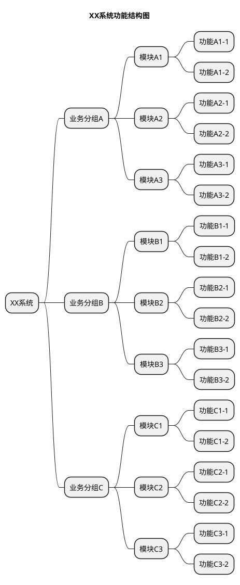
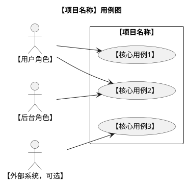
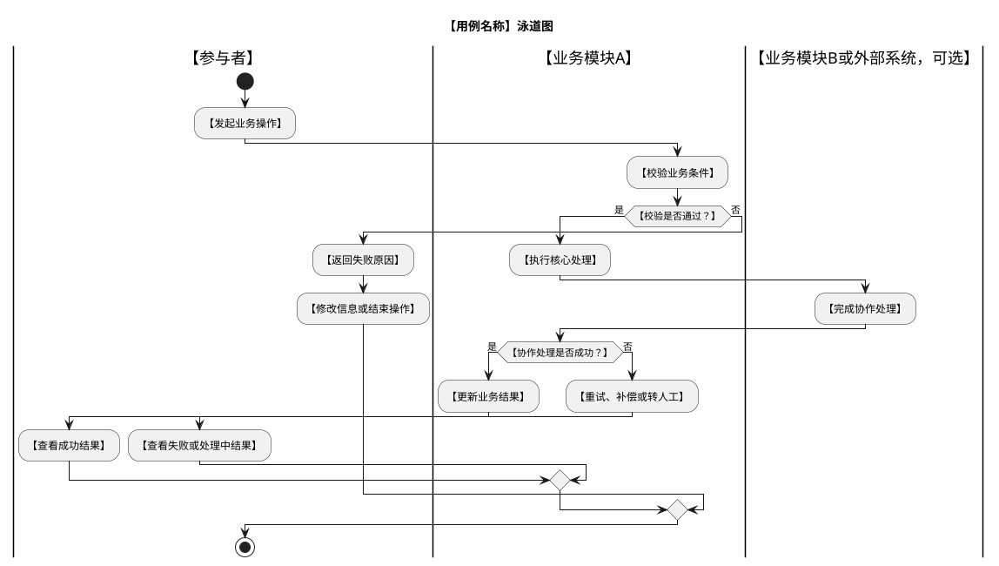
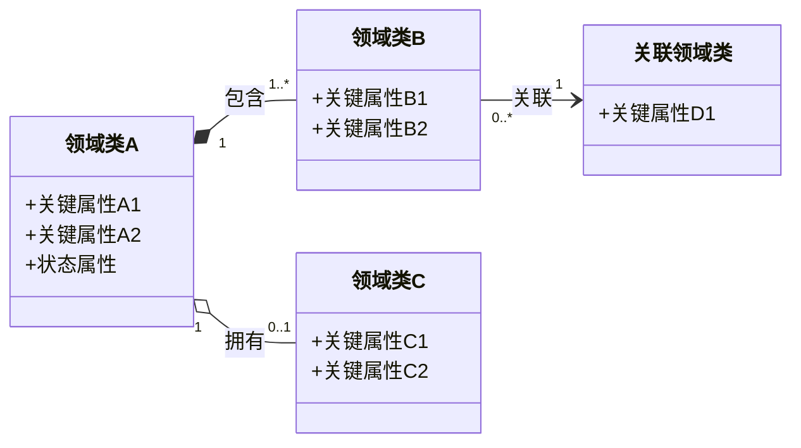

# 【项目名称】需求分析文档

> **模板说明**  
> 本模板只保留功能结构图、用例分析和领域类图。  
> 文档按照业务模块组织，不预设大量“中心”或子系统，也不在需求分析阶段限定技术架构。  
> 正式提交文档前，请删除所有“写作指引”、“使用提示”、未选用的图例和无关占位内容。

---

# 1. 功能分析

## 1.1 功能结构图

> **写作指引**  
> 功能结构图用于回答“这个系统需要实现哪些功能”。项目规模较小时，按照“系统 → 业务模块 → 功能”组织；模块较多时，可以增加一层业务分组，形成“系统 → 业务分组 → 模块 → 功能”。  
> 业务分组、模块和功能数量按项目实际情况填写，不要求凑数量，也不要为了套模板人为增加层级。没有业务分组时，直接删除对应层级。  
> 功能名称使用业务语言，不要写 Controller、Service 类、接口名称或数据库操作。

> **使用提示**  
> 上面的四层结构对应“系统—业务分组—模块—功能”。如果项目内容较少，可以删除“业务分组”这一层，并将模块前的 `***` 改为 `**`、功能前的 `****` 改为 `***`。  
> PlantUML 思维导图必须使用 `@startmindmap` 和 `@endmindmap` 成对包裹；每增加一个 `*` 代表向下增加一个层级。

## 1.2 功能简介

> **写作指引**  
> 功能简介用于解释功能结构图中的业务分组、模块和功能分别是做什么的，内容应与功能结构图保持一致。  
> 每个业务分组或模块使用一小段话说明业务目的、主要使用者和核心职责；每个具体功能使用一句话说明能够完成什么业务操作。  
> 只描述业务能力，不展开页面设计、接口调用、代码实现或数据库操作。简单且名称已经足够清楚的功能，可以合并描述，不必逐项扩写。  
> 如果功能结构图中没有“业务分组”层，删除业务分组标题，并将模块标题提升一级。

### 1.2.1 【业务分组A，可选】

【业务分组A】主要面向【主要参与者】，用于【业务目的】，负责【核心职责范围】。

#### 1.2.1.1 【模块A1】

【模块A1】主要用于【模块的业务目的】，支持【参与者】完成【核心业务活动】。

- **【功能A1-1】**：支持【参与者】完成【具体业务操作及结果】。
- **【功能A1-2】**：支持【参与者】完成【具体业务操作及结果】。

#### 1.2.1.2 【模块A2】

【模块A2】主要用于【模块的业务目的】，支持【参与者】完成【核心业务活动】。

- **【功能A2-1】**：支持【参与者】完成【具体业务操作及结果】。
- **【功能A2-2】**：支持【参与者】完成【具体业务操作及结果】。

### 1.2.2 【业务分组B，可选】

> 参照“1.2.1【业务分组A】”填写。如果项目没有更多业务分组，删除本节。

---

# 2. 用例分析

> **写作指引**  
> 用例分析用于说明“哪些参与者会使用系统中的哪些功能”。  
> 优先绘制一张系统级用例图；只有一张图明显过大时，才按业务模块分别绘制。  
> 简单的增删改查功能可以只在用例图中体现，或注明“参考产品需求”；核心功能、复杂流程、跨模块流程以及原需求没有说清楚的功能，才需要详细描述事件流和泳道图。

## 2.1 应用用例图

> **写作指引**  
> 参与者可以是用户角色、后台人员、外部系统或定时任务。  
> 用例名称使用“动词 + 业务对象”，例如“创建订单”“审核申请”“同步库存”。  
> 系统内部的业务模块通常不作为参与者；只有系统外部的人员或系统才画成参与者。

## 2.2 用例描述

> **写作指引**  
> 不需要为用例图中的每个用例都复制一份描述。只复制下面的结构，详写真正需要说明的用例。  
> 涉及多个业务模块或外部系统时，应说明业务顺序和责任边界，但不展开接口、消息队列或数据库实现细节。

### 2.2.1 【用例名称】

#### （1）简要说明

> 用一小段话说明谁在什么场景下使用该功能，以及最终要达到什么业务结果。

【用例名称】主要用于【参与者】在【业务场景】下完成【业务操作】，最终实现【业务结果】。

#### （2）事件流

> 按业务发生顺序描述参与者操作和应用响应。只保留会影响业务结果的关键步骤。

1. 【参与者发起操作】；
2. 应用【校验业务条件】；
3. 应用【执行核心业务处理】；
4. 应用【与其他业务模块或外部系统协作，可选】；
5. 应用【生成或更新业务结果】；
6. 【参与者查看处理结果】。

**异常或分支事件流（可选）：**

1. 当【业务条件不满足】时，应用【提示并终止/允许修改】；
2. 当【其他业务模块或外部系统处理失败】时，应用【重试、补偿或转人工】。

#### （3）泳道图

> **写作指引**  
> 泳道可按“参与者—业务模块—外部系统”划分，用于表达业务责任和处理顺序。  
> 重点画清楚成功主线以及关键失败处理，不需要表现代码方法或数据库操作。

### 2.2.2 【其他需要详写的用例】

> 复制 2.2.1 的结构；如果没有其他复杂用例，删除本节。

---

# 3. 领域类图

> **写作指引**  
> 领域类图使用 Mermaid 的 `classDiagram` 语法，用于展示应用中的核心业务对象、关键属性以及对象之间的关系。  
> 通常绘制一张整体领域类图；只有领域类和关系过多、明显影响阅读时，才按业务模块分别绘制。  
> 只保留理解业务所必需的领域类和属性，例如用户、订单、订单项、商品和库存。不要直接照搬数据库表，也不要放入 Controller、Service、DTO 等技术类。  
> 如果一张图中的领域类过多、关系线明显交叉，应按业务模块拆图，而不是把所有对象强行放进一张图。

## 3.1 绘制规则

1. **领域类命名**：使用业务人员能够理解的名词，例如“订单”“商品规格”“配送任务”。
2. **属性选择**：只写能够帮助理解业务的关键属性；需求分析阶段可以不写字段类型和方法。
3. **组合关系 `*--`**：表示整体与部分具有较强的生命周期关系，例如订单包含订单项。
4. **聚合关系 `o--`**：表示整体拥有某个可独立存在的对象。
5. **关联关系 `-->`**：表示一个对象会引用、使用或产生另一个对象。
6. **数量关系**：常用写法包括 `1`、`0..1`、`0..*` 和 `1..*`，分别表示一个、最多一个、任意多个和至少一个。
7. **关系说明**：使用“拥有、包含、选择、提交、产生、触发”等业务动词，避免写“外键关联”。

## 3.2 Mermaid 领域类图模板

> **使用提示**  
> 将代码块标记写成 `mermaid`，不要写成 `Python`。  
> 项目规模较小时，直接替换模板中的领域类即可；如果按业务模块拆图，应在每张图中只保留该模块的核心领域类，以及理解业务所必需的跨模块关系。
