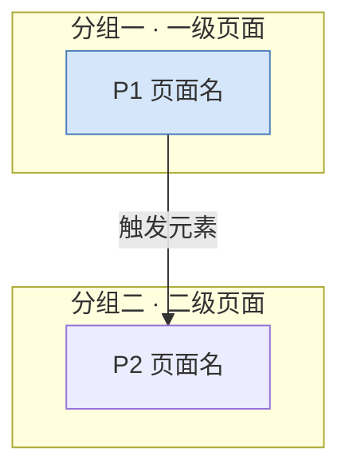

# 页面与跳转梳理模板

**模板版本：v0.2**

> **用途**：把某个产品（小程序 / App / Web / 桌面端）的页面与跳转关系梳理清楚。
> **前提**：① 可能没有源码，只能靠截图 + 手动点击；② 先出文字稿，确认后再出图。
> **用法**：把本模板和截图一起交给模型。**引用块**说明这一节怎么做、为什么；**代码块和表格**是照填的格式。

---

## 0. 版本记录

> 放在最前面，让人一眼看到结论是怎么变的。**被推翻的推测要留档** —— 既证明结论可靠，也防止有人拿旧结论去做需求。

```
**当前版本：v__**

| 版本 | 主要变化 |
|---|---|
| v1 | 截图反推的初稿 |
| v2 | 第 1 轮实测：推翻 ___ 条推测 |
| v3 | 修正 ___；新增 ___ 页 |
```

---

## 1. 开始前

> 这一节防"信息不够就开始猜"。**跳过它，后面全是返工。**

### 1.1 输入与证据边界

> 说清手上有什么、没有什么，以及**结论的强度上限**。
> 核心区分：**截图 ≠ 实测**。只有截图时，"能否到达某个页面"仍然只是推定。

```
【已提供】截图 __ 张；源码：有/无；能手动操作真机：能/不能
【未提供】______
【结论强度】实测确认 __ 条；截图反推 __ 条；无证据 __ 条（后者一律标"待确认"）
```

### 1.2 先问，别猜

> 动手前把关键问题问出来，**不要自己填默认值**。
> 双向进行：**用户先交代**（能省掉一半问题），**模型再补问**。

```
【你先交代】能否登录 / 能否付费 / 能否真机点击 / 有无源码 / 哪些区域不关心
【模型补问（按性价比排序：一次点击能澄清多个的排前面）】
1. ______ —— 影响：______
2. ______ —— 影响：______
【需登录或付费才能验证的（单独归类，不阻塞主线）】
- ______
```

---

## 2. 阅读约定

> 先立规矩，后面每张表都能直接照用。

### 2.1 置信度

| 标记 | 判断标准 |
|---|---|
| ✅ 已确认 | 真的点了，并看到了结果 |
| ⚠️ 推定 | 入口可见，但**没有目标页证据** |
| ❓ 未验证 | 需登录/付费，或仅凭命名与惯例推测 |

> **入口可见 ≠ 跳转确认。**

### 2.2 编码

| 前缀 | 含义 |
|---|---|
| `P` | 产品自研页面 |
| `W` | 平台原生页/弹窗（不计入产品页面） |
| `V` | 待确认页面 |
| `C` | 已确认跳转 |
| `T` | 待确认跳转 |
| `A` | 假设 |

> "无响应/非入口"用 `✗`、"页内交互"用 `◇` 就地标记即可，**不单独占编号**。

### 2.3 排序原则（心智模型）

> **排序本身就是梳理方法** —— 按固定顺序走一遍，才能做到不重不漏。所以**不按"发现顺序"排**。
> 1. **页面**：先一级导航（底部 Tab / 侧边栏 / 主菜单）→ **再按每个一级页从上到下的入口顺序**排下级页 → 公共/琐碎模块放最后
> 2. **跳转**：按来源页顺序 → 页内按**空间顺序（先上后下、先左后右）**
> 3. **返回 / 导航互通 / 系统能力**：统一归纳到末尾，不散落在各页中间

### 2.4 交付形态

> **文字修改成本远低于改图**，所以先文字定稿、再出图。
> **Mermaid 也算文字**（纯文本、可 diff），不要因为"渲染出来是图"就不敢用。

---

## 3. 页面清单

> 先**去重归并**，再分类。一个"页面" = 一个独立路由；**页内 Tab 不产生新页面**。

### 3.1 自研页面

> 按 §2.3 排序，并**写出每页由哪个入口引出** —— 这一列是后面查漏的关键。

| 编号 | 页面 | 类型 | 截图 | 需登录 | 实测状态 |
|---|---|---|---|---|---|
| P1 | ______ | 一级/二级/弹层 | `______` | 否/是 | ______ |

### 3.2 平台原生页/弹窗（不计入）

> 各平台都提供"看起来像产品页面、其实不是"的原生内容：地图页、各类授权弹窗、系统分享面板。
> **识别线索**：样式与其它页明显不同、带平台水印、无产品导航栏。
> 必须写明**这上面哪些按钮不是本产品开发的**，否则会误导后续需求。

| 编号 | 名称 | 来源 | 判定依据 |
|---|---|---|---|
| W1 | ______ | ______ | ______ |

### 3.3 待确认页面

> 只列**有明确入口指向、但看不到目标页**的。**不要罗列"可能存在的页面"** —— 那是臆想。

| 编号 | 页面 | 触发入口 | 无法确认的原因 |
|---|---|---|---|
| V1 | ______ | ______ | 需登录 / 需付费 / 数据为空 |

---

## 4. 跳转关系

> 只写有依据的跳转。每行的"触发元素"用**真实文案**，不要写"某个按钮"。

### 4.1 已确认

| 编号 | 来源页 | 触发元素 | 目标 | 方式 |
|---|---|---|---|---|
| C1 | P__ | 「______」 | P__ | 推入 / 返回 / 切换 / 拦截 |

> **方式枚举**（按平台调整）：`推入` `返回` `切换` `重定向` `调起原生` `登录拦截` `权限拦截`

### 4.2 平台原生页内的行为

| 编号 | 元素 | 行为 |
|---|---|---|
| W1-a | 「______」 | ______ |

### 4.3 无响应与非入口

> "什么不能点"和"什么能点"一样重要 —— 它决定页面的**交互密度**。
> 区分两种：**无响应**（像是能点，但点了没反应）／ **非入口**（本来就是展示区）。

| 页面 | 元素 | 结果 |
|---|---|---|
| P__ | ______ | 点击无响应 / 不是入口（说明） |

### 4.4 待确认

| 编号 | 来源页 | 触发元素 | 推测目标 |
|---|---|---|---|
| T1 | P__ | ______ | ______ |

### 4.5 页内交互（不换页）

> 凡"不换页但会改变内容"的都归这里 —— 它们是页面**状态**，不是跳转。
> 常见：Tab、筛选、日期选择、轮播、折叠、密码显隐。

| 页面 | 控件 | 取值 |
|---|---|---|
| P__ | ______ | ______ |

---

## 5. 跳转地图

### 5.1 总览（Mermaid）

> 代码是文字、渲染才是图，符合"文字优先"。
> 用 `subgraph` 分组、`classDef` 上色；**线型要带含义**：实线=已确认，虚线=待确认/假设，粗线=主入口。



> ⚠️ 已知坑：`subgraph` 内有**跨组连线**时，`direction LR` 可能失效；排版不理想就拆成多张图。

### 5.2 逐页出口清单

> 顺序 = **页面编号顺序**；每个页面内部**严格按视觉从上到下**。
> 标记：`→` 跳转 ｜ `···→` 待确认 ｜ `✗` 无响应/非入口 ｜ `◇` 页内交互

```
P1 ______
├─ ______ ────────────────→ P__
├─ ______ ·················→ ❓ 待确认
│     ✗ ______ ──────────── 点击无响应
│     ◇ ______ ──────────── 页内切换
└─ ______ ────────────────→ P__
```

### 5.3 反向索引（查漏）

> 正向排完后再反向核一遍：
> **没有"从哪来"的页面，很可能是臆想出来的；没出现在正向清单里的入口，就说明漏了。**

| 目标页 | 可从哪些入口到达 |
|---|---|
| P1 | ______ |

---

## 6. 关键发现

> **不复述结构，只写结构暴露出来的问题。** 好的发现属于这五类之一：
> **矛盾**（名称与落点不符）／ **断点**（走不通、或必须绕路）／ **反差**（页面数、投入与业务重要性不匹配）／ **依赖**（关键能力来自平台而非自研）／ **缺失**（本该有却没有）。
>
> 写法：**一句话结论 + 一句依据**。

```
**① ______**
依据：______。
```

> **定性要谨慎**：看起来不对的地方，**先怀疑数据、网络、权限，再怀疑设计**。没有确凿证据就写"待确认"，不要写成"缺陷"。

---

## 7. 假设与待确认

### 7.1 假设

> 凡"按口径采纳、但没有实测"的，都必须显式记为假设，方便后续追溯。

| 编号 | 假设内容 | 来源 |
|---|---|---|
| A1 | ______ | 用户指定 / 行业惯例 |

### 7.2 待确认

> 按**性价比**排序，并标注哪些需要登录/付费。

| 编号 | 待确认内容 | 影响 | 建议动作 |
|---|---|---|---|
| Q1 | ______ | ______ | ______ |

> **收口原则**：不登录就一定拿不到的，**不要硬编** —— 全文用"登录门/权限门"节点收口即可。

---

## 8. 下一步

```
【已交付】文字稿
【下一步】
1. 先确认文字稿
2. 定稿后出图：总览用 Mermaid 渲染；__ 个自研页面的低保真线框
   平台原生页不画；V__ 待确认页不画，只留"登录门/权限门"节点
```

---

## 附录 A · 六类常见错误

> 这六类都会让结论"看起来更完整、实际更不可靠"。

1. **把"有入口"当成"有页面"** → 页面数虚高
2. **把多段滚动截图当成多个页面** → 先确认是不是同一页
3. **把多 Tab 页当成多个页面** → 页内 Tab 归入 §4.5
4. **把平台原生页当成产品页面** → 单列 §3.2
5. **急着定性为"缺陷"** → 先排除数据/网络/权限
6. **按"发现顺序"排序** → 无法查漏，一律按 §2.3

## 附录 B · 横向检查项

> 不查一定会漏。

1. **命名一致性**：入口文案 vs 目标页标题 vs 正文用词
2. **空态文案**：各页是否统一话术
3. **按钮状态**："置灰→可点"是否全局一致（一致即规范，不是缺陷）
4. **一页多父入口**：哪些页面能从多处进入
5. **一页多 Tab**：防止重复计数
6. **登录/权限门规律**：哪些操作被拦、规律是什么
7. **字段存在但为空**：记为"字段存在"，不作为问题
8. **平台依赖度**：哪些能力来自平台 → 反映真实的"自研投入"
