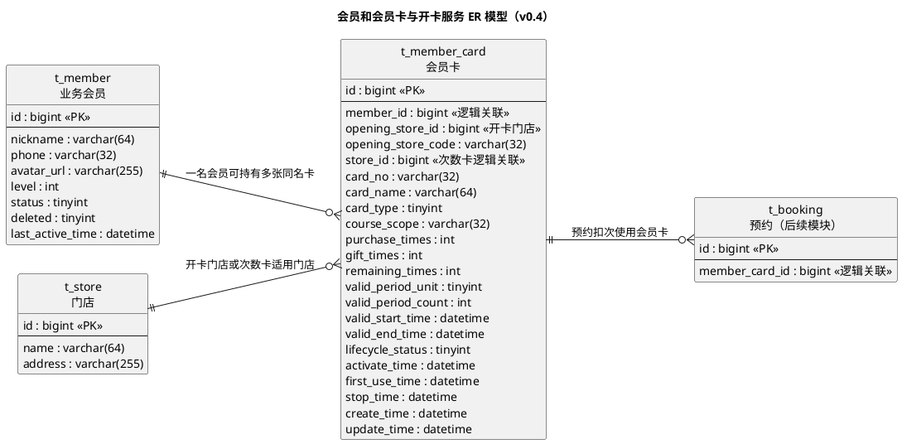

# 瑜伽普拉提会员和会员卡详细设计文档

**版本：v0.4**（2026-09-30，对齐 master 分支需求、概要设计和管理端原型）
**本版范围：会员增删查改、会员卡管理、开卡管理、开卡操作、查询、停卡、预约扣次和未开卡物理删除**

> 本文按 `docs/模板/详细设计文档模板.md` 的章节组织：1 数据架构 / 2 接口 / 3 开发架构 / 4 运行流程 / 5 测试用例设计 / 6 日志设计。
> 本版仍只交付设计，不实现 Java、SQL、Vue 或 uni-app 代码。
> 本版根据已确认规则和 master 分支资料修订：会员与若依系统用户隔离；会员卡通过 `member_id` 关联会员；卡号使用日期、开卡门店编号和秒级时间戳生成；期限卡全平台通用；会员卡按未开卡、激活、使用、停卡等生命周期管理；仅未开卡卡片允许物理删除；增加会员等级、课程适用范围及预约人数扣次的对齐说明。

## 上游依据与设计边界

| 文档 / 输入 | 本版使用内容 |
|---|---|
| `docs/需求文档/管理端/管理端功能清单.md` | 会员管理、会员卡管理，以及用户详情中的会员卡关联信息 |
| `docs/需求文档/用户端/用户端功能清单.md` | 用户查询自己持有的会员卡 |
| `docs/产品分析/用户端页面与对象.md` | 次数卡、年卡、卡号、卡片名称、有效期、状态、剩余次数、初始次数、门店地址 |
| `docs/产品分析/用户端小程序截图/P4-我的-04-会员卡-次数卡.jpg` | 次数卡未开卡/过期、卡号、剩余次数、初始次数和门店展示 |
| `docs/产品分析/用户端小程序截图/P4-我的-04-会员卡-年卡.jpg` | 期限卡卡号、有效期、剩余天数和卡片名称展示 |
| `docs/详细设计/详细设计.md` | 雪花主键、统一响应、VO/DO 分层、MyBatis-Plus、预约模块边界 |
| `backend/AGENTS.md` | `ruoyi-yoga` 业务模块、`com.techplant.yoga` 包名及全局异常/日志约定 |

### 本版明确纳入

1. 会员管理提供会员新增、查询、修改、删除和状态维护；会员独立于若依系统用户。
2. 会员卡管理包含卡片查询、详情、开卡管理、开卡操作和生命周期操作。
3. 开卡服务分两步：先创建待开卡记录，再正式开卡；正式开卡时选择/确认次数卡或期限卡配置。
4. 次数卡保存购买次数、赠送次数和剩余次数；总次数由购买次数与赠送次数相加得到。
5. 期限卡不绑定门店，全平台通用；次数卡绑定适用门店。
6. 卡号按 `yyyyMMdd + 开卡门店编号 + HHmmss` 生成，同一门店同一秒重复开卡由唯一索引返回卡号重复错误。
7. 有效期按开卡日含首尾日计算：一个月按 30 天，一年按 365 天。
8. 支持停卡；停卡后会员卡不可继续预约使用，但保留原有效期和次数数据用于查询。
9. 预约成功占用名额后扣除会员卡剩余次数；扣次必须具备并发安全和失败回滚规则。
10. 仅未开卡会员卡允许物理删除；已开卡卡片只能通过生命周期操作改变状态。
11. 会员卡保存课程适用范围；预约按课种筛选候选卡，期限卡全平台通用但仍受课程范围限制。
12. 用户端会员卡通过会员身份上下文取得 `member_id`，不通过若依系统用户 ID 直接关联。

### 本版明确不纳入

1. 不设计购卡订单、支付单、退款、转卡、续期、会员等级配置、优惠券、礼包和积分的业务表或接口；本版只保存会员等级值，默认等级为 0。
2. 不在会员卡表保存图片、卡面模板或二进制资源；截图中的卡面视觉属于前端展示层。
3. 不由会员卡模块直接读取 `t_booking` 或 `t_schedule`；预约扣次通过预约模块调用会员卡服务完成。
4. 不提供“撤销停卡/恢复使用”操作；如业务需要恢复，另行增加状态流转设计。
5. 不在会员卡中保存会员手机号作为归属键；会员卡只保存 `member_id`，会员信息由会员模块维护并关联查询。
6. 不把支付时的扣次返还、预约取消返还等资金/交易规则写入本版；本版只定义预约成功扣次接口能力。

### 设计标记说明

- **已确认事实**：来自用户本轮确认、现有需求/对象/截图或项目全局约定。
- **建议方案**：为保证本期能开发和验收而提出的实现口径。
- **TODO-待确认**：仍需产品或业务负责人确认，未确认前不得扩展为代码行为。

## master 分支资料校核与对齐结论

本次检查了 master 分支的 `docs/需求分析/需求分析.md`、`docs/概要设计/概要设计.md`、管理端功能清单、管理端页面结构图，以及管理端原型的会员和会员卡页面/API。主分支原型属于 Mock 页面，不能覆盖本轮已经确认的全部会员卡规则，因此采用“已确认业务规则优先、master 资料补充页面和预约闭环”的处理方式。

| 校核项 | master 分支现状 | 本版处理 |
|---|---|---|
| 会员字段 | 会员列表/详情展示昵称、手机号、会员等级、状态、加入时间、最近活跃；新会员等级为 0 | `t_member` 增加 `level` 和 `last_active_time`；`joinTime` 直接映射 `create_time` |
| 会员管理能力 | 功能清单和原型当前只有查询/详情 | 详细设计继续保留本轮已确认的会员 CRUD；明确原型需要补齐新增、修改、删除、启停用 |
| 会员卡菜单 | 原型路由将“会员管理”和“会员卡管理”配置为同级路由 | 以本轮确认的“会员管理 > 会员卡管理”为正式菜单层级，原型需要调整为嵌套菜单 |
| 开卡接口 | 原型使用 `POST /admin/member-cards` 创建、`PUT /admin/member-cards/{id}/activate` 激活 | 保留两步业务流程，接口路径对齐原型；开卡管理使用会员卡列表/详情查询，不另设 `member-card-openings` 路径 |
| 卡片配置 | 原型只有 `initialCount`、`validDays`、`courseScope`，且把 `storeId`作为开卡门店 | 增加开卡门店与适用门店区分；`courseScope` 纳入正式模型；`initialCount` 映射为购买次数，另补赠送次数 |
| 卡片状态 | 原型为未激活、已激活、停用三种展示状态 | 以生命周期 `未开卡/激活/使用中/停卡` 为后端事实，原型需补充使用中、过期、已用完和物理删除门禁 |
| 卡片操作 | 原型暂未提供停卡、物理删除 | 按已确认规则保留停卡和未开卡物理删除接口，原型需要补按钮和状态门禁 |
| 预约闭环 | 概要设计要求按课种筛选卡；次数卡按预约人数扣次；期限卡只校验有效期；多卡默认第一张且允许切换 | 将 `courseScope`、`bookingCount`、期限卡校验和多卡选择纳入扣次流程；返还次数仍放在预约/支付设计边界内 |

**需要后续调整的主分支原型：** 会员 CRUD、会员卡停卡/删除、开卡门店与适用门店字段、购买/赠送次数拆分、课程适用范围编码、会员卡生命周期状态、嵌套菜单及多卡预约选择。上述调整属于原型与接口联调事项，本版先固化详细设计契约。

---

# 1、数据架构

## 1.1 数据库 ER 模型

### 1.1.1 建模口径

| 项 | 本版约定 | 说明 |
|---|---|---|
| 数据库 | MySQL 8.0 | 与项目现有技术栈一致 |
| 存储引擎 / 字符集 | InnoDB / `utf8mb4` / `utf8mb4_unicode_ci` | 支持会员昵称、卡片名称和头像 URL |
| 会员表 | `t_member` | 独立于若依 `sys_user` 的业务会员 |
| 会员卡表 | `t_member_card` | 保存会员卡记录，支持未开卡物理删除 |
| 主键 | `id bigint unsigned`，应用侧雪花 ID | MyBatis-Plus `IdType.ASSIGN_ID` |
| 卡号 | `card_no varchar(64)` | `yyyyMMdd + 开卡门店编号 + HHmmss`，按字符串处理 |
| 卡号唯一性 | `t_member_card.uk_card_no` | 同一秒生成相同卡号时由数据库唯一索引返回重复错误，不增加卡号登记表 |
| 会员删除 | `t_member.deleted` 逻辑删除 | 保留会员与历史会员卡的业务关联 |
| 会员卡删除 | 物理删除 | 仅允许删除 `UNOPENED` 未开卡记录 |
| 审计字段 | `create_by`、`create_time`、`update_by`、`update_time` | 由统一 `MetaObjectHandler` 自动填充 |
| 会员卡状态 | 持久化生命周期 + 查询时有效状态 | 生命周期记录激活、使用、停卡；过期/用完可由查询时计算 |
| 逻辑外键 | `member_id`、`store_id`、`booking.member_card_id` | 不声明物理外键，由业务层校验 |

### 1.1.2 表清单

| 表名 | 中文名 | 所属模块 | 本版状态 |
|---|---|---|---|
| `t_member` | 会员 | 会员管理 | 本版新增，提供会员增删查改 |
| `t_member_card` | 会员卡 | 会员管理 / 会员卡管理 | 本版细化 |
| `sys_user` | 若依系统用户 | 若依系统模块 | 与 `t_member` 隔离，本版不建立归属关系 |
| `t_store` | 门店 | 经营基础 / 门店管理 | 提供开卡门店和次数卡适用门店；期限卡不关联适用门店 |
| `t_booking` | 课程预约 | 经营基础 / 预约管理 | 通过会员卡服务扣次，不在本表直接读写 |

### 1.1.3 ER 模型图



### 1.1.4 实体与关系说明

| 实体 | 说明 | 与其他实体的关系 |
|---|---|---|
| 会员 `t_member` | 保存业务会员的 ID、昵称、手机号、头像、等级和状态；独立于若依系统用户 | 1 : N 会员卡 |
| 会员卡 `t_member_card` | 保存会员、开卡门店、适用课程、卡类型、次数/期限、生命周期和查询展示数据 | N : 1 会员；次数卡 N : 1 适用门店；1 : N 预约引用 |
| 系统用户 `sys_user` | 若依后台登录主体 | 与业务会员隔离，不作为会员卡归属 |
| 门店 `t_store` | 开卡门店记录发卡来源；次数卡另外关联适用门店，期限卡不关联适用门店 | 1 : N 开卡记录或次数卡适用门店 |
| 预约 `t_booking` | 预约成功时通过会员卡服务扣除剩余次数 | N : 1 会员卡，关系由预约模块维护 |

**卡号生成约束：** 开卡服务创建记录时按 `yyyyMMdd + openingStoreCode + HHmmss` 生成卡号并写入 `t_member_card`。`card_no` 上设置唯一索引；同一门店同一秒再次生成相同卡号时直接返回卡号重复错误。物理删除未开卡记录后，历史卡号可以再次生成并入库，本版不额外建设卡号登记表。

## 1.2 数据库逻辑模型

### 1.2.1 `t_member` 会员表字段定义

| 字段 | 中文名 | 逻辑类型 | 必填 | 默认值 | 说明 | 依据 |
|---|---|---|:--:|:--:|---|---|
| `id` | 会员ID | 长整型 | 是 | 雪花ID | 业务会员主键，对外返回字符串 | 用户本轮确认 |
| `nickname` | 会员昵称 | 字符串(64) | 是 | — | 会员展示名称 | 用户本轮确认 |
| `phone` | 会员手机号 | 字符串(32) | 是 | — | 会员业务身份信息，建议唯一 | 用户本轮确认 |
| `avatar_url` | 会员头像 | 字符串(255) | 否 | `NULL` | 头像 URL，不保存二进制 | 用户本轮确认 |
| `level` | 会员等级 | 整型 | 是 | `0` | - | 用户本轮确认 |
| `status` | 会员状态 | 整型 | 是 | `1` | 1 正常，0 停用；停用会员不能新建待开卡记录 | 会员管理建议方案 |
| `deleted` | 逻辑删除 | 整型 | 是 | `0` | 0 正常，1 已删除；保留历史关联 | 会员管理建议方案 |
| `create_by` | 创建人 | 长整型 | 否 | `NULL` | 管理端操作人 ID | 项目全局建模约定 |
| `create_time` | 创建时间 | 日期时间 | 是 | 当前时间 | 记录创建时间 | 项目全局建模约定 |
| `update_by` | 更新人 | 长整型 | 否 | `NULL` | 最近更新操作人 ID | 项目全局建模约定 |
| `update_time` | 更新时间 | 日期时间 | 是 | 当前时间 | 最近更新时间 | 项目全局建模约定 |
| `last_active_time` | 最近活跃时间 | 日期时间 | 否 | `NULL` | 会员最近一次登录或有效业务操作时间；没有该数据时返回 `NULL` | master 原型展示字段 |

**会员边界：** `t_member` 不复用 `sys_user` 的用户 ID、昵称、手机号或头像字段。后台操作人来自 `sys_user`，业务持卡人来自 `t_member`；会员卡只保存 `member_id`。

### 1.2.2 `t_member_card` 会员卡表字段定义

| 字段 | 中文名 | 逻辑类型 | 必填 | 默认值 | 说明 | 依据 |
|---|---|---|:--:|:--:|---|---|
| `id` | 会员卡ID | 长整型 | 是 | 雪花ID | 主键，接口返回字符串 | 项目全局建模约定 |
| `member_id` | 持卡会员ID | 长整型 | 是 | — | 逻辑关联 `t_member.id`，不关联 `sys_user` | 用户本轮确认 |
| `opening_store_id` | 开卡门店ID | 长整型 | 是 | — | 记录实际发卡门店；期限卡不以此作为使用范围 | master 原型与卡号生成规则 |
| `opening_store_code` | 开卡门店编号 | 字符串(32) | 是 | — | 用于卡号生成；期限卡不以此作为使用范围 | 卡号生成规则 |
| `store_id` | 适用门店ID | 长整型 | 否 | `NULL` | 次数卡必填；期限卡必须为 `NULL` | 期限卡全平台通用 |
| `card_no` | 卡号 | 字符串(64) | 是 | — | `yyyyMMdd + 开卡门店编号 + HHmmss`，唯一索引 | 用户本轮确认 |
| `card_name` | 卡片名称 | 字符串(64) | 是 | — | 如“普拉提次卡”“通用年卡” | 截图及对象文档 |
| `card_type` | 卡片类型 | 整型 | 是 | — | 1 次数卡，2 期限卡 | 用户确认开卡时设置 |
| `course_scope` | 课程适用范围 | 字符串(32) | 是 | — | 1 团课/精品课，2 私教课；用于预约候选卡筛选 | master 需求与原型 |
| `purchase_times` | 初始购买次数 | 非负整数 | 次数卡是 | `NULL` | 与赠送次数分开保存 | 用户确认 |
| `gift_times` | 初始赠送次数 | 非负整数 | 次数卡是 | `NULL` | 与购买次数分开保存 | 用户确认 |
| `remaining_times` | 当前剩余次数 | 非负整数 | 次数卡是 | `NULL` | 初始值为购买次数 + 赠送次数，预约时直接扣减 | 用户确认 |
| `valid_period_unit` | 有效期单位 | 整型 | 开卡时是 | `NULL` | 1 月，2 年；两者分别按 30/365 天计算 | 用户确认 |
| `valid_period_count` | 有效期数量 | 正整数 | 开卡时是 | `NULL` | 例如 1 个月、1 年；实际天数由单位换算 | 用户确认 |
| `valid_start_time` | 有效期开始时间 | 日期时间 | 开卡后是 | `NULL` | 开卡日 00:00:00 | 开卡日含首日 |
| `valid_end_time` | 有效期结束时间 | 日期时间 | 开卡后是 | `NULL` | 开卡日含末日，结束日 23:59:59 | 开卡日含尾日 |
| `lifecycle_status` | 生命周期状态 | 整型 | 是 | `0` | 0 未开卡，1 激活，2 使用中，3 停卡 | 用户本轮确认 |
| `activate_time` | 激活时间 | 日期时间 | 否 | `NULL` | 正式开卡时写入；未开卡为空 | 开卡流程 |
| `activate_by` | 激活操作人 | 长整型 | 否 | `NULL` | 管理端操作人 ID | 审计需要 |
| `first_use_time` | 首次使用时间 | 日期时间 | 否 | `NULL` | 首次预约扣次成功时写入 | 生命周期 |
| `stop_time` | 停卡时间 | 日期时间 | 否 | `NULL` | 手动停卡时写入；不清除有效期和次数 | 用户本轮确认 |
| `stop_by` | 停卡操作人 | 长整型 | 否 | `NULL` | 管理端操作人 ID | 审计需要 |
| `stop_reason` | 停卡原因 | 字符串(255) | 否 | `NULL` | 停卡操作必填 | 建议方案 |
| `create_by` | 创建人 | 长整型 | 否 | `NULL` | 创建待开卡卡片的操作人 | 项目全局建模约定 |
| `create_time` | 创建时间 | 日期时间 | 是 | 当前时间 | 记录创建时间 | 项目全局建模约定 |
| `update_by` | 更新人 | 长整型 | 否 | `NULL` | 最近更新操作人 | 项目全局建模约定 |
| `update_time` | 更新时间 | 日期时间 | 是 | 当前时间 | 最近更新时间 | 项目全局建模约定 |

**总次数规则：** `total_times` 不单独落库，接口返回值由 `purchase_times + gift_times` 计算；`remaining_times` 初始值等于总次数，预约扣次时只更新 `remaining_times`。本版不区分购买次数和赠送次数的消耗先后顺序。

**会员信息规则：** 会员昵称、手机号、头像统一由 `t_member` 维护；会员卡只存 `member_id`。会员资料修改后，卡片查询通过会员服务取得最新信息，不复制手机号到会员卡表。

### 1.2.3 枚举值与状态计算

| 枚举 / 计算值 | 取值 | 说明 |
|---|---:|---|
| 卡片类型 `card_type` | `1` | 次数卡，必须绑定门店 |
| 卡片类型 `card_type` | `2` | 期限卡，不绑定门店，全平台通用 |
| 有效期单位 `valid_period_unit` | `1` | 月，1 个单位按 30 天计算 |
| 有效期单位 `valid_period_unit` | `2` | 年，1 个单位按 365 天计算 |
| 生命周期 `lifecycle_status` | `0` | 未开卡 |
| 生命周期 `lifecycle_status` | `1` | 激活，已正式开卡但尚未成功使用 |
| 生命周期 `lifecycle_status` | `2` | 使用中，至少一次预约扣次成功 |
| 生命周期 `lifecycle_status` | `3` | 停卡 |
| 展示状态 `cardStatus` | `EXPIRED` | 已激活/使用中且当前日期晚于有效期结束日 |
| 展示状态 `cardStatus` | `USED_UP` | 次数卡未停卡、未过期且 `remaining_times = 0` |

生命周期转换为：`UNOPENED` → `ACTIVATED` → `IN_USE`；`ACTIVATED/IN_USE` 可以转为 `STOPPED`。查询展示状态优先级为：未开卡 → 停卡 → 过期 → 已用完 → 生命周期状态（激活/使用中）。停卡不修改有效期和剩余次数。

### 1.2.4 物理模型与索引

```sql
DROP TABLE IF EXISTS `t_member`;
CREATE TABLE `t_member` (
  `id`          bigint unsigned NOT NULL COMMENT '会员ID',
  `nickname`    varchar(64) NOT NULL COMMENT '会员昵称',
  `phone`       varchar(32) NOT NULL COMMENT '会员手机号',
  `avatar_url`  varchar(255) DEFAULT NULL COMMENT '会员头像URL',
  `level`       int NOT NULL DEFAULT 0 COMMENT '会员等级，默认0',
  `status`      tinyint NOT NULL DEFAULT 1 COMMENT '会员状态：1正常 0停用',
  `deleted`     tinyint NOT NULL DEFAULT 0 COMMENT '逻辑删除：0正常 1已删除',
  `last_active_time` datetime DEFAULT NULL COMMENT '最近活跃时间',
  `create_by`   bigint unsigned DEFAULT NULL COMMENT '创建人ID',
  `create_time` datetime NOT NULL DEFAULT CURRENT_TIMESTAMP COMMENT '创建时间',
  `update_by`   bigint unsigned DEFAULT NULL COMMENT '更新人ID',
  `update_time` datetime NOT NULL DEFAULT CURRENT_TIMESTAMP ON UPDATE CURRENT_TIMESTAMP COMMENT '更新时间',
  PRIMARY KEY (`id`),
  UNIQUE KEY `uk_phone` (`phone`),
  KEY `idx_nickname_status` (`nickname`, `status`, `deleted`)
) ENGINE=InnoDB DEFAULT CHARSET=utf8mb4 COLLATE=utf8mb4_unicode_ci COMMENT='业务会员表';

DROP TABLE IF EXISTS `t_member_card`;
CREATE TABLE `t_member_card` (
  `id`                  bigint unsigned NOT NULL COMMENT '会员卡ID',
  `member_id`           bigint unsigned NOT NULL COMMENT '持卡会员ID，逻辑关联t_member.id',
  `opening_store_id`     bigint unsigned NOT NULL COMMENT '开卡门店ID，记录发卡来源',
  `opening_store_code`  varchar(32) NOT NULL COMMENT '开卡门店编号，用于生成卡号',
  `store_id`            bigint unsigned DEFAULT NULL COMMENT '次数卡适用门店ID；期限卡为空',
  `card_no`             varchar(64) NOT NULL COMMENT '会员卡号：日期+门店编号+时分秒',
  `card_name`           varchar(64) NOT NULL COMMENT '卡片名称',
  `card_type`           tinyint unsigned NOT NULL COMMENT '卡片类型：1次数卡 2期限卡',
  `course_scope`        varchar(32) NOT NULL COMMENT '课程适用范围：GROUP团课精品课 PRIVATE私教课',
  `purchase_times`      int unsigned DEFAULT NULL COMMENT '初始购买次数，仅次数卡',
  `gift_times`          int unsigned DEFAULT NULL COMMENT '初始赠送次数，仅次数卡',
  `remaining_times`     int unsigned DEFAULT NULL COMMENT '当前剩余次数，仅次数卡',
  `valid_period_unit`   tinyint unsigned DEFAULT NULL COMMENT '有效期单位：1月 2年',
  `valid_period_count`  int unsigned DEFAULT NULL COMMENT '有效期数量',
  `valid_start_time`    datetime DEFAULT NULL COMMENT '有效期开始时间，开卡日00:00:00',
  `valid_end_time`      datetime DEFAULT NULL COMMENT '有效期结束时间，结束日23:59:59',
  `lifecycle_status`     tinyint unsigned NOT NULL DEFAULT 0 COMMENT '生命周期：0未开卡 1激活 2使用中 3停卡',
  `activate_time`        datetime DEFAULT NULL COMMENT '激活时间',
  `activate_by`          bigint unsigned DEFAULT NULL COMMENT '激活操作人ID',
  `first_use_time`       datetime DEFAULT NULL COMMENT '首次使用时间',
  `stop_time`            datetime DEFAULT NULL COMMENT '停卡时间',
  `stop_by`              bigint unsigned DEFAULT NULL COMMENT '停卡操作人ID',
  `stop_reason`          varchar(255) DEFAULT NULL COMMENT '停卡原因',
  `create_by`            bigint unsigned DEFAULT NULL COMMENT '创建人ID',
  `create_time`          datetime NOT NULL DEFAULT CURRENT_TIMESTAMP COMMENT '创建时间',
  `update_by`            bigint unsigned DEFAULT NULL COMMENT '更新人ID',
  `update_time`          datetime NOT NULL DEFAULT CURRENT_TIMESTAMP ON UPDATE CURRENT_TIMESTAMP COMMENT '更新时间',
  PRIMARY KEY (`id`),
  UNIQUE KEY `uk_card_no` (`card_no`),
  KEY `idx_member_id_id` (`member_id`, `id`),
  KEY `idx_opening_store_id_id` (`opening_store_id`, `id`),
  KEY `idx_store_id_id` (`store_id`, `id`),
  KEY `idx_course_scope_id` (`course_scope`, `id`),
  KEY `idx_card_type_id` (`card_type`, `id`),
  KEY `idx_lifecycle_status_id` (`lifecycle_status`, `id`),
  KEY `idx_activate_time` (`activate_time`),
  KEY `idx_stop_time` (`stop_time`),
  KEY `idx_valid_end_time` (`valid_end_time`)
) ENGINE=InnoDB DEFAULT CHARSET=utf8mb4 COLLATE=utf8mb4_unicode_ci COMMENT='会员卡业务记录表';
```

> 上述 DDL 为设计稿，尚未在 MySQL 上执行验证。卡号唯一性只依赖 `t_member_card.uk_card_no`；实际实现需验证同一秒重复开卡时的唯一索引错误转换。

### 1.2.5 数据一致性约束

1. 会员：手机号唯一；新会员 `level = 0`；会员删除使用逻辑删除，存在会员卡时不得物理删除会员业务记录。
2. 会员卡：`opening_store_id` 和 `opening_store_code` 必须有值；`course_scope` 必须为 `GROUP` 或 `PRIVATE`，并参与预约候选卡筛选。
3. 次数卡：`store_id`、`purchase_times`、`gift_times`、`remaining_times`、`valid_period_unit`、`valid_period_count` 必须有值；`remaining_times = purchase_times + gift_times` 为开卡初始值。
4. 期限卡：`store_id` 必须为 `NULL`；次数相关字段必须为 `NULL`；只保存课程适用范围、有效期配置和开卡门店信息，使用时全平台通用。
5. `valid_period_unit = 1` 时实际天数为 `valid_period_count * 30`；`valid_period_unit = 2` 时实际天数为 `valid_period_count * 365`。
6. 开卡日为有效期第一天，结束日期为 `开卡日期 + 实际天数 - 1 天`；开始时间为 00:00:00，结束时间为 23:59:59。
7. 未开卡记录的 `activate_time`、`activate_by`、`valid_start_time`、`valid_end_time` 必须为空；正式开卡操作必须一次性写齐。
8. 停卡后必须保留 `stop_time`、`stop_by` 和原因，不得将剩余次数清零或改写有效期。
9. 卡号由日期、开卡门店编号和秒级时间戳组成，并由 `uk_card_no` 保证当前业务表内唯一。
10. 会员卡物理删除前必须确认 `lifecycle_status = 0`；已激活、使用中、停卡或已过期卡片均不可物理删除。

## 1.3 字段确认结论与待确认事项

### 1.3.1 本版已确定

| 编号 | 结论 |
|---|---|
| C1 | 增加独立的业务会员 `t_member`，提供会员新增、查询、修改、删除和状态维护；会员与 `sys_user` 隔离。 |
| C2 | 会员卡通过 `member_id` 关联会员，不以手机号作为会员卡归属键。 |
| C3 | 会员管理下设置“会员卡管理”，会员卡管理包含会员卡查询、详情、开卡管理和卡片操作。 |
| C4 | 会员卡支持物理删除，但只允许删除未开卡记录；已开卡后只能改变生命周期状态。 |
| C5 | 卡号按 `yyyyMMdd + 开卡门店编号 + HHmmss` 生成；`t_member_card.card_no` 使用唯一索引，同一秒重复生成时直接报错。 |
| C6 | 开卡服务分两步：创建待开卡记录、正式开卡；正式开卡时设置次数卡或期限卡。 |
| C7 | 期限卡不绑定门店，全平台通用；次数卡当前不允许跨店使用。 |
| C8 | 会员卡生命周期至少包括未开卡、激活、使用中和停卡；停卡字段统一使用 `stop_time`。 |
| C9 | 有效期包含开卡日首尾日；月份按 30 天，年份按 365 天。 |
| C10 | 一名会员可以持有多张同名卡；预约选择多张可用次数卡时由会员/用户自行选择。 |
| C11 | 预约成功时从 `remaining_times` 直接扣除；购买次数和赠送次数分开存储，总次数按两者相加计算，不区分消耗先后。 |
| C12 | 会员卡查询返回关联会员的会员 ID、昵称、手机号和头像；会员信息由 `t_member` 统一维护。 |
| C13 | 会员新增时等级默认为 0；本版保存等级值并展示，不设计会员等级配置和权益规则。 |
| C14 | 会员卡增加课程适用范围；团课/精品课与私教课按范围筛选候选卡，期限卡虽然全平台通用，但仍受课程范围限制。 |
| C15 | 开卡接口路径与 master 原型对齐：创建使用 `POST /admin/member-cards`，正式开卡使用 `PUT /admin/member-cards/{id}/activate`；业务上仍是创建待开卡记录和正式开卡两步。 |

### 1.3.2 TODO-待确认

上一版待确认项已根据本轮确认转化为上方 C1～C15；以下只保留尚未拍板的新增问题。

| 编号 | 待确认问题 | 建议默认值 / 影响 |
|---|---|---|
| TODO-会员卡-101 | 会员端登录态如何与独立 `t_member` 建立身份上下文？ | 建议会员端登录成功后直接携带 `member_id` 访问用户端会员卡接口；不复用 `sys_user`。 |
| TODO-会员卡-102 | 会员手机号是否允许修改，修改后是否需要通知已持有卡片的相关业务？ | 建议允许会员管理修改，卡片查询实时读取最新会员资料。 |
| TODO-会员卡-103 | 停卡后是否允许恢复为激活/使用中？ | 本版不提供恢复操作，确认后再补状态流转。 |
| TODO-会员卡-104 | 预约取消、预约失败和排班取消时是否返还已扣次数？ | master 概要设计建议按预约人数返还次数卡次数、期限卡不处理；按本轮会员卡边界，本版只锁定预约成功扣次，返还在预约/支付详细设计中落地。 |
| TODO-会员卡-105 | 开卡门店编号是否已存在于门店模块，还是需要新增 `store_code` 字段？ | 卡号不使用门店名称；建议门店模块提供稳定唯一的 `storeCode`。 |
| TODO-会员卡-106 | 同一会员拥有多张可用次数卡时，用户端选择卡片的交互和预约请求字段是什么？ | 本版要求用户自行选择，预约请求携带 `memberCardId`。 |
| TODO-会员卡-107 | 物理删除未开卡卡片后，历史卡号是否仍要求永久不可复用？ | 不增加卡号登记表时只能保证当前 `t_member_card` 存量唯一；若必须保证历史永久不可复用，需要接受新增卡号登记表或其他不可物理删除的占用记录。 |

---

# 2、接口

## 2.1 通用约定

1. 管理端接口前缀为 `/admin`，需要登录态；菜单归属为“会员管理 / 会员卡管理”。
2. 用户端接口前缀为 `/api`，需要会员登录态；会员 ID 必须从会员身份上下文取得，不能从 `sys_user` 推导。
3. 列表接口使用 `TableDataInfo`：`{total, rows, code, msg}`；详情和写操作使用 `AjaxResult`：`{code, msg, data}`。
4. HTTP 状态码沿用项目约定固定为 200，业务结果读取 `code`；参数校验失败由全局处理器返回业务码 500。
5. 64 位 ID 对外序列化为字符串；次数、天数、枚举和金额等非 ID 数值保持数字类型。
6. 不向前端直接返回 DO、审计字段、完整异常堆栈或未脱敏手机号。
7. 查询排序默认使用 `activate_time DESC`、`create_time DESC`、`id DESC`，保证翻页稳定。
8. 所有涉及会员、会员卡写入、物理删除、停卡和扣次的操作均在 service 层定义事务边界。

## 2.2 接口总览

| # | 接口 | 对应功能 | 需要登录 |
|---:|---|---|:---:|
| 1 | `GET /admin/members` | 会员管理：查询会员 | 是 |
| 2 | `GET /admin/members/{id}` | 会员管理：查询会员详情 | 是 |
| 3 | `POST /admin/members` | 会员管理：新增会员 | 是 |
| 4 | `PUT /admin/members/{id}` | 会员管理：修改会员 | 是 |
| 5 | `DELETE /admin/members/{id}` | 会员管理：删除会员（逻辑删除） | 是 |
| 6 | `PUT /admin/members/{id}/status` | 会员管理：设置会员状态 | 是 |
| 7 | `GET /admin/member-cards` | 会员卡管理：查询会员卡 | 是 |
| 8 | `GET /admin/member-cards/{id}` | 会员卡管理：查询详情 | 是 |
| 9 | `POST /admin/member-cards` | 开卡操作：创建待开卡会员卡 | 是 |
| 10 | `PUT /admin/member-cards/{id}/activate` | 开卡操作：正式开卡 | 是 |
| 11 | `PUT /admin/member-cards/{id}/stop` | 会员卡操作：停卡 | 是 |
| 12 | `DELETE /admin/member-cards/{id}` | 会员卡管理：物理删除未开卡卡片 | 是 |
| 13 | `GET /api/member-cards/me` | 会员查询自己的会员卡 | 是 |

本版不提供恢复停卡、修改已开卡卡片配置、修改卡号和修改会员归属接口；开卡后核心卡片配置视为已生效数据。

### 2.2.1 会员管理：会员 CRUD

会员管理维护独立于 `sys_user` 的业务会员信息。

| 接口 | 请求/返回 | 关键规则 |
|---|---|---|
| `GET /admin/members` | 分页参数、昵称、手机号、等级、状态；返回 `TableDataInfo<MemberListItemVO>` | 默认只查 `deleted = 0`，按 `id DESC` 排序 |
| `GET /admin/members/{id}` | 返回 `MemberDetailVO` | 不存在或已删除返回 404 |
| `POST /admin/members` | `nickname`、`phone`、`avatarUrl`；返回会员 ID | 手机号唯一；创建后等级为 0、状态为正常 |
| `PUT /admin/members/{id}` | 修改昵称、手机号、头像 | 手机号冲突返回 409；不允许修改 ID |
| `DELETE /admin/members/{id}` | 无请求体 | 逻辑删除；存在未停卡会员卡时拒绝删除 |
| `PUT /admin/members/{id}/status` | `status: 0/1` | 停用会员不能新增待开卡记录；已有卡片不自动删除 |

会员 CRUD 只处理 `t_member`，不创建或修改若依 `sys_user`。会员删除采用逻辑删除，避免破坏会员卡和预约历史关联。

### 2.2.2 会员卡管理：查询列表

`GET /admin/member-cards`

查询当前存在的会员卡业务记录，不使用 `deleted` 条件。支持卡号、会员信息、卡片类型、生命周期/有效状态和门店筛选。

#### 请求参数

| 参数 | 位置 | 类型 | 必选 | 说明 |
|---|---|---|:---:|---|
| `pageNum` | query | integer | 否 | 默认 1，最小 1 |
| `pageSize` | query | integer | 否 | 默认 10，最大 100 |
| `cardNo` | query | string | 否 | 卡号精确或前缀匹配，最长 32 |
| `memberId` | query | string | 否 | 会员 ID，按字符串接收后转长整型 |
| `memberNickname` | query | string | 否 | 会员昵称模糊查询，最长 64 |
| `memberPhone` | query | string | 否 | 会员手机号查询，具体权限见 TODO-会员卡-102 |
| `level` | query | integer | 否 | 会员等级筛选 |
| `cardName` | query | string | 否 | 卡片名称模糊匹配，最长 64 |
| `cardType` | query | integer | 否 | 1 次数卡，2 期限卡 |
| `cardStatus` | query | string | 否 | `UNOPENED` / `ACTIVATED` / `IN_USE` / `STOPPED` / `EXPIRED` / `USED_UP` |
| `storeId` | query | string | 否 | 只筛选次数卡适用门店 |
| `openingStoreId` | query | string | 否 | 筛选实际开卡门店 |
| `courseScope` | query | string | 否 | `GROUP` 团课/精品课，`PRIVATE` 私教课 |
| `openingStatus` | query | string | 否 | `UNOPENED` 待开卡，`OPENED` 已开卡；用于开卡管理列表 |

#### 200 Response 示例

```json
{
  "total": 1,
  "rows": [
    {
      "id": "1856739201475235991",
      "memberId": "1856739201475235841",
      "memberNickname": "瑜伽小一",
      "memberPhone": "138****8888",
      "memberAvatarUrl": "https://cdn.example.com/member/avatar-1.jpg",
      "openingStoreId": "1856739201475235901",
      "openingStoreCode": "SH001",
      "openingStoreName": "嘉定马陆店",
      "storeId": "1856739201475235901",
      "courseScope": "GROUP",
      "courseScopeName": "团课/精品课",
      "cardNo": "2025091900167",
      "cardName": "普拉提次卡",
      "cardType": 1,
      "cardTypeName": "次数卡",
      "purchaseTimes": 1,
      "giftTimes": 14,
      "totalTimes": 15,
      "remainingTimes": 15,
      "validPeriodUnit": 1,
      "validPeriodCount": 1,
      "validStartTime": null,
      "validEndTime": null,
      "lifecycleStatus": 0,
      "lifecycleStatusName": "未开卡",
      "activateTime": null,
      "firstUseTime": null,
      "stopTime": null,
      "cardStatus": "UNOPENED",
      "cardStatusName": "未开卡",
      "storeName": "嘉定马陆店",
      "storeAddress": "嘉定区马陆镇示例路 1 号"
    }
  ],
  "code": 200,
  "msg": "查询成功"
}
```

#### 返回结果

| 业务码 | 含义 | 说明 |
|---:|---|---|
| 200 | 成功 | 没有数据时 `rows` 为空数组 |
| 401 | 未登录 | 由认证框架返回 |
| 500 | 参数错误 | 分页、ID、手机号、枚举或卡号参数不合法 |

### 2.2.3 会员卡管理：查询详情

`GET /admin/member-cards/{id}`

按会员卡 ID 查询当前存在的会员卡完整信息，包括关联会员信息、卡片配置、开卡信息、停卡信息、有效期和当前状态。会员卡物理删除后查询返回 404。

| 业务码 | 含义 | 说明 |
|---:|---|---|
| 200 | 成功 | `data` 为 `MemberCardDetailVO` |
| 401 | 未登录 | 由认证框架返回 |
| 404 | 不存在 | 会员卡已物理删除或 ID 不存在 |
| 500 | 参数错误 | ID 格式不合法 |

### 2.2.4 会员卡管理：物理删除

`DELETE /admin/member-cards/{id}`

物理删除会员卡业务记录。只有 `lifecycle_status = 0` 的未开卡记录允许删除；已激活、使用中、停卡或已过期的会员卡均拒绝删除。由于没有卡号登记表，物理删除后卡号不再保留历史占用；同一秒再次生成相同卡号时仍由唯一索引决定是否冲突。

| 业务码 | 含义 | 说明 |
|---:|---|---|
| 200 | 成功 | `data` 不返回，会员卡业务记录已删除 |
| 401 | 未登录 | 由认证框架返回 |
| 404 | 不存在 | 会员卡已被删除或不存在 |
| 409 | 删除冲突 | 会员卡已激活或存在业务引用，不能删除 |
| 500 | 参数/系统错误 | ID 不合法或删除失败 |

### 2.2.5 开卡管理：查询开卡记录

`GET /admin/member-cards?openingStatus=UNOPENED`

查询开卡服务产生的会员卡记录，重点展示待开卡记录和已开卡记录。支持 `openingStatus=UNOPENED/OPENED`，其中 `OPENED` 表示 `activate_time` 不为空；停卡属于卡片生命周期状态，不改变“已开卡”事实。

请求参数在会员卡列表基础上增加：

| 参数 | 位置 | 类型 | 必选 | 说明 |
|---|---|---|:---:|---|
| `openingStatus` | query | string | 否 | `UNOPENED` 待开卡，`OPENED` 已开卡 |
| `createdStartTime` | query | string | 否 | 创建时间起点 |
| `createdEndTime` | query | string | 否 | 创建时间终点 |

返回 `TableDataInfo<MemberCardListItemVO>`，包含会员信息、开卡门店、适用范围、卡片类型、卡片配置、卡号、创建时间、开卡时间、开卡人和当前状态。

### 2.2.6 开卡管理：查询详情

`GET /admin/member-cards/{id}`

返回开卡管理详情。待开卡记录可以执行正式开卡；已开卡记录只读展示，不允许再次修改类型、次数、期限、门店和用户归属。

### 2.2.7 开卡操作：创建待开卡会员卡

`POST /admin/member-cards`

创建一条待开卡记录，完成会员选择、开卡门店编号确认、卡号生成和卡片配置保存，但不写入有效期开始/结束时间。创建后 `lifecycleStatus = UNOPENED`。

#### 请求体

```json
{
  "memberId": "1856739201475235841",
  "openingStoreId": "1856739201475235901",
  "cardName": "普拉提次卡",
  "cardType": 1,
  "courseScope": "GROUP",
  "storeId": "1856739201475235901",
  "purchaseTimes": 1,
  "giftTimes": 14,
  "validPeriodUnit": 1,
  "validPeriodCount": 1
}
```

#### 字段规则

1. `memberId` 必须对应未删除且正常状态的 `t_member`；会员信息由会员模块统一维护，不在开卡请求中重复提交手机号。
2. `openingStoreId` 必填，服务端读取门店稳定编号生成 `openingStoreCode`；卡号格式为 `yyyyMMdd + openingStoreCode + HHmmss`，卡号不由前端传入。
3. `courseScope` 必填：`GROUP` 表示团课/精品课，`PRIVATE` 表示私教课；预约按课程范围筛选候选卡。
4. `cardType = 1` 时 `storeId`、购买次数、赠送次数、有效期单位和有效期数量必填；初始 `remainingTimes = purchaseTimes + giftTimes`。
5. `cardType = 2` 时 `storeId` 必须为空；次数相关字段必须为空；期限卡全平台通用，但仍保存开卡门店用于卡号和发卡来源展示。
6. `validPeriodUnit = 1` 按 30 天，`validPeriodUnit = 2` 按 365 天；正式开卡时才计算有效期日期。原型的 `validDays=30/365` 只作为前端快捷选项，服务端统一转换为单位和数量。
7. 原型的 `initialCount` 只能映射为 `purchaseTimes`；正式表单必须补充 `giftTimes`，不能丢失赠送次数。
8. 同一门店同一秒再次生成相同卡号时，数据库唯一索引报重复错误，服务端返回 409，不自动改写卡号。

#### 返回结果

| 业务码 | 含义 | 说明 |
|---:|---|---|
| 200 | 成功 | 返回新建会员卡 ID，ID 为字符串 |
| 401 | 未登录 | 由认证框架返回 |
| 409 | 业务冲突 | 卡号重复、会员不存在或开卡配置冲突 |
| 500 | 参数错误 | 次数、类型、期限或会员信息校验失败 |

### 2.2.8 开卡操作：正式开卡

`PUT /admin/member-cards/{id}/activate`

将待开卡记录正式开卡。开卡日由服务端使用 `Asia/Shanghai` 当前自然日确定，不接受客户端回传的历史日期。操作必须幂等：已开卡重复调用返回当前结果，不重复延长有效期、不重复增加次数。

#### 开卡规则

1. 记录必须存在且 `activate_time` 为空；已停卡或已删除记录不能开卡。
2. `valid_start_time = 开卡日 00:00:00`。
3. 实际天数：月卡为 `validPeriodCount * 30`，年卡为 `validPeriodCount * 365`。
4. `valid_end_time = 开卡日 + 实际天数 - 1 天 23:59:59`。
5. 写入 `activate_time`、`activate_by`、`valid_start_time`、`valid_end_time`，并将生命周期从未开卡改为激活；不改变会员、卡号、卡类型、课程范围、次数和门店配置。

| 业务码 | 含义 | 说明 |
|---:|---|---|
| 200 | 成功 | 返回开卡后的会员卡详情 |
| 401 | 未登录 | 由认证框架返回 |
| 404 | 不存在 | 待开卡记录不存在 |
| 409 | 状态冲突 | 已开卡、已停卡或配置不完整 |
| 500 | 系统错误 | 开卡事务失败 |

### 2.2.9 会员卡操作：停卡

`PUT /admin/member-cards/{id}/stop`

手动停止会员卡使用。停卡后不清零剩余次数，不修改有效期；只写入 `stop_time`、`stop_by` 和 `stop_reason`，并将生命周期改为停卡。停卡操作不可重复恢复，本版不提供恢复接口。

#### 请求体

```json
{
  "reason": "用户申请暂停使用"
}
```

`reason` 必填，长度 1~255。已停卡重复调用视为幂等成功并返回当前状态；未开卡记录不能执行停卡。

### 2.2.10 会员端查询本人会员卡

`GET /api/member-cards/me`

查询当前登录会员的会员卡。会员端不能传入 `memberId`，服务端使用会员身份上下文限制数据范围。返回卡片类型、卡号、卡片名称、会员信息、有效期、状态、门店和次数/剩余天数。

期限卡的适用门店 `storeId/storeName/storeAddress` 固定为 `null`；两种卡都可以返回开卡门店信息，次数卡另外返回适用门店信息。手机号默认脱敏。

## 2.3 数据模型

### 2.3.1 `MemberListItemVO` / `MemberDetailVO`

| 名称 | 类型 | 必选 | 说明 |
|---|---|:---:|---|
| `id` | string | 是 | 会员 ID，字符串 |
| `nickname` | string | 是 | 会员昵称 |
| `phone` | string | 是 | 会员手机号；列表和用户端默认脱敏 |
| `avatarUrl` | string | 否 | 会员头像 URL |
| `level` | integer | 是 | 会员等级；新会员默认 0，本版不设计等级配置 |
| `status` | integer | 是 | 1 正常，0 停用 |
| `joinTime` | string | 是 | 加入时间，映射 `createTime` |
| `lastActiveTime` | string | 否 | 最近活跃时间，没有数据时为 `null` |
| `cardCount` | integer | 否 | 会员卡数量；列表可返回，详情按需返回 |

会员详情可以附带会员卡摘要，摘要至少包括卡号、开卡门店、卡名、类型、课程范围、剩余次数和状态；不直接嵌套全部会员卡分页数据，完整卡片数据仍通过会员卡查询接口获取。原型当前只提供查看详情，新增、修改、删除和启停用按钮需要补齐。

### 2.3.2 `MemberCardListItemVO`

| 名称 | 类型 | 必选 | 说明 |
|---|---|:---:|---|
| `id` | string | 是 | 会员卡 ID，字符串 |
| `memberId` | string | 是 | 持卡会员 ID |
| `memberNickname` | string | 是 | 关联会员昵称 |
| `memberPhone` | string | 是 | 关联会员手机号，默认脱敏 |
| `memberAvatarUrl` | string | 否 | 关联会员头像 |
| `openingStoreId` | string | 是 | 实际开卡门店 ID |
| `openingStoreCode` | string | 是 | 开卡门店编号，卡号生成来源 |
| `openingStoreName` | string | 是 | 实际开卡门店名称 |
| `storeId` | string | 否 | 次数卡门店 ID；期限卡为 `null` |
| `courseScope` | string | 是 | `GROUP` 团课/精品课，`PRIVATE` 私教课 |
| `courseScopeName` | string | 是 | 课程适用范围名称 |
| `cardNo` | string | 是 | 卡号，字符串；当前业务表内唯一 |
| `cardName` | string | 是 | 卡片名称 |
| `cardType` | integer | 是 | 1 次数卡，2 期限卡 |
| `cardTypeName` | string | 是 | 次数卡 / 期限卡 |
| `purchaseTimes` | integer | 否 | 次数卡购买次数 |
| `giftTimes` | integer | 否 | 次数卡赠送次数 |
| `totalTimes` | integer | 否 | `purchaseTimes + giftTimes`，不落库 |
| `remainingTimes` | integer | 否 | 当前剩余次数 |
| `validPeriodUnit` | integer | 否 | 1 月，2 年 |
| `validPeriodCount` | integer | 否 | 有效期数量 |
| `validStartTime` | string | 否 | 开卡日 00:00:00 |
| `validEndTime` | string | 否 | 结束日 23:59:59 |
| `remainingDays` | integer | 否 | 期限卡未过期时的剩余自然日 |
| `lifecycleStatus` | integer | 是 | 0 未开卡，1 激活，2 使用中，3 停卡 |
| `lifecycleStatusName` | string | 是 | 生命周期中文名 |
| `activateTime` | string | 否 | 正式开卡时间 |
| `firstUseTime` | string | 否 | 首次预约扣次时间 |
| `stopTime` | string | 否 | 停卡时间 |
| `cardStatus` | string | 是 | 未开卡 / 激活 / 使用中 / 已停卡 / 已过期 / 已用完 |
| `cardStatusName` | string | 是 | 状态中文名 |
| `storeName` | string | 否 | 次数卡门店名称 |
| `storeAddress` | string | 否 | 次数卡门店地址 |

### 2.3.3 `MemberCardDetailVO`

在列表模型基础上增加：

| 名称 | 类型 | 必选 | 说明 |
|---|---|:---:|---|
| `activateBy` | string | 否 | 激活操作人 ID，字符串 |
| `stopBy` | string | 否 | 停卡操作人 ID，字符串 |
| `stopReason` | string | 否 | 停卡原因 |
| `createTime` | string | 是 | 创建待开卡记录时间 |
| `updateTime` | string | 是 | 最近更新时间 |

不返回 `createBy/updateBy`，避免将内部审计字段直接暴露成业务字段。

### 2.3.4 请求模型

| 模型 | 主要字段 | 用途 |
|---|---|---|
| `MemberQuery` | 分页、昵称、手机号、等级、状态 | 会员管理列表 |
| `MemberCreateDTO` / `MemberUpdateDTO` | 昵称、手机号、头像 | 会员新增和修改 |
| `MemberStatusDTO` | `status` | 会员启用/停用 |
| `MemberCardQuery` | 分页、卡号、会员信息、类型、课程范围、生命周期、开卡门店、适用门店 | 会员卡管理列表 |
| `MemberCardOpeningQuery` | `MemberCardQuery` + 开卡状态、创建时间范围 | 开卡管理列表 |
| `MemberCardCreateDTO` | 会员 ID、开卡门店 ID、卡名、卡类型、课程范围、适用门店/次数/期限 | 创建待开卡记录；接口路径与 master 原型一致 |
| `MemberCardStopDTO` | `reason` | 停卡 |
| `MemberCardIdVO` | `id` | 新建成功返回 ID |

## 2.4 错误码

| 业务码 | 场景 | 示例消息 |
|---:|---|---|
| 200 | 成功 | 查询成功 / 开卡成功 / 停卡成功 / 删除成功 |
| 401 | 未登录或登录态失效 | 认证框架统一返回 |
| 404 | 会员或会员卡不存在 | 目标记录不存在或已删除 |
| 409 | 状态或唯一性冲突 | 手机号重复 / 卡号重复 / 会员卡已开卡 / 已激活卡片不能删除 |
| 500 | 参数校验或系统异常 | 会员信息、次数配置不合法或开卡失败 |

---

# 3、开发架构

## 3.1 实现类与职责

| 类 / 接口 | 包 | 职责 |
|---|---|---|
| `MemberController` | `member.controller` | 会员分页查询、详情、新增、修改、删除和状态变更 |
| `MemberService` | `member.service` | 提供会员 CRUD 与状态维护能力 |
| `MemberServiceImpl` | `member.service.impl` | 会员字段校验、手机号唯一性、逻辑删除和会员状态规则 |
| `MemberDao` | `member.dao` | 屏蔽会员 Mapper 细节 |
| `MemberMapper` | `member.mapper` | 继承 `BaseMapper<MemberDO>`，查询 `t_member` |
| `MemberDO` | `member.domain` | 对应 `t_member`，使用 `@TableLogic` |
| `MemberQuery` / `MemberCreateDTO` / `MemberUpdateDTO` | `member.query` / `member.dto` | 会员查询和写入参数 |
| `MemberListItemVO` / `MemberDetailVO` | `member.vo` | 对外返回会员信息 |
| `MemberCardController` | `membercard.controller` | 会员卡查询、创建待开卡记录、正式开卡、删除、停卡和用户端接口；只装配响应 |
| `MemberCardService` | `membercard.service` | 查询、物理删除、停卡、预约扣次的会员卡能力 |
| `MemberCardOpeningService` | `membercard.service` | 被 `MemberCardController` 调用，提供创建待开卡和正式开卡能力 |
| `MemberCardServiceImpl` | `membercard.service.impl` | 卡片查询、状态计算、物理删除门禁、停卡 |
| `MemberCardOpeningServiceImpl` | `membercard.service.impl` | 会员校验、卡号生成、待开卡创建、有效期计算和开卡事务 |
| `MemberCardDao` | `membercard.dao` | 会员卡业务表读写和条件查询 |
| `MemberCardMapper` | `membercard.mapper` | 继承 `BaseMapper<MemberCardDO>`；复杂筛选使用 XML |
| `MemberCardDO` | `membercard.domain` | 对应 `t_member_card`，不加 `@TableLogic` |
| `MemberCardQuery` / `MemberCardOpeningQuery` | `membercard.query` | 承载分页和筛选条件 |
| `MemberCardCreateDTO` / `MemberCardStopDTO` | `membercard.dto` | 接收创建待开卡和停卡参数 |
| `MemberCardListItemVO` / `MemberCardDetailVO` | `membercard.vo` | 对外返回模型 |
| `MemberCardConverter` | `membercard.convert` | DO、DTO、VO 转换及总次数计算 |
| `StoreService` | `store.service` | 批量补齐次数卡门店信息 |
| `BookingQueryService` | `booking.service` | 删除前检查预约引用；不直接读预约表 |
| `MemberCardUsageService` | `membercard.service` | 给预约模块提供扣次/返还能力；扣次规则在本版锁定 |
| `CurrentUserUtils` | `common.util` | 读取管理端操作人；不作为业务会员身份 |
| `CurrentMemberUtils` | `common.util` | 读取会员端当前 `member_id`，用户端查询只能使用它 |
| `BusinessLog` | `common.log` | 记录开卡、停卡、扣次、删除等写操作 |

## 3.2 调用关系

```text
MemberCardController
    -> MemberCardOpeningService
        -> MemberService
            -> t_member
        -> MemberCardDao
        -> t_member_card
        -> BusinessLog

MemberCardController
    -> MemberCardService
        -> MemberCardDao
        -> StoreService（次数卡批量补齐门店）
        -> BookingQueryService（删除门禁检查）
        -> BusinessLog

BookingService
    -> MemberCardUsageService
        -> MemberCardDao
            -> t_member_card.remaining_times
```

## 3.3 分层与关键实现规则

1. Controller 不直接访问 Mapper、DAO 或其他表，不写业务判断和日期计算。
2. Service 不向外暴露 DO、`IPage`；列表统一转换为 `PageResult<VO>`。
3. 开卡创建必须在一个事务中完成：校验会员 → 获取开卡门店编号 → 生成卡号 → 创建会员卡；唯一索引冲突全部回滚并返回 409。
4. 正式开卡必须在一个事务中完成：查询待开卡记录 → 计算日期 → 更新激活字段和生命周期；重复开卡按幂等成功处理。
5. 物理删除必须在一个事务中完成：确认生命周期为未开卡 → 检查引用 → 删除会员卡；已开卡记录不得删除。
6. 会员端只能使用 `CurrentMemberUtils` 的 `member_id`；不允许由请求参数覆盖会员范围。
7. 会员资料由 `MemberService` 统一维护；会员卡查询通过 `member_id` 补齐昵称、手机号和头像，不复制这些字段。
8. 会员卡状态由持久化生命周期与有效期、剩余次数共同计算；停卡使用 `stop_time` 记录明确的人工操作事实。
9. 预约扣次必须使用带剩余次数条件的原子更新：仅当卡片为可用状态且 `remaining_times >= bookingCount` 时按预约人数扣减；影响行数为 0 必须返回明确的不可用原因。
10. 预约事务必须在预约创建和扣次之间保持一致：预约创建失败必须回滚扣次，扣次失败不得创建成功预约。

## 3.4 包结构

```text
com.techplant.yoga
├── member
│   ├── controller/MemberController
│   ├── service
│   │   ├── MemberService
│   │   └── impl/MemberServiceImpl
│   ├── dao/MemberDao
│   ├── mapper/MemberMapper
│   ├── domain/MemberDO
│   ├── dto/MemberCreateDTO、MemberUpdateDTO、MemberStatusDTO
│   ├── vo/MemberListItemVO、MemberDetailVO
│   └── query/MemberQuery
└── membercard
    ├── controller
    │   └── MemberCardController
    ├── service
    │   ├── MemberCardService
    │   ├── MemberCardUsageService
    │   ├── MemberCardOpeningService
    │   └── impl
    │       ├── MemberCardServiceImpl
    │       ├── MemberCardUsageServiceImpl
    │       └── MemberCardOpeningServiceImpl
    ├── dao/MemberCardDao
    ├── mapper/MemberCardMapper
    ├── domain/MemberCardDO
    ├── dto/MemberCardCreateDTO、MemberCardStopDTO、MemberCardConsumeDTO
    ├── vo
    │   ├── MemberCardListItemVO
    │   ├── MemberCardDetailVO
    │   └── MemberCardIdVO
    ├── query
    │   ├── MemberCardQuery
    │   └── MemberCardOpeningQuery
    └── convert
        └── MemberCardConverter
```

Mapper XML 放在 `backend/ruoyi-yoga/src/main/resources/mapper/membercard/MemberCardMapper.xml`。业务包仍放在 `ruoyi-yoga`，不修改 `ruoyi-*` 框架模块。

## 3.5 管理端页面与菜单设计

菜单层级固定为：

```text
会员管理
└── 会员卡管理
    ├── 查询会员卡
    ├── 查询会员卡详情
    ├── 开卡管理
    ├── 开卡操作
    ├── 停卡
    └── 物理删除会员卡
```

页面建议放在 `frontend/pc/src/views/member-card/index.vue`，接口文件建议为 `frontend/pc/src/api/member-card/index.js`。

master 原型对应页面为 `docs/需求文档/管理端/原型/src/views/member/index.vue` 和 `memberCard/index.vue`，当前路由把两者配置为“会员管理”“会员卡管理”两个同级菜单；正式实现前应调整为本版约定的“会员管理 > 会员卡管理”。

| 页面区域 | 设计 |
|---|---|
| 查询区 | 卡号、会员昵称、手机号、卡片名称、卡片类型、课程适用范围、卡片状态、开卡门店、适用门店、开卡状态 |
| 列表区 | 会员信息、卡号、开卡门店、卡片名称、类型、课程适用范围、适用门店、有效期、购买/赠送/剩余次数、状态、激活时间 |
| 操作区 | 查看详情、开卡、停卡、物理删除；按钮按状态和权限显示 |
| 开卡弹窗 | 选择会员并回显会员信息；选择开卡门店；选择次数卡/期限卡和课程适用范围；按类型动态显示适用门店、购买/赠送次数和期限配置 |
| 停卡弹窗 | 输入必填停卡原因，确认后即时停卡 |
| 删除确认 | 展示卡号、用户和门禁提示；后端再次检查关联引用，不能只依赖前端确认 |
| 详情抽屉 | 展示会员信息、卡号、开卡门店、适用范围、适用门店、开卡信息、有效期、停卡信息和当前状态 |

开卡弹窗规则：开卡门店对次数卡和期限卡都必填，用于记录发卡来源和生成卡号；次数卡另显示适用门店、购买次数、赠送次数和有效期；期限卡隐藏适用门店和次数字段，只显示课程范围、期限单位与数量，并明确“全平台通用”。

master 原型当前只有会员查询/详情和会员卡查询/详情、创建、激活，尚未实现会员 CRUD、停卡、物理删除、赠送次数拆分和正式课程范围字段；这些属于必须补齐的原型差异，不改变本版后端契约。

## 3.6 用户端页面设计

当前 `frontend/uni-app/api/member.js` 的 `listMemberCards()` 仍返回本地 mock，会员卡入口路径为 `null`，页面尚未提供。本版锁定真实接口接入契约：

1. 后续页面建议为 `pages/member-cards/index.vue`，并登记到 `pages.json`。
2. 页面只调用 `api/member.js`，不在页面内直接调用 `uni.request`。
3. 次数卡展示类型、卡号、卡名、课程适用范围、状态、开卡门店、适用门店、有效期、购买次数、赠送次数、初始总次数、剩余次数和进度条。
4. 期限卡展示“期限卡”、卡名、课程适用范围、有效期、卡号、剩余天数和“全平台通用”；不显示适用门店和次数，但可以展示开卡门店作为发卡来源。
5. 手动停卡显示“已停卡”，不显示为“过期”；未开卡显示“开卡后开始计算有效期”。
6. 卡号使用字符串渲染；卡片删除后用户端刷新不再返回该卡。

---

# 4、运行流程

## 4.1 创建待开卡会员卡

1. 管理员进入“会员管理 / 会员卡管理”，打开开卡操作。
2. 选择已有会员，系统读取会员昵称、手机号和头像；服务端再次校验会员状态。
3. 管理员确认卡片名称和卡片类型；卡号由服务端按日期、开卡门店编号和秒级时间戳生成。
4. 开卡门店对两种卡都必填；次数卡另校验适用门店、购买次数、赠送次数和期限配置；期限卡适用门店为空、次数为空，但课程范围和期限配置完整。
5. 服务端创建 `t_member_card`，`activate_time` 和有效期字段保持为空；`uk_card_no` 冲突时直接返回 409。
6. 次数卡 `remaining_times` 初始化为购买次数 + 赠送次数。
7. 返回待开卡会员卡 ID；页面显示“未开卡”。

## 4.2 正式开卡

1. 管理员在开卡管理中选择待开卡记录并确认开卡。
2. Service 在事务内锁定并读取会员卡记录，确认未删除、未开卡、未停卡。
3. 使用服务端 `Asia/Shanghai` 当前日期作为开卡日。
4. 按 30 天/月或 365 天/年计算实际有效天数。
5. 写入开始时间、结束时间、`activate_time` 和 `activate_by`，不重新计算或增加次数。
6. 提交事务后返回激活状态；重复点击在同一记录已开卡时返回当前详情，不延长有效期。

## 4.3 查询会员卡

1. 管理端按照筛选条件分页查询当前存在的 `t_member_card` 记录。
2. 用户端从会员登录态取得 `member_id`，追加 `member_id = 当前会员` 条件，不接受请求中的会员 ID。
3. Service 批量补齐次数卡门店信息；期限卡不调用门店服务。
4. 按状态优先级计算 `cardStatus` 和状态文案。
5. 计算 `totalTimes = purchaseTimes + giftTimes`；期限卡相关次数返回 `null`。
6. 返回 `TableDataInfo`；没有数据时返回 200 和空数组。

## 4.4 停卡

1. 管理员选择已开卡且未停卡的会员卡，输入停卡原因。
2. Service 校验会员卡存在、已开卡且未停卡。
3. 在事务内写入 `stop_time`、`stop_by` 和 `stop_reason`，并将生命周期改为停卡。
4. 停卡成功后查询状态优先显示“已停卡”；不改变有效期、购买次数、赠送次数和剩余次数。
5. 重复停卡视为幂等成功；未开卡卡片拒绝停卡。

## 4.5 物理删除

1. 管理员确认删除会员卡。
2. Service 查询会员卡是否存在。
3. 调用预约模块、扣次流水模块和已接入交易模块的引用检查接口；任一接口失败或存在引用，按 fail-closed 返回 409/500。
4. 在同一事务内物理删除 `t_member_card`。
5. 本版不维护独立卡号登记表；删除后卡号不再有历史占用记录，是否再次生成由当前业务表唯一索引决定。
6. 删除后的管理端详情和用户端查询均返回不存在/空数据。

## 4.6 预约成功扣次

预约模块不得直接更新 `t_member_card`，必须调用 `MemberCardUsageService.consumeForBooking` 语义接口：

1. 预约模块确认课程场次存在、名额可用、用户具备预约资格。
2. 预约模块携带课程范围和预约人数；会员卡服务按 `member_id + course_scope + lifecycle_status + valid_end_time` 筛选候选卡。只有一张候选卡时自动选中，多张时默认第一张并允许会员切换。
3. 期限卡只校验有效期和课程范围，不扣次数；次数卡按 `bookingCount` 执行原子扣减，仅当卡片为可用状态且 `remaining_times >= bookingCount` 时更新。
4. 扣减成功返回会员卡 ID、扣减前次数、扣减数量和扣减后次数；购买次数和赠送次数不分别扣减。
5. 预约创建与扣次处于同一个业务事务/可靠一致性方案中；预约失败必须回滚扣次，扣次失败不得返回预约成功。
6. 并发扣次时只有满足剩余次数条件的请求能成功更新同一会员卡；失败请求返回“会员卡剩余次数不足或不可用”。

## 4.7 状态计算规则

```text
activate_time 为空？ ──是──> UNOPENED / 未开卡
        │否
stop_time 不为空？ ──是──> STOPPED / 已停卡
        │否
当前日期晚于 valid_end_time 的结束日期？ ──是──> EXPIRED / 已过期
        │否
次数卡且 remaining_times = 0？ ──是──> USED_UP / 已用完
        │否
ACTIVE / 使用中
```

有效期含首尾日：

| 单位 | 实际天数 | 1 个单位示例 |
|---|---:|---|
| 月 | `数量 × 30` | 2026-09-29 开卡，1 月有效至 2026-10-28 23:59:59 |
| 年 | `数量 × 365` | 2026-09-29 开卡，1 年有效至 2027-09-28 23:59:59 |

## 4.8 事务与并发

| 场景 | 事务 | 并发/失败处理 |
|---|:---:|---|
| 创建待开卡记录 | 是 | 卡号生成与会员卡插入同事务，唯一索引冲突回滚 |
| 正式开卡 | 是 | 行级锁或等价并发控制；重复开卡幂等 |
| 手动停卡 | 是 | 已停卡幂等；不允许未开卡停卡 |
| 物理删除 | 是 | 关联检查失败不删除；仅允许未开卡记录 |
| 管理端/用户端查询 | 否 | 只读，按当前时点计算状态 |
| 预约扣次 | 是/可靠一致性 | 按 `bookingCount` 原子扣减；预约失败回滚扣次 |

---

# 5、测试用例设计

本版先设计接口级冒烟测试，不编写测试代码。测试重点覆盖会员 CRUD、开卡两步流程、生命周期门禁、唯一索引冲突和预约扣次。

## 5.1 冒烟测试用例

| 编号 | 数据准备与输入 | 预期输出 | 验收点 |
|---:|---|---|---|
| 5.1.1 | 选择会员 A，创建 1 购买次数 + 14 赠送次数、团课/精品课范围的次数卡 | 创建成功，状态未开卡，剩余次数 15，开卡门店和适用门店均符合规则 | 开卡前配置 |
| 5.1.2 | 创建期限卡并传入门店 ID | 请求被拒绝 | 期限卡全平台通用 |
| 5.1.3 | 创建次数卡但不传门店 | 请求被拒绝 | 次数卡门店约束 |
| 5.1.4 | 在同一秒、同一开卡门店再次创建卡片 | 返回 409，唯一索引冲突且事务回滚 | 卡号生成与唯一约束 |
| 5.1.5 | 正式开通 2026-09-29 的 1 月卡 | 开始 2026-09-29 00:00:00，结束 2026-10-28 23:59:59 | 月按 30 天且含首尾 |
| 5.1.6 | 正式开通 2026-09-29 的 1 年卡 | 开始 2026-09-29 00:00:00，结束 2027-09-28 23:59:59 | 年按 365 天且含首尾 |
| 5.1.7 | 重复调用正式开卡接口 | 返回成功但有效期不延长、次数不增加 | 开卡幂等 |
| 5.1.8 | 对已开卡次数卡执行停卡 | 状态变为已停卡，次数和有效期不变 | 停卡 |
| 5.1.9 | 对未开卡卡片执行停卡 | 返回 409 | 停卡门禁 |
| 5.1.10 | 停卡后查询已过期卡 | 状态显示已停卡而不是已过期 | 状态优先级 |
| 5.1.11 | 物理删除无任何关联的未开卡会员卡 | `t_member_card` 行不存在 | 仅未开卡可物理删除 |
| 5.1.12 | 删除存在预约引用的未开卡会员卡 | 返回 409，会员卡保留 | 删除门禁 |
| 5.1.13 | 会员 A 查询本人会员卡并携带会员 B 的 `memberId` | 只返回会员 A 数据 | 会员归属隔离 |
| 5.1.14 | 预约使用剩余次数为 1 的次数卡 | 预约成功，剩余次数从 1 变为 0 | 预约扣次 |
| 5.1.15 | 两个并发预约同时消耗剩余次数 1 | 只有一个扣次成功，另一个失败 | 并发扣次 |
| 5.1.16 | 预约创建失败但扣次已执行 | 事务回滚，剩余次数恢复 | 预约/扣次一致性 |
| 5.1.17 | 查询卡号含前导零的会员卡 | JSON 中卡号保持原字符串 | 卡号类型 |
| 5.1.18 | 返回雪花 ID | `id`、`memberId`、`storeId`、操作人 ID 为字符串 | ID 精度 |
| 5.1.19 | 查询期限卡 | 适用门店和次数字段为 `null`，开卡门店可展示，状态和剩余天数正确 | 期限卡展示 |
| 5.1.20 | 查询手机号 | 按权限返回脱敏结果；日志不出现完整手机号 | 敏感信息 |
| 5.1.21 | 会员选择私教课，查询团课范围的次数卡 | 不返回不匹配的候选卡 | 课程适用范围筛选 |
| 5.1.22 | 预约人数为 2，使用剩余次数为 3 的次数卡 | 预约成功，剩余次数从 3 变为 1 | 按预约人数扣次 |
| 5.1.23 | 新增会员且不传等级 | 返回会员等级 0；列表和详情可展示等级 | 会员等级默认值 |
| 5.1.24 | 调用 master 原型现有 `initialCount`/`validDays` 字段创建卡片 | 服务端正确转换为购买次数和有效期单位/数量；赠送次数不丢失 | 原型字段兼容 |

## 5.2 数据约束测试

1. 次数卡购买次数和赠送次数至少有一个大于 0；负数、溢出和总次数超过整数范围时拒绝。
2. 期限卡的次数字段和门店字段必须为空；次数卡的门店和期限配置必须完整。
3. 待开卡记录的激活和有效期字段必须为空；正式开卡后四个激活/有效期字段必须同时有值。
4. `remaining_times` 不得大于初始总次数，不得小于 0；预约扣次不能产生负数。
5. 会员状态为停用或已删除时，创建待开卡记录失败，避免卡片挂错会员。
6. 卡号唯一索引冲突或会员卡插入失败时，创建待开卡事务必须整体回滚。

---

# 6、日志设计

## 6.1 日志分类

| 接口 / 场景 | 业务日志 | 级别 | 记录内容 |
|---|:---:|---|---|
| 管理端/用户端正常查询 | 否 | — | 公共访问日志；超过 500ms 的慢查询打 WARN |
| 创建待开卡成功 | 是 | INFO | 操作人、会员卡 ID、卡号后四位、会员 ID、卡类型、结果、耗时 |
| 正式开卡成功 | 是 | INFO | 操作人、会员卡 ID、开卡日、有效期、结果、耗时 |
| 停卡成功 | 是 | INFO | 操作人、会员卡 ID、原状态、新状态、原因摘要、耗时 |
| 物理删除成功 | 是 | INFO | 操作人、会员卡 ID、卡号后四位、删除结果、耗时 |
| 预约扣次成功 | 是 | INFO | 预约 ID、会员卡 ID、扣减前后剩余次数、结果、耗时 |
| 卡号冲突 | 是 | WARN | 操作人、卡号后四位、冲突类型；不记录完整卡号 |
| 状态/关联门禁拦截 | 是 | WARN | 操作人、会员卡 ID、拦截原因和关联数量 |
| 预约扣次失败 | 是 | WARN | 预约 ID、会员卡 ID、失败原因、扣减是否发生 |
| 会员信息校验失败 | 是 | WARN | 操作人、会员 ID、字段名；不记完整手机号 |
| 数据库或非预期异常 | 是 | ERROR | traceId、操作人、目标 ID、异常分类；不记完整请求体 |

## 6.2 敏感与大字段处理

1. 业务日志不记录完整卡号、完整手机号和用户姓名全量组合；卡号只记录后四位，手机号只记录脱敏值。
2. 停卡原因可以记录摘要，但不记录可能包含隐私的长文本原文。
3. 预约扣次日志必须记录扣减前后数量，便于处理“预约成功但次数不一致”问题。
4. 物理删除日志必须保留会员卡 ID 和卡号后四位；业务表删除后仍可通过业务日志追踪。
5. 统一使用 `BusinessLog`，不在会员卡模块创建第二套日志格式。
6. 查询类接口不写逐条业务日志，仅保留公共访问日志和慢查询告警。

---

# 7、版本记录

| 版本 | 日期 | 修改内容 |
|---|---|---|
| v0.1 | 2026-09-29 | 首次建立会员卡只读查询详细设计 |
| v0.2 | 2026-09-29 | 纳入物理删除、卡号永久登记、开卡管理与操作、用户信息快照、期限卡全平台通用、手动停卡、有效期规则、预约扣次和会员管理菜单层级 |
| v0.3 | 2026-09-29 | 改为会员和会员卡详细设计；新增独立会员 CRUD、会员字段和 `member_id` 关联；采用日期+门店编号+秒级时间戳卡号与当前业务表唯一索引；开卡拆分为创建待开卡和正式开卡；停卡统一使用 `stop_time`；明确未开卡物理删除、期限卡全平台通用和多卡自选规则 |
| v0.4 | 2026-09-30 | 校核 master 分支需求、概要设计和管理端原型；增加会员等级、最近活跃时间、课程适用范围、开卡门店与适用门店区分、按预约人数扣次；接口路径对齐原型并记录原型待补齐项 |
