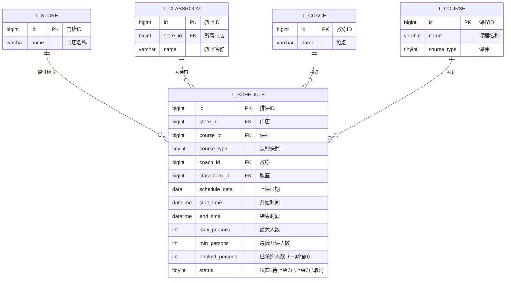
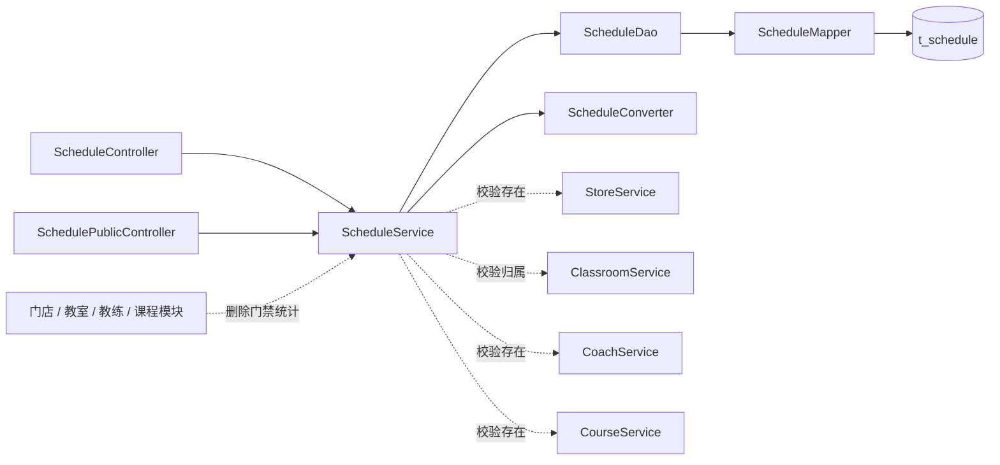

# 瑜伽普拉提排课管理详细设计文档

**版本：v2.0（重置版）**（2026-10-01）
**对应业务规则：** `BR-排课-001` ~ `BR-排课-020`、`BR-全局-006`、`BR-全局-007`、`BR-全局-008`、`BR-全局-009`
**上游文档：** [详细设计总览](详细设计总览.md)、[概要设计](../概要设计/概要设计.md) v2.0

> **本文是本期最核心的一份设计**：排课是唯一同时依赖门店、教室、教练、课程四个对象的业务表，也是唯一有状态流转的业务表。

---

# 1、数据架构

## 1.1 数据库 ER 模型

### 1.1.1 建模口径

| 项目 | 约定 |
|---|---|
| 表名 | `t_schedule` |
| 主键 | `id bigint unsigned`，雪花 ID，**应用侧生成** |
| 字符集 | `utf8mb4` / `utf8mb4_unicode_ci` |
| **删除** | **物理删除**：**不建 `deleted` 字段、不使用 `@TableLogic`**（`BR-排课-014`） |
| **状态** | `status tinyint`，**编码**：`1` 待上架、`2` 已上架、`3` 已取消；**"已结束"不落库**（`BR-排课-010`） |
| 审计字段 | `create_by / create_time / update_by / update_time`，公共审计处理器填充 |
| **唯一约束** | **不建**——见 §1.2.3 第 9 条的说明 |
| 关系 | 排课 N—1 门店 / 课程 / 教练 / 教室 |

### 1.1.2 表清单

| 表名 | 中文名 | 所属模块 | 与排课的关系 |
|---|---|---|---|
| `t_schedule` | 排课 | 排课管理 | **本版实现** |
| `t_store` | 门店 | 门店管理 | 排课必填；删除时被排课门禁保护 |
| `t_classroom` | 教室 | 教室管理 | 排课必填；**归属门店须与排课门店一致** |
| `t_coach` | 教练 | 教练管理 | 排课必填；**同一教练时间不得重叠** |
| `t_course` | 课程 | 课程管理 | 排课必填；课种不做快照 |

### 1.1.3 ER 模型图



## 1.2 数据库逻辑模型

### 1.2.1 `t_schedule` 字段定义

| 字段 | 中文名 | 类型 | 必填 | 默认值 | 说明 |
|---|---|---:|:---:|---:|---|
| `id` | 排课ID | bigint unsigned | 是 | — | 雪花 ID，应用侧生成 |
| `store_id` | 门店 | bigint unsigned | 是 | — | 排课归属门店 |
| `course_id` | 课程 | bigint unsigned | 是 | — | 平台级课程 |
| `course_type` | 课种快照 | tinyint | 是 | — | **新增／更换课程时从课程复制**；`1`~`4`；**不接受客户端提交** |
| `coach_id` | 教练 | bigint unsigned | 是 | — | 平台级教练 |
| `classroom_id` | 教室 | bigint unsigned | 是 | — | **其 `store_id` 必须等于本行的 `store_id`** |
| `schedule_date` | 上课日期 | date | 是 | — | **由 `start_time` 推导**（服务端写入，**不接受客户端提交**）；**筛选一律按本列** |
| `start_time` | 开始时间 | datetime | 是 | — | 含日期；与 `end_time` 必须在**同一自然日**内 |
| `end_time` | 结束时间 | datetime | 是 | — | 必须晚于 `start_time` |
| `max_persons` | 最大人数 | int | 是 | — | 必须 > 0 |
| `min_persons` | 最低开课人数 | int | 是 | `2` | 必须 ≥ 1 且 ≤ `max_persons` |
| `booked_persons` | 已预约人数 | int | 是 | `0` | **一期固定为 0**，只允许预约模块维护；管理端只读 |
| `status` | 状态 | tinyint | 是 | `1` | `1` 待上架；`2` 已上架；`3` 已取消 |
| `create_by` | 创建人 | bigint unsigned | 否 | NULL | 公共审计填充 |
| `create_time` | 创建时间 | datetime | 是 | CURRENT_TIMESTAMP | 公共审计填充 |
| `update_by` | 更新人 | bigint unsigned | 否 | NULL | 公共审计填充 |
| `update_time` | 更新时间 | datetime | 是 | CURRENT_TIMESTAMP | ON UPDATE |

**本表刻意不建的字段**：

| 不建的字段 | 原因 |
|---|---|
| `is_hot` / `hot_sort`（热门标识与热门排序） | 一期**不设**热门标记，用户端没有首页热门区 |
| `finished`（已结束） | **不落库**，由 `end_time <= 当前时间` 推导（`BR-排课-010`） |
| `deleted` | **物理删除**（`BR-排课-014`） |
| `cancel_reason` / `cancel_by` / `cancel_time` | 一期排课取消不记录原因与操作人（预约侧的取消原因才需要，一期没有预约） |

### 1.2.2 枚举值与状态全量视图

**落库的 `status` 只有三个值：**

| 值 | 文案 | 用户端可见 | 可编辑 | 可物理删除 |
|---:|---|:--:|:--:|:--:|
| 1 | 待上架 | ❌ | ✅ | ✅ |
| 2 | 已上架 | ✅ | **❌（须先下架）** | ❌（须先下架） |
| 3 | 已取消 | **✅** | ❌ | ❌ |

> **用户端可见口径 ＝ `status <> 1`（非待上架）**：已上架、已取消都可见；由已上架派生的"已结束"同样可见。只有**待上架不可见**（`BR-排课-015`、`BR-排课-016`）。

**"已结束"是派生状态，不落库：** `end_time <= 当前时间`。

因此**对外呈现的状态共 4 种**：待上架 / 已上架 / 已取消 / **已结束**（其中已结束由已上架 ＋ 时间推导而来）。

### 1.2.3 字段规则

1. 新增与修改按**全量提交**：`store_id`、`course_id`、`coach_id`、`classroom_id`、`start_time`、`end_time`、`max_persons`、`min_persons` 必填。
2. **必须先选门店，再选教室**：`classroom_id` 指向的教室，其 `store_id` 必须等于本行的 `store_id`（`BR-教室-005`、`BR-排课-006`）。
3. **不跨自然日**：`DATE(start_time) = DATE(end_time)` 且 `start_time < end_time`（`BR-排课-002`）。
   **同时**写入 `schedule_date = DATE(start_time)`；**修改开始时间时必须同步刷新 `schedule_date`**，两者不允许不一致。
   **为什么单独存一列**：用户端日期条与管理端日期区间都要按天筛选，用 `start_time`／`end_time` 拼区间既难写又容易与"不跨自然日"的约束脱节；单列 `date` 让筛选条件退化成 `schedule_date = ?` 或 `BETWEEN`（`BR-排课-022`）。
4. **人数范围**：`max_persons > 0`；`1 <= min_persons <= max_persons`；`min_persons` 默认 `2`（`BR-排课-003`、`BR-排课-004`）。
5. **排课窗口**：`DATE(start_time)` 必须落在**今天起 14 天内**（含今天），新增与修改都校验（`BR-排课-009`）。
6. **`booked_persons` 一期固定为 0**：新增时写入 0，修改接口**不接受**该字段，管理端表单只读（`BR-排课-019`）。
7. **`status` 不走新增/修改接口**：新增固定写入 `1`（待上架），状态只能通过独立的状态接口变更（`BR-排课-011`）。
8. **课种快照**：`course_type` 由服务端**从所选课程复制**而来，**不接受客户端提交**；**更换课程时刷新**——这是快照的**唯一刷新点**。用户端**课种 Tab 筛选一律以本列为准，不回读课程**（`BR-排课-021`）。
   **连锁口径**：课程事后调整课种**不追溯**（既有排课的 `course_type` 不变）；但**难度、封面、介绍**仍由卡片实时读取课程，**改难度会改变既有排课的展示**（`BR-课程-009`）。
9. **同一门店＋同一课程＋完全相同起止时间不重复、同一教练时间不重叠，两条都只在 service 校验，不建数据库唯一索引。** 原因：
   - "教练时间不重叠"是**区间相交**判断，唯一索引表达不了；
   - "完全相同起止时间不重复"如果落成唯一索引 `(store_id, course_id, start_time, end_time)`，那么**该排课被取消（`status=3`，且取消后不可删）之后，同一时段就再也排不回来了**；而 MySQL 不支持"部分唯一索引"（带条件），把 `status` 加进索引又会变成"两条已取消就冲突"。
   - 因此：**两条校验统一在 service 内、同一事务里以查询完成**。排课是低频人工操作，并发写入同一时段的概率极低，风险可接受。

## 1.3 数据库物理模型

### 1.3.1 建表语句

```sql
CREATE TABLE `t_schedule` (
  `id`             bigint unsigned NOT NULL COMMENT '排课ID',
  `store_id`       bigint unsigned NOT NULL COMMENT '门店ID',
  `course_id`      bigint unsigned NOT NULL COMMENT '课程ID',
  `course_type`    tinyint      NOT NULL COMMENT '课种快照：1团课 2精品课 3私教课 4特色课',
  `coach_id`       bigint unsigned NOT NULL COMMENT '教练ID',
  `classroom_id`   bigint unsigned NOT NULL COMMENT '教室ID（归属门店须与store_id一致）',
  `schedule_date`  date NOT NULL COMMENT '上课日期（由start_time推导，筛选按本列）',
  `start_time`     datetime NOT NULL COMMENT '开始时间（含日期）',
  `end_time`       datetime NOT NULL COMMENT '结束时间（须与开始时间同一天）',
  `max_persons`    int NOT NULL COMMENT '最大人数（>0）',
  `min_persons`    int NOT NULL DEFAULT 2 COMMENT '最低开课人数（1<=min<=max）',
  `booked_persons` int NOT NULL DEFAULT 0 COMMENT '已预约人数（一期固定0）',
  `status`         tinyint NOT NULL DEFAULT 1 COMMENT '状态：1待上架 2已上架 3已取消',
  `create_by`      bigint unsigned DEFAULT NULL COMMENT '创建人ID',
  `create_time`    datetime NOT NULL DEFAULT CURRENT_TIMESTAMP COMMENT '创建时间',
  `update_by`      bigint unsigned DEFAULT NULL COMMENT '更新人ID',
  `update_time`    datetime NOT NULL DEFAULT CURRENT_TIMESTAMP ON UPDATE CURRENT_TIMESTAMP COMMENT '更新时间',
  PRIMARY KEY (`id`),
  KEY `idx_schedule_store_type_date` (`store_id`, `course_type`, `schedule_date`),
  KEY `idx_schedule_coach_time` (`coach_id`, `start_time`),
  KEY `idx_schedule_classroom` (`classroom_id`),
  KEY `idx_schedule_course` (`course_id`)
) ENGINE=InnoDB DEFAULT CHARSET=utf8mb4 COLLATE=utf8mb4_unicode_ci COMMENT='排课信息表';
```

**索引的用途：**

| 索引 | 服务于 |
|---|---|
| `idx_schedule_store_type_date` | 用户端按「门店 ＋ **课种** ＋ **日期**」查询（**这正是课种快照与日期列存在的理由**）；门店删除门禁统计 |
| `idx_schedule_coach_time` | **教练时间不重叠校验** |
| `idx_schedule_classroom` | 教室删除门禁统计 |
| `idx_schedule_course` | 课程删除门禁统计 |

> **注意：** 本表**没有** `deleted`、`is_hot`、`finished` 字段；删除是对行执行 `DELETE`（且只允许删 `status = 1` 的行）。`schedule_date` 虽是派生列，但**必须落库**（见 §1.2.3 第 3 条）。

---

# 2、接口

## 2.1 通用约定

1. 管理端接口前缀 `/admin`，**依赖登录态**；HTTP 状态码固定 200，业务结果看响应 `code`。
2. 列表用 `TableDataInfo`；详情、新增、修改、状态流转、删除用 `AjaxResult`。
3. 主键在返回对象中序列化为**字符串**；时间字段按 `yyyy-MM-dd HH:mm:ss` 序列化。
4. **`booked_persons` 与 `status` 不接受写入**：前者只读、后者走独立状态接口。
5. 排课在**用户端**的读取（约课页列表、课程详情页）见 [用户端接口详细设计](用户端接口详细设计.md)，契约不在本文重复定义；实现落在本模块的 `SchedulePublicController`。

## 2.2 排课管理接口

| # | 方法 | 路径 | 功能 | 登录 |
|---:|---|---|---|:---:|
| 1 | GET | `/admin/schedules` | 查询排课列表 | 是 |
| 2 | GET | `/admin/schedules/{scheduleId}` | 查询排课详情 | 是 |
| 3 | POST | `/admin/schedules` | 新增排课 | 是 |
| 4 | PUT | `/admin/schedules/{scheduleId}` | 修改排课 | 是 |
| 5 | PUT | `/admin/schedules/{scheduleId}/status?status=` | 状态流转（上架／下架／取消） | 是 |
| 6 | DELETE | `/admin/schedules/{scheduleId}` | 删除排课（物理；**仅待上架**） | 是 |

### 2.2.1 查询排课列表

**请求：** `GET /admin/schedules?storeId=1856739201475235901&courseId=&coachId=&startDate=2026-10-01&endDate=2026-10-07&status=2&pageNum=1&pageSize=10`

| 参数 | 位置 | 类型 | 必填 | 说明 |
|---|---|---|---|:---:|---|
| `storeId` | query | string | 否 | 门店 |
| `courseId` | query | string | 否 | 课程 |
| `courseType` | query | integer | 否 | **课种快照** `1`~`4`（用户端课种 Tab 就是按它筛的） |
| `coachId` | query | string | 否 | 教练 |
| `startDate` | query | string | 否 | 起始日期（含），格式 `yyyy-MM-dd`，**按 `schedule_date` 判定** |
| `endDate` | query | string | 否 | 结束日期（含），同上 |
| `status` | query | integer | 否 | `1` 待上架；`2` 已上架；`3` 已取消；不传不限。**"已结束"不作为筛选值**（它是 `status=2` ＋ 时间推导） |
| `pageNum` | query | integer | 否 | 默认 1 |
| `pageSize` | query | integer | 否 | 默认 10，最大 100 |

**返回示例：**

```json
{
  "total": 1,
  "rows": [
    {
      "id": "1856739201475239001",
      "storeId": "1856739201475235901",
      "storeName": "徐汇店",
      "courseId": "1856739201475238001",
      "courseName": "哈他瑜伽",
      "courseType": 1,
      "courseTypeName": "团课",
      "coachId": "1856739201475237001",
      "coachName": "王老师",
      "classroomId": "1856739201475236001",
      "classroomName": "瑜伽团课大教室",
      "scheduleDate": "2026-10-03",
      "startTime": "2026-10-03 19:00:00",
      "endTime": "2026-10-03 20:00:00",
      "maxPersons": 20,
      "minPersons": 2,
      "bookedPersons": 0,
      "status": 2,
      "statusText": "已上架",
      "finished": false
    }
  ],
  "code": 200,
  "msg": "查询成功"
}
```

- 排序固定 `start_time ASC, id ASC`（**稳定排序**）。
- `storeName` / `courseName` / `courseType` / `coachName` / `classroomName` 由 service 调各自模块的 **Service** 批量补齐（**不跨模块读表**）。
- `statusText` 与 `finished` 由后端统一推导：`status=2` 且 `end_time <= now` 时 `statusText="已结束"`、`finished=true`。
- 若某对象已被物理删除（只有已取消／已结束的历史排课才可能），对应名称字段返回**空字符串**，管理端做空值兜底。

### 2.2.2 查询排课详情

**请求：** `GET /admin/schedules/{scheduleId}`

成功时 `data` 为 `ScheduleDetailVO`（字段与列表项一致）。排课不存在时返回 `404`，提示"排课不存在或已被删除"。

### 2.2.3 新增排课

**请求：** `POST /admin/schedules`

```json
{
  "storeId": "1856739201475235901",
  "courseId": "1856739201475238001",
  "coachId": "1856739201475237001",
  "classroomId": "1856739201475236001",
  "startTime": "2026-10-03 19:00:00",
  "endTime": "2026-10-03 20:00:00",
  "maxPersons": 20,
  "minPersons": 2
}
```

**校验顺序与失败处理：**

| # | 校验 | 不通过 |
|---:|---|---|
| 1 | 四个对象都存在（调 `StoreService` / `CourseService` / `CoachService` / `ClassroomService`） | `404`，"门店／课程／教练／教室不存在或已被删除" |
| 2 | 教室的归属门店 = `storeId` | `409`，"所选教室不属于该门店" |
| 3 | `start_time < end_time`，且两者**同一自然日** | `409`，"开始时间必须早于结束时间且不能跨天" |
| 4 | `max_persons > 0` | `409`，"最大人数必须大于 0" |
| 5 | `1 <= min_persons <= max_persons` | `409`，"最低开课人数必须在 1 与最大人数之间" |
| 6 | `DATE(start_time)` 在**今天起 14 天内** | `409`，"只能排今天起 14 天内的课" |
| 7 | 同一门店 ＋ 同一课程 ＋ **完全相同的起止时间**（`status != 3`）不存在 | `409`，"该门店该课程在此时间已有排课" |
| 8 | **同一教练的时间区间不与任何其它排课相交**（`status != 3`） | `409`，"该教练在此时间段已有排课" |

校验全部通过后：**从课程复制 `course_type` 写入课种快照**、**由 `start_time` 推导 `schedule_date`**，写入 `status = 1`（待上架）、`booked_persons = 0`，返回 `{ "code": 200, "msg": "操作成功" }`，**不返回新建排课 ID**。

> **并发说明：** 第 7、8 条校验与插入在**同一事务**内完成（见 §3.4）。

### 2.2.4 修改排课

**请求：** `PUT /admin/schedules/{scheduleId}`，请求体与新增一致（全量编辑，**不含** `status` 与 `bookedPersons`）。

| 情形 | 处理 |
|---|---|
| 排课不存在 | `404` |
| 当前状态**不是「待上架」（1）** | `409`，"已上架／已取消／已结束的排课不可修改，请先下架" |
| 其余校验 | 与新增的 1~8 条**完全一致**；第 7、8 条**排除自身** |
| **更换了课程** | 同步**刷新课种快照**——这是快照的唯一刷新点 |

**一期不设"已有预约时不得变更门店／课程／教室"的限制**（`booked_persons` 恒为 0，没有预约可影响）；二期接入预约后再补该门禁。

成功返回更新后的 `ScheduleDetailVO`。

### 2.2.5 状态流转

**请求：** `PUT /admin/schedules/{scheduleId}/status?status=2`

`status` 只接受 `1`、`2`、`3`，对应三条合法流转：

| 目标 `status` | 含义 | 允许的当前状态 |
|---:|---|---|
| `2` | **上架** | 只能从 `1`（待上架）来 |
| `1` | **下架** | 只能从 `2`（已上架）来，回到待上架 |
| `3` | **取消** | 只能从 `2`（已上架）来 |

**没有"已下架"这个状态**——下架 ＝ 回到待上架（`BR-排课-012`）。

| 情形 | 处理 |
|---|---|
| 排课不存在 | `404` |
| 当前为**已取消（3）** | `409`，"已取消的排课不可再变更状态" |
| 当前为**已上架但已结束** | `409`，"已结束的排课不可再变更状态" |
| 目标 = 当前状态 | **按成功处理**（幂等，`BR-全局-008`） |
| 目标状态不属于上述三条合法流转（如 `1 → 3`：待上架直接取消） | `409`，"当前状态不允许该操作" |
| `status` 不在 `{1,2,3}` | `500`（参数校验） |

成功返回 `{ "code": 200, "msg": "操作成功" }`。

> **排课取消在一期不产生级联**：没有预约可取消、没有次数可返还、没有通知要发（`BR-全局-005`）。二期接入预约后再按 `BR-排课-022` 的等价口径补级联。

### 2.2.6 删除排课

**请求：** `DELETE /admin/schedules/{scheduleId}`

| 情形 | 处理 |
|---|---|
| 排课不存在 | `404` |
| 当前为**待上架（1）** | ✅ **物理删除** |
| 当前为**已上架（2）** | `409`，"已上架的排课须先下架才能删除" |
| 当前为**已取消（3）** | `409`，"已取消的排课不可删除" |
| 当前为**已结束** | `409`，"已结束的排课不可删除" |

> 已取消与已结束的排课是**终态留痕**：不可编辑、不可改状态、不可删除（`BR-排课-013`、`BR-排课-014`）。

## 2.3 数据模型

### 2.3.1 `ScheduleListItemVO` / `ScheduleDetailVO`

| 字段 | 类型 | 说明 |
|---|---|---|
| `id` | string | 排课ID |
| `storeId` / `storeName` | string | 门店 |
| `courseId` / `courseName` | string | 课程 |
| `courseType` | integer | **课种快照**（排课自有字段，不回读课程） |
| `courseTypeName` | string | **课种名称**（按 `CourseTypeEnum` 翻译快照码；用户端卡片与详情页直接显示它） |
| `coachId` / `coachName` | string | 教练 |
| `classroomId` / `classroomName` | string | 教室 |
| `startTime` / `endTime` | string | `yyyy-MM-dd HH:mm:ss` |
| `scheduleDate` | string | **上课日期** `yyyy-MM-dd`（筛选与日期条都用它） |
| `maxPersons` / `minPersons` | integer | 最大人数／最低开课人数 |
| `bookedPersons` | integer | 已预约人数（一期恒 0） |
| `status` | integer | 落库状态码 `1`/`2`/`3` |
| `statusText` | string | 展示文案：待上架／已上架／已取消／**已结束** |
| `finished` | boolean | 是否已结束（`end_time <= now`） |

两个 VO 字段相同（列表已经带了排课全部业务字段，不再裁剪）。

### 2.3.2 `ScheduleCreateDTO` / `ScheduleUpdateDTO`

两个请求模型字段相同：`storeId`、`courseId`、`coachId`、`classroomId`、`startTime`、`endTime`、`maxPersons`、`minPersons`。**不含** `status`、`bookedPersons`、**`courseType`** 与 **`scheduleDate`**（课种快照由服务端从课程取、上课日期由服务端从开始时间推导）。使用 `@Valid` 校验非空；业务范围校验在 service。

### 2.3.3 `ScheduleQuery`

列表筛选与分页：`storeId`、`courseId`、`coachId`、`startDate`、`endDate`、`status`、`pageNum`、`pageSize`（上限 100）。

### 2.3.4 状态接口的入参

只有一个字段，直接用查询参数 `status`，**不建 DTO**。

## 2.4 错误码

| code | 场景 | 文案 |
|---:|---|---|
| 200 | 成功 | 查询成功／操作成功 |
| 404 | 排课或关联对象不存在 | 排课／门店／课程／教练／教室不存在或已被删除 |
| 409 | 教室不属该门店 | 所选教室不属于该门店 |
| 409 | 时间非法 | 开始时间必须早于结束时间且不能跨天 |
| 409 | 人数非法 | 最大人数必须大于 0 ／ 最低开课人数必须在 1 与最大人数之间 |
| 409 | 超出排课窗口 | 只能排今天起 14 天内的课 |
| 409 | 完全同时段重复 | 该门店该课程在此时间已有排课 |
| 409 | 教练时间冲突 | 该教练在此时间段已有排课 |
| 409 | 非待上架不可编辑 | 已上架／已取消／已结束的排课不可修改，请先下架 |
| 409 | 状态流转非法 | 当前状态不允许该操作 |
| 409 | 删除门禁 | 已上架的排课须先下架才能删除／已取消（已结束）的排课不可删除 |
| 500 | 参数校验失败／系统异常 | 由统一异常处理器返回具体字段提示 |

---

# 3、开发架构

## 3.1 包结构

```text
com.techplant.yoga.schedule
├─ controller/ScheduleController.java          （管理端）
├─ controller/SchedulePublicController.java    （用户端，契约见《用户端接口详细设计》）
├─ service/ScheduleService.java                （同时供四个主数据模块做删除门禁统计、供用户端查询）
├─ service/impl/ScheduleServiceImpl.java
├─ dao/ScheduleDao.java、ScheduleDaoImpl.java
├─ mapper/ScheduleMapper.java
├─ domain/ScheduleDO.java
├─ dto/ScheduleCreateDTO.java、ScheduleUpdateDTO.java
├─ query/ScheduleQuery.java
├─ vo/ScheduleListItemVO.java、ScheduleDetailVO.java
├─ enums/ScheduleStatusEnum.java               （1待上架 2已上架 3已取消 ＋ 两套文案）
└─ convert/ScheduleConverter.java
```

## 3.2 类与职责

| 类 | 职责 |
|---|---|
| `ScheduleController` | 管理端请求、校验、装配响应；**不写业务规则** |
| `SchedulePublicController` | 用户端免登录查询（`@Anonymous`），只读 |
| `ScheduleService` / `ScheduleServiceImpl` | 四项关联校验、教室归属校验、时间与人数校验、**14 天窗口**、**两条冲突校验**、**状态流转门禁**、**删除门禁（仅待上架）**、事务边界；并**对外**提供 ①四个 `countActiveByXxx(...)`（供主数据删除门禁）②用户端查询方法（**全项目统一不另立 QueryService**） |
| `ScheduleDao` / `ScheduleDaoImpl` | 组装筛选、分页、稳定排序；**区间相交查询**、**完全同时段查询**、**四类门禁统计** |
| `ScheduleMapper` | 继承 `BaseMapper<ScheduleDO>` |
| `ScheduleDO` | 与 `t_schedule` 对应；**无逻辑删除字段** |
| `ScheduleCreateDTO` / `ScheduleUpdateDTO` | 新增／修改入参（不含 `status`、`bookedPersons`） |
| `ScheduleQuery` | 列表筛选与分页 |
| `ScheduleListItemVO` / `ScheduleDetailVO` | 接口出参 |
| `ScheduleStatusEnum` | 状态码、**"已结束"的推导**，以及**两套状态文案**（管理端：待上架／已上架／已取消／已结束；用户端：可约／已结束／已取消）——都收在这一个枚举里，避免多处各写一遍 |
| `ScheduleConverter` | DTO、DO、VO 转换（含跨模块名称补齐后的装配） |

## 3.3 调用关系



## 3.4 关键实现约定

1. **物理删除**：`ScheduleDO` **不加** `@TableLogic`；删除仅允许 `status = 1`。
2. **"已结束"与两套状态文案都在 `ScheduleStatusEnum` 推导一处**：`finished = status == 2 && end_time <= now`。同一枚举提供**两套文案**——**管理端**：待上架／已上架／已取消／已结束；**用户端**：**可约／已结束／已取消**（`BR-排课-020`）。删除门禁与管理端列表用前一套，用户端卡片与详情页用后一套（`bookable` 也由它给出）。
   **判定的落点：service 层**——**返回 controller 之前**由 service 统一判定一次（`end_time <= 当前时间` 即已结束），据此装配 `finished` / `statusText` / `bookable`；**controller 不做判断、前端不算、也不要为派生状态再查一次库**。
   ⚠️ **唯一例外**：删除门禁的 **count 查询**（"有没有未结束的排课引用我"）必须把 `end_time > 当前时间` 写在 **SQL 条件**里——不能把行拉回内存再筛。这是**刻意保留的第二个表达式**，改动口径时两处一起改。
3. **两条冲突校验在同一事务内完成**：
   - 完全同时段：`store_id = ? AND course_id = ? AND start_time = ? AND end_time = ? AND status <> 3 AND id <> ?`
   - 教练时间相交：`coach_id = ? AND status <> 3 AND start_time < :end AND end_time > :start AND id <> ?`
   - 新增时 `id <> ?` 条件省略。两次查询与 INSERT/UPDATE 必须在**同一个 `@Transactional`** 内。
4. **状态流转用一个方法收口**（如 `changeStatus(id, targetStatus)`），在方法内校验"当前状态 → 目标状态"的合法性＋幂等＋终态拒绝；**不要在 controller 里写 if-else 分支**。
5. **跨模块只调 Service**：四个对象的存在性校验调各自 `XxxService`；四个模块的删除门禁统计调本模块 `ScheduleService` 的 `countActiveByXxx`。**不跨模块读表、不另立 QueryService**。
6. **`booked_persons` 与 `status` 不出现在写入路径**：DTO 里没有这两个字段，`ScheduleDO` 更新时**显式指定更新列**，不整对象覆盖。
7. **四个门禁统计的口径必须完全一致**：`未结束（end_time > now）AND status IN (1, 2)`。建议抽成一个私有方法 `buildActiveCondition()`，四个 `countActiveByXxx` 共用。
8. **列表的稳定排序固定 `start_time ASC, id ASC`**。
9. **用户端可见口径 ＝ `status <> 1`**：用户端查询**不要**再按"未结束"过滤（`BR-排课-016`）。已上架、已结束、已取消都要返回，并在卡片与详情页带出状态；**待上架不返回**。这条口径与"删除门禁统计"（`status IN (1,2) AND 未结束`）是**两套不同的条件**，不要合并成一个方法。
10. **课种快照只在两处发生**：**新增排课时从课程复制**、**更换课程时刷新**。其它任何路径（改难度／封面／介绍、课程侧改课种）都**不动快照**。
11. **`schedule_date` 是派生列，但必须落库**：只在 service 里由 `start_time` 推导写入，**修改开始时间时同步刷新**；用户端与管理端的日期筛选、以及 `idx_schedule_store_type_date` 索引**都只用这一列**，不要再出现 `start_time BETWEEN ...` 这类日期条件。
12. **枚举成对返回**：`courseType` ＋ **`courseTypeName`**、`status` ＋ `statusText`。课种名称统一由 `CourseTypeEnum` 翻译（**课种快照存的是码，展示的是名**）——**前端不许硬编码 `1 = 团课`**。这条是 [详细设计总览](详细设计总览.md) §2 的全局约定。

---

# 4、运行流程

## 4.1 查询列表
1. Controller 校验 `ScheduleQuery`（`pageSize` 上限 100、`status` ∈ {1,2,3}）。
2. Service 调 DAO 分页查询（**日期区间直接筛 `schedule_date`**），按 `start_time ASC, id ASC` 排序。
3. Service 批量调 `StoreService` / `CourseService` / `CoachService` / `ClassroomService` 补齐名称（**按 ID 去重后批量查，避免 N+1**）。
4. Service 用 `ScheduleStatusEnum` 推导 `statusText` 与 `finished`，转 VO 返回。

## 4.2 查询详情
1. Service 按 ID 查询；不存在 → `404`。
2. 补齐四个对象的名称，推导状态文案，返回。

## 4.3 新增排课
1. Controller 校验必填与时间格式。
2. Service 依次校验 §2.2.3 的 1~8 条（对象存在 → 教室归属 → 时间 → 人数 → 窗口 → 完全同时段 → 教练相交）。
3. 转 DO：**从课程复制 `course_type` 作为课种快照**、**由 `start_time` 推导 `schedule_date`**、`status = 1`、`booked_persons = 0`；插入。
4. 主键与审计字段由公共机制处理；返回统一成功响应。

## 4.4 修改排课
1. Service 按 ID 查询；不存在 → `404`。
2. **编辑门禁**：`status <> 1` → `409`（已上架须先下架；已取消与已结束是终态）。
3. 重复 §2.2.3 的 1~8 条校验（第 7、8 条**排除自身**）。
4. **更换了课程时刷新课种快照**；**开始时间变了则同步刷新 `schedule_date`**。
5. **显式更新业务列**（不含 `status`、`booked_persons`）；返回最新详情。

## 4.5 状态流转
1. Service 按 ID 查询；不存在 → `404`。
2. `status = 3` 或（`status = 2` 且已结束）→ `409`（终态）。
3. 目标 = 当前 → **直接按成功返回**（幂等）。
4. 校验合法流转（`1→2`、`2→1`、`2→3`）；非法 → `409`。
5. 只更新 `status` 列；返回统一成功响应。

## 4.6 删除排课
1. Service 按 ID 查询；不存在 → `404`。
2. `status != 1` → `409`（已上架须先下架；已取消与已结束不可删）。
3. 执行 `DELETE`。

---

# 5、菜单与 SQL 交付

1. `backend/sql/yoga.sql` 增加 `t_schedule` 建表语句（含四个索引）与示例数据（建议覆盖：一条**待上架**、一条**已上架且未开始**、一条**已上架且已结束**、一条**已取消**，用于验证状态门禁与"已结束"推导）。
2. 同脚本在 `sys_menu` 增加"排课管理"菜单，绑定内置管理员角色。
3. 管理端页面：`frontend/pc/src/views/schedule/index.vue`，支持按门店／课程／教练／日期区间／状态查询，以及新增、修改、上架、下架、取消、删除；按钮的可用性按 `status` 与 `finished` 控制（**前端不自行推导"已结束"，直接用后端返回的 `finished` 与 `statusText`**）。
4. 管理端接口封装：`frontend/pc/src/api/schedule/schedule.js`。
5. 排课表单：先选门店，教室下拉再按该门店加载（`GET /admin/classrooms?storeId=`）；课程与教练下拉**不限门店**（两者都是平台级）。
