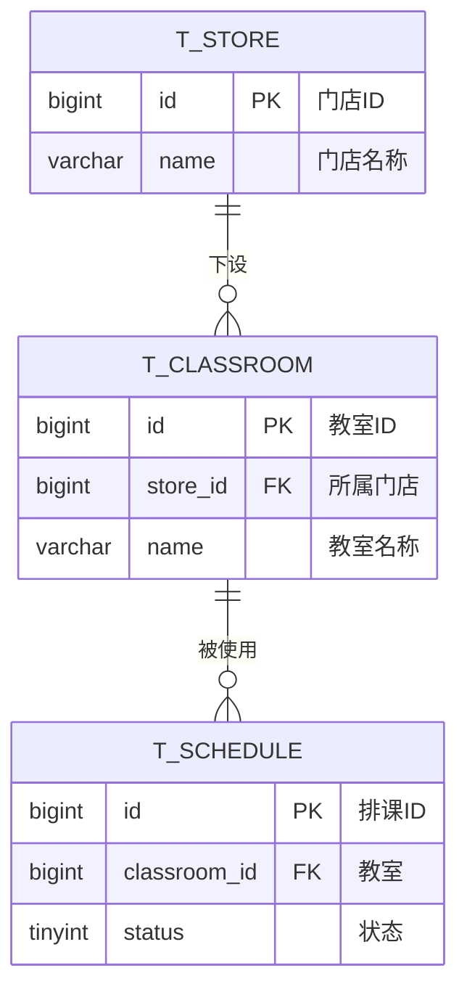
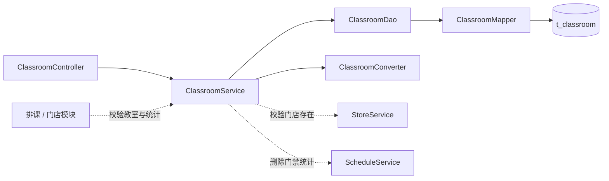

# 瑜伽普拉提教室管理详细设计文档

**版本：v2.0（重置版）**（2026-10-01）
**对应业务规则：** `BR-教室-001` ~ `BR-教室-007`、`BR-全局-006`、`BR-全局-007`、`BR-全局-009`
**上游文档：** [详细设计总览](详细设计总览.md)、[概要设计](../概要设计/概要设计.md) v2.0

---

# 1、数据架构

## 1.1 数据库 ER 模型

### 1.1.1 建模口径

| 项目 | 约定 |
|---|---|
| 表名 | `t_classroom` |
| 主键 | `id bigint unsigned`，雪花 ID，**应用侧生成** |
| 字符集 | `utf8mb4` / `utf8mb4_unicode_ci` |
| **删除** | **物理删除**：**不建 `deleted` 字段、不使用 `@TableLogic`**（`BR-教室-006`） |
| **状态** | **本表没有状态字段**（`BR-教室-003`） |
| 审计字段 | `create_by / create_time / update_by / update_time`，公共审计处理器填充 |
| 唯一约束 | `uk_classroom_store_name(store_id, name)`：**同一门店内**名称唯一（`BR-教室-001`） |
| 关系 | 教室 N—1 门店；教室 1—N 排课 |

### 1.1.2 表清单

| 表名 | 中文名 | 所属模块 | 本版状态 |
|---|---|---|---|
| `t_classroom` | 教室 | 教室管理 | **本版实现** |
| `t_store` | 门店 | 门店管理 | 本版实现；教室的归属对象 |
| `t_schedule` | 排课 | 排课管理 | 本版实现；**教室删除门禁的统计对象** |

### 1.1.3 ER 模型图



## 1.2 数据库逻辑模型

### 1.2.1 `t_classroom` 字段定义

| 字段 | 中文名 | 类型 | 必填 | 默认值 | 说明 |
|---|---|---:|:---:|---:|---|
| `id` | 教室ID | bigint unsigned | 是 | — | 雪花 ID，应用侧生成 |
| `store_id` | 所属门店 | bigint unsigned | 是 | — | 归属门店；**只允许在新增时指定** |
| `name` | 教室名称 | varchar(32) | 是 | — | 同一门店内唯一 |
| `create_by` | 创建人 | bigint unsigned | 否 | NULL | 公共审计填充 |
| `create_time` | 创建时间 | datetime | 是 | CURRENT_TIMESTAMP | 公共审计填充 |
| `update_by` | 更新人 | bigint unsigned | 否 | NULL | 公共审计填充 |
| `update_time` | 更新时间 | datetime | 是 | CURRENT_TIMESTAMP | ON UPDATE |

**本表刻意不建的字段**：

| 不建的字段 | 原因 |
|---|---|
| `status` | 教室**没有状态**（`BR-教室-003`） |
| `capacity` / `device` / `image_url` / `floor` / `coordinate` | 教室**不承载**容量、设备、图片、楼层、坐标等扩展信息（`BR-教室-002`） |
| `deleted` | **物理删除**（`BR-教室-006`） |

### 1.2.2 枚举值

本表**没有枚举字段**。

### 1.2.3 字段规则

1. 新增按全量提交：`store_id` 与 `name` 均必填；名称前后空格由转换层去除。
2. **修改只允许提交 `name`**；请求中如携带 `storeId`，**一律忽略**（`BR-教室-004`）。换门店等价于删除后在新门店下重建。
3. **同门店内名称唯一**：新增与修改都校验（修改时排除自身）；数据库层用 `uk_classroom_store_name` 兜底。
4. `store_id` 必须指向**存在**的门店（物理删除后即不存在）；校验走 `StoreService`。
5. 请求中不允许携带审计字段。

## 1.3 数据库物理模型

### 1.3.1 建表语句

```sql
CREATE TABLE `t_classroom` (
  `id`          bigint unsigned NOT NULL COMMENT '教室ID',
  `store_id`    bigint unsigned NOT NULL COMMENT '所属门店ID',
  `name`        varchar(32)  NOT NULL COMMENT '教室名称（同一门店内唯一）',
  `create_by`   bigint unsigned DEFAULT NULL COMMENT '创建人ID',
  `create_time` datetime NOT NULL DEFAULT CURRENT_TIMESTAMP COMMENT '创建时间',
  `update_by`   bigint unsigned DEFAULT NULL COMMENT '更新人ID',
  `update_time` datetime NOT NULL DEFAULT CURRENT_TIMESTAMP ON UPDATE CURRENT_TIMESTAMP COMMENT '更新时间',
  PRIMARY KEY (`id`),
  UNIQUE KEY `uk_classroom_store_name` (`store_id`, `name`),
  KEY `idx_classroom_store` (`store_id`)
) ENGINE=InnoDB DEFAULT CHARSET=utf8mb4 COLLATE=utf8mb4_unicode_ci COMMENT='教室信息表';
```

> **注意：** 本表**没有** `deleted` 与 `status` 字段；删除是对行执行 `DELETE`，删除后该名称随即释放、可在同一门店下再次使用。

---

# 2、接口

## 2.1 通用约定

1. 管理端接口前缀 `/admin`，**依赖登录态**；HTTP 状态码固定 200，业务结果看响应 `code`。
2. 列表用 `TableDataInfo`；新增、修改、删除用 `AjaxResult`。
3. 主键在返回对象中序列化为**字符串**。
4. 本模块**没有状态接口**（教室无状态）。
5. 教室**不提供用户端独立接口**：教室只作为排课卡片与课程详情页的一部分随排课一起返回（见 [用户端接口详细设计](用户端接口详细设计.md)）。

## 2.2 教室管理接口

| # | 方法 | 路径 | 功能 | 登录 |
|---:|---|---|---|:---:|
| 1 | GET | `/admin/classrooms` | 查询教室列表 | 是 |
| 2 | POST | `/admin/classrooms` | 新增教室 | 是 |
| 3 | PUT | `/admin/classrooms/{classroomId}` | 修改教室（**只改名称**） | 是 |
| 4 | DELETE | `/admin/classrooms/{classroomId}` | 删除教室（物理，带门禁） | 是 |

> 教室**不提供查看详情接口**：字段只有"所属门店 ＋ 名称"，列表项已含全部字段，编辑弹窗直接用列表行数据回填。

### 2.2.1 查询教室列表

**请求：** `GET /admin/classrooms?storeId=1856739201475235901&name=大教室&pageNum=1&pageSize=10`

| 参数 | 位置 | 类型 | 必填 | 说明 |
|---|---|---|---|:---:|---|
| `storeId` | query | string | 否 | 所属门店；排课表单必传 |
| `name` | query | string | 否 | 教室名称，模糊匹配，最长 32 |
| `pageNum` | query | integer | 否 | 默认 1 |
| `pageSize` | query | integer | 否 | 默认 10，最大 100 |

**返回示例：**

```json
{
  "total": 1,
  "rows": [
    {
      "id": "1856739201475236001",
      "storeId": "1856739201475235901",
      "storeName": "徐汇店",
      "name": "瑜伽团课大教室",
      "createTime": "2026-10-01 10:00:00",
      "updateTime": "2026-10-01 10:00:00"
    }
  ],
  "code": 200,
  "msg": "查询成功"
}
```

列表按 `store_id ASC, name ASC, id DESC` **稳定排序**；`storeName` 由 service 调 `StoreService` 批量补齐（**不跨模块读表**）。

### 2.2.2 新增教室

**请求：** `POST /admin/classrooms`

```json
{
  "storeId": "1856739201475235901",
  "name": "普拉提器械教室"
}
```

| 情形 | 处理 |
|---|---|
| 所属门店不存在 | `404`，"门店不存在或已被删除" |
| 同一门店内名称重复 | `409`，"该门店下已存在同名教室" |

成功只返回 `{ "code": 200, "msg": "操作成功" }`，**不返回新建教室 ID**。

### 2.2.3 修改教室

**请求：** `PUT /admin/classrooms/{classroomId}`

```json
{ "name": "普拉提小班课" }
```

- 教室不存在 → `404`；
- 同门店内名称与其它教室重复 → `409`；
- 请求体中的 `storeId` **被忽略**（`BR-教室-004`）；
- **改名不加排课门禁**：即使名下有未结束的排课也允许改名（`BR-教室-004`）。

成功只返回 `{ "code": 200, "msg": "操作成功" }`。

### 2.2.4 删除教室

**请求：** `DELETE /admin/classrooms/{classroomId}`

**物理删除**，删除前依次校验：

| # | 校验 | 不通过时 |
|---:|---|---|
| 1 | 教室存在 | `404` |
| 2 | 没有**未结束、且状态为待上架或已上架**的排课引用（调 `ScheduleService`） | `409`："该教室仍有 N 节未结束的排课，无法删除" |
| 3 | 上述统计**调用失败** | 拒绝删除，**不降级放行**（fail-closed） |

通过后执行 `DELETE FROM t_classroom WHERE id = ?`。

> **已取消、已结束的历史排课不阻塞删除**；删除后这些历史排课上的教室显示为空，管理端做空值兜底（`BR-教室-007`、`BR-全局-009`）。

## 2.3 数据模型

### 2.3.1 `ClassroomListItemVO`

| 字段 | 类型 | 说明 |
|---|---|---|
| `id` | string | 教室ID |
| `storeId` | string | 所属门店ID |
| `storeName` | string | 所属门店名称（跨模块补齐） |
| `name` | string | 教室名称 |
| `createTime` / `updateTime` | string | 时间字段 |

### 2.3.2 `ClassroomCreateDTO` / `ClassroomUpdateDTO`

- `ClassroomCreateDTO`：`storeId`、`name`，均必填。
- `ClassroomUpdateDTO`：**只有 `name`**（不定义 `storeId` 字段，从入参层面就杜绝换门店）。

### 2.3.3 `ClassroomQuery`

列表筛选与分页：`storeId`、`name`、`pageNum`、`pageSize`（上限 100）。

## 2.4 错误码

| code | 场景 | 文案 |
|---:|---|---|
| 200 | 成功 | 查询成功／操作成功 |
| 404 | 教室不存在 | 教室不存在或已被删除 |
| 404 | 所属门店不存在 | 门店不存在或已被删除 |
| 409 | 同门店内名称重复 | 该门店下已存在同名教室 |
| 409 | 仍有未结束的排课 | 该教室仍有 N 节未结束的排课，无法删除 |
| 409 | 引用统计失败 | 引用检查未完成，已拒绝本次删除 |
| 500 | 参数校验失败／系统异常 | 由统一异常处理器返回具体字段提示 |

---

# 3、开发架构

## 3.1 包结构

```text
com.techplant.yoga.classroom
├─ controller/ClassroomController.java
├─ service/ClassroomService.java           （同时供跨模块校验教室与统计）
├─ service/impl/ClassroomServiceImpl.java
├─ dao/ClassroomDao.java、ClassroomDaoImpl.java
├─ mapper/ClassroomMapper.java
├─ domain/ClassroomDO.java
├─ dto/ClassroomCreateDTO.java、ClassroomUpdateDTO.java
├─ query/ClassroomQuery.java
├─ vo/ClassroomListItemVO.java
└─ convert/ClassroomConverter.java
```

## 3.2 类与职责

| 类 | 职责 |
|---|---|
| `ClassroomController` | 接收请求、触发校验、装配响应；**不写业务规则** |
| `ClassroomService` / `ClassroomServiceImpl` | 门店存在校验、同门店内名称唯一校验、**删除门禁编排**、事务边界；并**对外**提供「校验教室存在且归属门店一致」与「统计某门店名下教室数」——排课与门店模块**直接依赖本 service**（**全项目统一不另立 QueryService**） |
| `ClassroomDao` / `ClassroomDaoImpl` | 组装筛选、分页、稳定排序 |
| `ClassroomMapper` | 继承 `BaseMapper<ClassroomDO>` |
| `ClassroomDO` | 与 `t_classroom` 对应；**无逻辑删除、无状态字段** |
| `ClassroomCreateDTO` / `ClassroomUpdateDTO` | 新增／修改入参（修改只有名称） |
| `ClassroomQuery` | 列表筛选与分页 |
| `ClassroomListItemVO` | 接口出参（含列表与编辑回填所需的全部字段） |
| `ClassroomConverter` | DTO、DO、VO 转换 |

## 3.3 调用关系



## 3.4 关键实现约定

1. **物理删除**：`ClassroomDO` **不加** `@TableLogic`；业务代码不要手写 `deleted = 0`。
2. **修改不可换门店**：`ClassroomUpdateDTO` **不定义** `storeId`；`ClassroomDO` 更新时**显式指定只更新 `name`**，不整对象覆盖，避免把 `store_id` 写空。
3. 名称唯一校验按 `store_id + name` 组合，且修改时排除自身。
4. 列表的 `storeName` 由 service 调 `StoreService` 补齐，**不跨模块读 `t_store`**。
5. 排序固定 `store_id ASC, name ASC, id DESC`。

---

# 4、运行流程

## 4.1 查询列表
1. Controller 校验 `ClassroomQuery`（`pageSize` 上限 100）。
2. Service 调 DAO 分页查询，按 `store_id ASC, name ASC, id DESC` 排序。
3. Service 调 `StoreService` 批量补齐 `storeName`，转 VO 返回。

## 4.2 新增教室
1. Controller 校验 `storeId`、`name` 非空与长度。
2. Service 调 `StoreService` 校验门店存在；不存在 → `404`。
3. 校验该门店内同名教室不存在；重复 → `409`。
4. 插入；主键与审计字段由公共机制处理。

## 4.3 修改教室
1. Service 按 ID 查询；不存在 → `404`。
2. 按 `store_id + name` 校验重复（**排除自身**）；重复 → `409`。
3. **只更新 `name`**（`store_id` 不变）；返回统一成功响应。

## 4.4 删除教室
1. Service 按 ID 查询；不存在 → `404`。
2. 调 `ScheduleService` 统计"未结束且状态为待上架或已上架"的排课数；> 0 → `409`（带数量）。
3. 统计抛异常 → 直接以 `ServiceException` 终止，**不继续删除**。
4. 执行物理删除。

---

# 5、菜单与 SQL 交付

1. `backend/sql/yoga.sql` 增加 `t_classroom` 建表语句（含 `uk_classroom_store_name`）与示例数据。
2. 同脚本在 `sys_menu` 增加"教室管理"菜单，绑定内置管理员角色。
3. 管理端页面：`frontend/pc/src/views/classroom/index.vue`，支持按门店筛选、新增、改名、删除；**编辑弹窗只有名称输入框**（不出现门店选择器）。
4. 管理端接口封装：`frontend/pc/src/api/classroom/classroom.js`。
5. 排课表单的教室下拉按所选门店加载（`GET /admin/classrooms?storeId=`）。
