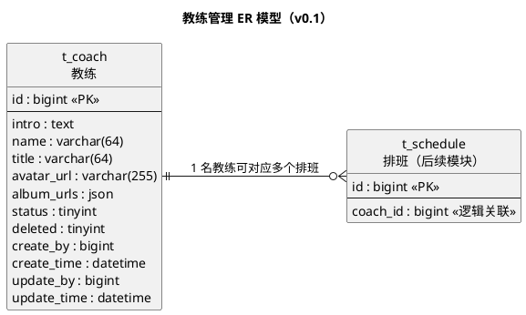

# 一水·瑜伽普拉提教练管理详细设计文档

**版本：v0.1**（2026-09-28，首版）  
**本版范围：管理端经营基础——教练管理**

> 本文按 `docs/模板/详细设计文档模板.md` 的章节组织：1 数据架构 / 2 接口 / 3 开发架构 / 4 运行流程 / 5 测试用例设计 / 6 日志设计。
> 本版以用户确认的 5 个教练业务字段为核心：教练简介、教练名称、教练头衔、教练头像、教练相册。
> `status` 是现有管理端“设置教练状态”功能所需的控制字段，`deleted` 是项目统一逻辑删除字段；二者不计入上述 5 个业务字段。

## 上游依据与设计边界

| 文档 / 输入 | 本版使用内容 |
|---|---|
| 用户本次字段清单 | 教练简介、教练名称、教练头衔、教练头像、教练相册 |
| `docs/需求文档/管理端/管理端功能清单.md` | 查询、新增、修改、设置教练状态 |
| `docs/需求文档/管理端/管理端页面结构图.md` | 管理端教练列表、详情和编辑入口 |
| `docs/详细设计/详细设计.md` | 雪花主键、逻辑删除、审计字段、若依统一响应、MyBatis-Plus 分层约定 |
| `backend/AGENTS.md` | `ruoyi-yoga` 业务模块、`com.techplant.yoga` 包名及接口实现约束 |

### 本版明确不纳入的内容

1. 不新增教练账号、手机号、联系方式、登录密码或用户账号关联字段。现有功能清单中的“创建教练账号”暂不纳入本版，本版只做后台教练资料管理。
2. 图片文件本体不存入 `t_coach`；本表只保存图片 URL。上传、裁剪、CDN、对象存储和图片删除策略属于文件服务范围，暂不在本模块内展开。
3. 不新增课程关联字段。教练与课程场次的关系由后续 `t_schedule.coach_id` 承载，教练表不反向保存课程列表。
4. 不提供物理删除接口；删除能力保留为逻辑删除约定，待后续确认是否需要管理端回收站。

---

# 1、数据架构

## 1.1 数据库 ER 模型

### 1.1.1 建模口径

| 项 | 本版约定 | 说明 |
|---|---|---|
| 数据库 | MySQL 8.0 | 与项目现有技术栈一致 |
| 存储引擎 / 字符集 | InnoDB / `utf8mb4` / `utf8mb4_general_ci` | 支持中文及常见 emoji |
| 表名 | `t_coach` | 项目业务表统一使用 `t_` 前缀 |
| 主键 | `id bigint unsigned`，应用侧雪花 ID | MyBatis-Plus `IdType.ASSIGN_ID`，不使用自增 |
| ID 对外返回 | 字符串 | 避免小程序 JavaScript `Number` 精度丢失 |
| 逻辑删除 | `deleted tinyint`，0 正常 / 1 已删除 | 由 MyBatis-Plus `@TableLogic` 处理 |
| 审计字段 | `create_by`、`create_time`、`update_by`、`update_time` | 由统一 `MetaObjectHandler` 自动填充；数据库默认值兜底 |
| 状态字段 | `status tinyint`，1 启用 / 0 停用 | 对应管理端“设置教练状态” |
| 图片字段 | URL 或 URL 数组，不存二进制 | 单图使用 `varchar(255)`；相册使用 MySQL `JSON` 数组 |
| 外键 | 暂不声明物理外键 | `t_schedule` 属于后续模块，跨模块关系先保持逻辑关联 |

### 1.1.2 表清单

| 表名 | 中文名 | 所属模块 | 本版状态 |
|---|---|---|---|
| `t_coach` | 教练 | 经营基础 / 教练管理 | 本版细化 |
| `t_schedule` | 排班 | 经营基础 / 排班管理 | 后续模块细化，仅表达 `coach_id` 逻辑关系 |

### 1.1.3 ER 模型图



### 1.1.4 实体与关系说明

| 实体 | 说明 | 与其他实体的关系 |
|---|---|---|
| 教练 `t_coach` | 保存管理端维护的教练展示资料、状态和审计信息 | 1 : N 排班 |
| 排班 `t_schedule` | 保存具体课程场次及授课教练 | N : 1 教练；由后续排班模块细化 |

**关系约定：** 本版只在后台维护教练状态，不展开停用与排班、预约或用户端的联动处理。排班模块后续如需校验教练状态，另行设计模块间调用规则。

## 1.2 数据库逻辑模型

### 1.2.1 `t_coach` 教练表字段定义

| 字段 | 中文名 | 逻辑类型 | 必填 | 默认值 | 说明 | 依据 |
|---|---|---|:--:|:--:|---|---|
| `id` | 教练ID | 长整型 | 是 | 雪花ID | 主键，应用侧生成 | 项目全局建模约定 |
| `intro` | 教练简介 | 长文本 | 否 | `NULL` | 教练介绍正文；不在列表接口返回 | 用户字段清单 |
| `name` | 教练名称 | 字符串(64) | 是 | — | 管理端和用户端展示名称 | 用户字段清单 |
| `title` | 教练头衔 | 字符串(64) | 否 | `NULL` | 例如“瑜伽导师”；不预设枚举 | 用户字段清单 |
| `avatar_url` | 教练头像 | 字符串(255) | 否 | `NULL` | 列表头像或个人头像 URL | 用户字段清单 |
| `album_urls` | 教练相册 | JSON 数组 | 否 | `NULL` | 图片 URL 数组；接口层转换为字符串数组 | 用户字段清单；相册为多值字段 |
| `status` | 教练状态 | 整型 | 是 | `1` | 1 启用 / 0 停用；本版仅作为后台管理字段 | 管理端功能清单“设置教练状态” |
| `deleted` | 逻辑删除 | 整型 | 是 | `0` | 0 正常 / 1 已删除 | 项目全局建模约定 |
| `create_by` | 创建人 | 长整型 | 否 | `NULL` | 管理端操作人 ID | 项目全局建模约定 |
| `create_time` | 创建时间 | 日期时间 | 是 | 当前时间 | 创建时自动填充 | 项目全局建模约定 |
| `update_by` | 更新人 | 长整型 | 否 | `NULL` | 最近一次修改人 ID | 项目全局建模约定 |
| `update_time` | 更新时间 | 日期时间 | 是 | 当前时间 | 更新时自动刷新 | 项目全局建模约定 |

> `album_urls` 必须是 JSON 数组，数组元素必须为非空字符串 URL，最多 5 张；每个 URL 最长 255 字符。该数量限制属于接口校验。

### 1.2.2 枚举值定义

| 枚举 | 取值 | 说明 |
|---|---|---|
| 教练状态 `status` | `1` | 启用 |
| 教练状态 `status` | `0` | 停用 |
| 逻辑删除 `deleted` | `0` | 正常数据 |
| 逻辑删除 `deleted` | `1` | 已删除数据，默认查询不可见 |

## 1.3 数据库物理模型

### 1.3.1 建表语句（MySQL 8.0）

```sql
DROP TABLE IF EXISTS `t_coach`;
CREATE TABLE `t_coach` (
  `id`          bigint unsigned NOT NULL COMMENT '教练ID（雪花ID，应用侧生成）',
  `intro`       text                                      COMMENT '教练简介',
  `name`        varchar(64) NOT NULL                       COMMENT '教练名称',
  `title`       varchar(64)                              DEFAULT NULL COMMENT '教练头衔',
  `avatar_url`  varchar(255)                             DEFAULT NULL COMMENT '教练头像URL',
  `album_urls`  json                                     DEFAULT NULL COMMENT '教练相册URL数组',
  `status`      tinyint NOT NULL DEFAULT 1                COMMENT '教练状态：1启用 0停用',
  `deleted`     tinyint NOT NULL DEFAULT 0                COMMENT '逻辑删除：0正常 1已删除',
  `create_by`   bigint unsigned                          DEFAULT NULL COMMENT '创建人ID',
  `create_time` datetime NOT NULL DEFAULT CURRENT_TIMESTAMP COMMENT '创建时间',
  `update_by`   bigint unsigned                          DEFAULT NULL COMMENT '更新人ID',
  `update_time` datetime NOT NULL DEFAULT CURRENT_TIMESTAMP ON UPDATE CURRENT_TIMESTAMP COMMENT '更新时间',
  PRIMARY KEY (`id`),
  KEY `idx_name` (`name`),
  KEY `idx_status_name` (`status`, `name`)
) ENGINE=InnoDB DEFAULT CHARSET=utf8mb4 COLLATE=utf8mb4_general_ci COMMENT='教练基础信息表';
```

### 1.3.2 索引设计

| 索引 | 字段 | 支撑的查询 |
|---|---|---|
| 主键 | `id` | 查询详情、修改资料、设置状态 |
| `idx_name` | `name` | 管理端按教练名称查询 |
| `idx_status_name` | `status`, `name` | 管理端按状态和名称筛选；启用教练列表 |

**说明：** 列表查询必须使用 `id DESC` 作为稳定的补充排序条件。

## 1.4 字段确认结论与待确认事项

### 1.4.1 本版已确定

| 编号 | 结论 |
|----|---|
| C1 | 表名为 `t_coach`，主键为应用侧生成的雪花 ID |
| C2 | 五个业务字段全部保留；相册以 JSON URL 数组落表 |
| C3 | 使用项目统一的 `status`、`deleted`、4 个审计字段 |
| C4 | 图片字段只保存 URL，不在业务表保存图片二进制 |
| C6 | 教练相册最多保存 5 张图片 |
| C7 | 停用只做后台状态维护，本版不处理排班、预约或用户端联动 |
| C8 | 暂不设计教练账号、手机号、联系方式和登录能力，只做后台教练资料管理 |
| C9 | 用户端提供首页金牌教练查询接口和“更多”教练列表接口；金牌教练按 `title = '金牌教练'` 查询 |

### 1.4.2 TODO-待确认

本版暂无阻塞性待确认事项。图片上传、裁剪、对象存储和资源删除属于文件服务范围，不作为教练管理字段扩展；用户端接口只读取已启用且未逻辑删除的教练数据。

---

# 2、接口

## 2.1 通用约定

1. 管理端接口前缀为 `/admin`，接口需要登录态；细粒度 RBAC 权限串待权限矩阵确认，暂不自行发明。
2. 用户端接口前缀为 `/api`，首页金牌教练和“更多”教练列表不要求登录，只返回启用且未逻辑删除的数据；实现时使用项目统一的 `@Anonymous` 放行配置。
3. 单条接口使用若依 `AjaxResult`：`{code, msg, data}`；列表接口使用 `TableDataInfo`：`{total, rows, code, msg}`。
4. HTTP 状态码沿用项目约定固定为 200，业务结果读取 `code`；参数校验失败由全局处理器返回业务码 500。
5. `id`、`createBy`、`updateBy` 等 64 位 ID 对外序列化为字符串；计数值仍返回数字。
6. 新增和修改请求不提交 `status`、`deleted`、审计字段；状态通过独立接口修改。

## 2.2 教练管理接口

| # | 接口 | 对应功能 | 需要登录 |
|---:|---|---|:---:|
| 1 | `GET /admin/coaches` | 查询教练 | 是 |
| 2 | `GET /admin/coaches/{id}` | 查询教练详情 | 是 |
| 3 | `POST /admin/coaches` | 新增教练 | 是 |
| 4 | `PUT /admin/coaches/{id}` | 修改教练 | 是 |
| 5 | `PUT /admin/coaches/{id}/status` | 设置教练状态 | 是 |
| 6 | `GET /api/coaches/featured` | 首页查询金牌教练 | 否 |
| 7 | `GET /api/coaches` | “更多”查询教练列表 | 否 |

> 本版无 `DELETE /admin/coaches/{id}`。如后续需要删除，默认实现为逻辑删除，并补充被排班、预约引用时的门禁规则。

### 2.2.1 查询教练列表

`GET /admin/coaches`

查询未逻辑删除的教练，支持按名称和状态筛选，按 `id DESC` 稳定排序。列表不返回简介和相册大字段。

#### 请求参数

| 参数 | 位置 | 类型 | 必选 | 说明 |
|---|---|---|:---:|---|
| `pageNum` | query | integer | 否 | 页码，默认 1，最小 1 |
| `pageSize` | query | integer | 否 | 页大小，默认 10，最大 100 |
| `name` | query | string | 否 | 教练名称关键词，最长 64 |
| `status` | query | integer | 否 | 1 启用，0 停用 |

#### 200 Response 示例

```json
{
  "total": 1,
  "rows": [
    {
      "id": "1856739201475235901",
      "name": "林教练",
      "title": "金牌教练",
      "avatarUrl": "https://cdn.example.com/coach/avatar-1.jpg",
      "status": 1
    }
  ],
  "code": 200,
  "msg": "查询成功"
}
```

#### 返回结果

| 状态码 | 状态码含义 | 说明 | 数据模型 |
|---:|---|---|---|
| 200 | 成功 | 返回分页数据 | `TableDataInfo<CoachListItemVO>` |
| 500 | 参数错误 | 分页参数或状态参数不合法 | 无 |

### 2.2.2 查询教练详情

`GET /admin/coaches/{id}`

查询未逻辑删除的教练完整资料，返回简介和相册数组。

#### 请求参数

| 参数 | 位置 | 类型 | 必选 | 说明 |
|---|---|---|:---:|---|
| `id` | path | string | 是 | 教练雪花 ID，必须为正整数文本 |

#### 200 Response 示例

```json
{
  "code": 200,
  "msg": "查询成功",
  "data": {
    "id": "1856739201475235901",
    "intro": "专注基础体式与呼吸练习。",
    "name": "林教练",
    "title": "瑜伽导师",
    "avatarUrl": "https://cdn.example.com/coach/avatar-1.jpg",
    "albumUrls": [
      "https://cdn.example.com/coach/album-1.jpg",
      "https://cdn.example.com/coach/album-2.jpg"
    ],
    "status": 1
  }
}
```

#### 返回结果

| 状态码 | 状态码含义 | 说明 | 数据模型 |
|---:|---|---|---|
| 200 | 成功 | 返回教练详情 | `CoachDetailVO` |
| 404 | 不存在 | 教练不存在或已被删除 | 无 |
| 500 | 参数错误 | ID 格式不合法 | 无 |

### 2.2.3 新增教练

`POST /admin/coaches`

创建教练资料，新增后默认为启用状态。主键由 MyBatis-Plus 生成，审计字段由统一填充器生成。

#### 请求体

```json
{
  "intro": "专注基础体式与呼吸练习。",
  "name": "林教练",
  "title": "瑜伽导师",
  "avatarUrl": "https://cdn.example.com/coach/avatar-1.jpg",
  "albumUrls": [
    "https://cdn.example.com/coach/album-1.jpg",
    "https://cdn.example.com/coach/album-2.jpg"
  ]
}
```

#### 字段约束

| 字段 | 必选 | 约束 |
|---|:---:|---|
| `name` | 是 | 1~64 个字符，去除首尾空白后不能为空 |
| `intro` | 否 | 最长 5000 个字符；空值按 `NULL` 保存 |
| `title` | 否 | 最长 64 个字符；空值按 `NULL` 保存 |
| `avatarUrl` | 否 | 最长 255 个字符；必须为已完成上传的图片 URL |
| `albumUrls` | 否 | URL 字符串数组，最多 5 项；空数组按 `NULL` 保存 |

#### 返回结果

| 状态码 | 状态码含义 | 说明 | 数据模型 |
|---:|---|---|---|
| 200 | 成功 | 返回新建教练 ID | `CoachIdVO` |
| 500 | 参数错误 | 必填项、长度或相册格式不合法 | 无 |

### 2.2.4 修改教练

`PUT /admin/coaches/{id}`

修改五个业务字段。请求体按全量编辑处理：字段传空表示清空可选字段；不允许通过本接口修改状态、逻辑删除和审计字段。

#### 请求参数

| 参数 | 位置 | 类型 | 必选 | 说明 |
|---|---|---|:---:|---|
| `id` | path | string | 是 | 教练雪花 ID |

#### 请求体

字段结构与新增一致，`name` 仍为必填；`intro`、`title`、`avatarUrl`、`albumUrls` 可以清空。

#### 返回结果

| 状态码 | 状态码含义 | 说明 | 数据模型 |
|---:|---|---|---|
| 200 | 成功 | 修改成功，不返回 DO | 无 |
| 404 | 不存在 | 教练不存在或已被删除 | 无 |
| 500 | 参数错误 | 字段长度或相册格式不合法 | 无 |

### 2.2.5 设置教练状态

`PUT /admin/coaches/{id}/status`

独立设置教练启用或停用状态。重复提交当前状态视为幂等成功；本版只做后台状态维护，不自动删除、取消或修改排班、预约。

#### 请求体

```json
{
  "status": 0
}
```

#### 门禁规则

1. `status` 只能为 0 或 1。
2. 教练不存在或已逻辑删除时返回 404。
3. 设置为 0 后，本版只保存后台状态，不在本接口内做排班、预约和用户端联动。

#### 返回结果

| 状态码 | 状态码含义 | 说明 | 数据模型 |
|---:|---|---|---|
| 200 | 成功 | 状态已设置或已是目标状态 | 无 |
| 404 | 不存在 | 教练不存在或已被删除 | 无 |
| 500 | 参数错误 | 状态不为 0 或 1 | 无 |

### 2.2.6 首页查询金牌教练

`GET /api/coaches/featured`

供用户端首页调用，查询启用且未逻辑删除、头衔为“金牌教练”的教练。接口不要求用户登录，返回轻量卡片数据。

#### 返回示例

```json
{
  "code": 200,
  "msg": "查询成功",
  "data": [
    {
      "id": "1856739201475235901",
      "name": "林教练",
      "title": "金牌教练",
      "avatarUrl": "https://cdn.example.com/coach/avatar-1.jpg"
    }
  ]
}
```

#### 返回结果

| 状态码 | 状态码含义 | 说明 | 数据模型 |
|---:|---|---|---|
| 200 | 成功 | 返回金牌教练卡片数组，无数据时返回空数组 | `CoachCardVO[]` |
| 500 | 系统异常 | 查询失败 | 无 |

### 2.2.7 “更多”查询教练列表

`GET /api/coaches`

供用户端点击“更多”后调用，查询启用且未逻辑删除的教练，按 `id DESC` 稳定排序并分页。列表返回教练名称、头衔和头像，不返回简介和相册大字段。

#### 请求参数

| 参数 | 位置 | 类型 | 必选 | 说明 |
|---|---|---|:---:|---|
| `pageNum` | query | integer | 否 | 页码，默认 1，最小 1 |
| `pageSize` | query | integer | 否 | 页大小，默认 10，最大 100 |

#### 返回结果

| 状态码 | 状态码含义 | 说明 | 数据模型 |
|---:|---|---|---|
| 200 | 成功 | 返回用户端教练卡片分页数据 | `TableDataInfo<CoachCardVO>` |
| 500 | 参数错误 | 分页参数不合法 | 无 |

## 2.3 数据模型

### 2.3.1 `CoachListItemVO`

| 名称 | 类型 | 必选 | 约束 | 中文名 | 说明 |
|---|---|:---:|---|---|---|
| `id` | string | 是 | 雪花 ID | 教练ID | 对外返回字符串 |
| `name` | string | 是 | maxLength 64 | 教练名称 | 列表展示 |
| `title` | string | 否 | maxLength 64 | 教练头衔 | 列表展示 |
| `avatarUrl` | string | 否 | maxLength 255 | 教练头像 | 列表展示 |
| `status` | integer | 是 | 0 或 1 | 教练状态 | 启用 / 停用 |

### 2.3.2 `CoachDetailVO`

在 `CoachListItemVO` 基础上增加：

| 名称 | 类型 | 必选 | 约束 | 中文名 | 说明 |
|---|---|:---:|---|---|---|
| `intro` | string | 否 | maxLength 5000 | 教练简介 | 详情正文 |
| `albumUrls` | string[] | 否 | 最多 5 项 | 教练相册 | JSON 数组转换后的接口字段 |

### 2.3.3 `CoachCreateDTO` / `CoachUpdateDTO`

| 名称 | 类型 | 新增必选 | 修改必选 | 说明 |
|---|---|:---:|:---:|---|
| `intro` | string | 否 | 否 | 空值清空 |
| `name` | string | 是 | 是 | 1~64 个字符 |
| `title` | string | 否 | 否 | 空值清空 |
| `avatarUrl` | string | 否 | 否 | 空值清空 |
| `albumUrls` | string[] | 否 | 否 | 空数组清空 |

### 2.3.4 `CoachStatusDTO` / `CoachIdVO`

| 模型 | 字段 | 类型 | 说明 |
|---|---|---|---|
| `CoachStatusDTO` | `status` | integer | 只能为 0 或 1 |
| `CoachIdVO` | `id` | string | 新建教练 ID，序列化为字符串 |

### 2.3.5 `CoachCardVO`

首页金牌教练和用户端“更多”教练列表共用的轻量卡片模型。

| 名称 | 类型 | 必选 | 约束 | 中文名 | 说明 |
|---|---|:---:|---|---|---|
| `id` | string | 是 | 雪花 ID | 教练ID | 对外返回字符串 |
| `name` | string | 是 | maxLength 64 | 教练名称 | 用户端展示 |
| `title` | string | 否 | maxLength 64 | 教练头衔 | 金牌教练接口按此字段筛选 |
| `avatarUrl` | string | 否 | maxLength 255 | 教练头像 | 用户端展示 |

## 2.4 错误码

| 业务码 | 场景 | 示例消息 |
|---:|---|---|
| 200 | 成功 | 查询成功 / 保存成功 |
| 404 | 教练不存在或已删除 | 教练不存在或已被删除 |
| 500 | 参数校验失败或系统异常 | 教练名称不能为空 / 相册格式不合法 |

---

# 3、开发架构

## 3.1 实现类图

教练管理是单表资料维护，主要协作是“状态变更的独立入口”和“相册 JSON 转换”。不画跨模块实现类图，按项目现有 `course` 模块分层实现。

### 3.1.1 类与职责

| 类 / 接口 | 包 | 职责 |
|---|---|---|
| `CoachController` | `coach.controller` | 接收请求、参数校验、组装 `AjaxResult` / `TableDataInfo` |
| `CoachService` | `coach.service` | 对外提供查询、保存、修改、状态变更能力 |
| `CoachServiceImpl` | `coach.service.impl` | 业务校验、事务边界、DO/VO 转换、业务日志 |
| `CoachDao` | `coach.dao` | 屏蔽 Mapper 细节，提供单表数据访问语义 |
| `CoachMapper` | `coach.mapper` | 继承 `BaseMapper<CoachDO>`；复杂查询使用 XML |
| `CoachDO` | `coach.domain` | 对应 `t_coach`，使用 `@TableId`、`@TableLogic` 和审计填充注解 |
| `CoachQuery` | `coach.query` | 承载分页、名称、状态筛选条件 |
| `CoachCreateDTO` / `CoachUpdateDTO` / `CoachStatusDTO` | `coach.dto` | 接收接口请求数据 |
| `CoachListItemVO` / `CoachDetailVO` / `CoachIdVO` | `coach.vo` | 对外返回数据，不暴露 DO |
| `CoachConverter` | `coach.convert` | DTO、DO、VO 互转，负责 `album_urls` 与 `albumUrls` 转换 |
| `AuditMetaObjectHandler` | `common.mybatis` | 自动填充创建 / 修改审计字段 |
| `JacksonConfig` | `common.config` | 序列化业务 ID 为字符串 |

### 3.1.2 调用关系

```text
CoachController
    -> CoachService
        -> CoachDao
            -> CoachMapper
                -> t_coach

CoachServiceImpl
    -> CoachConverter
    -> AuditMetaObjectHandler（框架自动填充）
    -> BusinessLog（写操作日志）
```

### 3.1.3 分层规则

1. Controller 不直接访问 Mapper 或 DAO，不写业务判断。
2. Service 层不向外暴露 `CoachDO`、`IPage`；列表转换为 `PageResult<CoachListItemVO>`。
3. DAO 只被 Service 调用；本版不跨模块直接查询排班表。
4. `album_urls` 的 JSON 合法性在 DTO 校验和 Converter 双重保证；数据库查询到空值时，详情 VO 返回空数组或 `null` 的具体表现需前端确认，建议统一返回空数组。

## 3.2 包设计

```text
com.techplant.yoga
└── coach
    ├── controller
    │   └── CoachController
    ├── service
    │   ├── CoachService
    │   └── impl/CoachServiceImpl
    ├── dao/CoachDao
    ├── mapper/CoachMapper
    ├── domain/CoachDO
    ├── dto/CoachCreateDTO、CoachUpdateDTO、CoachStatusDTO
    ├── vo/CoachListItemVO、CoachDetailVO、CoachIdVO
    ├── query/CoachQuery
    └── convert/CoachConverter
```

Mapper XML 放在 `ruoyi-yoga/src/main/resources/mapper/coach/CoachMapper.xml`。管理端菜单及按钮权限 SQL 另随管理端菜单增量补充，不在本数据表设计中隐式生成。

---

# 4、运行流程

## 4.1 查询教练列表

1. Controller 接收分页、名称和状态条件。
2. Query 校验分页上限和状态取值。
3. Service 组装 `deleted = 0` 的查询条件。
4. DAO 分页查询 `t_coach`，按 `id DESC` 稳定排序。
5. Converter 将 DO 转换为列表 VO，不加载简介和相册大字段。
6. Controller 返回 `TableDataInfo`。

## 4.2 新增或修改教练

1. Controller 使用 `@Valid` 校验名称、长度、头像 URL 和相册字段。
2. Service 校验相册为 URL 字符串数组；修改前按 ID 查询未删除数据。
3. Converter 组装 DO；新增固定 `status = 1`、`deleted = 0`，不手写审计字段。
4. DAO 插入或全量更新 `t_coach`。
5. MyBatis-Plus 自动生成主键并填充审计字段。
6. 写操作成功记录业务日志，不记录完整简介、完整 URL 或全量请求报文。

## 4.3 设置教练状态

1. Controller 接收教练 ID 和目标状态。
2. Service 校验状态只能为 0 或 1，并查询未删除教练。
3. DAO 按 ID 更新 `status`；重复设置当前状态视为成功。
4. 本版不触发排班、预约或用户端联动。
5. 记录启用或停用结果及教练 ID；不记录头像 URL 和简介正文。

## 4.4 用户端查询金牌教练

1. 首页调用 `/api/coaches/featured`。
2. Service 使用 `deleted = 0`、`status = 1` 和 `title = '金牌教练'` 过滤数据。
3. Converter 转换为 `CoachCardVO`，只返回教练 ID、名称、头衔和头像。
4. 没有符合条件的数据时返回空数组，不返回错误。

## 4.5 用户端查询教练列表

1. 用户点击“更多”后调用 `/api/coaches`。
2. Service 使用 `deleted = 0`、`status = 1` 查询教练，并按 `id DESC` 稳定排序。
3. DAO 执行分页查询，Converter 转换为 `CoachCardVO`。
4. 列表接口不返回简介和相册，详情能力如后续需要再单独设计。

## 4.6 事务与并发

| 接口 | 事务 | 说明 |
|---|---|---|
| 查询列表 / 详情 | 否 | 只读 |
| 新增 | 是 | 插入失败回滚 |
| 修改 | 是 | 查询存在性和更新在同一业务事务内完成 |
| 设置状态 | 是 | 状态更新失败回滚 |

**并发约定：** 本版不引入行锁。更新按主键执行并检查影响行数；影响行数为 0 时重新判断是不存在、已删除还是并发更新，并返回明确业务错误。若后续需要乐观锁，再增加 `version` 字段并另行评审，本版不预先加入。

---

# 5、测试用例设计

本次不设计单元测试，只保留接口级冒烟测试，用于验证管理端和用户端接口的基本闭环。

## 5.1 冒烟测试用例设计

冒烟测试使用测试数据库和固定测试账号，测试数据必须使用独立前缀并在用例结束后清理。

| 编号 | 场景 | 验收点 |
|---:|---|---|
| 1 | 新增完整教练 | 返回 200 和字符串 ID，数据库五个业务字段正确 |
| 2 | 查询列表 | 新增数据可查询，列表不返回简介正文 |
| 3 | 查询详情 | 简介、头像、相册完整返回 |
| 4 | 修改资料 | 修改后详情字段与请求一致 |
| 5 | 清空相册 | `albumUrls: []` 后详情符合空值约定 |
| 6 | 停用教练 | `status` 变为 0，重复停用仍成功 |
| 7 | 启用教练 | `status` 变为 1 |
| 8 | 查询已删除数据 | 已逻辑删除数据不出现在列表和详情 |
| 9 | 相册超过 5 张 | 超过上限时拒绝保存 |
| 10 | 非法相册 | 非数组或含空字符串时拒绝保存 |
| 11 | 首页金牌教练 | 只返回 `title = '金牌教练'` 且启用的数据 |
| 12 | 用户端教练列表 | “更多”只返回启用教练并正确分页 |
| 13 | 审计字段 | 新增、修改后的创建人/时间、更新人/时间符合统一填充规则 |

---

# 6、日志设计

## 6.1 日志分类

| 接口 / 场景 | 业务日志 | 级别 | 记录内容 |
|---|:---:|---|---|
| 查询列表 / 详情 | 否 | — | 仅沿用公共访问日志；慢查询超过 500ms 时告警 |
| 新增教练成功 | 是 | INFO | 操作人、教练 ID、动作、结果、耗时 |
| 修改教练成功 | 是 | INFO | 操作人、教练 ID、动作、结果、耗时 |
| 设置教练状态成功 | 是 | INFO | 操作人、教练 ID、旧状态、新状态、结果、耗时 |
| 参数校验失败 | 是 | WARN | 操作人、目标动作、失败原因摘要 |
| 教练不存在 | 是 | WARN | 操作人、教练 ID、目标动作 |
| 数据库或非预期异常 | 是 | ERROR | `traceId`、操作人、目标 ID、异常分类；不写完整请求体 |

## 6.2 敏感与大字段处理

1. 不记录教练简介全文、相册完整 URL 数组和头像完整 URL。
2. URL 日志只记录“有 / 无”或资源数量；排错通过 `traceId` 关联文件服务日志。
3. 日志统一使用 `BusinessLog`，不在教练模块新建第二套日志格式。
4. 跨模块排班检查尚未纳入本版，因此本版不存在跨模块失败降级问题；后续加入检查时必须遵循 fail-closed。

---

# 7、版本记录

| 版本 | 日期 | 修改内容 |
|---|---|---|
| v0.1 | 2026-09-28 | 新增教练管理详细设计：五个业务字段、主键、状态、逻辑删除、审计字段、接口、分层、运行流程、测试和日志设计 |
| v0.2 | 2026-09-28 | 移除多余图片字段；相册上限调整为 5 张；补充首页金牌教练和用户端教练列表接口；本次取消单元测试 |
