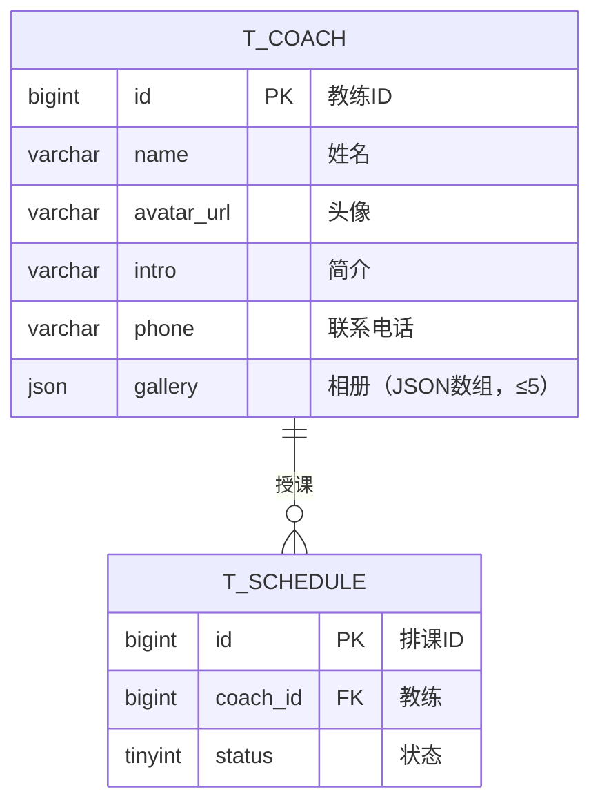
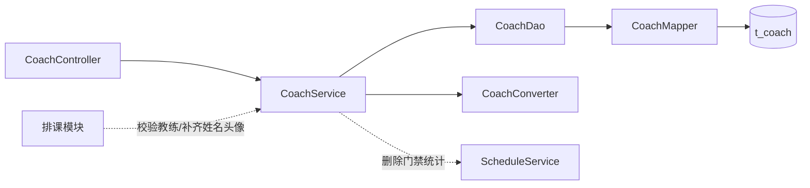

# 瑜伽普拉提教练管理详细设计文档

**版本：v2.0（重置版）**（2026-10-01）
**对应业务规则：** `BR-教练-001` ~ `BR-教练-006`、`BR-用户端-010`、`BR-全局-006`、`BR-全局-007`、`BR-全局-009`
**上游文档：** [详细设计总览](详细设计总览.md)、[概要设计](../概要设计/概要设计.md) v2.0

---

# 1、数据架构

## 1.1 数据库 ER 模型

### 1.1.1 建模口径

| 项目 | 约定 |
|---|---|
| 表名 | `t_coach` |
| 主键 | `id bigint unsigned`，雪花 ID，**应用侧生成** |
| 字符集 | `utf8mb4` / `utf8mb4_unicode_ci` |
| **删除** | **物理删除**：**不建 `deleted` 字段、不使用 `@TableLogic`**（`BR-教练-006`） |
| **状态** | **本表没有状态字段**（教练不设启用／停用） |
| 审计字段 | `create_by / create_time / update_by / update_time`，公共审计处理器填充 |
| **唯一约束** | **无**：教练名称**允许重名**（`BR-教练-002`） |
| 关系 | 教练 1—N 排课（`t_schedule.coach_id`）；**不建**教练×门店关联表 |

### 1.1.2 表清单

| 表名 | 中文名 | 所属模块 | 本版状态 |
|---|---|---|---|
| `t_coach` | 教练 | 教练管理 | **本版实现** |
| `t_schedule` | 排课 | 排课管理 | 本版实现；**教练删除门禁的统计对象** |

### 1.1.3 ER 模型图



## 1.2 数据库逻辑模型

### 1.2.1 `t_coach` 字段定义

| 字段 | 中文名 | 类型 | 必填 | 默认值 | 说明 |
|---|---|---:|:---:|---:|---|
| `id` | 教练ID | bigint unsigned | 是 | — | 雪花 ID，应用侧生成 |
| `name` | 姓名 | varchar(32) | 是 | — | **允许重名**，不建唯一约束 |
| `avatar_url` | 头像 | varchar(255) | 否 | NULL | 图片 URL |
| `intro` | 简介 | varchar(512) | 否 | NULL | 纯文本 |
| `phone` | 联系电话 | varchar(32) | 否 | NULL | 管理端专用；一期不参与登录 |
| `gallery` | 相册 | json | 否 | NULL | **JSON 数组**，最多 5 个图片 URL（**沿用既有 `album_urls` 的 `json` 列类型**） |
| `create_by` | 创建人 | bigint unsigned | 否 | NULL | 公共审计填充 |
| `create_time` | 创建时间 | datetime | 是 | CURRENT_TIMESTAMP | 公共审计填充 |
| `update_by` | 更新人 | bigint unsigned | 否 | NULL | 公共审计填充 |
| `update_time` | 更新时间 | datetime | 是 | CURRENT_TIMESTAMP | ON UPDATE |

### 1.2.2 枚举值

本表**没有枚举字段**。

### 1.2.3 字段规则

1. `name` 必填；`avatar_url`、`intro`、`phone`、`gallery` 可空。请求字段前后空格由转换层去除。
2. **相册规则**：`gallery` 是 **MySQL `json` 列**，内容为 URL 数组（形如 `["url1","url2"]`），元素个数**最多 5**（`BR-教练-004`）；超过即拒绝。空相册存 `NULL` 或 `[]`。**列类型沿用既有 `album_urls json` 的做法**，本版只把列名统一为 `gallery`。
3. **相册为什么不做子表**：一个教练最多 5 个 URL，且**不存在跨行查询相册**的场景；为此建 `t_coach_album` 只会增加一次联表与一套 CRUD。因此用一列 JSON 承载。
4. **名称允许重名**：不做唯一校验，也不建唯一索引。
5. 请求中不允许携带审计字段。

## 1.3 数据库物理模型

### 1.3.1 建表语句

```sql
CREATE TABLE `t_coach` (
  `id`          bigint unsigned NOT NULL COMMENT '教练ID',
  `name`        varchar(32)  NOT NULL COMMENT '姓名（允许重名）',
  `avatar_url`  varchar(255) DEFAULT NULL COMMENT '头像URL',
  `intro`       varchar(512) DEFAULT NULL COMMENT '简介',
  `phone`       varchar(32)  DEFAULT NULL COMMENT '联系电话（管理端专用）',
  `gallery`     json DEFAULT NULL COMMENT '相册：JSON数组，最多5个URL',
  `create_by`   bigint unsigned DEFAULT NULL COMMENT '创建人ID',
  `create_time` datetime NOT NULL DEFAULT CURRENT_TIMESTAMP COMMENT '创建时间',
  `update_by`   bigint unsigned DEFAULT NULL COMMENT '更新人ID',
  `update_time` datetime NOT NULL DEFAULT CURRENT_TIMESTAMP ON UPDATE CURRENT_TIMESTAMP COMMENT '更新时间',
  PRIMARY KEY (`id`),
  KEY `idx_coach_name` (`name`)
) ENGINE=InnoDB DEFAULT CHARSET=utf8mb4 COLLATE=utf8mb4_unicode_ci COMMENT='教练信息表';
```

> `idx_coach_name` 只服务于管理端按姓名模糊查询，**不是唯一索引**。

---

# 2、接口

## 2.1 通用约定

1. 管理端接口前缀 `/admin`，**依赖登录态**；HTTP 状态码固定 200，业务结果看响应 `code`。
2. 列表用 `TableDataInfo`；详情、新增、修改、删除用 `AjaxResult`。
3. 主键在返回对象中序列化为**字符串**。
4. 本模块**没有状态接口**，也**没有启用／停用**。
5. 教练**不提供用户端独立接口**：一期用户端**不提供教练列表与教练详情页**（`BR-用户端-010`），教练姓名与头像只随排课卡片与课程详情页返回（见 [用户端接口详细设计](用户端接口详细设计.md)）。

## 2.2 教练管理接口

| # | 方法 | 路径 | 功能 | 登录 |
|---:|---|---|---|:---:|
| 1 | GET | `/admin/coaches` | 查询教练列表 | 是 |
| 2 | GET | `/admin/coaches/{coachId}` | 查询教练详情 | 是 |
| 3 | POST | `/admin/coaches` | 新增教练 | 是 |
| 4 | PUT | `/admin/coaches/{coachId}` | 修改教练 | 是 |
| 5 | DELETE | `/admin/coaches/{coachId}` | 删除教练（物理，带门禁） | 是 |

### 2.2.1 查询教练列表

**请求：** `GET /admin/coaches?name=王&pageNum=1&pageSize=10`

| 参数 | 位置 | 类型 | 必填 | 说明 |
|---|---|---|---|:---:|---|
| `name` | query | string | 否 | 姓名，模糊匹配，最长 32 |
| `pageNum` | query | integer | 否 | 默认 1 |
| `pageSize` | query | integer | 否 | 默认 10，最大 100 |

**返回示例：**

```json
{
  "total": 1,
  "rows": [
    {
      "id": "1856739201475237001",
      "name": "王老师",
      "avatarUrl": "https://cdn.example.com/coach/1.jpg",
      "phone": "13800000000",
      "createTime": "2026-10-01 10:00:00",
      "updateTime": "2026-10-01 10:00:00"
    }
  ],
  "code": 200,
  "msg": "查询成功"
}
```

列表**不返回** `intro` 与 `gallery`（大字段），按 `id DESC` **稳定排序**。

### 2.2.2 查询教练详情

**请求：** `GET /admin/coaches/{coachId}`

成功时 `data` 为 `CoachDetailVO`，含 `gallery` 数组。教练不存在时返回 `404`，提示"教练不存在或已被删除"。

### 2.2.3 新增教练

**请求：** `POST /admin/coaches`

```json
{
  "name": "王老师",
  "avatarUrl": "https://cdn.example.com/coach/1.jpg",
  "intro": "十年哈他瑜伽经验",
  "phone": "13800000000",
  "gallery": [
    "https://cdn.example.com/coach/1-1.jpg",
    "https://cdn.example.com/coach/1-2.jpg"
  ]
}
```

| 情形 | 处理 |
|---|---|
| `gallery` 元素超过 5 个 | `409`，"相册最多 5 张" |
| 姓名与其它教练重复 | **放行**（允许重名） |

成功只返回 `{ "code": 200, "msg": "操作成功" }`。

### 2.2.4 修改教练

**请求：** `PUT /admin/coaches/{coachId}`，请求体与新增一致（全量编辑）。

- 教练不存在 → `404`；
- `gallery` 超过 5 个 → `409`；
- 不做引用检查：**已被排课引用时仍允许修改**教练资料（与门店同口径）。

成功返回更新后的 `CoachDetailVO`。

### 2.2.5 删除教练

**请求：** `DELETE /admin/coaches/{coachId}`

**物理删除**，删除前依次校验：

| # | 校验 | 不通过时 |
|---:|---|---|
| 1 | 教练存在 | `404` |
| 2 | 没有**未结束、且状态为待上架或已上架**的排课引用（调 `ScheduleService`） | `409`："该教练仍有 N 节未结束的排课，无法删除" |
| 3 | 上述统计**调用失败** | 拒绝删除，**不降级放行**（fail-closed） |

通过后执行 `DELETE FROM t_coach WHERE id = ?`。

> **已取消、已结束的历史排课不阻塞删除**；删除后这些历史排课上的教练显示为空，管理端做空值兜底（`BR-全局-009`）。

## 2.3 数据模型

### 2.3.1 `CoachListItemVO` / `CoachDetailVO`

| 字段 | 类型 | 列表 | 详情 | 说明 |
|---|---|:--:|:--:|---|
| `id` | string | ✅ | ✅ | 教练ID |
| `name` | string | ✅ | ✅ | 姓名 |
| `avatarUrl` | string | ✅ | ✅ | 头像 URL |
| `phone` | string | ✅ | ✅ | 联系电话 |
| `intro` | string | ❌ | ✅ | 简介（列表不返回大字段） |
| `gallery` | string[] | ❌ | ✅ | 相册 URL 数组 |
| `createTime` / `updateTime` | string | ✅ | ✅ | 时间字段 |

### 2.3.2 `CoachCreateDTO` / `CoachUpdateDTO`

两个请求模型字段相同：`name`（必填）、`avatarUrl`、`intro`、`phone`、`gallery`（`List<String>`，服务端校验 ≤ 5）。使用 `@Valid` 校验非空与长度。

### 2.3.3 `CoachQuery`

列表筛选与分页：`name`、`pageNum`、`pageSize`（上限 100）。

## 2.4 错误码

| code | 场景 | 文案 |
|---:|---|---|
| 200 | 成功 | 查询成功／操作成功 |
| 404 | 教练不存在 | 教练不存在或已被删除 |
| 409 | 相册超过上限 | 相册最多 5 张 |
| 409 | 仍有未结束的排课 | 该教练仍有 N 节未结束的排课，无法删除 |
| 409 | 引用统计失败 | 引用检查未完成，已拒绝本次删除 |
| 500 | 参数校验失败／系统异常 | 由统一异常处理器返回具体字段提示 |

---

# 3、开发架构

## 3.1 包结构

```text
com.techplant.yoga.coach
├─ controller/CoachController.java
├─ service/CoachService.java              （同时供跨模块校验与补齐）
├─ service/impl/CoachServiceImpl.java
├─ dao/CoachDao.java、CoachDaoImpl.java
├─ mapper/CoachMapper.java
├─ domain/CoachDO.java
├─ dto/CoachCreateDTO.java、CoachUpdateDTO.java
├─ query/CoachQuery.java
├─ vo/CoachListItemVO.java、CoachDetailVO.java
└─ convert/CoachConverter.java
```

## 3.2 类与职责

| 类 | 职责 |
|---|---|
| `CoachController` | 接收请求、触发校验、装配响应；**不写业务规则** |
| `CoachService` / `CoachServiceImpl` | 存在性校验、相册上限校验、JSON 相册的序列化与反序列化、**删除门禁编排**、事务边界；并**对外**提供「校验教练存在」与「批量取姓名头像」供排课使用（**全项目统一不另立 QueryService**） |
| `CoachDao` / `CoachDaoImpl` | 组装筛选、分页、稳定排序 |
| `CoachMapper` | 继承 `BaseMapper<CoachDO>` |
| `CoachDO` | 与 `t_coach` 对应；`gallery` 在 DO 里以字符串承载，**在 service 层完成 JSON ↔ `List<String>` 转换** |
| `CoachCreateDTO` / `CoachUpdateDTO` | 新增／修改入参（`gallery` 为 `List<String>`） |
| `CoachQuery` | 列表筛选与分页 |
| `CoachListItemVO` / `CoachDetailVO` | 接口出参 |
| `CoachConverter` | DTO、DO、VO 转换 |

## 3.3 调用关系



## 3.4 关键实现约定

1. **物理删除**：`CoachDO` **不加** `@TableLogic`。
2. **相册 JSON 的转换只在 service 层发生**：DO 持有字符串，DTO/VO 持有 `List<String>`；**不要**把 JSON 解析散落到 controller 或 converter 之外。
3. 相册上限校验（≤ 5）在 service 统一做，新增与修改共用同一段校验。
4. **不做名称唯一校验**（允许重名），也不建唯一索引。
5. 列表固定 `id DESC` 排序，且**不查询** `intro` / `gallery` 大字段（列表 SQL 只 select 必要列）。

---

# 4、运行流程

## 4.1 查询列表
1. Controller 校验 `CoachQuery`（`pageSize` 上限 100）。
2. Service 调 DAO 分页查询（只 select `id/name/avatar_url/phone/审计时间`），按 `id DESC` 排序。
3. 转 `CoachListItemVO` 返回。

## 4.2 查询详情
1. Service 按 ID 查询；不存在 → `404`。
2. 反序列化 `gallery` 为 `List<String>`，转 `CoachDetailVO` 返回。

## 4.3 新增教练
1. Controller 校验 `name` 非空、长度与各字段长度。
2. Service 校验 `gallery` 元素数 ≤ 5；超过 → `409`。
3. 序列化 `gallery` 为 JSON 字符串，插入；主键与审计字段由公共机制处理。

## 4.4 修改教练
1. Service 按 ID 查询；不存在 → `404`。
2. 校验 `gallery` 元素数 ≤ 5；超过 → `409`。
3. 全量覆盖业务字段并更新；返回最新详情。

## 4.5 删除教练
1. Service 按 ID 查询；不存在 → `404`。
2. 调 `ScheduleService` 统计"未结束且状态为待上架或已上架"的排课数；> 0 → `409`（带数量）。
3. 统计抛异常 → 直接以 `ServiceException` 终止，**不继续删除**。
4. 执行物理删除。

---

# 5、菜单与 SQL 交付

1. `backend/sql/yoga.sql` 增加 `t_coach` 建表语句与示例数据（示例教练**故意取两个同名**，用于验证"允许重名"）。
2. 同脚本在 `sys_menu` 增加"教练管理"菜单，绑定内置管理员角色。
3. 管理端页面：`frontend/pc/src/views/coach/index.vue`，支持按姓名查询、新增、修改、删除；相册用**最多 5 张**的图片上传组件（超过即前端阻止提交）。
4. 管理端接口封装：`frontend/pc/src/api/coach/coach.js`。
5. 排课表单的教练下拉来自 `GET /admin/coaches`
