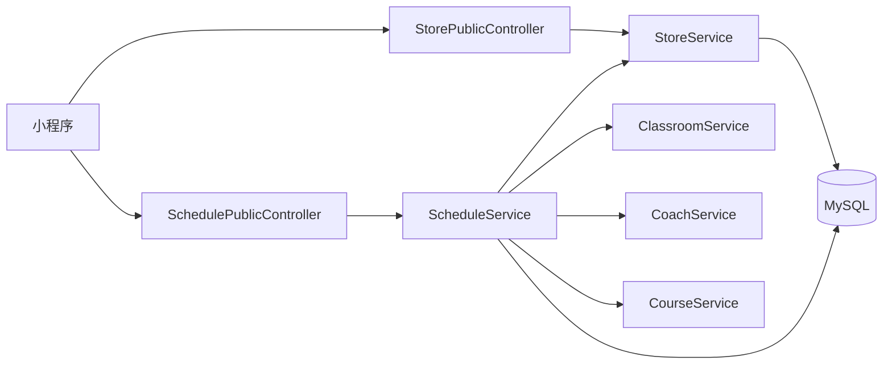

# 瑜伽普拉提用户端接口详细设计文档

**版本：v2.0（重置版）**（2026-10-01）
**对应业务规则：** `BR-全局-001`／`002`／`006`／`010`、`BR-门店-002`／`005`／`007`、`BR-排课-015`~`022`、`BR-用户端-001`~`010`
**上游文档：** [详细设计总览](详细设计总览.md)、[概要设计](../概要设计/概要设计.md) v2.0

> **本文是用户端 3 个免登录接口的唯一契约。**
> 各模块详细设计只写**管理端**接口；用户端接口**只在这里定义一次**，模块文档只留一句指引。

---

# 1、总体约定

## 1.1 免登录、只读、无身份

| 项 | 约定 |
|---|---|
| 鉴权 | 3 个接口全部标注 `@Anonymous`，由 `PermitAllUrlProperties` 收进 permitAll 白名单，**无需登录** |
| 方法 | **只有 `GET`**；一期用户端**没有任何写操作**（`BR-全局-002`） |
| 身份 | **不接受也不返回任何用户、会员、账号信息**；不存在"我的 XX"类接口 |
| 数据范围 | 只能看到**未删除**的对象；门店未删除、排课未删除 |

## 1.2 两条硬口径（写错就返工）

1. **可见口径 ＝ `status <> 1`（非「待上架」）**
   已上架、**已结束**、**已取消**都要返回；**只有「待上架」不返回**（`BR-排课-015`、`BR-排课-016`）。
   ⚠️ 不是"已上架且未结束"——这是本期明确纠正过的口径。
2. **筛选一律走派生列，不回读课程、不用起止时间拼日期**
   - 日期 → `schedule_date`（`BR-排课-022`）
   - 课种 → `course_type` **快照**（`BR-排课-021`）

## 1.3 通用响应与格式

| 项 | 约定 |
|---|---|
| 成功 | `AjaxResult{code:200, msg:"查询成功", data:…}`；**HTTP 状态码固定 200** |
| 列表 | **两个列表都分页**：统一用若依约定的 `TableDataInfo{total, rows, code, msg}`；`rows` 为空时返回 `[]`，**不返回 null** |
| 主键 | 字符串（雪花 ID 超出小程序 `Number` 精度） |
| 时间 | `yyyy-MM-dd HH:mm:ss`；日期 `yyyy-MM-dd` |
| 枚举 | **码与名称成对返回**（`courseType` ＋ `courseTypeName`、`status` ＋ `statusText`）——**小程序不维护码→名映射** |
| 空值 | 对象已被删除时，对应名称字段返回**空字符串**，不要返回 null（`BR-全局-009` 的空值兜底） |

## 1.4 接口清单

| # | 方法 | 路径 | 用途 | 承载页面 |
|---:|---|---|---|---|
| 1 | GET | `/api/stores` | 门店列表 | **首页**（切换门店） |
| 2 | GET | `/api/schedules` | 排课列表 | **约课页** |
| 3 | GET | `/api/schedules/{scheduleId}` | 排课详情 | **课程详情页** |

> 三个接口分别落在**门店模块**与**排课模块**的 `*PublicController` 上，**不新建模块**（见 §5）。

---

# 2、接口详情

## 2.1 查询门店列表

**请求：** `GET /api/stores?regionCode=310104&keyword=徐汇&pageNum=1&pageSize=10`

**参数：** 支持**按区域筛选**与**按名称／地址关键字搜索**；另可传分页参数。

| 参数 | 位置 | 类型 | 必填 | 说明 |
|---|---|---|---|---|
| `regionCode` | query | string | 否 | 所在区域 code，**精确匹配**（字典 `store_region` 的 16 个 code 之一；越界即拒绝） |
| `keyword` | query | string | 否 | 关键字，对**门店名称与地址**做**模糊匹配**（前后空格去除）；最长 64 |
| `pageNum` | query | integer | 否 | 默认 `1` |
| `pageSize` | query | integer | 否 | 默认 `10`，**上限 `100`** |

**返回：** `TableDataInfo`（**分页**），`rows` 为 `StorePublicItemVO` 数组。

```json
{
  "total": 3,
  "rows": [
    {
      "id": "1856739201475235901",
      "name": "徐汇店",
      "storeType": 1,
      "storeTypeName": "主力店",
      "regionCode": "310104",
      "regionName": "徐汇区",
      "phone": "021-12345678",
      "businessHours": "周一至周日 09:00-22:00",
      "address": "漕溪北路 88 号",
      "imageUrl": "https://cdn.example.com/store/1856739201475235901.jpg"
    }
  ],
  "code": 200,
  "msg": "查询成功"
}
```

| 项 | 说明 |
|---|---|
| 过滤 | 只返回**未删除**的门店；`regionCode` 与 `keyword` **可单用也可同时用**（同时用时是**与**关系） |
| 搜索 | `keyword` **同时匹配门店名称与地址**（`name LIKE %kw% OR address LIKE %kw%`）（`BR-门店-002`） |
| 排序 | `region_code ASC, name ASC, id DESC`（**稳定排序**；首页门店列表按区再按名） |
| 空态 | 无门店 → `total: 0`、`rows: []` |
| 不返回 | 审计字段、任何状态字段（门店本来就没有状态） |

> **首页怎么用**：门店卡展示 `name` / `regionName` / `address`；用户点「换店」列出本接口的全部门店。**当前门店由小程序本地记住**，不调服务端、不登录（`BR-全局-010`）。

## 2.2 查询排课列表（约课页）

**请求：** `GET /api/schedules?storeId=1856739201475235901&courseType=1&date=2026-10-03`

| 参数 | 位置 | 类型 | 必填 | 说明 |
|---|---|---|---|---|
| `storeId` | query | string | **是** | 当前门店 |
| `courseType` | query | integer | **是** | 课种 Tab：`1` 团课／`2` 精品课／`3` 私教课／`4` 特色课 |
| `date` | query | string | **是** | 日期条选中的日期，`yyyy-MM-dd` |
| `pageNum` | query | integer | 否 | 默认 `1` |
| `pageSize` | query | integer | 否 | 默认 `10`，**上限 `100`**（超出由 MP 分页插件钳制到 100） |

**服务端固定施加的过滤条件（客户端不可覆盖）：**

| # | 条件 | 依据 |
|---:|---|---|
| 1 | 排课未删除 | `BR-排课-016` |
| 2 | **`status <> 1`**（非「待上架」） | `BR-排课-015` |
| 3 | `store_id = :storeId` | `BR-排课-016` |
| 4 | **`course_type = :courseType`**（快照列，**不回读课程**） | `BR-排课-021` |
| 5 | **`schedule_date = :date`**（派生日期列，**不用 start_time/end_time 拼**） | `BR-排课-022` |

**参数校验：**

| 情况 | 处理 |
|---|---|
| 缺 `storeId` / `courseType` / `date` | 拒绝，提示具体缺失的参数 |
| `courseType` 不在 `1`~`4` | 拒绝，提示取值非法 |
| `date` 不是 `yyyy-MM-dd` | 拒绝，提示格式非法 |
| `date` 超出**今天起 14 天**（含今天） | 拒绝，提示只能查今天起 14 天内（`BR-排课-017`） |
| `storeId` 指向的门店不存在或已删除 | 返回 `404`，"门店不存在或已被删除"（`BR-全局-006`） |

**返回：** `TableDataInfo`（**分页**），`rows` 为 `ScheduleCardVO` 数组。

- 排序固定 **`start_time ASC, id ASC`**——分页**必须有稳定排序**，否则翻页会重复／漏项。
- 空结果：`total = 0`、`rows = []`。

```json
{
  "total": 12,
  "rows": [
    {
      "id": "1856739201475239001",
      "courseName": "哈他瑜伽",
      "courseCoverUrl": "https://cdn.example.com/course/1.jpg",
      "courseType": 1,
      "courseTypeName": "团课",
      "difficulty": 2,
      "scheduleDate": "2026-10-03",
      "startTime": "2026-10-03 19:00:00",
      "endTime": "2026-10-03 20:00:00",
      "coachName": "王老师",
      "storeId": "1856739201475235901",
      "storeName": "徐汇店",
      "classroomName": "瑜伽团课大教室",
      "maxPersons": 20,
      "bookedPersons": 0,
      "remainingPlaces": 20,
      "status": 2,
      "statusText": "可约",
      "bookable": true
    }
  ],
  "code": 200,
  "msg": "查询成功"
}
```

**用户端状态文案映射**（与管理端不同，`BR-排课-020`）：

| 落库 `status` | 时间 | `statusText` | `bookable` |
|---:|---|---|:--:|
| `2` 已上架 | `end_time > now` | **可约** | `true` |
| `2` 已上架 | `end_time <= now` | **已结束** | `false` |
| `3` 已取消 | — | **已取消** | `false` |
| `1` 待上架 | — | — | **不返回**（对用户端不可见） |

> 用户端**不出现"待上架"「已上架」这两个管理端措辞**；卡片上只会有「可约／已结束／已取消」三种。
> **已结束与已取消的卡片置灰、不可发起预约**（`bookable = false`）。
> 一期**没有预约**，`bookedPersons` 恒为 `0`、`remainingPlaces` 恒等于 `maxPersons`（`BR-排课-018`）。

**空态：** 该门店该课种该日期没有可看的排课 → `total: 0`、`rows: []`。一期「私教课」（`courseType=3`）没有排课数据，固定返回空分页。

## 2.3 查询排课详情（课程详情页）

**请求：** `GET /api/schedules/{scheduleId}`

**路径参数：** `scheduleId`（字符串形式的雪花 ID）。

**可用性判断：** 排课必须**未删除**且 **`status <> 1`**；否则**一律按不存在处理，返回 `404`**——**不区分"不存在"与"不可见"**，避免暴露某节课处于待上架（`BR-全局-006`）。

**返回：** `data` 为 `ScheduleDetailVO`。

```json
{
  "code": 200,
  "msg": "查询成功",
  "data": {
    "id": "1856739201475239001",
    "courseId": "1856739201475238001",
    "courseName": "哈他瑜伽",
    "courseCoverUrl": "https://cdn.example.com/course/1.jpg",
    "courseIntro": "适合初学者的基础课程",
    "courseType": 1,
    "courseTypeName": "团课",
    "difficulty": 2,
    "scheduleDate": "2026-10-03",
    "startTime": "2026-10-03 19:00:00",
    "endTime": "2026-10-03 20:00:00",
    "coachId": "1856739201475237001",
    "coachName": "王老师",
    "coachAvatarUrl": "https://cdn.example.com/coach/1.jpg",
    "coachIntro": "十年哈他瑜伽经验，擅长初学者体态调整",
    "storeId": "1856739201475235901",
    "storeName": "徐汇店",
    "classroomName": "瑜伽团课大教室",
    "status": 2,
    "statusText": "可约",
    "bookable": true,
    "maxPersons": 20,
    "minPersons": 2,
    "bookedPersons": 0,
    "remainingPlaces": 20,
    "bookers": []
  }
}
```

| 字段 | 口径 |
|---|---|
| `courseType` / `courseTypeName` | **取排课保存的课种快照**，不回读课程（`BR-排课-021`） |
| `courseCoverUrl` / `courseIntro` / `difficulty` | **实时取课程当前值**（难度／封面／介绍不做快照）。课程被改后本页展示随之变化 |
| `minPersons` | 即需求里的**「开课人数」**（`BR-排课-004`、`BR-用户端-009`） |
| `bookers` | **预约人员列表**：一期没有预约，**固定返回空数组 `[]`**（不是 null） |
| `bookable` | 是否可以发起预约；一期「立即预约」点击只提示**敬请期待**，不发起任何请求 |

**空值兜底：** 若课程、教练、教室已被物理删除（只可能出现在已取消／已结束的历史排课上），对应名称字段返回**空字符串**，前端自行兜底（`BR-全局-009`）。

---

# 3、数据模型

## 3.1 `StorePublicItemVO`（`GET /api/stores`）

| 字段 | 类型 | 说明 |
|---|---|---|
| `id` | string | 门店ID |
| `name` | string | 门店名称 |
| `storeType` | integer | `1` 主力店；`2` 精品店 |
| `storeTypeName` | string | 门店类型名称 |
| `regionCode` | string | 所在区域 code（6 位行政区划代码） |
| `regionName` | string | 所在区域名称（后端按字典翻译） |
| `phone` | string | 联系电话 |
| `businessHours` | string | 营业时间（一段展示文本） |
| `address` | string | 地址 |
| `imageUrl` | string | 门店图片 URL（单图，可空 → 空字符串） |

> 用户端**不返回** `storeType` 之外的任何状态字段；门店本来就没有状态（`BR-门店-008`）。
> 一期**不做**地址跳地图，因此 `address` 只用于展示，**不需要经纬度**。

## 3.2 `ScheduleCardVO`（`GET /api/schedules`）

| 字段 | 类型 | 说明 |
|---|---|---|
| `id` | string | 排课ID（进详情页用） |
| `courseName` | string | 课程名称 |
| `courseCoverUrl` | string | 课程封面 URL（单图，可空 → 空字符串） |
| `courseType` / `courseTypeName` | integer / string | 课种（**快照**） |
| `difficulty` | integer | 难度 `1`~`5`（实时取课程） |
| `scheduleDate` | string | 上课日期 `yyyy-MM-dd` |
| `startTime` / `endTime` | string | 起止时间 |
| `coachName` | string | 教练姓名（卡片只给姓名；**头像与简介只在详情页**） |
| `storeId` / `storeName` | string | 门店 |
| `classroomName` | string | 教室名称（已删除时空字符串） |
| `maxPersons` | integer | 最大人数 |
| `bookedPersons` | integer | 已预约人数（一期恒 `0`） |
| `remainingPlaces` | integer | 剩余名额（一期恒等于 `maxPersons`） |
| `status` / `statusText` | integer / string | 用户端口径：`2` 可约或已结束、`3` 已取消 |
| `bookable` | boolean | 是否可发起预约 |

> 卡片**含课程封面**（`courseCoverUrl`）与**状态**；**已取消与已结束的卡片仍可点进课程详情页**，只是「立即预约」不可点（`bookable = false`）。

## 3.3 `ScheduleDetailVO`（`GET /api/schedules/{id}`）

在卡片字段的基础上，另加：`courseId`、`courseCoverUrl`、`courseIntro`、`coachId`、`coachAvatarUrl`、**`coachIntro`（教练简介）**、`minPersons`、`bookers`。

## 3.4 字段口径速查

| 口径 | 说明 |
|---|---|
| 码＋名成对 | `storeType`/`storeTypeName`、`regionCode`/`regionName`、`courseType`/`courseTypeName`、`status`/`statusText` |
| 快照 vs 实时 | **课种取快照**；**难度／封面／介绍实时取课程** |
| 派生状态 | `statusText` 与 `bookable` 由后端推导（"已结束"不落库） |
| 教练信息 | **卡片只给 `coachName`**；**头像 `coachAvatarUrl` 与简介 `coachIntro` 只在详情页**给（`BR-用户端-007` / `BR-用户端-009`） |
| 一期恒量 | `bookedPersons = 0`、`remainingPlaces = maxPersons`、`bookers = []` |

---

# 4、错误码

| code | 场景 | 文案 |
|---:|---|---|
| 200 | 成功 | 查询成功 |
| 404 | 门店不存在或已删除 | 门店不存在或已被删除 |
| 404 | 排课不存在、已删除、**或处于「待上架」** | 排课不存在或已被删除 |
| 500 | 缺少必填参数／参数取值非法／系统异常 | 由统一异常处理器返回**具体字段提示**（框架既有行为：`@Valid` 与手工校验失败都是 500） |

> ⚠️ **参数校验失败走 500**（不是 400）——这是若依框架的既有行为，一期**不去改**（改会波及 `sys_*` 接口，见 `backend/AGENTS.md` §8.11）。

---

# 5、实现落点（开发架构）

## 5.1 类的位置

```text
com.techplant.yoga.store
└─ controller/StorePublicController.java        （GET /api/stores）

com.techplant.yoga.schedule
└─ controller/SchedulePublicController.java     （GET /api/schedules、GET /api/schedules/{id}）
```

- **不新建模块**：用户端接口就落在这两个模块的 `*PublicController` 上，与模块自己的 `*Controller`（管理端）并列。
- 两个 `PublicController` **都标注 `@Anonymous`**，并且**只调本模块的 Service**。

## 5.2 调用关系



- `ScheduleService` 需要补齐 `storeName` / `coachName` / `classroomName` / 课程资料，**按 ID 去重后批量调各模块 Service**，避免 N+1。
- **不跨模块读表、不另立 QueryService**（[详细设计总览](详细设计总览.md) §2）。

## 5.3 关键实现约定

1. **可见口径只写一处**：`status <> 1` 这个条件在两个用户端查询里必须共用同一段构造逻辑，不要一处写 `<> 1`、另一处写 `IN (2,3)`。
2. **状态文案与 `bookable` 由 `ScheduleStatusEnum` 提供**：该枚举同时提供**管理端文案**（待上架／已上架／已取消／已结束）与**用户端文案**（可约／已结束／已取消），不要在前端或 controller 里各写一套。
3. **详情接口对「待上架」返回 404**，与"不存在"用**同一个响应**，不区分。
4. **两个列表都返回 `TableDataInfo`**（`total` ＋ `rows`）；空结果 `total = 0`、`rows = []`，**不要返回 `null`**。都走同一套分页（见第 7 条）。
5. 三个方法都要标 `@ApiOperation` + 类上 `@Api`，否则不进 Swagger。
6. **接口路径前缀 `/api`**（管理端是 `/admin`），两个前缀在 `SecurityConfig` 里的待遇完全不同：`/api/**` 是放行白名单，`/admin/**` 要求登录。
7. **排课列表的分页走与管理端同一套**：`Query` 对象（含 `pageNum`/`pageSize` 默认值与上限校验）→ MP `IPage` → `PageResult` → controller 装配 `TableDataInfo`；排序固定 `start_time ASC, id ASC`。**不要用框架的 `startPage()` + PageHelper**（那是 `sys_*` 的写法）。

---

# 6、与需求的对齐（逐条）

| 业务规则 | 在本契约里的体现 |
|---|---|
| `BR-全局-002` | 3 个接口全部 `@Anonymous`、只看不写 |
| `BR-全局-006` | 不存在／不可见一律 `404`；名称字段空字符串兜底 |
| `BR-全局-010` | 当前门店由小程序本地记住，接口不参与 |
| `BR-用户端-001` | 接口数正好支撑三个页面 |
| `BR-用户端-003` | `/api/stores` 的字段即首页门店卡要素 |
| `BR-用户端-005`~`007` | `/api/schedules` 的入参与卡片要素 |
| `BR-用户端-008` | 卡片带 `id`，用于进详情 |
| `BR-用户端-009` | `/api/schedules/{id}` 的字段即详情页要素 |
| `BR-门店-002` | 门店列表只返回未删除的门店；**支持按所在区域与名称／地址关键字筛选** |
| `BR-门店-005` | `regionCode` ＋ `regionName` |
| `BR-排课-015`／`016` | **可见口径 ＝ `status <> 1`**，五个固定过滤条件 |
| `BR-排课-017` | `date` 限今天起 14 天，默认今天（默认值由前端给） |
| `BR-排课-018` | `remainingPlaces` 返回，一期恒等于 `maxPersons` |
| `BR-排课-020` | 用户端**展示**状态：可约／已结束／已取消 |
| `BR-排课-021` | 按 `course_type` **快照**筛 Tab；详情页课种取快照 |
| `BR-排课-022` | 按 `schedule_date` **派生列**筛日期 |
| `BR-课程-009` | 难度／封面／介绍实时取课程 |

---

# 7、明确不做

| 项 | 说明 |
|---|---|
| 用户端登录、注册、账号、"我的 XX" | 一期用户端免登录（`BR-全局-005`） |
| 门店列表分页 | **不做**——已改为分页（见 §2.1），此处原"不分页"的口径已作废 |
| 预约相关字段与接口 | 一期不预约；`bookers` 固定 `[]`，「立即预约」只提示"敬请期待" |
| 排队、取消、签到 | 同上，全部在范围外 |
| 教练列表页与教练详情页 | `BR-用户端-010`；教练信息只随排课带出 |
| 首页其它区块（公告、今日可约、热门课程、金牌教练、门店实景图） | 一期首页只做门店切换（`BR-用户端-003`） |
| 地址跳地图、门店定位 | 属前端／微信原生能力，且需要经纬度，**本版不做** |
| 收藏、分享、打卡 | 范围外 |
