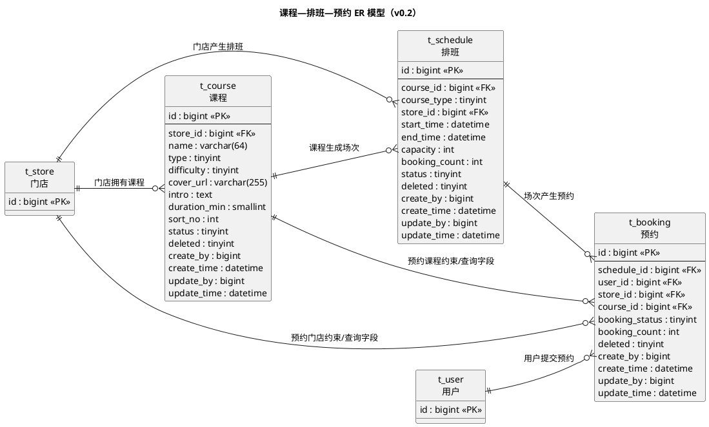
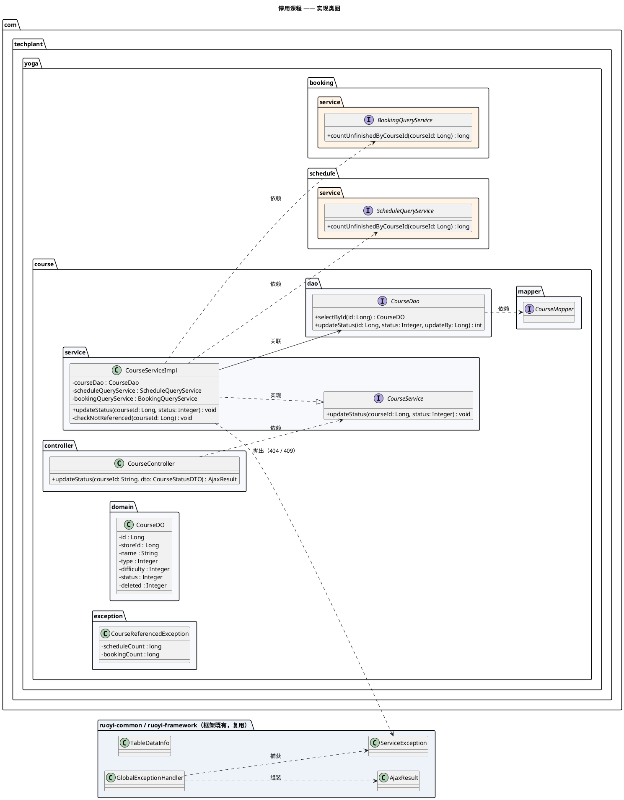
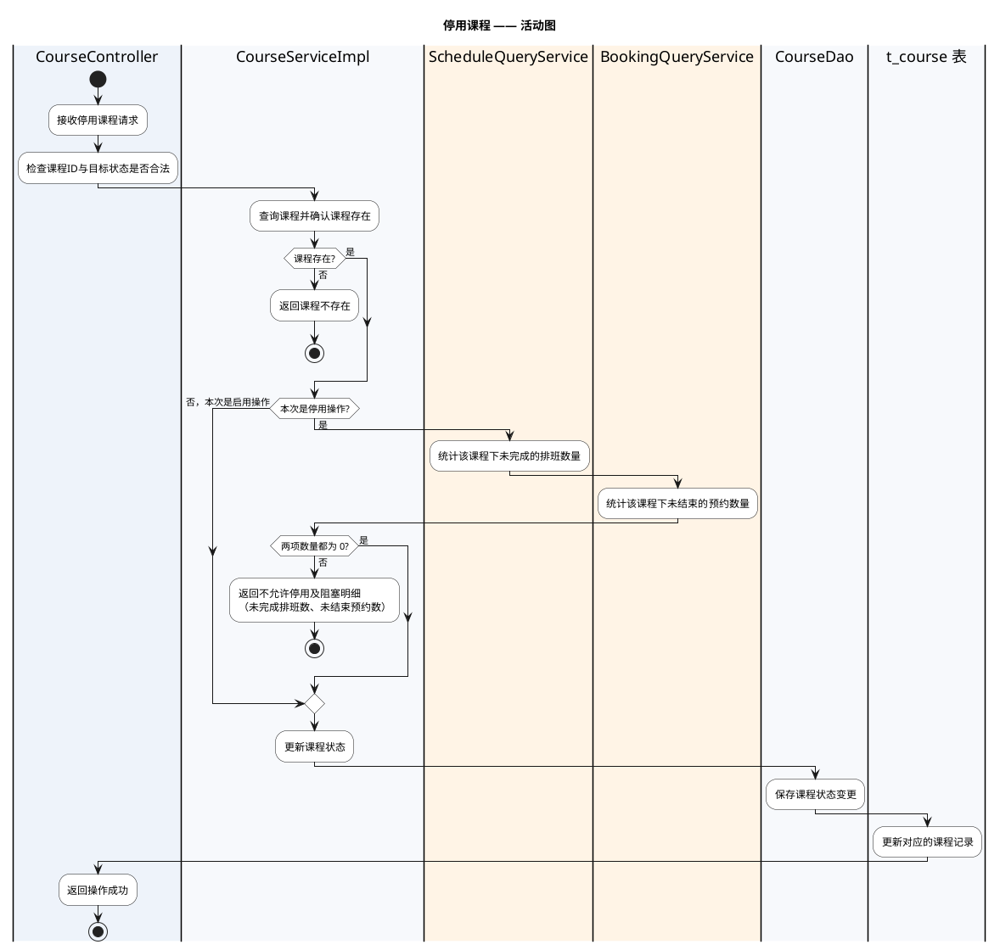
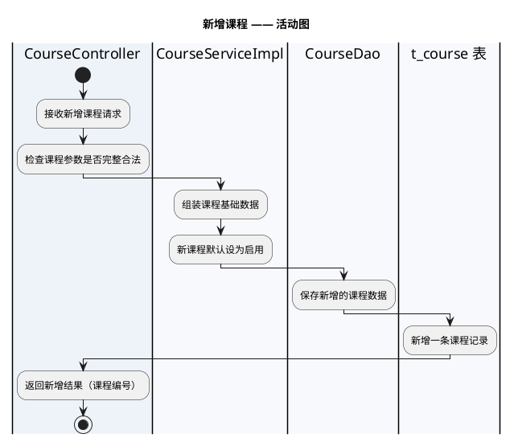
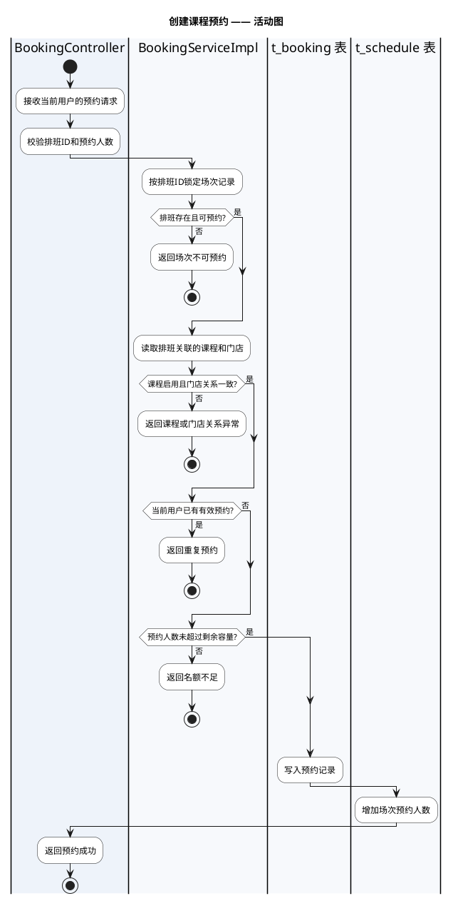

# 瑜伽普拉提详细设计文档

**版本：v0.4**（2026-09-30，排班保存课种快照以支持课种与日期筛选）
**本版范围：经营基础 —— 课程、排班、预约（第 1~6 章：数据架构 / 接口 / 开发架构 / 运行流程 / 测试用例设计 / 日志设计）**

> 本文按 `docs/模板/详细设计模板.md` 的章节组织：1 数据架构 / 2 接口 / 3 开发架构 / 4 运行流程 / 5 测试用例设计 / 6 日志设计。
> 其中第 2 章「接口」按 `docs/模板/接口设计模板.md` 的格式编写（每个接口给出方法、路径、请求参数、请求/返回示例、返回结果表与数据模型）。
> **本版在原课程管理详细设计的基础上，补齐课程、排班、预约三张核心表及其关系、最小接口契约、预约并发规则和验收用例。门店、用户、教练等基础表仍以既有模块为准。字段以本次评审意见为准，变更结论见 1.4。**
> **过程记录：** 评审意见与设计决策的变更见同目录 `详细设计记录.md`。

**上游依据**

| 文档 | 版本 | 本版引用内容 |
|---|---|---|
| `docs/需求分析/需求分析.md` | v0.2 | 课程领域对象、E12 课程分类（本版已在 1.2.2 确认）、3.3 待确认汇总 |
| `docs/概要设计/概要设计.md` | v0.1 | 排班承载课程场次、课程与排班的逻辑职责 |
| `docs/需求文档/管理端/管理端功能清单.md` | v1 | 查询课程 / 新增课程 / 修改课程 / 设置课程状态 |
| `docs/需求文档/管理端/管理端页面结构图.md` | 草稿 | 课程列表与课程详情的字段清单 |
| `docs/产品分析/用户端页面与跳转梳理.md` | v2.1 | 课程分类、门店筛选、课程预约、我的预约页面字段 |
| `docs/产品分析/业务对象倒排索引.tsv` | 当前基线 | 课程、课程场次、预约、门店和用户端页面可见字段 |

**标记口径**（沿用需求分析与概要设计）：

| 标记 | 含义 |
|---|---|
| **已确认事实** | 功能清单已列出，或现有小程序已实测 |
| **建议方案** | 为形成可落地的设计而提出，确认后才能进入开发 |
| **TODO-待确认** | 资料未明确，不应据此直接开发 |

---

# 1、数据架构

## 1.1 数据库ER模型

### 1.1.1 建模口径（全局约定）

以下约定一次定好、后续所有模块复用。2026-09-22 已逐项评审，结论见「说明」列。

| 项 | 本版约定 | 说明 |
|---|---|---|
| 数据库 | MySQL 8.0 | 技术栈已确认：Java + Spring Boot + MyBatis-Plus + MySQL |
| 存储引擎 / 字符集 | InnoDB / `utf8mb4` / `utf8mb4_unicode_ci` | 建议方案；课程名称、教练姓名等含中文与 emoji 风险 |
| 表命名 | `t_` + 业务名，全小写下划线（`t_course`） | **已确认**（2026-09-22 Q1） |
| 主键 | `id` `bigint unsigned`，**雪花ID**，由 MyBatis-Plus 的 `IdType.ASSIGN_ID` 在应用侧生成，不使用数据库自增 | **已确认**（2026-09-22 Q2）：主键由 MyBatis-Plus 框架提供 |
| 主键与前端 | 主键是 64 位整数，**接口返回给前端时必须序列化成字符串** | 小程序 JS 的 `Number` 只有 53 位精度，直接返回数字会丢精度；Jackson 需配置 Long → String |
| 逻辑删除 | 统一 `deleted` `tinyint`，0 正常 / 1 已删除 | **建议方案**：课程会被排班与预约引用，不允许物理删除；但「停用」与「删除」是两件事，业务上优先用 `status` |
| 审计字段 | `create_by` / `create_time` / `update_by` / `update_time`，数据库 `DEFAULT CURRENT_TIMESTAMP` 兜底 | 建议方案；管理端操作需要留痕（管理端 RBAC 尚未确认，见需求分析 E09） |
| 时间类型 | `datetime`，不用 `timestamp` | 建议方案；避免 2038 问题与隐式时区转换 |
| 状态字段 | `tinyint` + 代码内枚举常量，不用数据库 `enum` | 建议方案；加值不需要改表 |
| 金额字段 | `decimal(10,2)` | 本版无金额字段，先记约定 |

> **说明：** 本版字段一律**可溯源**（见 1.2 的「依据」列）：课程字段来自页面分析，排班与预约字段以本次评审明确的业务关系为准，并保留支撑状态、逻辑删除、审计和并发控制所需的基础字段。未确认的教练、教室、支付、会员扣次、候补和取消规则不在本版擅自扩展。

### 1.1.2 本版范围与表清单

经营基础模块（管理端）按功能清单应包含**门店、课程、排班、教练、预约、用户**六组数据。本版先细化预约闭环最核心的**课程、排班、预约**三张表；门店、教练、用户仍引用既有或后续模块。

| 表名 | 中文名 | 所属 | 本版状态 |
|---|---|---|---|
| `t_course` | 课程 | 经营基础 | **本版细化** |
| `t_store` | 门店 | 经营基础 | 后续模块细化（仅登记） |
| `t_coach` | 教练 | 经营基础 | 后续模块细化（仅登记） |
| `t_schedule` | 排班 | 经营基础 | **本版细化** |
| `t_booking` | 预约 | 经营基础 | **本版细化** |
| `t_user` | 用户 | 用户与账号 | 后续模块细化（仅登记） |
| `t_trial_apply` | 体验课申请 | 体验与会员权益 | 后续模块细化（仅登记） |
| `t_course_image` | 课程图片 | 经营基础 | 本版不建（Q10 已确认：课程单图即可） |

> **本版边界：** `t_store`、`t_user`、`t_coach` 只作为外部主数据表被引用，本版不重复设计它们的字段；`t_course`、`t_schedule`、`t_booking` 是本次预约闭环的核心数据表。

### 1.1.3 ER 模型图

**已确认事实：** 课程属于门店，排班是某门店某课程在一个时间段的可预约场次，预约同时关联排班、用户、门店和课程。`t_schedule.booking_count` 是该场次当前有效预约人数，`t_booking.booking_count` 是本次预约占用的人数。



> ER 图用 PlantUML 表达

### 1.1.4 实体与关系说明

| 实体 | 说明 | 与其他实体的关系 |
|---|---|---|
| 课程 `t_course` | 某门店下可提供的课程基础信息（名称、类型、难度、介绍、图片、状态） | N : 1 门店；1 : N 排班；1 : N 预约 |
| 排班 `t_schedule` | 某门店某课程的一个时间段，保存所选课程的课种快照，承载开始/结束时间、容量和当前预约人数 | N : 1 课程；N : 1 门店；1 : N 预约 |
| 预约 `t_booking` | 某用户对某排班的预约记录，保留门店和课程ID用于一致性校验及高频查询 | N : 1 排班；N : 1 用户；N : 1 门店；N : 1 课程 |

**本次确认：** 课程需要关联 `store_id`，同名课程可以在不同门店分别维护；因此不建 `t_course_store`，而是由 `t_course.store_id` 直接表达课程归属门店。排班必须同时携带 `store_id` 与 `course_id`，service 层校验课程归属门店一致。

**数据冗余说明：** 预约中的 `store_id`、`course_id` 不是让预约脱离排班独立选课，而是预约创建时从排班回填的查询/一致性字段。创建与修改排班时不得直接改已有预约的这两个字段；若排班课程或门店需要变更，应按业务规则拒绝或先处理已有预约。

**已确认事实：** 「设置课程状态」控制课程是否可继续用于排班或展示；排班状态控制具体场次是否取消或结束；预约状态控制用户本次预约的业务状态。三者不能用一个状态字段替代。

---

## 1.2 数据库逻辑模型

### 1.2.1 `t_course` 课程表

| 字段 | 中文名 | 逻辑类型 | 必填 | 默认值 | 说明 | 依据 |
|---|---|---|---|:--:|---|---|
| `id` | 课程ID | 长整型 | 是 | 雪花ID | 主键，应用侧生成 | 建模口径（MyBatis-Plus `ASSIGN_ID`） |
| `store_id` | 门店ID | 长整型 | 是 | — | 课程归属门店，关联 `t_store.id`；同名课程可在不同门店独立维护 | **本次确认**：课程属于门店 |
| `name` | 课程名称 | 字符串(64) | 是 | — | 课程展示名称 | 功能清单「修改课程名称」；页面结构图课程详情 |
| `type` | 课种 | 整型 | 是 | — | 1 团课 / 2 精品课 / 3 私教课 / 4 特色课 | 页面与跳转梳理 S2·S10 实测；页面结构图「课种」 |
| `difficulty` | 课程难度 | 整型 | 是 | 1 | 1~5 星（1 最低、5 最高） | 页面结构图「课程难度」；取值 **已确认**（2026-09-22 Q6） |
| `cover_url` | 课程封面图 | 字符串(255) | 否 | NULL | 列表与详情的主图 URL | 页面结构图课程详情「课程图片」 |
| `intro` | 课程介绍 | 长文本 | 否 | NULL | 课程详情正文 | 功能清单「修改课程介绍」 |
| `duration_min` | 单节时长 | 整型 | 否 | NULL | 单位：分钟 | **已确认**（2026-09-22 Q7）：上游未列，本版补充 |
| `sort_no` | 展示排序 | 整型 | 是 | 0 | 值越小越靠前 | **已确认**（2026-09-22 Q8）：上游未列，本版补充 |
| `status` | 课程状态 | 整型 | 是 | 1 | 1 启用 / 0 停用 | 功能清单「设置课程状态」 |
| `deleted` | 逻辑删除 | 整型 | 是 | 0 | 0 正常 / 1 已删除 | 建模口径 |
| `create_by` | 创建人 | 长整型 | 否 | NULL | 管理端操作人ID | 建模口径 |
| `create_time` | 创建时间 | 日期时间 | 是 | 当前时间 | — | 建模口径 |
| `update_by` | 更新人 | 长整型 | 否 | NULL | 管理端操作人ID | 建模口径 |
| `update_time` | 更新时间 | 日期时间 | 是 | 当前时间 | 更新时自动刷新 | 建模口径 |

> **本版不建的字段（上游无依据，不发明需求）：** 课程价格、适用人数、课程编码、推荐/热门标记、上架时间、教练关联、多图数组。课程归属门店已经通过 `store_id` 表达，不再另建 `t_course_store`。
> 其中「热门课程」「金牌教练」在用户端首页存在，但**管理端功能清单里没有对应的配置功能**（需求分析 §1.2.3 未列出），因此不建字段；**Q9 已确认**：本期用户端「热门课程」直接按 `sort_no` 排序。

### 1.2.2 `t_schedule` 排班表

| 字段 | 中文名 | 逻辑类型 | 必填 | 默认值 | 说明 | 依据 |
|---|---|---|---|:--:|---|---|
| `id` | 排班ID | 长整型 | 是 | 雪花ID | 某门店某课程的一个具体场次 | 建模口径 |
| `store_id` | 门店ID | 长整型 | 是 | — | 关联 `t_store.id` | 本次确认：排班属于门店 |
| `course_id` | 课程ID | 长整型 | 是 | — | 关联 `t_course.id`；必须与课程的 `store_id` 一致 | 本次确认：排班关联课程 |
| `course_type` | 排班课种 | 整型 | 是 | — | 创建或更换课程时从 `t_course.type` 复制；用于课种 Tab + 日期查询和预约卡范围校验 | 本次确认：用户端筛选条件 |
| `start_time` | 开始时间 | 日期时间 | 是 | — | 场次开始时间，包含日期和时分秒 | 页面分析“开始时间” |
| `end_time` | 结束时间 | 日期时间 | 是 | — | 必须晚于开始时间 | 页面分析“结束时间” |
| `capacity` | 容量 | 整型 | 是 | — | 本场最多可占用人数，必须大于 0 | 用户端场次“总人数/开课人数” |
| `booking_count` | 预约人数 | 整型 | 是 | 0 | 当前有效预约占用人数，等于有效预约记录 `booking_count` 之和 | 本次确认 |
| `status` | 排班状态 | 整型 | 是 | 1 | 1 可预约、2 已取消、3 已结束 | 页面分析场次状态 |
| `deleted` | 逻辑删除 | 整型 | 是 | 0 | 0 正常 / 1 已删除；已有预约的排班不物理删除 | 建模口径 |
| `create_by` / `update_by` | 操作人 | 长整型 | 否 | NULL | 管理端操作人ID | 建模口径 |
| `create_time` / `update_time` | 操作时间 | 日期时间 | 是 | 当前时间 | 创建与最后更新时间 | 建模口径 |

**排班约束：** `start_time < end_time`；`capacity > 0`；`booking_count >= 0` 且不应大于 `capacity`；课程必须启用，且课程归属门店必须与排班 `store_id` 一致。是否允许同一门店同一课程时间重叠列为 TODO-待确认，当前建议禁止完全相同的时间段。

### 1.2.3 `t_booking` 预约表

| 字段 | 中文名 | 逻辑类型 | 必填 | 默认值 | 说明 | 依据 |
|---|---|---|---|:--:|---|---|
| `id` | 预约ID | 长整型 | 是 | 雪花ID | 主键，应用侧生成 | 建模口径 |
| `schedule_id` | 排班ID | 长整型 | 是 | — | 预约实际指向的场次，关联 `t_schedule.id` | 本次确认 |
| `user_id` | 用户ID | 长整型 | 是 | — | 提交预约的用户，关联 `t_user.id` | 本次确认 |
| `store_id` | 门店ID | 长整型 | 是 | — | 从排班回填，用于门店维度查询与一致性校验 | 本次确认 |
| `course_id` | 课程ID | 长整型 | 是 | — | 从排班回填，用于课程维度查询与一致性校验 | 本次确认 |
| `booking_status` | 预约状态 | 整型 | 是 | 1 | 1 已预约、2 已取消、3 已签到 | 页面分析“我的预约” |
| `booking_count` | 本次预约人数 | 整型 | 是 | 1 | 本次预约占用的名额数，当前建议只允许 1；保留字段以支持后续多人预约 | 本次确认 |
| `deleted` | 逻辑删除 | 整型 | 是 | 0 | 0 正常 / 1 已删除 | 建模口径 |
| `create_by` / `update_by` | 操作人 | 长整型 | 否 | NULL | 用户操作可记录用户ID，后台操作记录管理端用户ID | 建模口径 |
| `create_time` / `update_time` | 操作时间 | 日期时间 | 是 | 当前时间 | 创建与最后更新时间 | 建模口径 |

**预约约束：** 创建预约时以 `schedule_id` 为唯一业务入口，从排班读取并回填 `store_id`、`course_id`，客户端不能自行提交可信的门店/课程关系；同一用户同一排班只能存在一条有效预约；有效预约是 `booking_status = 1` 且 `deleted = 0` 的记录。重复预约、场次取消、场次结束、课程停用、容量不足时拒绝创建。

### 1.2.4 枚举值定义

| 枚举 | 取值 | 来源 |
|---|---|---|
| 课种 `type` | 1 团课、2 精品课、3 私教课、4 特色课 | 现有小程序实测（页面与跳转梳理 S2：团课/精品课/私教课/特色课） |
| 课程难度 `difficulty` | 1~5，对应 **1 星 ~ 5 星** | **已确认**（2026-09-22 Q6）；上游只给了字段名未给取值，本版定为星级 |
| 课程状态 `status` | 1 启用、0 停用 | 功能清单「控制课程是否可继续用于排班或展示」 |

**已确认**（2026-09-22 Q5）：课程分类**不含「体验课」**，按实测的 4 类建模。
**依据：** 用户端产品结构图把约课分类写成「团课、私教课、体验课、特色课」，而现有小程序实测是「团课、精品课、私教课、特色课」（需求分析 E12）；体验课走独立的申请审核流程，落在 `t_trial_apply`，不进课程分类。

---

## 1.3 数据库物理模型

### 1.3.1 建表语句（MySQL 8.0）

```sql
DROP TABLE IF EXISTS `t_booking`;
DROP TABLE IF EXISTS `t_schedule`;
DROP TABLE IF EXISTS `t_course`;

CREATE TABLE `t_course` (
  `id`           bigint unsigned NOT NULL                          COMMENT '课程ID',
  `store_id`     bigint unsigned NOT NULL                          COMMENT '门店ID',
  `name`         varchar(64)     NOT NULL                          COMMENT '课程名称',
  `type`         tinyint         NOT NULL                          COMMENT '课种：1团课 2精品课 3私教课 4特色课',
  `difficulty`   tinyint         NOT NULL DEFAULT 1                COMMENT '课程难度：1~5 星',
  `cover_url`    varchar(255)             DEFAULT NULL             COMMENT '课程封面图URL',
  `intro`        text                                              COMMENT '课程介绍',
  `duration_min` smallint unsigned        DEFAULT NULL             COMMENT '单节时长（分钟）',
  `sort_no`      int             NOT NULL DEFAULT 0                COMMENT '展示排序，值越小越靠前',
  `status`       tinyint         NOT NULL DEFAULT 1                COMMENT '课程状态：1启用 0停用',
  `deleted`      tinyint         NOT NULL DEFAULT 0                COMMENT '逻辑删除：0正常 1已删除',
  `create_by`    bigint unsigned          DEFAULT NULL             COMMENT '创建人ID',
  `create_time`  datetime        NOT NULL DEFAULT CURRENT_TIMESTAMP COMMENT '创建时间',
  `update_by`    bigint unsigned          DEFAULT NULL             COMMENT '更新人ID',
  `update_time`  datetime        NOT NULL DEFAULT CURRENT_TIMESTAMP ON UPDATE CURRENT_TIMESTAMP COMMENT '更新时间',
  PRIMARY KEY (`id`),
  KEY `idx_store_type_status` (`store_id`, `type`, `status`),
  KEY `idx_store_name` (`store_id`, `name`)
) ENGINE=InnoDB DEFAULT CHARSET=utf8mb4 COLLATE=utf8mb4_unicode_ci COMMENT='门店课程基础信息表';

CREATE TABLE `t_schedule` (
  `id`             bigint unsigned NOT NULL                          COMMENT '排班ID',
  `store_id`       bigint unsigned NOT NULL                          COMMENT '门店ID',
  `course_id`      bigint unsigned NOT NULL                          COMMENT '课程ID',
  `course_type`    tinyint         NOT NULL                          COMMENT '排班课种快照：1团课 2精品课 3私教课 4特色课',
  `start_time`    datetime        NOT NULL                          COMMENT '开始时间',
  `end_time`      datetime        NOT NULL                          COMMENT '结束时间',
  `capacity`      int unsigned    NOT NULL                          COMMENT '场次容量',
  `booking_count` int unsigned    NOT NULL DEFAULT 0                COMMENT '当前有效预约人数',
  `status`        tinyint         NOT NULL DEFAULT 1                COMMENT '排班状态：1可预约 2已取消 3已结束',
  `deleted`       tinyint         NOT NULL DEFAULT 0                COMMENT '逻辑删除：0正常 1已删除',
  `create_by`     bigint unsigned          DEFAULT NULL             COMMENT '创建人ID',
  `create_time`   datetime        NOT NULL DEFAULT CURRENT_TIMESTAMP COMMENT '创建时间',
  `update_by`     bigint unsigned          DEFAULT NULL             COMMENT '更新人ID',
  `update_time`   datetime        NOT NULL DEFAULT CURRENT_TIMESTAMP ON UPDATE CURRENT_TIMESTAMP COMMENT '更新时间',
  PRIMARY KEY (`id`),
  KEY `idx_store_type_start_status` (`store_id`, `course_type`, `start_time`, `status`),
  KEY `idx_store_start_status` (`store_id`, `start_time`, `status`),
  KEY `idx_course_start` (`course_id`, `start_time`),
  KEY `idx_course_status` (`course_id`, `status`)
) ENGINE=InnoDB DEFAULT CHARSET=utf8mb4 COLLATE=utf8mb4_unicode_ci COMMENT='课程排班场次表';

CREATE TABLE `t_booking` (
  `id`             bigint unsigned NOT NULL                          COMMENT '预约ID',
  `schedule_id`    bigint unsigned NOT NULL                          COMMENT '排班ID',
  `user_id`        bigint unsigned NOT NULL                          COMMENT '用户ID',
  `store_id`       bigint unsigned NOT NULL                          COMMENT '门店ID',
  `course_id`      bigint unsigned NOT NULL                          COMMENT '课程ID',
  `booking_status` tinyint         NOT NULL DEFAULT 1                COMMENT '预约状态：1已预约 2已取消 3已签到',
  `booking_count`  int unsigned    NOT NULL DEFAULT 1                COMMENT '本次预约人数',
  `deleted`        tinyint         NOT NULL DEFAULT 0                COMMENT '逻辑删除：0正常 1已删除',
  `create_by`      bigint unsigned          DEFAULT NULL             COMMENT '创建人ID',
  `create_time`    datetime        NOT NULL DEFAULT CURRENT_TIMESTAMP COMMENT '创建时间',
  `update_by`      bigint unsigned          DEFAULT NULL             COMMENT '更新人ID',
  `update_time`    datetime        NOT NULL DEFAULT CURRENT_TIMESTAMP ON UPDATE CURRENT_TIMESTAMP COMMENT '更新时间',
  PRIMARY KEY (`id`),
  UNIQUE KEY `uk_schedule_user_status` (`schedule_id`, `user_id`, `booking_status`),
  KEY `idx_user_status_time` (`user_id`, `booking_status`, `create_time`),
  KEY `idx_schedule_status` (`schedule_id`, `booking_status`),
  KEY `idx_store_course_status` (`store_id`, `course_id`, `booking_status`)
) ENGINE=InnoDB DEFAULT CHARSET=utf8mb4 COLLATE=utf8mb4_unicode_ci COMMENT='课程预约记录表';
```

### 1.3.2 索引设计

| 索引 | 字段 | 支撑的查询 |
|---|---|---|
| 主键 | `id` | 按ID查详情、更新、启停 |
| `idx_store_type_status` | `store_id`, `type`, `status` | 管理端及用户端按门店、课种、状态筛选 |
| `idx_store_name` | `store_id`, `name` | 管理端按门店和课程名称查询 |
| `idx_store_type_start_status` | `store_id`, `course_type`, `start_time`, `status` | 用户端按门店、课种和日期范围筛选场次 |
| `idx_store_start_status` | `store_id`, `start_time`, `status` | 用户端未指定课种时按门店、日期范围和场次状态查询 |
| `idx_course_start` | `course_id`, `start_time` | 排班按课程查询并按开始时间排序 |
| `idx_course_status` | `course_id`, `status` | 课程停用时统计未完成排班 |
| `uk_schedule_user_status` | `schedule_id`, `user_id`, `booking_status` | 限制同一用户同一场次同一状态重复记录；有效预约仍由 service 校验，允许取消后重新预约 |
| `idx_user_status_time` | `user_id`, `booking_status`, `create_time` | 用户查询我的预约 |
| `idx_schedule_status` | `schedule_id`, `booking_status` | 查询场次预约人数与名单 |
| `idx_store_course_status` | `store_id`, `course_id`, `booking_status` | 管理端按门店/课程筛选预约 |

**建议方案：** 按详细设计模板的实践口径，**本阶段只给基础索引**；等  SQL 写出来之后，再结合真实 SQL 复核索引，并在 code review 时请人专门 review 索引设计（涉及 `t_schedule`、`t_booking` 的联合查询时尤其需要）。

**说明：** `name` 不建唯一索引 —— 「流瑜伽」这类课程名可能在不同类型/难度下重复出现，唯一约束会误伤正常业务；是否需要禁止重名由 service 层业务校验决定。

---

## 1.4 字段确认结论（2026-09-29 本次评审）

本次将原“课程全局共享”的口径改为“课程归属门店”，并把排班、预约纳入同一份详细设计。此前 2026-09-22 已确认的主键、课种、难度、单节时长、排序和单图规则继续有效。

| 编号 | 问题 | 本次评审结论 |
|---|---|---|
| Q11 | 课程与门店的关系 | `t_course` 必须有 `store_id`；同名课程可以在不同门店独立维护；不建 `t_course_store` |
| Q12 | 排班最小字段 | `id`、`store_id`、`course_id`、`start_time`、`end_time`、`capacity`、`booking_count`，并保留状态、逻辑删除和审计字段 |
| Q13 | 预约最小字段 | `id`、`schedule_id`、`user_id`、`store_id`、`course_id`、`booking_status`、`booking_count`，并保留逻辑删除和审计字段 |
| Q14 | 预约的真实指向 | 预约必须指向 `schedule_id`；`store_id`、`course_id` 由排班回填，不能信任客户端自行拼接 |
| Q15 | 排班容量控制 | 创建预约时锁定排班行，校验 `booking_count + 本次预约人数 <= capacity`，成功后同事务插入预约并增加排班预约人数 |
| Q16 | 重复预约 | 同一用户同一排班只允许一条有效预约；重复预约返回业务冲突 |
| Q17 | 状态划分 | 课程状态、排班状态、预约状态分别维护；“排队”不落库，当前由预约人数达到容量后计算展示 |
| Q18 | 课种归属与场次筛选 | 课程维护课种；排班创建或更换课程时复制 `t_course.type` 到 `t_schedule.course_type` 保存。用户端按课种 Tab + 日期直接筛选排班课种；课程课种编码变化不会追溯改写既有排班快照 |

**仍需后续确认的事项：** 教练与教室是否挂在排班、取消预约截止时间、候补/排队转正规则、会员卡扣次/支付资格、多人预约是否开放、课程或排班变更时已有预约如何处理。会员卡范围与排班课种映射见会员卡详细设计。上述事项不影响本版三表的核心关系，但进入开发前必须补齐业务规则。

---

# 2、接口

> **本章格式：** 按 `docs/模板/接口设计模板.md` 编写 —— 每个接口给出「请求参数表 → 返回示例 JSON → 返回结果表 → 返回数据结构表」，并在章末统一收一节「数据模型」。
> **章节编号：** 沿用 `docs/模板/详细设计模板.md` 的「2.1 模块 → 2.1.1 接口」层级，因此接口内部的「请求参数 / 返回示例 / 返回结果 / 返回数据结构」比模板降一级为 `####`。
> **接口范围：** 详细设计模板正文提到「面向前端的 controller 接口在本课程省略不写」——那是课程为进度做的取舍；本项目把**三端调用服务端的接口视为模块间交互**，因此接口写全。
> **关于模板开头的 YAML front-matter：** 接口设计模板顶部那段（`language_tabs`、`generator: "@tarslib/widdershins"`、8 种语言代码页签、oAuth2 定义）是 **Widdershins 生成器的配置**，不是接口内容本身。本文档是设计文档而非生成器输入，故不搬运；将来若要用 Widdershins 生成对外 API 站点，再按需补该段配置。认证一节已按本项目改写为 2.1.2。

## 2.1 通用约定

### 2.1.1 服务地址与环境

| 项 | 值 |
|---|---|
| 管理端接口前缀 | `/admin` |

### 2.1.3 统一响应结构

所有接口返回统一包裹（数据模型见 2.3.1），与若依既有接口保持一致：

```json
{
  "code": 200,
  "msg": "操作成功",
  "data": {}
}
```

| 字段 | 说明 |
|---|---|
| `code` | 业务码，成功固定 `200`；失败按 2.4 取值（404 / 409 / 500） |
| `msg` | 提示信息，成功固定 `操作成功`；失败给出可读原因 |
| `data` | 业务数据；**无返回值时不返回该字段**（若依 `AjaxResult` 的行为） |

**已确认**（2026-09-22）：统一采用若依的 `AjaxResult`（`com.ruoyi.common.core.domain.AjaxResult`）与
`TableDataInfo`，**HTTP 状态码固定 200，业务结果一律看 `code`** —— 与 RuoYi 管理端既有约定一致，前端只判断一个字段；
失败由框架自带的 `com.ruoyi.framework.web.exception.GlobalExceptionHandler` 统一转换（业务失败抛 `ServiceException` 并带业务码）。

### 2.1.4 分页约定

- 请求：`pageNum`（页码，从 1 开始，默认 1）、`pageSize`（每页条数，默认 10，最大 100；超过 100 返回业务码 500 与提示「每页条数不能超过 100」）。
- 响应：若依标准的 `TableDataInfo`（见 2.3.2），结构 `{ total, rows, code, msg }`。

### 2.1.5 命名与序列化约定

| 项 | 约定 | 说明 |
|---|---|---|
| URL 风格 | 资源名词复数 + kebab-case | `/admin/courses` |
| JSON 字段 | lowerCamelCase | `coverUrl`、`durationMin` |
| **ID 序列化** | **64 位整数一律序列化为字符串** | 雪花ID 超出 JS `Number` 的 53 位安全范围，返回数字会丢精度（见 1.4） |
| 时间格式 | `yyyy-MM-dd HH:mm:ss` | **建议方案**，见 2.5 |
| 枚举 | 只返回 code，不返回翻译文案 | 类型/难度/状态的中文由前端按 1.2.2 的映射表展示，避免后端耦合展示层 |
| 请求体 | `application/json`，UTF-8 | — |

### 2.1.6 对象命名口径

对应详细设计模板第 2 章列出的对象词汇，本项目只用其中四种：

| 类型 | 本项目用法 | 本模块示例 |
|---|---|---|
| DO | 与表一一对应，在 `domain` 包，只在 mapper 与 service 之间传递 | `CourseDO`、`ScheduleDO`、`BookingDO` |
| DTO | service 的入参，controller 接收的请求体 | `CourseCreateDTO`、`ScheduleCreateDTO`、`BookingCreateDTO` |
| Query | 复杂查询条件的载体 | `CourseQuery`、`ScheduleQuery`、`BookingQuery` |
| VO | 接口返回给前端的数据，controller 的出参 | `CourseDetailVO`、`ScheduleVO`、`BookingDetailVO` |

## 2.2 课程管理模块

对应管理端功能清单：查询课程 / 新增课程 / 修改课程 / 设置课程状态。

| # | 接口 | 对应功能 | 需要登录 |
|---|---|---|---|
| 1 | `GET /admin/courses` | 查询课程（列表） | 是 |
| 2 | `GET /admin/courses/{courseId}` | 查询课程（详情） | 是 |
| 3 | `POST /admin/courses` | 新增课程 | 是 |
| 4 | `PUT /admin/courses/{courseId}` | 修改课程 | 是 |
| 5 | `PUT /admin/courses/{courseId}/status` | 设置课程状态 | 是 |

> **响应口径（2026-09-22 变更，先读这条）：** 本模块统一若依的响应体系 —— HTTP 状态码固定 **200**，
> 业务结果看响应体的 `code`；单条操作用 `AjaxResult`（`{code, msg, data}`），列表用 `TableDataInfo`
> （`{total, rows, code, msg}`）。因此下面各接口「返回结果」表里的**状态码一律读作业务码**，
> 返回示例已按新口径更新。详见 2.1.3、2.1.4、2.3.1、2.3.2、2.4 与《详细设计记录》R11。
>
> **状态不走编辑表单：** 管理端页面结构图中课程列表的操作是「查看 / 编辑 / 启用停用」，设置状态是**独立的列表操作**，因此新增与修改接口的请求体都**不含 `status`**，状态变更只走接口 5。

### 2.2.1 查询课程列表

<a id="opIdlistCourses"></a>

`GET /admin/courses`

分页查询课程列表，支持按课程名称、课种、课程状态筛选，只返回未删除的课程。

#### 请求参数

|名称|位置|类型|必选|说明|
|---|---|---|---|---|
|storeId|query|string| 否 |门店ID；管理端可按门店筛选。|
|name|query|string| 否 |课程名称，模糊匹配。|
|type|query|integer| 否 |课种，取值见下方枚举值。|
|status|query|integer| 否 |课程状态：1 启用、0 停用。不传表示不限状态。|
|pageNum|query|integer| 否 |页码，从 1 开始，默认 1。|
|pageSize|query|integer| 否 |每页条数，默认 10，最大 100。|

#### 枚举值

|属性|值|
|---|---|
|type|1|
|type|2|
|type|3|
|type|4|
|status|1|
|status|0|

> 返回示例

> 200 Response

```json
{
  "total": 2,
  "rows": [
    {
      "id": "1856739201475235840",
      "storeId": "1856739201475235800",
      "name": "哈他瑜伽",
      "type": 1,
      "difficulty": 2,
      "coverUrl": "https://cdn.example.com/course/hata.jpg",
      "status": 1,
      "sortNo": 10,
      "createTime": "2026-09-20 10:12:33",
      "updateTime": "2026-09-21 09:03:11"
    },
    {
      "id": "1856739201475235841",
      "storeId": "1856739201475235800",
      "name": "流瑜伽",
      "type": 2,
      "difficulty": 3,
      "coverUrl": "https://cdn.example.com/course/vinyasa.jpg",
      "status": 0,
      "sortNo": 20,
      "createTime": "2026-09-20 10:15:02",
      "updateTime": "2026-09-22 08:41:07"
    }
  ],
  "code": 200,
  "msg": "查询成功"
}
```

#### 返回结果

> 状态码列读作**业务码**；HTTP 状态码固定 200（见 2.4）。

|状态码|状态码含义|说明|数据模型|
|---|---|---|---|
|200|[OK](https://tools.ietf.org/html/rfc7231#section-6.3.1)|查询成功|[TableDataInfo](#schemapageresult)|
|401|[Unauthorized](https://tools.ietf.org/html/rfc7235#section-3.1)|未登录或登录态失效|[AjaxResult](#schemaapiresponse)|
|500|[Internal Server Error](https://tools.ietf.org/html/rfc7231#section-6.6.1)|参数不合法（如 `type` 不在 1~4、`pageSize` 超过 100），`msg` 给出具体提示|[AjaxResult](#schemaapiresponse)|

#### 返回数据结构

状态码 **200**

|名称|类型|必选|约束|中文名|说明|
|---|---|---|---|---|---|
|total|integer(int64)|true|none||符合条件的总记录数。|
|rows|[[CourseListItemVO](#schemacourselistitemvo)]|true|none||课程列表，字段见 2.3.3。|
|code|integer|true|none||业务码，200。|
|msg|string|true|none||提示信息，`查询成功`。|

### 2.2.2 查询课程详情

<a id="opIdgetCourse"></a>

`GET /admin/courses/{courseId}`

按课程ID查询课程详情，用于课程详情的「查看」与「编辑」回显。

#### 请求参数

|名称|位置|类型|必选|说明|
|---|---|---|---|---|
|courseId|path|string| 是 |课程ID（雪花ID 以字符串传递，见 2.1.5）。|

> 返回示例

> 200 Response

```json
{
  "code": 200,
  "msg": "操作成功",
  "data": {
    "id": "1856739201475235840",
    "storeId": "1856739201475235800",
    "name": "哈他瑜伽",
    "type": 1,
    "difficulty": 2,
    "coverUrl": "https://cdn.example.com/course/hata.jpg",
    "intro": "以体式与呼吸配合为主的经典课程，适合初学者建立基础。",
    "durationMin": 60,
    "sortNo": 10,
    "status": 1,
    "createTime": "2026-09-20 10:12:33",
    "updateTime": "2026-09-21 09:03:11"
  }
}
```

#### 返回结果

|状态码|状态码含义|说明|数据模型|
|---|---|---|---|
|200|[OK](https://tools.ietf.org/html/rfc7231#section-6.3.1)|查询成功|[AjaxResult](#schemaapiresponse)|
|401|[Unauthorized](https://tools.ietf.org/html/rfc7235#section-3.1)|未登录或登录态失效|[AjaxResult](#schemaapiresponse)|
|404|[Not Found](https://tools.ietf.org/html/rfc7231#section-6.5.4)|课程不存在或已被删除|[AjaxResult](#schemaapiresponse)|

#### 返回数据结构

状态码 **200**

|名称|类型|必选|约束|中文名|说明|
|---|---|---|---|---|---|
|code|integer|true|none||业务码，200。|
|msg|string|true|none||提示信息，`操作成功`。|
|data|[CourseDetailVO](#schemacoursedetailvo)|true|none||课程详情，字段见 2.3.4。|

### 2.2.3 新增课程

<a id="opIdcreateCourse"></a>

`POST /admin/courses`

创建课程基础信息。请求体不含 `status`，新课程默认为**启用**；状态变更走 2.2.5。

> Body 请求参数

```json
{
  "storeId": "1856739201475235800",
  "name": "哈他瑜伽",
  "type": 1,
  "difficulty": 2,
  "coverUrl": "https://cdn.example.com/course/hata.jpg",
  "intro": "以体式与呼吸配合为主的经典课程，适合初学者建立基础。",
  "durationMin": 60,
  "sortNo": 10
}
```

#### 请求参数

|名称|位置|类型|必选|说明|
|---|---|---|---|---|
|body|body|[CourseCreateDTO](#schemacoursecreatedto)| 是 |课程信息，字段见 2.3.6。|

#### 枚举值

|属性|值|
|---|---|
|type|1|
|type|2|
|type|3|
|type|4|
|difficulty|1|
|difficulty|2|
|difficulty|3|
|difficulty|4|
|difficulty|5|

> 返回示例

> 200 Response

```json
{
  "code": 200,
  "msg": "操作成功",
  "data": {
    "id": "1856739201475235840"
  }
}
```

#### 返回结果

|状态码|状态码含义|说明|数据模型|
|---|---|---|---|
|200|[OK](https://tools.ietf.org/html/rfc7231#section-6.3.1)|新增成功，返回新课程ID。|[AjaxResult](#schemaapiresponse)|
|500|[Internal Server Error](https://tools.ietf.org/html/rfc7231#section-6.6.1)|参数校验失败（名称/类型/难度缺失或超范围），`msg` 给出具体字段提示|[AjaxResult](#schemaapiresponse)|
|401|[Unauthorized](https://tools.ietf.org/html/rfc7235#section-3.1)|未登录或登录态失效|[AjaxResult](#schemaapiresponse)|

#### 返回数据结构

状态码 **200**

|名称|类型|必选|约束|中文名|说明|
|---|---|---|---|---|---|
|code|integer|true|none||业务码，200。|
|msg|string|true|none||提示信息，`操作成功`。|
|data|object|true|none||新建课程的标识。|
|» id|string|true|none||课程ID（雪花ID，字符串）。|

> **建议方案：** 本接口**不做重名校验** —— `t_course.name` 上未建唯一索引（见 1.3.2），同名课程允许存在（同一课名可能在不同类型或难度下重复）。若业务要求禁止重名，需要在 service 层加校验并补充错误码，见 2.5。

### 2.2.4 修改课程

<a id="opIdupdateCourse"></a>

`PUT /admin/courses/{courseId}`

修改课程基础信息。请求体**不含 `status`**；修改「类型、难度」会同时影响该课程已排班次在用户端的展示，但不改变已有排班本身。

> Body 请求参数

```json
{
  "storeId": "1856739201475235800",
  "name": "哈他瑜伽（初级）",
  "type": 1,
  "difficulty": 2,
  "coverUrl": "https://cdn.example.com/course/hata.jpg",
  "intro": "以体式与呼吸配合为主的经典课程，适合初学者建立基础。",
  "durationMin": 75,
  "sortNo": 10
}
```

#### 请求参数

|名称|位置|类型|必选|说明|
|---|---|---|---|---|
|courseId|path|string| 是 |课程ID（字符串）。|
|body|body|[CourseUpdateDTO](#schemacourseupdatedto)| 是 |课程信息，字段见 2.3.7。|

> 返回示例

> 200 Response

```json
{
  "code": 200,
  "msg": "操作成功",
  "data": {
    "id": "1856739201475235840",
    "storeId": "1856739201475235800",
    "name": "哈他瑜伽（初级）",
    "type": 1,
    "difficulty": 2,
    "coverUrl": "https://cdn.example.com/course/hata.jpg",
    "intro": "以体式与呼吸配合为主的经典课程，适合初学者建立基础。",
    "durationMin": 75,
    "sortNo": 10,
    "status": 1,
    "createTime": "2026-09-20 10:12:33",
    "updateTime": "2026-09-22 14:20:05"
  }
}
```

#### 返回结果

|状态码|状态码含义|说明|数据模型|
|---|---|---|---|
|200|[OK](https://tools.ietf.org/html/rfc7231#section-6.3.1)|修改成功，返回更新后的课程详情。|[AjaxResult](#schemaapiresponse)|
|500|[Internal Server Error](https://tools.ietf.org/html/rfc7231#section-6.6.1)|参数校验失败，`msg` 给出具体字段提示|[AjaxResult](#schemaapiresponse)|
|401|[Unauthorized](https://tools.ietf.org/html/rfc7235#section-3.1)|未登录或登录态失效|[AjaxResult](#schemaapiresponse)|
|404|[Not Found](https://tools.ietf.org/html/rfc7231#section-6.5.4)|课程不存在或已被删除|[AjaxResult](#schemaapiresponse)|

#### 返回数据结构

状态码 **200**

|名称|类型|必选|约束|中文名|说明|
|---|---|---|---|---|---|
|code|integer|true|none||业务码，200。|
|msg|string|true|none||提示信息，`操作成功`。|
|data|[CourseDetailVO](#schemacoursedetailvo)|true|none||更新后的课程详情，字段见 2.3.4。|

### 2.2.5 设置课程状态

<a id="opIdupdateCourseStatus"></a>

`PUT /admin/courses/{courseId}/status`

启用或停用课程。**停用前做引用检查**：课程下若仍存在**未完成的排班**或**未结束的用户预约**，则拒绝停用；启用不校验。幂等：重复设置同一状态返回成功。

> Body 请求参数

```json
{
  "status": 0
}
```

#### 请求参数

|名称|位置|类型|必选|说明|
|---|---|---|---|---|
|courseId|path|string| 是 |课程ID（字符串）。|
|body|body|[CourseStatusDTO](#schemacoursestatusdto)| 是 |目标状态，字段见 2.3.8。|

#### 枚举值

|属性|值|
|---|---|
|status|1|
|status|0|

> 返回示例

> 200 Response

```json
{
  "code": 200,
  "msg": "操作成功",
  "data": null
}
```

> 409 Response（课程下仍有排班或预约）

```json
{
  "code": 409,
  "msg": "该课程下仍有 3 个未完成排班、5 条未结束预约，无法停用"
}
```

#### 返回结果

> 状态码列读作**业务码**；HTTP 状态码固定 200（见 2.4）。

|状态码|状态码含义|说明|数据模型|
|---|---|---|---|
|200|[OK](https://tools.ietf.org/html/rfc7231#section-6.3.1)|设置成功。|[AjaxResult](#schemaapiresponse)|
|401|[Unauthorized](https://tools.ietf.org/html/rfc7235#section-3.1)|未登录或登录态失效|[AjaxResult](#schemaapiresponse)|
|404|[Not Found](https://tools.ietf.org/html/rfc7231#section-6.5.4)|课程不存在或已被删除|[AjaxResult](#schemaapiresponse)|
|409|[Conflict](https://tools.ietf.org/html/rfc7231#section-6.5.8)|课程下仍存在未完成的排班或未结束的预约，不允许停用；阻塞明细见 `msg`|[AjaxResult](#schemaapiresponse)|
|500|[Internal Server Error](https://tools.ietf.org/html/rfc7231#section-6.6.1)|`status` 取值不是 0 或 1，`msg` 给出具体提示|[AjaxResult](#schemaapiresponse)|

#### 返回数据结构

状态码 **200**

|名称|类型|必选|约束|中文名|说明|
|---|---|---|---|---|---|
|code|integer|true|none||业务码，200。|
|msg|string|true|none||提示信息，`操作成功`。|

状态码 **409**

|名称|类型|必选|约束|中文名|说明|
|---|---|---|---|---|---|
|code|integer|true|none||业务码，409。|
|msg|string|true|none||提示信息，示例：「该课程下仍有 3 个未完成排班、5 条未结束预约，无法停用」——**阻塞明细放在提示语里**（`AjaxResult` 不附带 `data`，见 2.4 与 R11）。|

> **已确认事实：** 课程状态控制课程**是否可继续用于排班或展示**（管理端功能清单）。
> **本版规则**（2026-09-22 确认）：设置状态前做**引用检查** ——
> - 只在 `status = 0`（停用）时校验；`status = 1`（启用）不校验。
> - 只要该课程下**仍存在未完成的排班**或**仍存在未结束的用户预约**，就**拒绝停用**，返回 409 并给出阻塞明细。
> - 只有当两者都不存在时，才允许停用。
> - **引用检查失败（统计接口不可用或超时）时，停用操作失败**，不降级放行 —— 否则统计服务一抖动，课程就会被误停用（见 6.1.5）。
>
> **阻塞口径**（2026-09-22 确认）：
>
> | 对象 | 阻塞 | 不阻塞 |
> |---|---|---|
> | 排班 `t_schedule` | 未开始、进行中（未完成） | 已完成、已取消（历史留档，不阻挡停用） |
> | 用户预约 `t_booking` | 已预约 / 待上课（未结束） | 已签到、已取消（历史留档，不阻挡停用） |
>
> 这样既能保证停用时不会有「未履约的班次和预约失去课程基础信息」，又不会让**上过课的课程永远停不了**。
> **待确认：** 上面「未完成 / 未结束」对应的具体状态枚举，要在排班与预约模块设计时确定（预约状态还牵涉概要设计 §3.5 阻断项 1）。
>
> **这条规则同时替代了原「联动取消」方案：** 因为不允许在有未完成排班/未结束预约时停用，就不存在「停用后已排班次和已提交预约失去课程基础信息」的问题，因此**不需要再补排班与预约的联动取消逻辑**（概要设计 §3.5 阻断项 2 中「课程停用」这一支由此关闭）。
> **实现依赖：** 校验要读 `t_schedule`（排班）与 `t_booking`（预约），两张表已在本版纳入数据模型；实现时仍通过 `ScheduleQueryService` / `BookingQueryService` 的模块接口查询，不由课程模块直接拼接对方 SQL。

### 2.2.6 排班与预约模块接口契约

本节只定义本次新增的最小闭环。所有接口仍遵循 2.1 的若依响应、ID 字符串和时间格式约定。

#### （1）排班接口

| 方法 | 路径 | 端 | 用途 |
|---|---|---|---|
| `GET` | `/admin/schedules` | 管理端 | 分页查询门店/课程/日期范围内的排班 |
| `GET` | `/admin/schedules/{scheduleId}` | 管理端 | 查询排班详情 |
| `POST` | `/admin/schedules` | 管理端 | 新增排班 |
| `PUT` | `/admin/schedules/{scheduleId}` | 管理端 | 修改未开始且无冲突的排班 |
| `PUT` | `/admin/schedules/{scheduleId}/status` | 管理端 | 取消或结束排班 |
| `GET` | `/api/schedules` | 用户端/教练端 | 按门店、课种（`courseType`）和日期范围（`startDate`、`endDate`）查询可展示场次 |

新增/修改排班请求字段：`storeId`、`courseId`、`startTime`、`endTime`、`capacity`。`courseType` 不由客户端提交，服务端根据所选课程的 `t_course.type` 写入 `t_schedule.course_type`；更换课程时同步更新课种快照。`bookingCount`、`status`、`deleted`、审计字段由服务端维护；已有有效预约的排班不允许修改门店和课程，时间或容量变更也必须保证不会造成已预约人数超过容量。

排班返回字段：`id`、`storeId`、`courseId`、`courseType`、`startTime`、`endTime`、`capacity`、`bookingCount`、`status`。管理端显示由课程自动带入的排班课种；用户端场次列表支持 `courseType`、`startDate`、`endDate` 查询，并返回课程名称、排班保存的课种、难度、封面图和“可预约/排队/已取消/已结束”展示状态。`courseType` 沿用课程课种编码：1 团课、2 精品课、3 私教课、4 特色课；会员卡 `courseScope` 使用其独立编码映射（3↔4）。

#### （2）预约接口

| 方法 | 路径 | 端 | 用途 |
|---|---|---|---|
| `POST` | `/api/bookings` | 用户端 | 为当前用户创建预约 |
| `GET` | `/api/bookings` | 用户端 | 查询当前用户的预约列表 |
| `GET` | `/api/bookings/{bookingId}` | 用户端 | 查询当前用户的预约详情 |
| `GET` | `/admin/bookings` | 管理端 | 按门店、课程、排班、用户和状态查询预约 |
| `GET` | `/admin/bookings/{bookingId}` | 管理端 | 查询预约详情 |
| `GET` | `/admin/schedules/{scheduleId}/bookings` | 管理端 | 查询指定场次的预约人数和用户名单 |

创建预约请求：

```json
{
  "scheduleId": "1856739201475235900",
  "bookingCount": 1
}
```

`userId` 从登录态取得，`storeId` 与 `courseId` 从排班读取，客户端不得提交或覆盖这两个字段。当前建议 `bookingCount` 只能为 1；接口保留该字段是为了后续支持多人预约，是否开放多人预约列为 TODO-待确认。

创建预约的成功返回：

```json
{
  "code": 200,
  "msg": "预约成功",
  "data": {
    "id": "1856739201475235910",
    "scheduleId": "1856739201475235900",
    "userId": "1856739201475235801",
    "storeId": "1856739201475235800",
    "courseId": "1856739201475235840",
    "bookingStatus": 1,
    "bookingCount": 1,
    "startTime": "2026-10-01 19:00:00",
    "endTime": "2026-10-01 20:00:00"
  }
}
```

预约创建必须在一个事务中完成：锁定排班行 → 校验排班、课程和重复预约 → 校验容量 → 插入 `t_booking` → 增加 `t_schedule.booking_count`。任一步失败都回滚，不允许出现“预约记录已写入但排班人数未增加”或反向的不一致。

**预约状态变更：** 本版只确认创建和查询；取消预约、签到、候补转正、会员扣次/支付等操作的接口和规则列为 TODO-待确认。管理端当前只读预约，不默认提供人工改约或代用户预约。

## 2.3 数据模型

### 2.3.1 AjaxResult

<a id="schemaapiresponse"></a>

```json
{
  "code": 200,
  "msg": "操作成功",
  "data": null
}
```

统一响应结构，所有接口共用；实现为若依的 `com.ruoyi.common.core.domain.AjaxResult`。

#### 属性

|名称|类型|必选|约束|中文名|说明|
|---|---|---|---|---|---|
|code|integer|true|none||业务码，成功 200；失败按 2.4 取值（404 / 409 / 500）。|
|msg|string|true|none||提示信息，成功固定 `操作成功`。|
|data|object|false|none||业务数据，结构随接口而定；**无返回值时不返回该字段**。|

### 2.3.2 TableDataInfo

<a id="schemapageresult"></a>

```json
{
  "total": 42,
  "rows": [],
  "code": 200,
  "msg": "查询成功"
}
```

分页结果结构；实现为若依的 `com.ruoyi.common.core.page.TableDataInfo`（列表接口的响应体）。

#### 属性

|名称|类型|必选|约束|中文名|说明|
|---|---|---|---|---|---|
|total|integer(int64)|true|none||符合条件的总记录数。|
|rows|[[CourseListItemVO](#schemacourselistitemvo)]|true|none||当前页数据，元素结构随接口而定。|
|code|integer|true|none||业务码，查询成功固定 200。|
|msg|string|true|none||提示信息，查询成功固定 `查询成功`。|

> **变更说明**（2026-09-22）：原 `PageResult`（`{total, pageNum, pageSize, list}`）改为若依标准的
> `TableDataInfo`，不再在响应里回显页码与每页条数（前端自己持有请求参数）。service 层仍保留内部结构
> `com.techplant.yoga.common.response.PageResult` 承载「总数 + 当前页数据」，由 controller 装配成 `TableDataInfo`。

### 2.3.3 CourseListItemVO

<a id="schemacourselistitemvo"></a>

```json
{
  "id": "1856739201475235840",
  "storeId": "1856739201475235800",
  "name": "哈他瑜伽",
  "type": 1,
  "difficulty": 2,
  "coverUrl": "https://cdn.example.com/course/hata.jpg",
  "status": 1,
  "sortNo": 10,
  "createTime": "2026-09-20 10:12:33",
  "updateTime": "2026-09-21 09:03:11"
}
```

课程列表项。列表页展示的字段与课程详情不同（不含 `intro`、`durationMin`），避免列表接口返回大字段。

#### 属性

|名称|类型|必选|约束|中文名|说明|
|---|---|---|---|---|---|
|id|string|true|none||课程ID（雪花ID，字符串）。|
|storeId|string|true|none||课程所属门店ID（雪花ID，字符串）。|
|name|string|true|maxLength 64||课程名称。|
|type|integer|true|none||课种：1 团课、2 精品课、3 私教课、4 特色课。|
|difficulty|integer|true|none||课程难度：1~5 星。|
|coverUrl|string|false|none||课程封面图 URL。|
|status|integer|true|none||课程状态：1 启用、0 停用。|
|sortNo|integer|true|none||展示排序，值越小越靠前。|
|createTime|string|true|none||创建时间。|
|updateTime|string|true|none||更新时间。|

### 2.3.4 CourseDetailVO

<a id="schemacoursedetailvo"></a>

```json
{
  "id": "1856739201475235840",
  "storeId": "1856739201475235800",
  "name": "哈他瑜伽",
  "type": 1,
  "difficulty": 2,
  "coverUrl": "https://cdn.example.com/course/hata.jpg",
  "intro": "以体式与呼吸配合为主的经典课程，适合初学者建立基础。",
  "durationMin": 60,
  "sortNo": 10,
  "status": 1,
  "createTime": "2026-09-20 10:12:33",
  "updateTime": "2026-09-21 09:03:11"
}
```

课程详情，用于详情查看与编辑回显。

#### 属性

|名称|类型|必选|约束|中文名|说明|
|---|---|---|---|---|---|
|id|string|true|none||课程ID（雪花ID，字符串）。|
|storeId|string|true|none||课程所属门店ID（雪花ID，字符串）。|
|name|string|true|maxLength 64||课程名称。|
|type|integer|true|none||课种：1 团课、2 精品课、3 私教课、4 特色课。|
|difficulty|integer|true|none||课程难度：1~5 星。|
|coverUrl|string|false|none||课程封面图 URL。|
|intro|string|false|none||课程介绍。|
|durationMin|integer|false|none||单节时长（分钟）。|
|sortNo|integer|true|none||展示排序，值越小越靠前。|
|status|integer|true|none||课程状态：1 启用、0 停用。|
|createTime|string|true|none||创建时间。|
|updateTime|string|true|none||更新时间。|

> **说明：** `create_by` / `update_by` **不返回**给前端 —— 管理端页面结构图的课程详情中没有这两个字段，它们只用于数据留痕（见 1.2.1）。

### 2.3.5 CourseQuery

<a id="schemacoursequery"></a>

```json
{
  "storeId": "1856739201475235800",
  "name": "瑜伽",
  "type": 1,
  "status": 1,
  "pageNum": 1,
  "pageSize": 10
}
```

课程列表查询条件对象（对应 2.1.6 的 Query 类型），由 controller 接收 query string 后装配。

#### 属性

|名称|类型|必选|约束|中文名|说明|
|---|---|---|---|---|---|
|storeId|string|true|none||课程所属门店ID（雪花ID，字符串）。|
|name|string|false|maxLength 64||课程名称，模糊匹配。|
|type|integer|false|none||课种，1~4。|
|status|integer|false|none||课程状态：1 启用、0 停用；不传不限。|
|pageNum|integer|false|min 1||页码，默认 1。|
|pageSize|integer|false|min 1, max 100||每页条数，默认 10。|

### 2.3.6 CourseCreateDTO

<a id="schemacoursecreatedto"></a>

```json
{
  "storeId": "1856739201475235800",
  "name": "哈他瑜伽",
  "type": 1,
  "difficulty": 2,
  "coverUrl": "https://cdn.example.com/course/hata.jpg",
  "intro": "以体式与呼吸配合为主的经典课程，适合初学者建立基础。",
  "durationMin": 60,
  "sortNo": 10
}
```

新增课程的请求体。**不含 `status`**，新课程固定为启用。

#### 属性

|名称|类型|必选|约束|中文名|说明|
|---|---|---|---|---|---|
|storeId|string|true|none||课程所属门店ID。必须引用存在且正常的门店。|
|name|string|true|maxLength 64||课程名称。|
|type|integer|true|none||课种：1 团课、2 精品课、3 私教课、4 特色课。|
|difficulty|integer|true|min 1, max 5||课程难度（星）。|
|coverUrl|string|false|maxLength 255||课程封面图 URL。|
|intro|string|false|none||课程介绍。|
|durationMin|integer|false|min 1||单节时长（分钟）。|
|sortNo|integer|false|min 0||展示排序，不传按 0 处理。|

### 2.3.7 CourseUpdateDTO

<a id="schemacourseupdatedto"></a>

```json
{
  "storeId": "1856739201475235800",
  "name": "哈他瑜伽（初级）",
  "type": 1,
  "difficulty": 2,
  "coverUrl": "https://cdn.example.com/course/hata.jpg",
  "intro": "以体式与呼吸配合为主的经典课程，适合初学者建立基础。",
  "durationMin": 75,
  "sortNo": 10
}
```

修改课程的请求体，字段与 CourseCreateDTO 一致（PUT 全量提交），**同样不含 `status`**。

#### 属性

|名称|类型|必选|约束|中文名|说明|
|---|---|---|---|---|---|
|storeId|string|true|none||课程所属门店ID；不允许把已有课程直接移动到存在排班/预约的其他门店。|
|name|string|true|maxLength 64||课程名称。|
|type|integer|true|none||课种：1 团课、2 精品课、3 私教课、4 特色课。|
|difficulty|integer|true|min 1, max 5||课程难度（星）。|
|coverUrl|string|false|maxLength 255||课程封面图 URL；传 `null` 表示清空。|
|intro|string|false|none||课程介绍；传 `null` 表示清空。|
|durationMin|integer|false|min 1||单节时长（分钟）；传 `null` 表示清空。|
|sortNo|integer|false|min 0||展示排序。|

### 2.3.8 CourseStatusDTO

<a id="schemacoursestatusdto"></a>

```json
{
  "status": 0
}
```

设置课程状态的请求体。

#### 属性

|名称|类型|必选|约束|中文名|说明|
|---|---|---|---|---|---|
|status|integer|true|none||目标状态：1 启用、0 停用。|

#### 枚举值

|属性|值|
|---|---|
|status|1|
|status|0|

## 2.4 错误码

**已确认**（2026-09-22）：采用若依口径 —— **HTTP 状态码固定 200，业务码放在响应体的 `code`**，前端只判断 `code`。

| code | 含义 | 说明 |
|---|---|---|
| 200 | 成功 | 对应若依 `AjaxResult.success` / `TableDataInfo`（查询成功） |
| 401 | 未登录 / 登录态失效 | 由框架的认证入口返回，见 2.1.2 |
| 403 | 无权限 | RBAC 未确认（E09），本版暂不返回 |
| 404 | 资源不存在 | 本模块用于「课程不存在或已删除」 |
| 409 | 状态冲突 | 本模块用于「课程下仍有未完成的排班或未结束的预约，不允许停用」 |
| 500 | 参数校验失败 / 系统异常 | 参数校验失败给出具体字段提示；系统异常统一兜底 |

> **两点与实现的差异（如实登记，均为若依框架既有行为）：**
> 1. 参数校验失败（`@Valid`）走框架的 `MethodArgumentNotValidException` 分支，业务码是 **500**（不是 400），`msg` 是具体字段提示（如「课程名称不能为空」）。若要把校验失败定为 400，需要改框架的全局异常处理器。
> 2. 框架的 `RuntimeException` 分支会把异常 `message` 放进 `msg`（例如数据库异常会带出表名与语句片段）。本版沿用框架行为，未做收敛；若需要「不向前端暴露细节」，需要改框架处理器。
>
> 另：**409 的阻塞明细放在 `msg` 里**（「该课程下仍有 3 个未完成排班、5 条未结束预约，无法停用」）——若依的 `AjaxResult` 只能承载 `code/msg/data`，框架处理器不会附带 `data`，因此原设计里 409 的结构化明细（`scheduleCount` / `bookingCount`）随本次口径变更取消；若前端需要结构化明细，需要在框架处理器上做扩展（待确认）。

## 2.5 接口级待确认清单

| 编号 | 待确认 | 建议默认 | 影响面 |
|---|---|---|---|
| A1 | 测试 / 线上环境的 Base URL | 本地 `http://localhost:8080`，其余待定 | 前端联调配置 |
| A2 | 管理端令牌形态与有效期 | JWT，2 小时 | 依赖账号模块；影响全部接口 |
| A3 | 失败时是否也用 HTTP 200 + 业务码 | **已确认（2026-09-22）：用 HTTP 200 + 业务码**（若依口径，见 2.1.3、2.4） | 全部接口的错误处理 |
| A4 | 时间返回格式 | `yyyy-MM-dd HH:mm:ss` | 全部含时间的接口 |
| A5 | 课程是否禁止重名 | 不禁止 | 需在 2.2.3 增加校验与错误码 |
| A6 | 查询列表的排序规则 | `sort_no ASC, id DESC` | 分页必须有稳定排序，否则翻页会重复/漏项；见 4.1.3.1 |

---

# 3、开发架构

> **本章口径**（按详细设计模板的实践经验）：最普通的增删改查**可以不画实现类图** —— 只要接口、运行流程和数据库模型清楚，实现就没问题。
> 课程管理的 5 个接口里，**4 个是纯 CRUD**（查询列表、查询详情、新增、修改），**只有「停用课程」不是**：它要跨模块做引用检查，还要返回 409 与阻塞明细，最能体现 controller / service / dao 的分工与事务边界。
> 因此本版**只画「停用课程」这一条链路的实现类图**，其余 4 个接口用文字说明实现逻辑（见 3.1.4）。

## 3.1 实现类图

### 3.1.1 「停用课程」实现类图



> 橙色包 = 本版只定义接口、实现随各自模块落地；蓝色包 = 复用的框架类（2026-09-22 响应体系决策后，
> 本模块**不再自定义** `ApiResponse` / `BusinessException` / `GlobalExceptionHandler` / `CourseReferencedException`）。
> 图中 `CourseController` 的出参类型相应为 `AjaxResult`（单条）与 `TableDataInfo`（列表）。

### 3.1.2 类与职责

| 类 / 接口 | 包 | 职责 | 本版状态 |
|---|---|---|---|
| `CourseController` | `course.controller` | 接收请求、参数校验（`@Valid`）、装配响应（`AjaxResult` / `TableDataInfo`）；**不写业务逻辑** | 本版新建 |
| `CourseService` | `course.service` | 课程业务接口，对 controller 暴露 | 本版新建 |
| `CourseServiceImpl` | `course.service.impl` | 业务实现：存在性校验、引用检查、事务边界 | 本版新建 |
| `CourseDao` | `course.dao` | 数据访问（面向业务语义），屏蔽 mapper 细节 | 本版新建 |
| `CourseMapper` | `course.mapper` | MyBatis-Plus `BaseMapper<CourseDO>`；复杂 SQL 写 XML | 本版新建 |
| `CourseDO` | `course.domain` | 与 `t_course` 一一对应（字段见 1.2.1） | 本版新建 |
| `PageResult` | `common.response` | service 层内部结构：总数 + 当前页数据（controller 据此装配 `TableDataInfo`） | 本版新建（内部） |
| `ScheduleQueryService` | `schedule.service` | 排班模块对外提供：统计某课程下未完成的排班数、查询排班并执行容量校验 | 本版接口契约 |
| `BookingQueryService` | `booking.service` | 预约模块对外提供：统计某课程下未结束的预约数、创建预约并维护排班人数 | 本版接口契约 |
| `AjaxResult` / `TableDataInfo` | `ruoyi-common` | 统一响应与分页结构（见 2.3.1、2.3.2） | **复用框架既有类**（2026-09-22 决策） |
| `ServiceException` | `ruoyi-common` | 业务异常，携带业务码（本版用 404 / 409） | **复用框架既有类**（替代原 `BusinessException` / `CourseReferencedException`） |
| `GlobalExceptionHandler` | `ruoyi-framework` | 框架自带的 `@RestControllerAdvice`，把 `ServiceException` 等转成 `AjaxResult` | **复用框架既有类**（本模块不再自定义异常处理器） |

### 3.1.3 类之间的关系

按详细设计模板列出的 7 种 UML 关系，本图只用到 4 种：

| 关系 | 画法 | 本图中的实例 |
|---|---|---|
| 实现 | 虚线 + 空心箭头 | `CourseServiceImpl` ⇢ `CourseService` |
| 继承 | 实线 + 空心箭头 | **本模块未使用**（业务异常复用框架的 `ServiceException`，不再自定义异常继承体系） |
| 关联 | 实线 + 简单箭头 | `CourseServiceImpl` → `CourseDao`（持有引用） |
| 依赖 | 虚线 + 简单箭头 | `CourseController` ⇢ `CourseService`；`CourseServiceImpl` ⇢ `ScheduleQueryService`、`BookingQueryService`、`ServiceException`（框架）；`CourseDao` ⇢ `CourseMapper`；`GlobalExceptionHandler`（框架）⇢ `ServiceException`、`AjaxResult` |
| 组合 / 聚合 | — | **本模块未使用**：课程与排班、预约是跨模块引用（外部实体标识），不是组合或聚合 |

### 3.1.4 其余 4 个接口的实现说明（不画类图）

| 接口 | 调用链 | 事务 |
|---|---|---|
| 查询课程列表 | `CourseController` → `CourseService.page(CourseQuery)` → `CourseDao.selectPage` → `CourseMapper` | 只读，不需要 |
| 查询课程详情 | `CourseController` → `CourseService.getById(id)` → `CourseDao.selectById` | 只读，不需要 |
| 新增课程 | `CourseController` → `CourseService.create(CourseCreateDTO)` → `CourseDao.insert` | 单表写，建议加 `@Transactional` |
| 修改课程 | `CourseController` → `CourseService.update(id, CourseUpdateDTO)` → `CourseDao.selectById` + `updateById` | 建议加 `@Transactional` |

**查询课程列表：** controller 接收 query string 并装配 `CourseQuery`；service 据此构造 `LambdaQueryWrapper<CourseDO>`（`storeId`、`type`、`status` 用 `eq`，`name` 用 `like`；`deleted = 0` 由 MyBatis-Plus 的 `@TableLogic` 自动附加，**不需要手写**）；`CourseDao.selectPage` 返回 `IPage<CourseDO>`；service 用 `CourseConverter` 转成内部结构 `PageResult<CourseListItemVO>`，controller 再装配成若依标准的 `TableDataInfo` —— **`IPage` 不出 service 层**，业务模块也不自定义对外响应体（见 2.1.4）。

**查询课程详情：** `CourseDao.selectById` 返回 null（或 `deleted = 1`）时抛 `ServiceException(404)`，否则 `CourseConverter.toDetailVO` 转换返回。

**新增课程：** controller 用 `@Valid` 校验 `CourseCreateDTO`；service 先校验 `storeId` 对应门店存在且可用，再通过 `CourseConverter.toDO` 组装 `CourseDO`，其中 **`status` 固定为 1（启用）**、`deleted` 固定为 0、**主键不赋值**（由 MyBatis-Plus 的 `IdType.ASSIGN_ID` 生成雪花ID，见 1.4）、审计字段由 `MetaObjectHandler` 自动填充；插入成功后返回主键。**注意返回值里的 `id` 和 `storeId` 要序列化成字符串**（见 2.1.5）。

**修改课程：** 先 `CourseDao.selectById` 做存在性校验（不存在抛 404）；`storeId` 变更前必须检查该课程没有排班和预约，存在引用时拒绝移动门店；再用 `CourseConverter.applyUpdate` 把 DTO 的可选字段写入 DO —— 其中 `coverUrl` / `intro` / `durationMin` 传 `null` 表示**清空**（见 2.3.7 的字段说明），这一点在转换时要显式处理，不能因为「null 不更新」而写错；最后 `updateById` 并回查返回最新详情。

**`CourseConverter`：** 负责 DO ⇄ DTO/VO 的转换，`course.convert` 包。**建议方案：** 本版手写转换方法（`toDO` / `applyUpdate` / `toListItemVO` / `toDetailVO`），字段少、可读性好；字段变多后再考虑引入 MapStruct。它不出现在 3.1.1 的类图里 —— 因为「停用课程」这条链路不需要对象转换。

### 3.1.5 跨模块引用检查的两个约定

1. **不跨模块读表。** 课程模块**不直接查** `t_schedule` / `t_booking`，只依赖排班、预约模块对外暴露的 `ScheduleQueryService` / `BookingQueryService`。理由：三张表虽属于同一数据库，但模块必须通过 service 契约协作，避免课程模块绑定预约实现细节。
2. **接口先行。** `countUnfinishedByCourseId` 继续返回 `long`；新增预约流程由预约模块持有事务，在排班模块提供的锁定/容量能力上完成。**跨模块接口需要同步给对应模块实现者**，不可绕过 service 直接改 `t_schedule.booking_count`。

**并发窗口（必须知道）：** 引用检查与状态更新在同一个 `@Transactional` 内，但「检查完、提交前」另一个事务可能刚好插入一条排班，导致停用后仍有未完成排班。两种兜底：

| 方案 | 做法 | 取舍 |
|---|---|---|
| **双向校验**（建议） | 排班模块**创建排班时校验课程状态**，课程已停用则拒绝排班 | 不引入锁，性能好；需要排班模块配合 |
| 行锁串行化 | 课程查询带 `FOR UPDATE`，把同一课程的并发操作串起来 | 逻辑集中，但课程行会成为热点，且要保证加锁顺序避免死锁 |

**本版建议采用「双向校验」**：课程侧做引用检查（拦截绝大多数场景），排班侧做状态校验（兜住并发窗口）。

## 3.2 包设计

### 3.2.1 包结构

```text
com.techplant.yoga
├── common/                          公共模块（不依赖任何业务模块）
│   ├── response/                    PageResult（service 层内部结构；对外响应复用框架的 AjaxResult / TableDataInfo）
│   ├── config/                      MybatisPlusConfig（分页插件）、JacksonConfig（ID 序列化）
│   ├── mybatis/                     AuditMetaObjectHandler（审计字段自动填充）
│   ├── log/                         TraceIdFilter、BusinessLog（第 6 章的统一日志格式）
│   └── util/                        CurrentUserUtils（取当前登录人）
├── course/                          课程管理模块（本版）
│   ├── controller/                  CourseController
│   ├── service/                     CourseService
│   │   └── impl/                    CourseServiceImpl
│   ├── dao/                         CourseDao、CourseDaoImpl
│   ├── mapper/                      CourseMapper
│   ├── domain/                      CourseDO
│   ├── dto/                         CourseCreateDTO、CourseUpdateDTO、CourseStatusDTO
│   ├── vo/                          CourseListItemVO、CourseDetailVO、CourseCreatedVO
│   ├── query/                       CourseQuery
│   └── convert/                     CourseConverter
├── schedule/                        排班模块（本版纳入核心闭环）
│   ├── controller/                  ScheduleController
│   ├── service/                     ScheduleService、ScheduleQueryService
│   │   └── impl/                    ScheduleServiceImpl
│   ├── dao/                         ScheduleDao、ScheduleDaoImpl
│   ├── mapper/                      ScheduleMapper
│   ├── domain/                      ScheduleDO
│   ├── dto/                         ScheduleCreateDTO、ScheduleUpdateDTO、ScheduleStatusDTO
│   ├── vo/                          ScheduleVO
│   └── query/                       ScheduleQuery
└── booking/                         预约模块（本版纳入核心闭环）
    ├── controller/                  BookingController
    ├── service/                     BookingService、BookingQueryService
    │   └── impl/                    BookingServiceImpl
    ├── dao/                         BookingDao、BookingDaoImpl
    ├── mapper/                      BookingMapper
    ├── domain/                      BookingDO
    ├── dto/                         BookingCreateDTO
    ├── vo/                          BookingVO、BookingDetailVO
    └── query/                       BookingQuery
```

MyBatis 的 XML 放在资源目录，**与 mapper 包同构**：

```text
src/main/resources/mapper/course/CourseMapper.xml
```

> 包结构在 3.1.1 的类图里已按包分组呈现；这里给出**完整树**，包含本版没有画类的包（如 `dto`、`vo`、`query`、`convert`）。
> 详细设计模板的示例包只列了 `domain / controller / mapper / dao / service` 五个；本版把 `dto`、`vo`、`query`、`convert`、`exception` 拆成独立包，避免 `domain` 包混装请求体和返回体。

### 3.2.2 类清单

| 包 | 类 / 接口 | 说明 |
|---|---|---|
| `course.controller` | `CourseController` | 5 个接口的入口，见 2.2 |
| `course.service` | `CourseService` | 业务接口 |
| `course.service.impl` | `CourseServiceImpl` | 业务实现 |
| `course.dao` | `CourseDao` | 数据访问 |
| `course.mapper` | `CourseMapper` | `BaseMapper<CourseDO>` + XML |
| `course.domain` | `CourseDO` | 与 `t_course` 一一对应 |
| `course.dto` | `CourseCreateDTO`、`CourseUpdateDTO`、`CourseStatusDTO` | 请求体，见 2.3.6~2.3.8 |
| `course.vo` | `CourseListItemVO`、`CourseDetailVO` | 响应体，见 2.3.3、2.3.4 |
| `course.query` | `CourseQuery` | 查询条件，见 2.3.5 |
| `course.convert` | `CourseConverter` | DO ⇄ DTO/VO 转换 |
| `schedule.*` | `ScheduleController`、`ScheduleService`、`ScheduleQueryService`、`ScheduleDao`、`ScheduleMapper`、`ScheduleDO`、DTO/VO/Query | 排班管理、按场次查询、锁定排班和容量校验；与 `t_schedule` 一一对应 |
| `booking.*` | `BookingController`、`BookingService`、`BookingQueryService`、`BookingDao`、`BookingMapper`、`BookingDO`、DTO/VO/Query | 预约创建、我的预约、场次名单和预约状态查询；与 `t_booking` 一一对应 |
| `common.response` | `PageResult` | service 层内部分页结构（对外响应复用框架的 `AjaxResult` / `TableDataInfo`） |
| `common.config` / `common.mybatis` / `common.log` / `common.util` | `MybatisPlusConfig`、`JacksonConfig`、`AuditMetaObjectHandler`、`TraceIdFilter`、`BusinessLog`、`CurrentUserUtils` | 基础设施适配：MyBatis-Plus 装配、ID 序列化、审计填充、链路标识与业务日志格式 |

### 3.2.3 分层调用规则

| 规则 | 说明 |
|---|---|
| controller 只调 service | 不得直接调 dao / mapper |
| service 之间可以互调 | 跨模块调用对方 **service 接口**（如 `ScheduleQueryService` / `BookingQueryService`），不得绕过 service 直接改对方表 |
| **service 不把 DO 返回给 controller** | 出参一律 VO —— 对应详细设计模板「service 必须将数据封装为 DTO/VO 返回」的口径 |
| dao 只被 service 调用 | dao 返回 DO；dao 内部可以使用 mapper |
| mapper 只被 dao 调用 | 复杂 SQL 写 XML，不用注解堆 SQL |

---

# 4、运行流程

> **本章口径**（按模板）：有较复杂的业务流程**必须画活动图**；仅仅是简单 CRUD 的，**文字描述清楚代码实现逻辑即可**。
> 模板对活动图的粒度要求是：**画出每个类与每个表之间的交互关系**，完整体现功能实现时各类与表的交互顺序和逻辑 —— 比概要设计里的时序图更贴近实现。因此本章活动图按「类 / 组件」分泳道，并把落到表上的操作单独标出。
> **与 3.1.4 的分工：** 3.1.4 回答「谁调用谁」（静态的类关系），本章回答「按什么顺序发生、数据怎么流转、边界条件在哪」（动态的运行流程），两者不重复。
> **活动图画什么、不画什么**（2026-09-22 评审确定）：只画**业务步骤与其落表操作**。横切基础设施（全局异常处理）与框架自动行为（主键生成、审计字段填充）**不属于业务步骤，因此不出现在活动图里** —— 它们分别在 3.1.1 的实现类图与 3.1.4 的实现说明中体现。表操作保留，因为模板明确要求活动图体现「类与**表**之间的交互」。
> **泳道内容怎么写**（2026-09-22 评审确定）：**泳道标题**可以用类名（`CourseServiceImpl`）或表名（`t_course 表`）；**泳道里的每一步用中文业务语言描述**（「接收停用课程请求」「统计该课程下未完成的排班数量」），**不写方法名、不写 SQL、不写框架名**。活动图是给人看懂业务主线和分支的，不是代码清单 —— 方法名与 SQL 属于 3.1.4 和 4.1.3 的实现说明，不属于活动图。

## 4.1 课程管理模块

| 接口 | 本章处理方式 | 理由 |
|---|---|---|
| 停用课程 | **活动图**（4.1.1） | 有跨模块引用检查、嵌套分支、事务边界、409 分支 |
| 新增课程 | **活动图**（4.1.2） | 有主键生成、审计字段自动填充、状态固定三处非直观步骤 |
| 查询课程列表 | 文字（4.1.3.1） | 单表分页查询 |
| 查询课程详情 | 文字（4.1.3.2） | 单表主键查询 |
| 修改课程 | 文字（4.1.3.3） | 单表更新，只有「null 即清空」需要点明 |

### 4.1.1 停用课程



**步骤说明**

| 步 | 执行者 | 动作 | 异常分支 |
|---|---|---|---|
| 1 | `CourseController` | 接收停用课程请求，检查课程ID与目标状态是否合法 | 不合法 → 400 |
| 2 | `CourseServiceImpl` | 查询课程，确认课程存在且未删除 | 不存在 → 404 |
| 3 | `CourseServiceImpl` | 判断本次是否为停用操作；若是启用操作则直接跳到第 5 步 | — |
| 4 | `ScheduleQueryService`、`BookingQueryService` | 分别统计该课程下未完成的排班数与未结束的预约数 | 任一大于 0 → 最终返回 409，并带上未完成排班数与未结束预约数 |
| 5 | `CourseServiceImpl` → `CourseDao` | 更新课程状态并保存变更（同时记录更新人与更新时间） | 未命中任何记录 → 404（并发被删的兜底） |
| 6 | `CourseController` | 返回操作成功 | — |

**涉及的表**

| 表 | 操作 | 说明 |
|---|---|---|
| `t_course` | `SELECT` / `UPDATE` | 读存在性、写状态；`deleted = 0` 由 `@TableLogic` 自动附加，不手写 |
| `t_schedule` | `SELECT COUNT` | 由排班模块的 `ScheduleQueryService` 代理，**课程模块不直接查这张表**（见 3.1.5） |
| `t_booking` | `SELECT COUNT` | 同上，由预约模块的 `BookingQueryService` 代理 |

### 4.1.2 新增课程



**步骤说明**

| 步 | 执行者 | 动作 | 异常分支 |
|---|---|---|---|
| 1 | `CourseController` | 接收新增课程请求，检查课程参数是否完整合法 | 校验失败 → 400 |
| 2 | `CourseServiceImpl` | 组装课程基础数据；新课程默认设为启用、默认未删除，**不指定课程编号** | — |
| 3 | `CourseDao` | 保存新增的课程数据 | — |
| 4 | `CourseController` | 返回新增结果（课程编号） | 课程编号必须序列化为字符串（见 2.1.5） |

> 课程编号生成与审计字段填充属于框架的自动行为，**不在业务活动图里展开**，见 3.1.4。

**涉及的表**

| 表 | 操作 | 说明 |
|---|---|---|
| `t_course` | `INSERT` | 只写一张表；主键由应用生成，**不走数据库自增** |

### 4.1.3 其余 3 个接口的实现逻辑

#### 4.1.3.1 查询课程列表

1. `CourseController` 接收 `GET /admin/courses`，参数绑定到 `CourseQuery`；`pageSize > 100`、`pageNum < 1`、`storeId` 不是有效ID 或 `type ∉ 1~4` → 400。
2. `CourseServiceImpl` 构造 `LambdaQueryWrapper<CourseDO>`：`storeId`、`type`、`status` 非空 → `eq`；`name` 非空 → `like`。**`deleted = 0` 由 `@TableLogic` 自动附加，不手写**。
3. `CourseDao` 调 `CourseMapper.selectPage(Page, wrapper)`，落到表上：
   ```sql
   SELECT id, store_id, name, type, difficulty, cover_url, status, sort_no, create_time, update_time
     FROM t_course
    WHERE deleted = 0
      /* AND name LIKE CONCAT('%', ?, '%') */
      /* AND store_id = ? AND type = ? AND status = ? */
    ORDER BY sort_no ASC, id DESC
    LIMIT ?, ?
   ```
4. `CourseServiceImpl` 把 `IPage<CourseDO>` 逐条经 `CourseConverter.toListItemVO` 转换，再组装成内部结构 `PageResult<CourseListItemVO>`（**`IPage` 不出 service 层**，见 2.1.4）。
5. `CourseController` 把 `PageResult` 装配成 `TableDataInfo{total, rows, code:200, msg:"查询成功"}` 返回。

**说明：** 只查列表列（不含 `intro`、`duration_min`）—— 列表 DTO 与详情 DTO 分开就是为了避免把长文本带进列表查询。

**说明：** 排序用 `sort_no ASC, id DESC`（**建议方案**，见 2.5 的 A6）。分页查询必须有稳定排序，否则翻页会出现重复/漏项；`id` 兜底保证唯一序。管理端课程量级小（几十到几百条），`ORDER BY` 不额外建索引；量级上来后再评估 `(deleted, sort_no)`。

#### 4.1.3.2 查询课程详情

1. `CourseController` 接收 `courseId`（字符串转 `Long`），转换失败 → 400。
2. `CourseServiceImpl` 调 `CourseDao.selectById`，落到表上：
   ```sql
   SELECT * FROM t_course WHERE id = ? AND deleted = 0
   ```
3. 结果为空 → 抛 `ServiceException(404)`。
4. `CourseConverter.toDetailVO` 转换后返回。

#### 4.1.3.3 修改课程

1. `CourseController` 用 `@Valid` 校验 `CourseUpdateDTO`。
2. `CourseServiceImpl` 先 `CourseDao.selectById` 做存在性校验 → 不存在抛 404。
3. `CourseConverter.applyUpdate(do, dto)` 把 DTO 写入 DO：
   - 直接覆盖：`storeId`、`name`、`type`、`difficulty`、`sortNo`；`storeId` 变更必须先通过排班和预约引用检查；
   - **可清空字段：`coverUrl`、`intro`、`durationMin` 传 `null` 表示清空**（见 2.3.7）—— 这里必须**显式赋 `null`**，不能写成「非空才更新」，否则用户清不掉封面图或介绍。
4. `CourseDao.updateById(do)`：
   ```sql
   UPDATE t_course
      SET store_id = ?, name = ?, type = ?, difficulty = ?, cover_url = ?, intro = ?,
          duration_min = ?, sort_no = ?, update_by = ?, update_time = ?
    WHERE id = ? AND deleted = 0
   ```
5. 影响行数为 0 → 抛 404（并发下课程被删的兜底）。
6. 回查或直接用更新后的 DO 转 `CourseDetailVO` 返回。

### 4.1.4 事务与并发

| 接口 | 事务 | 说明 |
|---|---|---|
| 停用课程 | **`@Transactional`（必须）** | 「引用检查 + 更新状态」必须同一个事务；否则检查通过后、更新前发生异常会留下不一致 |
| 新增课程 | `@Transactional`（建议） | 单表写入，加事务是为了统一风格与后续扩展（如将来要联动排班模板） |
| 修改课程 | `@Transactional`（建议） | 存在性校验 + 更新两步 |
| 查询列表 / 详情 | 不需要 | 只读；若数据库主从分离，只读走从库 |

**并发窗口的兜底：** 停用的「引用检查」与「状态更新」之间，另一个事务可能刚好插入一条排班。本版**不引入行锁**，改用**双向校验** —— 排班模块创建排班时校验课程 `status`，课程已停用则拒绝排班。详见 3.1.5。

**幂等：** 停用接口重复调用同一状态返回成功（`UPDATE` 影响行数可能是 0，此时**不能当成 404** —— 404 只由第 2 步的存在性校验决定；第 5 步影响行数为 0 只在「课程刚被并发删除」时出现）。

---

# 4.2 排班与预约模块

### 4.2.1 新增排班

1. `ScheduleController` 接收门店、课程、开始时间、结束时间和容量；校验必填项、时间先后和容量大于 0。
2. `ScheduleServiceImpl` 查询课程，确认课程存在、未删除、状态为启用，并确认课程的 `store_id` 与请求的 `store_id` 一致。
3. 检查时间段冲突；冲突规则在当前版本建议为同一门店同一课程不允许完全相同的开始和结束时间。
4. 将 `course.type` 复制到 `ScheduleDO.courseType`；令 `booking_count = 0`、`status = 1`，写入 `t_schedule`。
5. 返回排班ID和场次信息；排班ID按 2.1.5 序列化为字符串。

### 4.2.2 创建预约（核心事务）



**步骤说明：**

| 步 | 执行者 | 动作 | 异常分支 |
|---|---|---|---|
| 1 | `BookingController` | 从登录态取得 `userId`，接收 `scheduleId` 和 `bookingCount` | 参数不合法 → 业务码 500（沿用若依当前校验口径） |
| 2 | `BookingServiceImpl` | `SELECT ... FOR UPDATE` 锁定 `t_schedule` 对应行 | 场次不存在、已取消、已结束或已删除 → 409 |
| 3 | `BookingServiceImpl` | 读取课程、门店，校验课程启用且 `course.store_id = schedule.store_id` | 课程停用或关系不一致 → 409 |
| 4 | `BookingServiceImpl` | 查询当前用户同一场次的有效预约 | 已存在 → 409 |
| 5 | `BookingServiceImpl` | 校验 `booking_count + request.bookingCount <= capacity` | 名额不足 → 409 |
| 6 | `BookingDao` / `t_booking` | 写入预约，状态初始化为 1，门店和课程ID从排班回填 | 写入失败 → 整体回滚 |
| 7 | `ScheduleDao` / `t_schedule` | 在同一事务中增加 `booking_count` | 更新失败 → 整体回滚 |
| 8 | `BookingController` | 返回预约详情 | — |

**事务与并发：** 创建预约必须使用 `@Transactional`。排班行锁是容量扣减的并发控制点；所有创建预约的入口都必须复用同一 service，不能由 controller 或脚本直接插入 `t_booking`。`t_schedule.booking_count` 只能由预约服务在预约成功、未来取消或签到规则确认后统一维护。

### 4.2.3 查询预约

- 用户端只按当前登录用户的 `user_id` 查询，不能通过请求参数查询其他用户预约。
- 管理端可按门店、课程、排班、用户和预约状态分页查询；场次名单查询以 `schedule_id` 为主条件，并返回 `booking_count` 汇总与预约记录。
- 查询展示时将课程名称、封面图、排班开始/结束时间组装到 VO；不把 `create_by`、`update_by`、`deleted` 等审计/内部字段返回前端。

### 4.2.4 排班与预约的状态边界

| 对象 | 可用状态 | 终态/历史状态 | 说明 |
|---|---|---|---|
| 课程 | 1 启用 | 0 停用 | 停用后不能新增排班或预约；已有未完成引用会阻挡停用 |
| 排班 | 1 可预约 | 2 已取消、3 已结束 | 排队展示由 `booking_count >= capacity` 计算，不单独落库 |
| 预约 | 1 已预约 | 2 已取消、3 已签到 | 取消、签到截止时间和候补规则仍为 TODO-待确认 |

---

# 5、测试用例设计

> **本章口径**（按模板）：用例按「（1）数据准备 →（2）输入 →（3）输出 →（4）资源清理」四要素编写；**对每个类设计对应的单元测试类，每个方法都要有单元测试**；主链路另有冒烟测试。
> **写法**（沿用 R03 的口径）：用例用**中文业务语言**描述，不写测试代码；关键数据给出**具体值**，便于评审并直接转成测试方法。
> **测试分层：**

| 层 | 测什么 | 连数据库 |
|---|---|---|
| 单元测试（5.1） | 单个类的方法：正常分支、边界、异常分支 | 否，依赖用模拟对象隔离 |
| 冒烟测试（5.2） | 真实环境端到端跑通主链路 | 是 |

## 5.1 单元测试用例设计

**测试框架：** JUnit 5 + Mockito。依赖（课程数据访问、排班统计、预约统计、课程业务服务）全部用模拟对象隔离，**单元测试不连数据库** —— 真实 SQL 由 5.2 的冒烟测试覆盖。

### 5.1.1 课程管理模块

**覆盖表**（每个类、每个方法都有对应用例）：

| 被测类 | 测试类 | 被测行为 | 用例编号 |
|---|---|---|---|
| `CourseServiceImpl` | `CourseServiceImplTest` | 设置课程状态（停用） | 5.1.1.1 ~ 5.1.1.4 |
| `CourseServiceImpl` | `CourseServiceImplTest` | 设置课程状态（启用） | 5.1.1.5 |
| `CourseServiceImpl` | `CourseServiceImplTest` | 新增课程 | 5.1.1.6、5.1.1.14 |
| `CourseServiceImpl` | `CourseServiceImplTest` | 查询课程列表 | 5.1.1.7、5.1.1.8 |
| `CourseServiceImpl` | `CourseServiceImplTest` | 查询课程详情 | 5.1.1.9、5.1.1.10 |
| `CourseServiceImpl` | `CourseServiceImplTest` | 修改课程 | 5.1.1.11 ~ 5.1.1.13 |
| `CourseController` | `CourseControllerTest` | 5 个接口的入参与出参 | 5.1.1.15 ~ 5.1.1.21 |
| `CourseDao` | `CourseDaoTest` | 5 个数据访问方法 | 5.1.1.22 ~ 5.1.1.26 |
| `CourseConverter` | `CourseConverterTest` | 4 个转换方法 | 5.1.1.27 ~ 5.1.1.29 |

#### 5.1.1.1 停用课程：课程下有未完成的排班 → 拒绝停用

| 要素 | 内容 |
|---|---|
| （1）数据准备 | 模拟「按编号查询课程」返回一门启用中的课程；模拟「统计未完成排班」返回 3；模拟「统计未结束预约」返回 0 |
| （2）输入 | 课程编号 = C001，目标状态 = 停用 |
| （3）输出 | 抛出「课程被引用」业务异常；异常中带未完成排班数 3、未结束预约数 0；**且不调用「保存课程状态变更」** |
| （4）资源清理 | 无（依赖全部为模拟对象） |

#### 5.1.1.2 停用课程：课程下有未结束的预约 → 拒绝停用

| 要素 | 内容 |
|---|---|
| （1）数据准备 | 模拟「按编号查询课程」返回一门启用中的课程；模拟「统计未完成排班」返回 0；模拟「统计未结束预约」返回 5 |
| （2）输入 | 课程编号 = C001，目标状态 = 停用 |
| （3）输出 | 抛出「课程被引用」业务异常；异常中带未完成排班数 0、未结束预约数 5；**且不调用「保存课程状态变更」** |
| （4）资源清理 | 无 |

#### 5.1.1.3 停用课程：既无排班也无预约 → 停用成功

| 要素 | 内容 |
|---|---|
| （1）数据准备 | 模拟「按编号查询课程」返回一门启用中的课程；两个统计都返回 0 |
| （2）输入 | 课程编号 = C001，目标状态 = 停用 |
| （3）输出 | 调用「保存课程状态变更」一次，入参状态为停用；方法正常返回，不抛异常 |
| （4）资源清理 | 无 |

#### 5.1.1.4 停用课程：课程不存在 → 提示课程不存在

| 要素 | 内容 |
|---|---|
| （1）数据准备 | 模拟「按编号查询课程」返回空（课程不存在，或已逻辑删除） |
| （2）输入 | 课程编号 = C999，目标状态 = 停用 |
| （3）输出 | 抛出「课程不存在」业务异常；**不调用排班统计、预约统计与保存** |
| （4）资源清理 | 无 |

#### 5.1.1.5 启用课程：不触发引用检查 → 启用成功

| 要素 | 内容 |
|---|---|
| （1）数据准备 | 模拟「按编号查询课程」返回一门已停用的课程 |
| （2）输入 | 课程编号 = C001，目标状态 = 启用 |
| （3）输出 | **不调用排班统计与预约统计**；调用「保存课程状态变更」一次；正常返回 |
| （4）资源清理 | 无 |

> 5.1.1.5 是重点用例：它锁住「只有停用才做引用检查」这条规则，防止实现时把检查错放到启用分支。

#### 5.1.1.6 新增课程：参数合法 → 返回课程编号且默认启用

| 要素 | 内容 |
|---|---|
| （1）数据准备 | 模拟「保存新增课程数据」返回成功并回填课程编号 |
| （2）输入 | 名称 = 哈他瑜伽，类型 = 团课，难度 = 2 星，封面图 = 有值，介绍 = 有值，单节时长 = 60，排序号 = 10 |
| （3）输出 | 保存时传入的数据对象**状态为启用、未删除标记为否、课程编号为空**（由框架生成）；返回生成的课程编号 |
| （4）资源清理 | 无 |

#### 5.1.1.7 查询课程列表：无条件 → 返回分页数据

| 要素 | 内容 |
|---|---|
| （1）数据准备 | 模拟分页查询返回 2 条课程数据，总数 2 |
| （2）输入 | 页码 = 1，每页条数 = 10，其余筛选条件为空 |
| （3）输出 | 返回总数为 2、当前页 2 条；每条**不含课程介绍与单节时长**（列表不返回长字段） |
| （4）资源清理 | 无 |

#### 5.1.1.8 查询课程列表：带筛选条件 → 条件正确传入

| 要素 | 内容 |
|---|---|
| （1）数据准备 | 模拟分页查询返回任意结果 |
| （2）输入 | 名称 = 瑜伽，类型 = 精品课，状态 = 启用，页码 = 2，每页条数 = 20 |
| （3）输出 | 传给数据访问层的查询条件为：名称按模糊匹配、类型与状态按等值匹配、页码 2、每页 20；**且未删除条件不由业务代码拼接**（由框架自动附加） |
| （4）资源清理 | 无 |

#### 5.1.1.9 查询课程详情：课程存在 → 返回详情

| 要素 | 内容 |
|---|---|
| （1）数据准备 | 模拟「按编号查询课程」返回一条完整课程数据 |
| （2）输入 | 课程编号 = C001 |
| （3）输出 | 返回的详情含名称、类型、难度、封面图、介绍、单节时长、排序号、状态、创建时间、更新时间；**不含创建人与更新人** |
| （4）资源清理 | 无 |

#### 5.1.1.10 查询课程详情：课程不存在 → 提示课程不存在

| 要素 | 内容 |
|---|---|
| （1）数据准备 | 模拟「按编号查询课程」返回空 |
| （2）输入 | 课程编号 = C999 |
| （3）输出 | 抛出「课程不存在」业务异常 |
| （4）资源清理 | 无 |

#### 5.1.1.11 修改课程：课程存在 → 字段更新成功

| 要素 | 内容 |
|---|---|
| （1）数据准备 | 模拟「按编号查询课程」返回一门课程；模拟更新返回影响 1 行 |
| （2）输入 | 课程编号 = C001；名称改为「哈他瑜伽（初级）」，难度改为 3 星，单节时长改为 75，其余字段给新值 |
| （3）输出 | 更新入参中上述字段为新值；返回更新后的详情 |
| （4）资源清理 | 无 |

#### 5.1.1.12 修改课程：封面图与介绍传空 → 被清空

| 要素 | 内容 |
|---|---|
| （1）数据准备 | 模拟「按编号查询课程」返回一门**封面图与介绍都有值**的课程；模拟更新返回影响 1 行 |
| （2）输入 | 课程编号 = C001；封面图 = 空，介绍 = 空，单节时长 = 空，其余字段给新值 |
| （3）输出 | 更新入参中**封面图、介绍、单节时长均为空值**（清空语义），而不是保留原值 |
| （4）资源清理 | 无 |

> 5.1.1.12 是重点用例：锁住「传空即清空」的契约（见 2.3.7）。若实现写成「只有非空才更新」，这条必然失败。

#### 5.1.1.13 修改课程：课程不存在 → 提示课程不存在

| 要素 | 内容 |
|---|---|
| （1）数据准备 | 模拟「按编号查询课程」返回空 |
| （2）输入 | 课程编号 = C999，其余字段给合法值 |
| （3）输出 | 抛出「课程不存在」业务异常；**不调用更新** |
| （4）资源清理 | 无 |

#### 5.1.1.14 新增课程：不传排序号 → 默认 0

| 要素 | 内容 |
|---|---|
| （1）数据准备 | 模拟「保存新增课程数据」返回成功 |
| （2）输入 | 名称 = 流瑜伽，类型 = 精品课，难度 = 3 星；**排序号不传**，封面图、介绍、单节时长都不传 |
| （3）输出 | 保存时排序号为 0；封面图、介绍、单节时长为空值；正常返回课程编号 |
| （4）资源清理 | 无 |

#### 5.1.1.15 停用课程接口：参数合法 → 返回成功

| 要素 | 内容 |
|---|---|
| （1）数据准备 | 模拟课程业务服务的「设置课程状态」不做任何事（正常返回） |
| （2）输入 | 请求路径中的课程编号 = 1856739201475235840；请求体状态 = 0 |
| （3）输出 | 响应业务码为 0，业务数据为空；业务服务收到的课程编号为数值型 1856739201475235840 |
| （4）资源清理 | 无 |

#### 5.1.1.16 停用课程接口：课程编号不是数字 → 返回参数错误

| 要素 | 内容 |
|---|---|
| （1）数据准备 | 模拟课程业务服务 |
| （2）输入 | 请求路径中的课程编号 = abc；请求体状态 = 0 |
| （3）输出 | 返回参数错误（400）；**不调用业务服务** |
| （4）资源清理 | 无 |

#### 5.1.1.17 停用课程接口：状态取值非法 → 返回参数错误

| 要素 | 内容 |
|---|---|
| （1）数据准备 | 模拟课程业务服务 |
| （2）输入 | 请求路径中的课程编号 = C001；请求体状态 = 2（既不是启用也不是停用） |
| （3）输出 | 返回参数错误（400）；**不调用业务服务** |
| （4）资源清理 | 无 |

#### 5.1.1.18 新增课程接口：必填项缺失 → 返回参数错误

| 要素 | 内容 |
|---|---|
| （1）数据准备 | 模拟课程业务服务 |
| （2）输入 | 请求体缺少课程名称（类型与难度正常） |
| （3）输出 | 返回参数错误（400），提示信息指出缺失字段；**不调用业务服务** |
| （4）资源清理 | 无 |

#### 5.1.1.19 新增课程接口：难度超出 1~5 星 → 返回参数错误

| 要素 | 内容 |
|---|---|
| （1）数据准备 | 模拟课程业务服务 |
| （2）输入 | 名称 = 哈他瑜伽，类型 = 团课，难度 = 6 |
| （3）输出 | 返回参数错误（400）；**不调用业务服务** |
| （4）资源清理 | 无 |

#### 5.1.1.20 接口返回中的课程编号是字符串

| 要素 | 内容 |
|---|---|
| （1）数据准备 | 模拟课程业务服务返回课程编号 1856739201475235840（数值） |
| （2）输入 | 调用新增课程接口（参数合法） |
| （3）输出 | 返回报文里课程编号是**带引号的字符串** `"1856739201475235840"`，不是数字 |
| （4）资源清理 | 无 |

> 5.1.1.20 是重点用例：雪花ID 超出前端数字精度（见 2.1.5），这条用例锁住序列化配置，防止前端拿到被截断的编号。

#### 5.1.1.21 业务异常被统一转换成响应

| 要素 | 内容 |
|---|---|
| （1）数据准备 | 模拟课程业务服务在停用时抛出「课程被引用」业务异常，异常带未完成排班数 3、未结束预约数 5 |
| （2）输入 | 调用停用课程接口（参数合法） |
| （3）输出 | 响应状态为 409；业务码 409；提示信息含「3 个未完成排班」与「5 条未结束预约」；业务数据含未完成排班数 3、未结束预约数 5 |
| （4）资源清理 | 无 |

#### 5.1.1.22 分页查询：返回记录与总数

| 要素 | 内容 |
|---|---|
| （1）数据准备 | 模拟课程映射器返回 2 条记录、总数 2 |
| （2）输入 | 查询条件：页码 1、每页 10 |
| （3）输出 | 返回 2 条记录与总数 2 |
| （4）资源清理 | 无 |

#### 5.1.1.23 按编号查询：自动附加未删除条件

| 要素 | 内容 |
|---|---|
| （1）数据准备 | 模拟课程映射器按编号返回一条记录 |
| （2）输入 | 课程编号 = C001 |
| （3）输出 | 查询自动带上「未删除」条件（由框架的逻辑删除能力附加，**业务代码不手写**） |
| （4）资源清理 | 无 |

#### 5.1.1.24 新增课程数据：回填生成的课程编号

| 要素 | 内容 |
|---|---|
| （1）数据准备 | 模拟课程映射器插入成功并回填课程编号 |
| （2）输入 | 一个不含课程编号的课程数据对象 |
| （3）输出 | 返回影响行数 1；入参数据对象上已回填课程编号 |
| （4）资源清理 | 无 |

#### 5.1.1.25 按编号更新状态：返回影响行数

| 要素 | 内容 |
|---|---|
| （1）数据准备 | 模拟课程映射器更新返回影响 1 行 |
| （2）输入 | 课程编号 = C001，目标状态 = 停用，操作人编号 = U001 |
| （3）输出 | 返回影响行数 1；更新同时写入操作人与更新时间 |
| （4）资源清理 | 无 |

#### 5.1.1.26 按编号全量更新：返回影响行数

| 要素 | 内容 |
|---|---|
| （1）数据准备 | 模拟课程映射器更新返回影响 1 行 |
| （2）输入 | 一个课程编号 = C001、字段均为新值的数据对象 |
| （3）输出 | 返回影响行数 1 |
| （4）资源清理 | 无 |

#### 5.1.1.27 新增请求转数据对象：字段一一对应且默认启用

| 要素 | 内容 |
|---|---|
| （1）数据准备 | 无（纯转换，无依赖） |
| （2）输入 | 一个字段齐全的新增课程请求对象 |
| （3）输出 | 转换后的数据对象：名称、类型、难度、封面图、介绍、单节时长、排序号与原请求一致；状态为启用；未删除标记为否；课程编号为空 |
| （4）资源清理 | 无 |

#### 5.1.1.28 更新请求写入数据对象：可选字段为空时写入空值

| 要素 | 内容 |
|---|---|
| （1）数据准备 | 一个名称、封面图、介绍都有值的课程数据对象 |
| （2）输入 | 一个封面图 = 空、介绍 = 空、其余字段有新值的更新请求对象 |
| （3）输出 | 数据对象的名称已更新为新值；**封面图与介绍变为空值**（清空语义） |
| （4）资源清理 | 无 |

#### 5.1.1.29 数据对象转列表项：不含长字段

| 要素 | 内容 |
|---|---|
| （1）数据准备 | 无（纯转换，无依赖） |
| （2）输入 | 一个含课程介绍与单节时长的课程数据对象 |
| （3）输出 | 列表项含编号、名称、类型、难度、封面图、状态、排序号、创建时间、更新时间；**不含介绍与单节时长** |
| （4）资源清理 | 无 |

---

## 5.1.2 排班与预约模块

| 用例编号 | 用例名称 | 预期结果 |
|---|---|---|
| 5.1.2.1 | 新增排班时课程不存在 | 返回资源不存在，不写入排班 |
| 5.1.2.2 | 新增排班时课程属于其他门店 | 返回业务冲突，不写入排班 |
| 5.1.2.3 | 新增排班时结束时间早于开始时间 | 返回参数错误，不写入排班 |
| 5.1.2.4 | 首次预约且容量充足 | 写入预约，排班预约人数同步加 1 |
| 5.1.2.5 | 同一用户重复预约同一排班 | 返回重复预约，排班预约人数不变 |
| 5.1.2.6 | 场次容量不足 | 返回名额不足，预约和人数更新均回滚 |
| 5.1.2.7 | 并发预约最后一个名额 | 只有不超过容量的请求成功，其余返回名额不足 |
| 5.1.2.8 | 预约场次已取消或已结束 | 返回场次不可预约，不写入预约 |
| 5.1.2.9 | 预约响应中的ID | `id`、`scheduleId`、`userId`、`storeId`、`courseId` 均为字符串 |
| 5.1.2.10 | 用户查询我的预约 | 只能返回当前登录用户的预约，不能越权查询 |

#### 5.1.2.4 首次预约且容量充足

| 要素 | 内容 |
|---|---|
| （1）数据准备 | 建立启用课程和可预约排班，容量 10，`booking_count = 0`；准备当前用户 |
| （2）输入 | `scheduleId` 为该排班，`bookingCount = 1` |
| （3）输出 | `t_booking` 新增 1 条 `booking_status = 1` 记录，门店ID和课程ID从排班回填；`t_schedule.booking_count = 1` |
| （4）资源清理 | 删除测试预约并恢复排班人数 |

#### 5.1.2.7 并发预约最后一个名额

| 要素 | 内容 |
|---|---|
| （1）数据准备 | 建立容量为 1、预约人数为 0 的排班，准备两个不同用户 |
| （2）输入 | 两个请求同时提交同一 `scheduleId` |
| （3）输出 | 只有一个请求成功；另一个返回名额不足；最终预约记录数和 `booking_count` 都为 1，不出现负数或超容量 |
| （4）资源清理 | 删除测试预约和排班 |

## 5.2 冒烟测试用例设计

**前置条件**

| 项 | 说明 |
|---|---|
| 环境 | 测试环境，连接真实数据库，通过 HTTP 调用管理端接口 |
| 登录态 | 管理端接口需要登录态。**账号模块尚未设计**，在此之前先在测试环境准备一个固定测试令牌，或用测试配置放开鉴权（**TODO-待确认**） |
| 数据制造 | 优先通过接口造数；课程、排班和预约均已纳入本版契约，接口未实现前才允许用 SQL 准备测试数据 |

### 5.2.1 课程管理模块

| 用例编号 | 用例名称 |
|---|---|
| 5.2.1.1 | 新增课程后，列表能查到 |
| 5.2.1.2 | 新增课程后，详情字段与提交一致 |
| 5.2.1.3 | 修改课程后，详情已更新 |
| 5.2.1.4 | 无排班无预约的课程，可以停用 |
| 5.2.1.5 | 有未完成排班的课程，停用被拒绝并给出明细 |
| 5.2.1.6 | 有未结束预约的课程，停用被拒绝并给出明细 |
| 5.2.1.7 | 已停用的课程，可以重新启用 |
| 5.2.1.8 | 按状态筛选时，已停用的课程不出现 |
| 5.2.1.9 | 列表翻页不重复、不漏项 |
| 5.2.1.10 | 接口返回的课程编号是字符串（前端联调冒烟） |

#### 5.2.1.1 新增课程后，列表能查到

| 要素 | 内容 |
|---|---|
| （1）数据准备 | 清理测试库中同名课程；记录当前课程总数 |
| （2）输入 | 提交新增课程：名称 = 冒烟测试课程，类型 = 团课，难度 = 1 星，排序号 = 999 |
| （3）输出 | 新增返回成功且带课程编号；按名称查询列表能查到该课程，状态为启用，课程总数比准备时多 1 |
| （4）资源清理 | 删除本用例新增的课程记录 |

#### 5.2.1.2 新增课程后，详情字段与提交一致

| 要素 | 内容 |
|---|---|
| （1）数据准备 | 无 |
| （2）输入 | 用 5.2.1.1 新增课程的编号查询详情 |
| （3）输出 | 名称、类型、难度、封面图、介绍、单节时长、排序号与提交值完全一致；状态为启用 |
| （4）资源清理 | 删除本用例新增的课程记录 |

#### 5.2.1.3 修改课程后，详情已更新

| 要素 | 内容 |
|---|---|
| （1）数据准备 | 新增一门冒烟测试课程，记录其编号 |
| （2）输入 | 修改该课程：名称加「（已改）」，难度改为 5 星，单节时长改为 90，其余字段不变 |
| （3）输出 | 修改返回成功；再查详情，名称、难度、单节时长为新值，其余字段未变 |
| （4）资源清理 | 删除本用例新增的课程记录 |

#### 5.2.1.4 无排班无预约的课程，可以停用

| 要素 | 内容 |
|---|---|
| （1）数据准备 | 新增一门冒烟测试课程；确认该课程在排班表与预约表中都没有记录 |
| （2）输入 | 将该课程状态设置为停用 |
| （3）输出 | 返回成功；再查详情，状态为停用 |
| （4）资源清理 | 删除本用例新增的课程记录 |

#### 5.2.1.5 有未完成排班的课程，停用被拒绝并给出明细

| 要素 | 内容 |
|---|---|
| （1）数据准备 | 新增一门冒烟测试课程；用 SQL 为该课程写入 3 条未完成状态的排班 |
| （2）输入 | 将该课程状态设置为停用 |
| （3）输出 | 返回状态 409；提示信息含「3 个未完成排班」；业务数据中未完成排班数为 3；**再查详情，课程状态仍为启用**（事务未产生副作用） |
| （4）资源清理 | 删除本用例写入的 3 条排班与课程记录 |

> **依赖：** 需要先按本版排班接口或 SQL 准备 `t_schedule` 数据；排班数据必须包含门店ID、课程ID、开始/结束时间、容量和预约人数。

#### 5.2.1.6 有未结束预约的课程，停用被拒绝并给出明细

| 要素 | 内容 |
|---|---|
| （1）数据准备 | 新增一门冒烟测试课程；用 SQL 写入 1 条未完成排班与 2 条未结束预约（预约必须挂在排班上） |
| （2）输入 | 将该课程状态设置为停用 |
| （3）输出 | 返回状态 409；业务数据中未完成排班数为 1（未完成排班先被拦下）、未结束预约数为 2 |
| （4）资源清理 | 删除本用例写入的预约、排班与课程记录 |

> **依赖：** 同 5.2.1.5，预约数据必须通过 `schedule_id` 关联排班，并保证 `store_id`、`course_id` 与排班一致。

#### 5.2.1.7 已停用的课程，可以重新启用

| 要素 | 内容 |
|---|---|
| （1）数据准备 | 新增一门冒烟测试课程并将其停用 |
| （2）输入 | 将该课程状态设置为启用 |
| （3）输出 | 返回成功；再查详情，状态为启用 |
| （4）资源清理 | 删除本用例新增的课程记录 |

#### 5.2.1.8 按状态筛选时，已停用的课程不出现

| 要素 | 内容 |
|---|---|
| （1）数据准备 | 新增一门冒烟测试课程；停用它 |
| （2）输入 | 按状态 = 启用、名称 = 冒烟测试课程查询列表 |
| （3）输出 | 列表中查不到该课程；改按状态 = 停用查询，能查到 |
| （4）资源清理 | 删除本用例新增的课程记录 |

#### 5.2.1.9 列表翻页不重复、不漏项

| 要素 | 内容 |
|---|---|
| （1）数据准备 | 确保课程总数不少于 12 条，记录全部课程编号 |
| （2）输入 | 每页 5 条，依次请求第 1、2、3 页；每页请求重复执行一次 |
| （3）输出 | 三次请求返回的课程编号合并后**无重复**；两次相同页码请求返回的编号顺序**完全一致**（验证排序稳定） |
| （4）资源清理 | 删除本次为凑数新增的课程记录 |

> **依据：** 该用例验证 4.1.3.1 里「分页必须有稳定排序」的设计（`sort_no` 升序 + 编号降序兜底）。

#### 5.2.1.10 接口返回的课程编号是字符串（前端联调冒烟）

| 要素 | 内容 |
|---|---|
| （1）数据准备 | 新增一门冒烟测试课程，从响应中取出课程编号 |
| （2）输入 | 用该编号查询课程详情 |
| （3）输出 | 详情响应中的课程编号与新增响应中的**字符串完全一致**（一字不差，末位没有变成 0）；用前端同样的方式解析后仍能查到该课程 |
| （4）资源清理 | 删除本用例新增的课程记录 |

---

# 6、日志设计

> **本章口径**（按模板）：按「模块 → 功能 → 日志埋点」逐条给出埋点，每条写清楚**触发时机、级别、内容、用途**四件事。
> **一条判断先行：** 日志是给**运维和排查**用的。所以**查询类接口不写业务日志**（由统一的访问日志覆盖），埋点只给**写操作与业务拦截** —— 否则高频只读日志会把真正需要审计的写操作淹没。

**统一格式**（每条业务日志都带这些字段）：

| 字段 | 说明 | 示例 |
|---|---|---|
| 链路标识 | 由统一的请求过滤器生成，全链路透传 | 7f3a9c1e |
| 操作人 | 管理端登录用户编号 | 1856739201475235841 |
| 来源端 | 固定为 `admin` | admin |
| 操作对象 | 业务对象 + 标识 | course:1856739201475235840 |
| 动作 | 本次动作 | CREATE / UPDATE / CHANGE_STATUS |
| 结果 | SUCCESS / BLOCKED / FAIL | SUCCESS |
| 明细 | 关键字段，**不含长文本** | name=哈他瑜伽, type=1 |
| 耗时 | 毫秒 | 37 |

**级别选择：**

| 级别 | 什么时候用 |
|---|---|
| INFO | 写操作成功、状态变更成功 |
| WARN | **可预期的业务失败**：参数校验失败、课程不存在、被引用拦截、跨模块调用失败 |
| ERROR | 非预期异常（数据库异常、空指针等） |
| DEBUG | 跨模块调用细节、循环体内；默认关闭，排查时按需打开 |

**不写进日志：** 课程介绍（长文本）、完整封面图地址（只记有/无）、请求全量报文。

**关于审计落库（建议方案）：** 管理端操作需要「谁在什么时候改了什么」可追溯。本版先落**应用日志**；是否额外写一张审计表，与「管理端账号、角色、权限」（需求分析 E09）一起确认。若落库，**审计写入与业务同事务**（保证审计不丢），单条插入的性能代价可接受。**TODO-待确认。**

## 6.1 课程管理模块

### 6.1.1 新增课程

| 埋点 | 触发时机 | 级别 | 内容 | 用途 |
|---|---|---|---|---|
| （1） | 请求进入、参数校验前 | INFO | 操作人、动作 = CREATE、明细 = 名称 / 类型 / 难度 / 排序号 | 链路追踪；定位「提交了但没入库」 |
| （2） | 参数校验失败 | WARN | 操作人、失败字段、原始取值 | 定位前端传参问题 |
| （3） | 新增成功 | INFO | 操作对象 = course:{新编号}、明细、耗时 | 审计：谁在什么时候建了什么课程 |
| （4） | 出现非预期异常 | ERROR | 异常摘要 + 链路标识 | 告警与排查 |

### 6.1.2 修改课程

| 埋点 | 触发时机 | 级别 | 内容 | 用途 |
|---|---|---|---|---|
| （1） | 请求进入、存在性校验通过后、更新前 | INFO | 操作人、动作 = UPDATE、**修改前的字段快照** | 审计：改之前是什么（可回溯） |
| （2） | 修改成功 | INFO | 操作对象、**发生变化的字段及前后值**、耗时 | 审计：谁把什么从什么改成了什么 |
| （3） | 课程不存在 | WARN | 操作人、课程编号 | 定位「要改的对象没了」（并发删除） |
| （4） | 出现非预期异常 | ERROR | 异常摘要 + 链路标识 | 告警与排查 |

> **只记录发生变化的字段**，未变的字段不写 —— 否则一次提交就是十几行日志，审计时反而看不清改了什么。

### 6.1.3 设置课程状态（停用 / 启用）

| 埋点 | 触发时机 | 级别 | 内容 | 用途 |
|---|---|---|---|---|
| （1） | 状态变更成功 | INFO | 操作人、课程编号、**原状态 → 新状态**、耗时 | 审计：谁把哪门课上下架了 |
| （2） | **被引用拦截（停用被拒绝）** | **WARN** | 课程编号、未完成排班数、未结束预约数 | ① 运营问「为什么停不了」时有据可查；② 可统计哪些课程长期被卡住 |
| （3） | 课程不存在 | WARN | 操作人、课程编号 | 定位并发删除 |
| （4） | 出现非预期异常 | ERROR | 异常摘要 + 链路标识 | 告警与排查 |

> 埋点（2）是本模块**最重要的一条日志** —— 它是唯一「用户会来问为什么」的分支，没有这条日志，运营和开发都只能靠猜。

### 6.1.4 查询课程列表 / 查询课程详情

**本功能不写业务日志。**

理由：查询是高频只读操作，逐次打业务日志会淹没真正需要审计的写操作。查询的「谁查了什么、耗时多少、返回什么状态码」由**统一的访问日志**覆盖 —— 那属于公共模块（请求过滤器或网关层统一记录），不在本模块逐接口埋点。

唯一的例外：**慢查询**超过阈值（建议 500 毫秒）打 WARN，内容为查询条件摘要与耗时。

### 6.1.5 跨模块引用检查（调用排班统计 / 预约统计）

| 埋点 | 触发时机 | 级别 | 内容 | 用途 |
|---|---|---|---|---|
| （1） | 调用排班统计、预约统计完成 | DEBUG | 课程编号、两个统计结果、各自耗时 | 排查「停用为什么被拦」的判定依据；默认关闭避免噪音 |
| （2） | 调用失败或超时 | WARN | 课程编号、被调模块、异常摘要、耗时 | 跨模块故障定位 |

**必须明确的一条契约：引用检查失败时，停用操作要失败，不能降级放行。**

如果统计接口挂了就当成「没有引用」，就会出现**统计服务一抖动、课程被误停用**。所以引用检查**不能吞异常**：抛异常 → 停用失败 → 由调用方重试。这也是埋点（2）必须打 WARN 的原因。（该契约同时写进 2.2.5。）

---

## 6.2 排班管理模块

| 埋点 | 触发时机 | 级别 | 内容 | 用途 |
|---|---|---|---|---|
| （1） | 新增排班成功 | INFO | 操作人、排班编号、门店、课程、开始/结束时间、容量 | 审计排班来源 |
| （2） | 修改排班成功 | INFO | 排班编号、发生变化的字段及前后值 | 追踪时间或容量调整 |
| （3） | 课程停用或门店关系校验失败 | WARN | 排班编号、课程编号、门店编号、失败原因 | 定位错误配置 |
| （4） | 取消排班 | INFO | 排班编号、原状态 → 已取消、操作人 | 审计场次取消 |
| （5） | 数据库写入或锁定失败 | ERROR | 排班编号、链路标识、异常摘要 | 告警与排查 |

查询类排班接口不写业务日志；超过 500 毫秒的慢查询打 WARN，仅记录门店、课程、日期范围摘要和耗时。

## 6.3 预约模块

| 埋点 | 触发时机 | 级别 | 内容 | 用途 |
|---|---|---|---|---|
| （1） | 用户发起预约 | INFO | 用户编号、排班编号、预约人数、链路标识 | 还原用户操作链路 |
| （2） | 预约成功 | INFO | 预约编号、用户、排班、门店、课程、预约人数、耗时 | 审计成功预约 |
| （3） | 重复预约 | WARN | 用户编号、排班编号、已有预约编号 | 定位前端重复提交或重试 |
| （4） | 名额不足 | WARN | 排班编号、当前预约人数、容量、请求人数 | 分析容量冲突 |
| （5） | 排班锁定/预约写入失败 | ERROR | 排班编号、用户编号、链路标识、异常摘要 | 告警并核对事务回滚 |

**日志安全：** 不记录用户手机号、密码、完整请求报文；用户编号和业务编号可记录，课程介绍和封面图地址不记录。预约成功与排班人数更新必须使用同一链路标识，便于核对“预约记录数”和 `booking_count` 是否一致。

---

# 附录 · 后续计划

> 课程、排班、预约三个核心模块的本版详细设计已完成。本附录列出仍需继续细化的模块与依赖关系。每个模块按本文档同一结构编写：**1 数据架构 → 2 接口 → 3 开发架构 → 4 运行流程 → 5 测试用例设计 → 6 日志设计**。

| 模块 | 说明 | 与其他模块的关系 |
|---|---|---|
| 账号与登录认证 | 管理端登录态、令牌形态与有效期 | **被全模块依赖**：接口 2.1.2 的 TODO、冒烟测试的登录态都等它 |
| 排班管理增强 | 在本版基础上补齐教练、教室、冲突规则和自动结束任务 | 课程停用校验依赖统计接口；预约创建依赖排班行锁与容量校验 |
| 预约管理增强 | 在本版基础上补齐取消、签到、候补、会员扣次/支付 | 创建预约已固定 `schedule_id`、用户、门店、课程和排班人数的一致性 |
| 门店管理 | 经营基础 | 排班引用门店 |
| 教练管理 | 经营基础 | 排班引用教练 |
| 体验课申请与审核 | 申请 → 审核 → 消息 | 独立闭环 |
| 消息管理 | 站内通知 | 被体验课审核、排班变更依赖 |
| 会员与权益 | 等级、权益、会员卡、优惠券、礼包、积分 | 预约资格（概要设计 §3.5 阻断项 1）依赖它 |
| 体测管理 | 教练录入 + 运营补录 | 依赖授课关系与权限 |
| 公告与活动 | 内容管理 | 活动是否面向用户端仍待确认（E01/E06） |
| 用户端 / 教练端接口 | 三端接口的另一半 | 用户端课程查询按门店与日期，走排班 |
