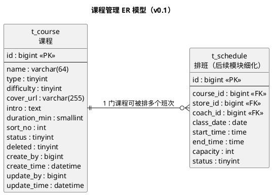

# 一水·瑜伽普拉提详细设计文档

**版本：v0.1**（2026-09-22，字段评审已通过）
**本版范围：管理端经营基础 —— 课程管理（第 1 章 数据架构 + 第 2 章 接口）**

> 本文按 `docs/模板/详细设计模板.md` 的章节组织：1 数据架构 / 2 接口 / 3 开发架构 / 4 运行流程 / 5 测试用例设计 / 6 日志设计。
> 其中第 2 章「接口」按 `docs/模板/接口设计模板.md` 的格式编写（每个接口给出方法、路径、请求参数、请求/返回示例、返回结果表与数据模型）。
> **本版交付第 1 章「数据架构」与第 2 章「接口」中「课程管理」这一部分。字段已于 2026-09-22 评审确认（结论见 1.4），第 3 章及后续章节继续编写。**

**上游依据**

| 文档 | 版本 | 本版引用内容 |
|---|---|---|
| `docs/需求分析/需求分析.md` | v0.2 | 课程领域对象、E12 课程分类（本版已在 1.2.2 确认）、3.3 待确认汇总 |
| `docs/概要设计/概要设计.md` | v0.1 | 排班承载课程场次、课程与排班的逻辑职责 |
| `docs/需求文档/管理端/管理端功能清单.md` | v1 | 查询课程 / 新增课程 / 修改课程 / 设置课程状态 |
| `docs/需求文档/管理端/管理端页面结构图.md` | 草稿 | 课程列表与课程详情的字段清单 |
| `docs/产品分析/页面与跳转梳理.md` | v2.1 | §3.5 S2/S10 课程类型实测取值、§6.1 A1 |

**标记口径**（沿用需求分析与概要设计）：

| 标记 | 含义 |
|---|---|
| **已确认事实** | 功能清单已列出，或现有小程序已实测 |
| **建议方案** | 为形成可落地的设计而提出，确认后才能进入开发 |
| **TODO-待确认** | 资料未明确，不应据此直接开发 |

---

# 1、数据架构

## 1.1 数据库ER模型

### 1.1.1 建模口径（全局约定）

以下约定一次定好、后续所有模块复用。2026-09-22 已逐项评审，结论见「说明」列。

| 项 | 本版约定 | 说明 |
|---|---|---|
| 数据库 | MySQL 8.0 | 技术栈已确认：Java + Spring Boot + MyBatis-Plus + MySQL |
| 存储引擎 / 字符集 | InnoDB / `utf8mb4` / `utf8mb4_general_ci` | 建议方案；课程名称、教练姓名等含中文与 emoji 风险 |
| 表命名 | `t_` + 业务名，全小写下划线（`t_course`） | **已确认**（2026-09-22 Q1） |
| 主键 | `id` `bigint unsigned`，**雪花ID**，由 MyBatis-Plus 的 `IdType.ASSIGN_ID` 在应用侧生成，不使用数据库自增 | **已确认**（2026-09-22 Q2）：主键由 MyBatis-Plus 框架提供 |
| 主键与前端 | 主键是 64 位整数，**接口返回给前端时必须序列化成字符串** | 小程序 JS 的 `Number` 只有 53 位精度，直接返回数字会丢精度；Jackson 需配置 Long → String |
| 逻辑删除 | 统一 `deleted` `tinyint`，0 正常 / 1 已删除，用 MyBatis-Plus `@TableLogic` 标注 | **建议方案**：课程会被排班与预约引用，不允许物理删除；但「停用」与「删除」是两件事，业务上优先用 `status` |
| 审计字段 | `create_by` / `create_time` / `update_by` / `update_time`，由 MyBatis-Plus `MetaObjectHandler` 自动填充，数据库 `DEFAULT CURRENT_TIMESTAMP` 兜底 | 建议方案；管理端操作需要留痕（管理端 RBAC 尚未确认，见需求分析 E09） |
| 时间类型 | `datetime`，不用 `timestamp` | 建议方案；避免 2038 问题与隐式时区转换 |
| 状态字段 | `tinyint` + 代码内枚举常量，不用数据库 `enum` | 建议方案；加值不需要改表 |
| 金额字段 | `decimal(10,2)` | 本版无金额字段，先记约定 |
| Java 包名 | `com.techplant.yoga.<模块>`（本版 `com.techplant.yoga.course`） | **已确认**（2026-09-22 Q3） |
| 分层 | `controller` / `service` / `dao` / `mapper` / `domain`(DO) / `dto` / `vo` / `query` | 按详细设计模板的分层口径 |
| ORM | MyBatis-Plus（`BaseMapper` / `IService`；复杂查询写 XML mapper） | **已确认**（2026-09-22 Q2）：主键生成与逻辑删除均用框架能力 |

> **说明：** 本版字段一律**可溯源**（见 1.2.1 的「依据」列）：要么直接来自上游文档，要么是 2026-09-22 评审拍板补充的（`duration_min`、`sort_no`）。除此之外的字段一律不加，避免凭空发明需求。

### 1.1.2 本版范围与表清单

经营基础模块（管理端）按功能清单应包含**门店、课程、排班、教练、预约、用户**六组数据。本版只细化**课程**，其余仅登记表名与规划状态，避免 ER 图空洞。

| 表名 | 中文名 | 所属 | 本版状态 |
|---|---|---|---|
| `t_course` | 课程 | 经营基础 | **本版细化** |
| `t_store` | 门店 | 经营基础 | 后续模块细化（仅登记） |
| `t_coach` | 教练 | 经营基础 | 后续模块细化（仅登记） |
| `t_schedule` | 排班 | 经营基础 | 后续模块细化（本版仅画引用关系） |
| `t_booking` | 预约 | 经营基础 | 后续模块细化（仅登记） |
| `t_user` | 用户 | 用户与账号 | 后续模块细化（仅登记） |
| `t_trial_apply` | 体验课申请 | 体验与会员权益 | 后续模块细化（仅登记） |
| `t_course_image` | 课程图片 | 经营基础 | 本版不建（Q10 已确认：课程单图即可） |

> **已确认**（2026-09-22 Q0）：本版 ER 只细化「课程」，门店与教练留到各自的模块。

### 1.1.3 ER 模型图

**已确认事实：** 课程是独立的课程基础信息；排班承载具体上课时间、门店、教练、场地和人数（概要设计 §3.3.3、需求分析 §3.1）。



> ER 图用 PlantUML 表达（等价于 PowerDesigner 的 ER 模型，纯文本、可 diff、本地可渲染）。若需要交付 PowerDesigner `.pdm`，请告知。

### 1.1.4 实体与关系说明

| 实体 | 说明 | 与其他实体的关系 |
|---|---|---|
| 课程 `t_course` | 课程的基础信息（名称、类型、难度、介绍、图片、状态） | 1 : N 排班 |
| 排班 `t_schedule` | 课程的具体场次，承载门店、教练、时间、场地、人数 | N : 1 课程；N : 1 门店；N : 1 教练 |

**建议方案：** 课程本身**不挂门店**，即课程是全局共享的主数据，门店之间的差异由「排班」体现。
**依据：** 页面与跳转梳理 A1「所有门店品类能力一致，只是数据配置不同；其他门店可能有团课数据，当前门店没有」；用户端「按门店、日期、课程类型查询课程」实际查的是排班场次（需求分析 §2.3.1）。
**已确认**（2026-09-22 Q4）：课程全局共享、**不挂门店**，因此不建 `t_course_store`。若后续业务改为按门店配置课程，需要补关联表并调整课程接口。

**已确认事实：** 「设置课程状态」控制课程是否可继续用于排班或展示（管理端功能清单）。因此课程状态是**排班与前端展示的共同开关**。

---

## 1.2 数据库逻辑模型

### 1.2.1 `t_course` 课程表

| 字段 | 中文名 | 逻辑类型 | 必填 | 默认值 | 说明 | 依据 |
|---|---|---|---|:--:|---|---|
| `id` | 课程ID | 长整型 | 是 | 雪花ID | 主键，应用侧生成 | 建模口径（MyBatis-Plus `ASSIGN_ID`） |
| `name` | 课程名称 | 字符串(64) | 是 | — | 课程展示名称 | 功能清单「修改课程名称」；页面结构图课程详情 |
| `type` | 课程类型 | 整型 | 是 | — | 1 团课 / 2 精品课 / 3 私教课 / 4 特色课 | 页面与跳转梳理 S2·S10 实测；页面结构图「课程类型」 |
| `difficulty` | 课程难度 | 整型 | 是 | 1 | 1~5 星（1 最低、5 最高） | 页面结构图「课程难度」；取值 **已确认**（2026-09-22 Q6） |
| `cover_url` | 课程封面图 | 字符串(255) | 否 | NULL | 列表与详情的主图 URL | 页面结构图课程详情「课程图片」 |
| `intro` | 课程介绍 | 长文本 | 否 | NULL | 课程详情正文 | 功能清单「修改课程介绍」 |
| `duration_min` | 单节时长 | 整型 | 否 | NULL | 单位：分钟 | **已确认**（2026-09-22 Q7）：上游未列，本版补充 |
| `sort_no` | 展示排序 | 整型 | 是 | 0 | 值越小越靠前 | **已确认**（2026-09-22 Q8）：上游未列，本版补充 |
| `status` | 课程状态 | 整型 | 是 | 1 | 1 启用 / 0 停用 | 功能清单「设置课程状态」 |
| `deleted` | 逻辑删除 | 整型 | 是 | 0 | 0 正常 / 1 已删除 | 建模口径 |
| `create_by` | 创建人 | 长整型 | 否 | NULL | 管理端操作人ID | 建模口径 |
| `create_time` | 创建时间 | 日期时间 | 是 | 当前时间 | — | 建模口径 |
| `update_by` | 更新人 | 长整型 | 否 | NULL | 管理端操作人ID | 建模口径 |
| `update_time` | 更新时间 | 日期时间 | 是 | 当前时间 | 更新时自动刷新 | 建模口径 |

> **本版不建的字段（上游无依据，不发明需求）：** 课程价格、适用门店、适用人数、课程编码、推荐/热门标记、上架时间、教练关联。
> 其中「热门课程」「金牌教练」在用户端首页存在，但**管理端功能清单里没有对应的配置功能**（需求分析 §1.2.3 未列出），因此不建字段；**Q9 已确认**：本期用户端「热门课程」直接按 `sort_no` 排序。

### 1.2.2 枚举值定义

| 枚举 | 取值 | 来源 |
|---|---|---|
| 课程类型 `type` | 1 团课、2 精品课、3 私教课、4 特色课 | 现有小程序实测（页面与跳转梳理 S2：团课/精品课/私教课/特色课） |
| 课程难度 `difficulty` | 1~5，对应 **1 星 ~ 5 星** | **已确认**（2026-09-22 Q6）；上游只给了字段名未给取值，本版定为星级 |
| 课程状态 `status` | 1 启用、0 停用 | 功能清单「控制课程是否可继续用于排班或展示」 |

**已确认**（2026-09-22 Q5）：课程分类**不含「体验课」**，按实测的 4 类建模。
**依据：** 用户端产品结构图把约课分类写成「团课、私教课、体验课、特色课」，而现有小程序实测是「团课、精品课、私教课、特色课」（需求分析 E12）；体验课走独立的申请审核流程，落在 `t_trial_apply`，不进课程分类。

---

## 1.3 数据库物理模型

### 1.3.1 建表语句（MySQL 8.0）

```sql
DROP TABLE IF EXISTS `t_course`;
CREATE TABLE `t_course` (
  `id`           bigint unsigned NOT NULL                          COMMENT '课程ID（雪花ID，应用侧生成）',
  `name`         varchar(64)     NOT NULL                          COMMENT '课程名称',
  `type`         tinyint         NOT NULL                          COMMENT '课程类型：1团课 2精品课 3私教课 4特色课',
  `difficulty`   tinyint         NOT NULL DEFAULT 1                COMMENT '课程难度：1~5 星',
  `cover_url`    varchar(255)             DEFAULT NULL             COMMENT '课程封面图URL',
  `intro`        text                                              COMMENT '课程介绍',
  `duration_min` smallint unsigned        DEFAULT NULL             COMMENT '单节时长（分钟）',
  `sort_no`      int             NOT NULL DEFAULT 0                COMMENT '展示排序，值越小越靠前',
  `status`       tinyint         NOT NULL DEFAULT 1                COMMENT '课程状态：1启用 0停用',
  `deleted`      tinyint         NOT NULL DEFAULT 0                COMMENT '逻辑删除：0正常 1已删除',
  `create_by`    bigint unsigned          DEFAULT NULL             COMMENT '创建人ID',
  `create_time`  datetime        NOT NULL DEFAULT CURRENT_TIMESTAMP COMMENT '创建时间',
  `update_by`    bigint unsigned          DEFAULT NULL             COMMENT '更新人ID',
  `update_time`  datetime        NOT NULL DEFAULT CURRENT_TIMESTAMP ON UPDATE CURRENT_TIMESTAMP COMMENT '更新时间',
  PRIMARY KEY (`id`),
  KEY `idx_type_status` (`type`, `status`),
  KEY `idx_name` (`name`)
) ENGINE=InnoDB DEFAULT CHARSET=utf8mb4 COLLATE=utf8mb4_general_ci COMMENT='课程基础信息表';
```

> ⚠️ **本段 DDL 未在 MySQL 实例上执行验证**（2026-09-22 决定跳过执行）：语法经人工核对，待开发环境就绪后再实际建表确认。
> 因为主键改为雪花ID，`id` 去掉了 `AUTO_INCREMENT`，插入时不传主键，由 MyBatis-Plus 生成。

### 1.3.2 索引设计

| 索引 | 字段 | 支撑的查询 |
|---|---|---|
| 主键 | `id` | 按ID查详情、更新、启停 |
| `idx_type_status` | `type`, `status` | 管理端课程列表按「课程类型 + 状态」筛选；用户端按类型取启用课程 |
| `idx_name` | `name` | 管理端按课程名称查询（前缀匹配可用；`%xx%` 模糊查询不生效） |

**建议方案：** 按详细设计模板的实践口径，**本阶段只给基础索引**；等 MyBatis-Plus 的 mapper SQL 写出来之后，再结合真实 SQL 复核索引，并在 code review 时请人专门 review 索引设计（涉及 `t_schedule`、`t_booking` 的联合查询时尤其需要）。

**说明：** `name` 不建唯一索引 —— 「流瑜伽」这类课程名可能在不同类型/难度下重复出现，唯一约束会误伤正常业务；是否需要禁止重名由 service 层业务校验决定。

---

## 1.4 字段确认结论（2026-09-22 评审）

本版 10 个待确认项已全部确认，**无遗留 TODO**，可以据此进入第 2 章接口设计。

| 编号 | 问题 | 评审结论 |
|---|---|---|
| Q0 | 本版 ER 细化范围 | 只细化「课程」，门店与教练留到各自模块 |
| Q1 | 表名前缀 | 采用 `t_` 前缀 |
| Q2 | 主键策略 | **雪花ID**，由 MyBatis-Plus 框架提供（`IdType.ASSIGN_ID`）；ORM 相应确定为 MyBatis-Plus |
| Q3 | 包名前缀 | 采用 `com.techplant.yoga` |
| Q4 | 课程与门店的关系 | 课程全局共享、不挂门店，门店差异由排班体现 |
| Q5 | 课程分类是否含体验课 | 不含，按实测 4 类（团课/精品课/私教课/特色课） |
| Q6 | 课程难度取值 | **1~5 星**（1 最低、5 最高） |
| Q7 | 是否要「单节时长」 | 要，`duration_min`（分钟） |
| Q8 | 是否要「展示排序」 | 要，`sort_no`（值越小越靠前） |
| Q9 | 用户端「热门课程」排序 | 本期不建字段，按 `sort_no` 排序 |
| Q10 | 课程是否要多图 | 不需要，单图 `cover_url`；不建 `t_course_image` |

**衍生的两条实现约束**（由 Q2 雪花ID 直接推出，第 2、3 章必须遵守）：

1. **接口返回的 `id` 必须是字符串**：雪花ID 是 64 位整数，超出小程序 JS `Number` 的 53 位安全整数范围，直接返回数字会在前端丢精度。Jackson 需配置 Long → String 序列化。
2. **插入不传主键**：DDL 中 `id` 已去掉 `AUTO_INCREMENT`，由 MyBatis-Plus 在应用侧生成。

**未纳入本版、需要在后续模块确认的事项**（不改本版表结构）：课程价格与售卖方式、课程与教练的关联方式、用户端「热门课程」是否需要后台可配置。

---

# 2、接口

> **本章格式：** 按 `docs/模板/接口设计模板.md` 编写 —— 每个接口给出「请求参数表 → 返回示例 JSON → 返回结果表 → 返回数据结构表」，并在章末统一收一节「数据模型」。
> **章节编号：** 沿用 `docs/模板/详细设计模板.md` 的「2.1 模块 → 2.1.1 接口」层级，因此接口内部的「请求参数 / 返回示例 / 返回结果 / 返回数据结构」比模板降一级为 `####`。
> **接口范围：** 详细设计模板正文提到「面向前端的 controller 接口在本课程省略不写」——那是课程为进度做的取舍；本项目把**三端调用服务端的接口视为模块间交互**，因此接口写全。
> **关于模板开头的 YAML front-matter：** 接口设计模板顶部那段（`language_tabs`、`generator: "@tarslib/widdershins"`、8 种语言代码页签、oAuth2 定义）是 **Widdershins 生成器的配置**，不是接口内容本身。本文档是设计文档而非生成器输入，故不搬运；将来若要用 Widdershins 生成对外 API 站点，再按需补该段配置。认证一节已按本项目改写为 2.1.2。

## 2.1 通用约定

### 2.1.1 服务地址与环境

| 项 | 值 |
|---|---|
| 管理端接口前缀 | `/admin` |
| 用户端 / 教练端接口前缀 | `/api`、`/coach`（本版未涉及，在各自模块章节定义） |
| 本地开发地址 | `http://localhost:8080` |
| 测试 / 线上地址 | **TODO-待确认**（见 2.5） |

本版只涉及管理端接口，路径统一形如 `/admin/courses`。

### 2.1.2 认证

- HTTP Authentication, scheme: **bearer**
- 管理端接口均需携带登录态：`Authorization: Bearer <token>`

**TODO-待确认：** 令牌形态（JWT / Redis 会话）、有效期与刷新机制，依赖「账号与登录认证」模块的详细设计，该模块尚未编写。本版只声明「需要管理端登录态」这一约束。
**TODO-待确认：** 管理端 RBAC 尚未确认（需求分析 E09）。本版接口按「登录即可调用」编写，**未细分角色权限**；待 E09 明确后再补权限矩阵。

### 2.1.3 统一响应结构

所有接口返回统一包裹（数据模型见 2.3.1）：

```json
{
  "code": 0,
  "message": "success",
  "data": {}
}
```

| 字段 | 说明 |
|---|---|
| `code` | 业务码，**0 表示成功**；失败时与 HTTP 状态码同值，见 2.4 |
| `message` | 提示信息，成功固定 `success` |
| `data` | 业务数据；无返回值时为 `null` |

**建议方案：** HTTP 状态码表达协议层结果，业务码与 HTTP 状态码**同值**（成功是唯一例外：HTTP 200 + `code` 0），前端只需判断一个字段。若团队习惯「永远返回 HTTP 200 + 业务码」，需要统一改，见 2.5。

### 2.1.4 分页约定

- 请求：`pageNum`（页码，从 1 开始，默认 1）、`pageSize`（每页条数，默认 10，最大 100）。
- 响应：`PageResult`（见 2.3.2），结构 `{ total, pageNum, pageSize, list }`。

**建议方案：** service 层把 MyBatis-Plus 的 `IPage` 转换成项目的 `PageResult`，**不直接把 `IPage` 暴露给前端**，避免框架结构泄漏进接口契约。

### 2.1.5 命名与序列化约定

| 项 | 约定 | 说明 |
|---|---|---|
| URL 风格 | 资源名词复数 + kebab-case | `/admin/courses` |
| JSON 字段 | lowerCamelCase | `coverUrl`、`durationMin` |
| **ID 序列化** | **64 位整数一律序列化为字符串** | 雪花ID 超出 JS `Number` 的 53 位安全范围，返回数字会丢精度（见 1.4） |
| 时间格式 | `yyyy-MM-dd HH:mm:ss` | **建议方案**，见 2.5 |
| 枚举 | 只返回 code，不返回翻译文案 | 类型/难度/状态的中文由前端按 1.2.2 的映射表展示，避免后端耦合展示层 |
| 请求体 | `application/json`，UTF-8 | — |

### 2.1.6 对象命名口径

对应详细设计模板第 2 章列出的对象词汇，本项目只用其中四种：

| 类型 | 本项目用法 | 本模块示例 |
|---|---|---|
| DO | 与表一一对应，在 `domain` 包，只在 mapper 与 service 之间传递 | `CourseDO` |
| DTO | service 的入参，controller 接收的请求体 | `CourseCreateDTO`、`CourseUpdateDTO`、`CourseStatusDTO` |
| Query | 复杂查询条件的载体 | `CourseQuery` |
| VO | 接口返回给前端的数据，controller 的出参 | `CourseListItemVO`、`CourseDetailVO` |
| PO / BO / AO | 本项目不使用 | — |

## 2.2 课程管理模块

对应管理端功能清单：查询课程 / 新增课程 / 修改课程 / 设置课程状态。

| # | 接口 | 对应功能 | 需要登录 |
|---|---|---|---|
| 1 | `GET /admin/courses` | 查询课程（列表） | 是 |
| 2 | `GET /admin/courses/{courseId}` | 查询课程（详情） | 是 |
| 3 | `POST /admin/courses` | 新增课程 | 是 |
| 4 | `PUT /admin/courses/{courseId}` | 修改课程 | 是 |
| 5 | `PUT /admin/courses/{courseId}/status` | 设置课程状态 | 是 |

> **没有删除接口：** 管理端功能清单只有查询/新增/修改/设置状态，**没有删除课程**，因此本模块不提供删除接口。表上的 `deleted` 逻辑删除字段仅用于数据留痕，不对管理端开放。
> **状态不走编辑表单：** 管理端页面结构图中课程列表的操作是「查看 / 编辑 / 启用停用」，设置状态是**独立的列表操作**，因此新增与修改接口的请求体都**不含 `status`**，状态变更只走接口 5。

### 2.2.1 查询课程列表

<a id="opIdlistCourses"></a>

`GET /admin/courses`

分页查询课程列表，支持按课程名称、课程类型、课程状态筛选，只返回未删除的课程。

#### 请求参数

|名称|位置|类型|必选|说明|
|---|---|---|---|---|
|name|query|string| 否 |课程名称，模糊匹配。|
|type|query|integer| 否 |课程类型，取值见下方枚举值。|
|status|query|integer| 否 |课程状态：1 启用、0 停用。不传表示不限状态。|
|pageNum|query|integer| 否 |页码，从 1 开始，默认 1。|
|pageSize|query|integer| 否 |每页条数，默认 10，最大 100。|

#### 枚举值

|属性|值|
|---|---|
|type|1|
|type|2|
|type|3|
|type|4|
|status|1|
|status|0|

> 返回示例

> 200 Response

```json
{
  "code": 0,
  "message": "success",
  "data": {
    "total": 2,
    "pageNum": 1,
    "pageSize": 10,
    "list": [
      {
        "id": "1856739201475235840",
        "name": "哈他瑜伽",
        "type": 1,
        "difficulty": 2,
        "coverUrl": "https://cdn.example.com/course/hata.jpg",
        "status": 1,
        "sortNo": 10,
        "createTime": "2026-09-20 10:12:33",
        "updateTime": "2026-09-21 09:03:11"
      },
      {
        "id": "1856739201475235841",
        "name": "流瑜伽",
        "type": 2,
        "difficulty": 3,
        "coverUrl": "https://cdn.example.com/course/vinyasa.jpg",
        "status": 0,
        "sortNo": 20,
        "createTime": "2026-09-20 10:15:02",
        "updateTime": "2026-09-22 08:41:07"
      }
    ]
  }
}
```

#### 返回结果

|状态码|状态码含义|说明|数据模型|
|---|---|---|---|
|200|[OK](https://tools.ietf.org/html/rfc7231#section-6.3.1)|查询成功|[ApiResponse](#schemaapiresponse)|
|400|[Bad Request](https://tools.ietf.org/html/rfc7231#section-6.5.1)|参数不合法（如 `type` 不在 1~4、`pageSize` 超过 100）|[ApiResponse](#schemaapiresponse)|
|401|[Unauthorized](https://tools.ietf.org/html/rfc7235#section-3.1)|未登录或登录态失效|[ApiResponse](#schemaapiresponse)|

#### 返回数据结构

状态码 **200**

|名称|类型|必选|约束|中文名|说明|
|---|---|---|---|---|---|
|code|integer|true|none||业务码，0 表示成功。|
|message|string|true|none||提示信息。|
|data|[PageResult](#schemapageresult)|true|none||分页结果。|
|» total|integer(int64)|true|none||符合条件的总记录数。|
|» pageNum|integer|true|none||当前页码。|
|» pageSize|integer|true|none||每页条数。|
|» list|[[CourseListItemVO](#schemacourselistitemvo)]|true|none||课程列表，字段见 2.3.3。|

### 2.2.2 查询课程详情

<a id="opIdgetCourse"></a>

`GET /admin/courses/{courseId}`

按课程ID查询课程详情，用于课程详情的「查看」与「编辑」回显。

#### 请求参数

|名称|位置|类型|必选|说明|
|---|---|---|---|---|
|courseId|path|string| 是 |课程ID（雪花ID 以字符串传递，见 2.1.5）。|

> 返回示例

> 200 Response

```json
{
  "code": 0,
  "message": "success",
  "data": {
    "id": "1856739201475235840",
    "name": "哈他瑜伽",
    "type": 1,
    "difficulty": 2,
    "coverUrl": "https://cdn.example.com/course/hata.jpg",
    "intro": "以体式与呼吸配合为主的经典课程，适合初学者建立基础。",
    "durationMin": 60,
    "sortNo": 10,
    "status": 1,
    "createTime": "2026-09-20 10:12:33",
    "updateTime": "2026-09-21 09:03:11"
  }
}
```

#### 返回结果

|状态码|状态码含义|说明|数据模型|
|---|---|---|---|
|200|[OK](https://tools.ietf.org/html/rfc7231#section-6.3.1)|查询成功|[ApiResponse](#schemaapiresponse)|
|401|[Unauthorized](https://tools.ietf.org/html/rfc7235#section-3.1)|未登录或登录态失效|[ApiResponse](#schemaapiresponse)|
|404|[Not Found](https://tools.ietf.org/html/rfc7231#section-6.5.4)|课程不存在或已被删除|[ApiResponse](#schemaapiresponse)|

#### 返回数据结构

状态码 **200**

|名称|类型|必选|约束|中文名|说明|
|---|---|---|---|---|---|
|code|integer|true|none||业务码，0 表示成功。|
|message|string|true|none||提示信息。|
|data|[CourseDetailVO](#schemacoursedetailvo)|true|none||课程详情，字段见 2.3.4。|

### 2.2.3 新增课程

<a id="opIdcreateCourse"></a>

`POST /admin/courses`

创建课程基础信息。请求体不含 `status`，新课程默认为**启用**；状态变更走 2.2.5。

> Body 请求参数

```json
{
  "name": "哈他瑜伽",
  "type": 1,
  "difficulty": 2,
  "coverUrl": "https://cdn.example.com/course/hata.jpg",
  "intro": "以体式与呼吸配合为主的经典课程，适合初学者建立基础。",
  "durationMin": 60,
  "sortNo": 10
}
```

#### 请求参数

|名称|位置|类型|必选|说明|
|---|---|---|---|---|
|body|body|[CourseCreateDTO](#schemacoursecreatedto)| 是 |课程信息，字段见 2.3.6。|

#### 枚举值

|属性|值|
|---|---|
|type|1|
|type|2|
|type|3|
|type|4|
|difficulty|1|
|difficulty|2|
|difficulty|3|
|difficulty|4|
|difficulty|5|

> 返回示例

> 200 Response

```json
{
  "code": 0,
  "message": "success",
  "data": {
    "id": "1856739201475235840"
  }
}
```

#### 返回结果

|状态码|状态码含义|说明|数据模型|
|---|---|---|---|
|200|[OK](https://tools.ietf.org/html/rfc7231#section-6.3.1)|新增成功，返回新课程ID。|[ApiResponse](#schemaapiresponse)|
|400|[Bad Request](https://tools.ietf.org/html/rfc7231#section-6.5.1)|参数校验失败（名称/类型/难度缺失或超范围）|[ApiResponse](#schemaapiresponse)|
|401|[Unauthorized](https://tools.ietf.org/html/rfc7235#section-3.1)|未登录或登录态失效|[ApiResponse](#schemaapiresponse)|

#### 返回数据结构

状态码 **200**

|名称|类型|必选|约束|中文名|说明|
|---|---|---|---|---|---|
|code|integer|true|none||业务码，0 表示成功。|
|message|string|true|none||提示信息。|
|data|object|true|none||新建课程的标识。|
|» id|string|true|none||课程ID（雪花ID，字符串）。|

> **建议方案：** 本接口**不做重名校验** —— `t_course.name` 上未建唯一索引（见 1.3.2），同名课程允许存在（同一课名可能在不同类型或难度下重复）。若业务要求禁止重名，需要在 service 层加校验并补充错误码，见 2.5。

### 2.2.4 修改课程

<a id="opIdupdateCourse"></a>

`PUT /admin/courses/{courseId}`

修改课程基础信息。请求体**不含 `status`**；修改「类型、难度」会同时影响该课程已排班次在用户端的展示，但不改变已有排班本身。

> Body 请求参数

```json
{
  "name": "哈他瑜伽（初级）",
  "type": 1,
  "difficulty": 2,
  "coverUrl": "https://cdn.example.com/course/hata.jpg",
  "intro": "以体式与呼吸配合为主的经典课程，适合初学者建立基础。",
  "durationMin": 75,
  "sortNo": 10
}
```

#### 请求参数

|名称|位置|类型|必选|说明|
|---|---|---|---|---|
|courseId|path|string| 是 |课程ID（字符串）。|
|body|body|[CourseUpdateDTO](#schemacourseupdatedto)| 是 |课程信息，字段见 2.3.7。|

> 返回示例

> 200 Response

```json
{
  "code": 0,
  "message": "success",
  "data": {
    "id": "1856739201475235840",
    "name": "哈他瑜伽（初级）",
    "type": 1,
    "difficulty": 2,
    "coverUrl": "https://cdn.example.com/course/hata.jpg",
    "intro": "以体式与呼吸配合为主的经典课程，适合初学者建立基础。",
    "durationMin": 75,
    "sortNo": 10,
    "status": 1,
    "createTime": "2026-09-20 10:12:33",
    "updateTime": "2026-09-22 14:20:05"
  }
}
```

#### 返回结果

|状态码|状态码含义|说明|数据模型|
|---|---|---|---|
|200|[OK](https://tools.ietf.org/html/rfc7231#section-6.3.1)|修改成功，返回更新后的课程详情。|[ApiResponse](#schemaapiresponse)|
|400|[Bad Request](https://tools.ietf.org/html/rfc7231#section-6.5.1)|参数校验失败|[ApiResponse](#schemaapiresponse)|
|401|[Unauthorized](https://tools.ietf.org/html/rfc7235#section-3.1)|未登录或登录态失效|[ApiResponse](#schemaapiresponse)|
|404|[Not Found](https://tools.ietf.org/html/rfc7231#section-6.5.4)|课程不存在或已被删除|[ApiResponse](#schemaapiresponse)|

#### 返回数据结构

状态码 **200**

|名称|类型|必选|约束|中文名|说明|
|---|---|---|---|---|---|
|code|integer|true|none||业务码，0 表示成功。|
|message|string|true|none||提示信息。|
|data|[CourseDetailVO](#schemacoursedetailvo)|true|none||更新后的课程详情，字段见 2.3.4。|

### 2.2.5 设置课程状态

<a id="opIdupdateCourseStatus"></a>

`PUT /admin/courses/{courseId}/status`

启用或停用课程。幂等：重复设置同一状态返回成功。

> Body 请求参数

```json
{
  "status": 0
}
```

#### 请求参数

|名称|位置|类型|必选|说明|
|---|---|---|---|---|
|courseId|path|string| 是 |课程ID（字符串）。|
|body|body|[CourseStatusDTO](#schemacoursestatusdto)| 是 |目标状态，字段见 2.3.8。|

#### 枚举值

|属性|值|
|---|---|
|status|1|
|status|0|

> 返回示例

> 200 Response

```json
{
  "code": 0,
  "message": "success",
  "data": null
}
```

#### 返回结果

|状态码|状态码含义|说明|数据模型|
|---|---|---|---|
|200|[OK](https://tools.ietf.org/html/rfc7231#section-6.3.1)|设置成功。|[ApiResponse](#schemaapiresponse)|
|400|[Bad Request](https://tools.ietf.org/html/rfc7231#section-6.5.1)|`status` 取值不是 0 或 1|[ApiResponse](#schemaapiresponse)|
|401|[Unauthorized](https://tools.ietf.org/html/rfc7235#section-3.1)|未登录或登录态失效|[ApiResponse](#schemaapiresponse)|
|404|[Not Found](https://tools.ietf.org/html/rfc7231#section-6.5.4)|课程不存在或已被删除|[ApiResponse](#schemaapiresponse)|

#### 返回数据结构

状态码 **200**

|名称|类型|必选|约束|中文名|说明|
|---|---|---|---|---|---|
|code|integer|true|none||业务码，0 表示成功。|
|message|string|true|none||提示信息。|
|data|null|true|none||无返回数据。|

> **已确认事实：** 课程状态控制课程**是否可继续用于排班或展示**（管理端功能清单）。
> **建议方案：** 本接口只改课程状态，**不联动已存在的排班与预约**；停用后该课程不能再被排新的班次，也不再出现在用户端。
> **TODO-待确认：** 停用课程时，已有的未完成排班与用户预约如何处理（自动取消？是否通知用户？）—— 属于概要设计 §3.5 阻断项 2「排班修改或取消对已有预约、会员资产及通知的处理规则」，需产品确认后再补联动逻辑。

## 2.3 数据模型

### 2.3.1 ApiResponse

<a id="schemaapiresponse"></a>

```json
{
  "code": 0,
  "message": "success",
  "data": null
}
```

统一响应结构，所有接口共用。

#### 属性

|名称|类型|必选|约束|中文名|说明|
|---|---|---|---|---|---|
|code|integer|true|none||业务码，0 表示成功；失败时与 HTTP 状态码同值，见 2.4。|
|message|string|true|none||提示信息，成功固定 `success`。|
|data|object|false|none||业务数据，结构随接口而定；无返回值时为 `null`。|

### 2.3.2 PageResult

<a id="schemapageresult"></a>

```json
{
  "total": 42,
  "pageNum": 1,
  "pageSize": 10,
  "list": []
}
```

分页结果结构。

#### 属性

|名称|类型|必选|约束|中文名|说明|
|---|---|---|---|---|---|
|total|integer(int64)|true|none||符合条件的总记录数。|
|pageNum|integer|true|none||当前页码，从 1 开始。|
|pageSize|integer|true|none||每页条数。|
|list|[[CourseListItemVO](#schemacourselistitemvo)]|true|none||当前页数据，元素结构随接口而定。|

### 2.3.3 CourseListItemVO

<a id="schemacourselistitemvo"></a>

```json
{
  "id": "1856739201475235840",
  "name": "哈他瑜伽",
  "type": 1,
  "difficulty": 2,
  "coverUrl": "https://cdn.example.com/course/hata.jpg",
  "status": 1,
  "sortNo": 10,
  "createTime": "2026-09-20 10:12:33",
  "updateTime": "2026-09-21 09:03:11"
}
```

课程列表项。列表页展示的字段与课程详情不同（不含 `intro`、`durationMin`），避免列表接口返回大字段。

#### 属性

|名称|类型|必选|约束|中文名|说明|
|---|---|---|---|---|---|
|id|string|true|none||课程ID（雪花ID，字符串）。|
|name|string|true|maxLength 64||课程名称。|
|type|integer|true|none||课程类型：1 团课、2 精品课、3 私教课、4 特色课。|
|difficulty|integer|true|none||课程难度：1~5 星。|
|coverUrl|string|false|none||课程封面图 URL。|
|status|integer|true|none||课程状态：1 启用、0 停用。|
|sortNo|integer|true|none||展示排序，值越小越靠前。|
|createTime|string|true|none||创建时间。|
|updateTime|string|true|none||更新时间。|

### 2.3.4 CourseDetailVO

<a id="schemacoursedetailvo"></a>

```json
{
  "id": "1856739201475235840",
  "name": "哈他瑜伽",
  "type": 1,
  "difficulty": 2,
  "coverUrl": "https://cdn.example.com/course/hata.jpg",
  "intro": "以体式与呼吸配合为主的经典课程，适合初学者建立基础。",
  "durationMin": 60,
  "sortNo": 10,
  "status": 1,
  "createTime": "2026-09-20 10:12:33",
  "updateTime": "2026-09-21 09:03:11"
}
```

课程详情，用于详情查看与编辑回显。

#### 属性

|名称|类型|必选|约束|中文名|说明|
|---|---|---|---|---|---|
|id|string|true|none||课程ID（雪花ID，字符串）。|
|name|string|true|maxLength 64||课程名称。|
|type|integer|true|none||课程类型：1 团课、2 精品课、3 私教课、4 特色课。|
|difficulty|integer|true|none||课程难度：1~5 星。|
|coverUrl|string|false|none||课程封面图 URL。|
|intro|string|false|none||课程介绍。|
|durationMin|integer|false|none||单节时长（分钟）。|
|sortNo|integer|true|none||展示排序，值越小越靠前。|
|status|integer|true|none||课程状态：1 启用、0 停用。|
|createTime|string|true|none||创建时间。|
|updateTime|string|true|none||更新时间。|

> **说明：** `create_by` / `update_by` **不返回**给前端 —— 管理端页面结构图的课程详情中没有这两个字段，它们只用于数据留痕（见 1.2.1）。

### 2.3.5 CourseQuery

<a id="schemacoursequery"></a>

```json
{
  "name": "瑜伽",
  "type": 1,
  "status": 1,
  "pageNum": 1,
  "pageSize": 10
}
```

课程列表查询条件对象（对应 2.1.6 的 Query 类型），由 controller 接收 query string 后装配。

#### 属性

|名称|类型|必选|约束|中文名|说明|
|---|---|---|---|---|---|
|name|string|false|maxLength 64||课程名称，模糊匹配。|
|type|integer|false|none||课程类型，1~4。|
|status|integer|false|none||课程状态：1 启用、0 停用；不传不限。|
|pageNum|integer|false|min 1||页码，默认 1。|
|pageSize|integer|false|min 1, max 100||每页条数，默认 10。|

### 2.3.6 CourseCreateDTO

<a id="schemacoursecreatedto"></a>

```json
{
  "name": "哈他瑜伽",
  "type": 1,
  "difficulty": 2,
  "coverUrl": "https://cdn.example.com/course/hata.jpg",
  "intro": "以体式与呼吸配合为主的经典课程，适合初学者建立基础。",
  "durationMin": 60,
  "sortNo": 10
}
```

新增课程的请求体。**不含 `status`**，新课程固定为启用。

#### 属性

|名称|类型|必选|约束|中文名|说明|
|---|---|---|---|---|---|
|name|string|true|maxLength 64||课程名称。|
|type|integer|true|none||课程类型：1 团课、2 精品课、3 私教课、4 特色课。|
|difficulty|integer|true|min 1, max 5||课程难度（星）。|
|coverUrl|string|false|maxLength 255||课程封面图 URL。|
|intro|string|false|none||课程介绍。|
|durationMin|integer|false|min 1||单节时长（分钟）。|
|sortNo|integer|false|min 0||展示排序，不传按 0 处理。|

### 2.3.7 CourseUpdateDTO

<a id="schemacourseupdatedto"></a>

```json
{
  "name": "哈他瑜伽（初级）",
  "type": 1,
  "difficulty": 2,
  "coverUrl": "https://cdn.example.com/course/hata.jpg",
  "intro": "以体式与呼吸配合为主的经典课程，适合初学者建立基础。",
  "durationMin": 75,
  "sortNo": 10
}
```

修改课程的请求体，字段与 CourseCreateDTO 一致（PUT 全量提交），**同样不含 `status`**。

#### 属性

|名称|类型|必选|约束|中文名|说明|
|---|---|---|---|---|---|
|name|string|true|maxLength 64||课程名称。|
|type|integer|true|none||课程类型：1 团课、2 精品课、3 私教课、4 特色课。|
|difficulty|integer|true|min 1, max 5||课程难度（星）。|
|coverUrl|string|false|maxLength 255||课程封面图 URL；传 `null` 表示清空。|
|intro|string|false|none||课程介绍；传 `null` 表示清空。|
|durationMin|integer|false|min 1||单节时长（分钟）；传 `null` 表示清空。|
|sortNo|integer|false|min 0||展示排序。|

### 2.3.8 CourseStatusDTO

<a id="schemacoursestatusdto"></a>

```json
{
  "status": 0
}
```

设置课程状态的请求体。

#### 属性

|名称|类型|必选|约束|中文名|说明|
|---|---|---|---|---|---|
|status|integer|true|none||目标状态：1 启用、0 停用。|

#### 枚举值

|属性|值|
|---|---|
|status|1|
|status|0|

## 2.4 错误码

**建议方案：** 业务码与 HTTP 状态码同值，前端只判断一个字段。

| HTTP | code | 含义 | 说明 |
|---|---|---|---|
| 200 | 0 | 成功 | 唯一与 HTTP 状态码不同的取值 |
| 400 | 400 | 参数校验失败 | 由 `@Valid` 统一拦截，`message` 给出具体字段 |
| 401 | 401 | 未登录 / 登录态失效 | 依赖账号模块，见 2.1.2 |
| 403 | 403 | 无权限 | RBAC 未确认（E09），本版暂不返回 |
| 404 | 404 | 资源不存在 | 本模块用于「课程不存在或已删除」 |
| 500 | 500 | 系统异常 | 统一兜底，不向前端暴露堆栈 |

## 2.5 接口级待确认清单

| 编号 | 待确认 | 建议默认 | 影响面 |
|---|---|---|---|
| A1 | 测试 / 线上环境的 Base URL | 本地 `http://localhost:8080`，其余待定 | 前端联调配置 |
| A2 | 管理端令牌形态与有效期 | JWT，2 小时 | 依赖账号模块；影响全部接口 |
| A3 | 失败时是否也用 HTTP 200 + 业务码 | 用真实 HTTP 状态码 | 全部接口的错误处理 |
| A4 | 时间返回格式 | `yyyy-MM-dd HH:mm:ss` | 全部含时间的接口 |
| A5 | 课程是否禁止重名 | 不禁止 | 需在 2.2.3 增加校验与错误码 |
| A6 | 停用课程是否联动已有排班与预约 | 不联动，仅置状态 | 影响 2.2.5；属概要设计 §3.5 阻断项 |

---

# 附录 · 后续章节计划

> 本附录列出本文档尚未编写的章节与依赖关系，不随章节编号增长而变动。

| 章节 | 内容 | 依赖 |
|---|---|---|
| 3 开发架构 | 实现类图 + 包设计（`com.techplant.yoga.course.*`） | 第1、2章（已确认） |
| 4 运行流程 | 课程新增/修改/启停的活动图；纯 CRUD 部分按模板用文字说明 | 第2、3章 |
| 5 测试用例设计 | 单元测试 + 冒烟测试用例 | 第2、3、4章 |
| 6 日志设计 | 课程管理操作的日志埋点 | 第2章 |
