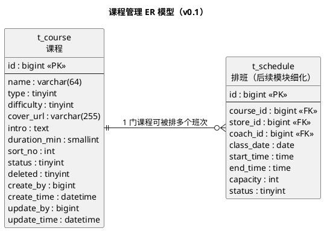
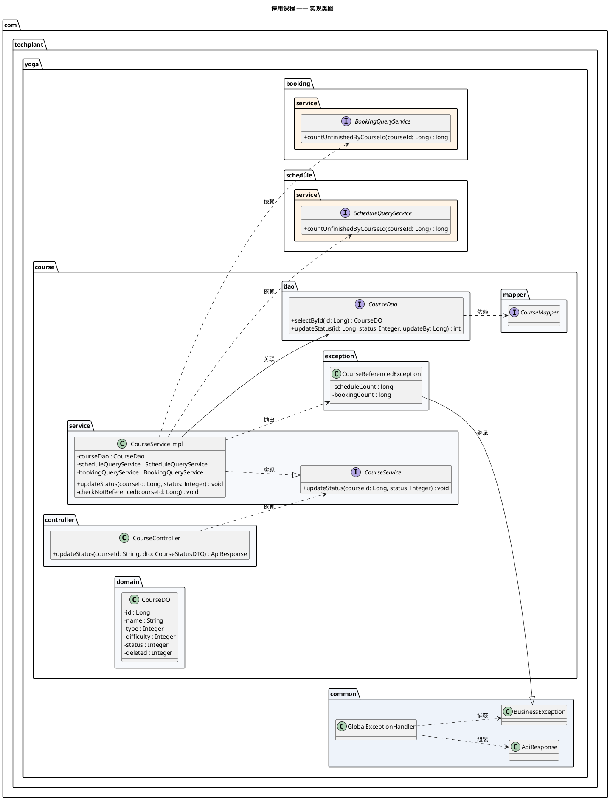
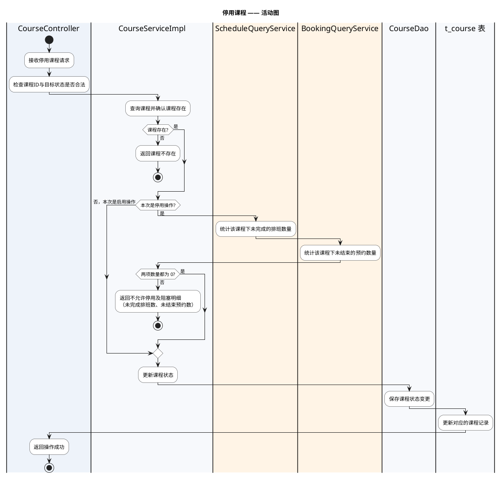
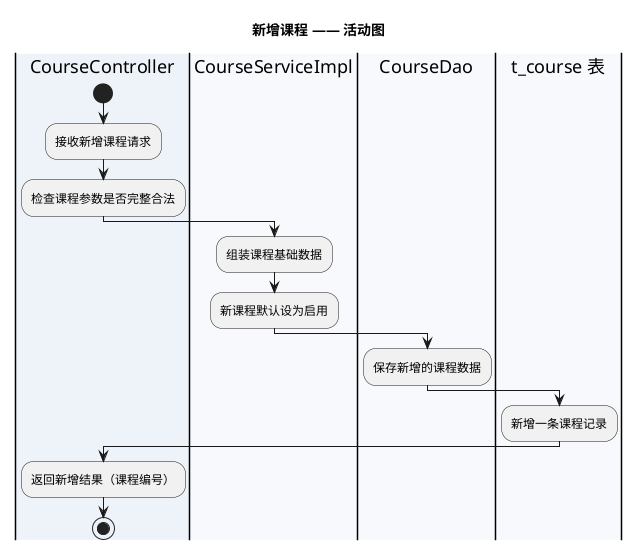

# 一水·瑜伽普拉提详细设计文档

**版本：v0.1**（2026-09-22，字段评审已通过）
**本版范围：管理端经营基础 —— 课程管理（第 1~5 章：数据架构 / 接口 / 开发架构 / 运行流程 / 测试用例设计）**

> 本文按 `docs/模板/详细设计模板.md` 的章节组织：1 数据架构 / 2 接口 / 3 开发架构 / 4 运行流程 / 5 测试用例设计 / 6 日志设计。
> 其中第 2 章「接口」按 `docs/模板/接口设计模板.md` 的格式编写（每个接口给出方法、路径、请求参数、请求/返回示例、返回结果表与数据模型）。
> **本版交付第 1~5 章中「课程管理」这一部分。字段已于 2026-09-22 评审确认（结论见 1.4），第 6 章继续编写。**
> **过程记录：** 评审意见与设计决策的变更见同目录 `详细设计记录.md`。

**上游依据**

| 文档 | 版本 | 本版引用内容 |
|---|---|---|
| `docs/需求分析/需求分析.md` | v0.2 | 课程领域对象、E12 课程分类（本版已在 1.2.2 确认）、3.3 待确认汇总 |
| `docs/概要设计/概要设计.md` | v0.1 | 排班承载课程场次、课程与排班的逻辑职责 |
| `docs/需求文档/管理端/管理端功能清单.md` | v1 | 查询课程 / 新增课程 / 修改课程 / 设置课程状态 |
| `docs/需求文档/管理端/管理端页面结构图.md` | 草稿 | 课程列表与课程详情的字段清单 |
| `docs/产品分析/页面与跳转梳理.md` | v2.1 | §3.5 S2/S10 课程类型实测取值、§6.1 A1 |

**标记口径**（沿用需求分析与概要设计）：

| 标记 | 含义 |
|---|---|
| **已确认事实** | 功能清单已列出，或现有小程序已实测 |
| **建议方案** | 为形成可落地的设计而提出，确认后才能进入开发 |
| **TODO-待确认** | 资料未明确，不应据此直接开发 |

---

# 1、数据架构

## 1.1 数据库ER模型

### 1.1.1 建模口径（全局约定）

以下约定一次定好、后续所有模块复用。2026-09-22 已逐项评审，结论见「说明」列。

| 项 | 本版约定 | 说明 |
|---|---|---|
| 数据库 | MySQL 8.0 | 技术栈已确认：Java + Spring Boot + MyBatis-Plus + MySQL |
| 存储引擎 / 字符集 | InnoDB / `utf8mb4` / `utf8mb4_general_ci` | 建议方案；课程名称、教练姓名等含中文与 emoji 风险 |
| 表命名 | `t_` + 业务名，全小写下划线（`t_course`） | **已确认**（2026-09-22 Q1） |
| 主键 | `id` `bigint unsigned`，**雪花ID**，由 MyBatis-Plus 的 `IdType.ASSIGN_ID` 在应用侧生成，不使用数据库自增 | **已确认**（2026-09-22 Q2）：主键由 MyBatis-Plus 框架提供 |
| 主键与前端 | 主键是 64 位整数，**接口返回给前端时必须序列化成字符串** | 小程序 JS 的 `Number` 只有 53 位精度，直接返回数字会丢精度；Jackson 需配置 Long → String |
| 逻辑删除 | 统一 `deleted` `tinyint`，0 正常 / 1 已删除，用 MyBatis-Plus `@TableLogic` 标注 | **建议方案**：课程会被排班与预约引用，不允许物理删除；但「停用」与「删除」是两件事，业务上优先用 `status` |
| 审计字段 | `create_by` / `create_time` / `update_by` / `update_time`，由 MyBatis-Plus `MetaObjectHandler` 自动填充，数据库 `DEFAULT CURRENT_TIMESTAMP` 兜底 | 建议方案；管理端操作需要留痕（管理端 RBAC 尚未确认，见需求分析 E09） |
| 时间类型 | `datetime`，不用 `timestamp` | 建议方案；避免 2038 问题与隐式时区转换 |
| 状态字段 | `tinyint` + 代码内枚举常量，不用数据库 `enum` | 建议方案；加值不需要改表 |
| 金额字段 | `decimal(10,2)` | 本版无金额字段，先记约定 |
| Java 包名 | `com.techplant.yoga.<模块>`（本版 `com.techplant.yoga.course`） | **已确认**（2026-09-22 Q3） |
| 分层 | `controller` / `service` / `dao` / `mapper` / `domain`(DO) / `dto` / `vo` / `query` | 按详细设计模板的分层口径 |
| ORM | MyBatis-Plus（`BaseMapper` / `IService`；复杂查询写 XML mapper） | **已确认**（2026-09-22 Q2）：主键生成与逻辑删除均用框架能力 |

> **说明：** 本版字段一律**可溯源**（见 1.2.1 的「依据」列）：要么直接来自上游文档，要么是 2026-09-22 评审拍板补充的（`duration_min`、`sort_no`）。除此之外的字段一律不加，避免凭空发明需求。

### 1.1.2 本版范围与表清单

经营基础模块（管理端）按功能清单应包含**门店、课程、排班、教练、预约、用户**六组数据。本版只细化**课程**，其余仅登记表名与规划状态，避免 ER 图空洞。

| 表名 | 中文名 | 所属 | 本版状态 |
|---|---|---|---|
| `t_course` | 课程 | 经营基础 | **本版细化** |
| `t_store` | 门店 | 经营基础 | 后续模块细化（仅登记） |
| `t_coach` | 教练 | 经营基础 | 后续模块细化（仅登记） |
| `t_schedule` | 排班 | 经营基础 | 后续模块细化（本版仅画引用关系） |
| `t_booking` | 预约 | 经营基础 | 后续模块细化（仅登记） |
| `t_user` | 用户 | 用户与账号 | 后续模块细化（仅登记） |
| `t_trial_apply` | 体验课申请 | 体验与会员权益 | 后续模块细化（仅登记） |
| `t_course_image` | 课程图片 | 经营基础 | 本版不建（Q10 已确认：课程单图即可） |

> **已确认**（2026-09-22 Q0）：本版 ER 只细化「课程」，门店与教练留到各自的模块。

### 1.1.3 ER 模型图

**已确认事实：** 课程是独立的课程基础信息；排班承载具体上课时间、门店、教练、场地和人数（概要设计 §3.3.3、需求分析 §3.1）。



> ER 图用 PlantUML 表达（等价于 PowerDesigner 的 ER 模型，纯文本、可 diff、本地可渲染）。若需要交付 PowerDesigner `.pdm`，请告知。

### 1.1.4 实体与关系说明

| 实体 | 说明 | 与其他实体的关系 |
|---|---|---|
| 课程 `t_course` | 课程的基础信息（名称、类型、难度、介绍、图片、状态） | 1 : N 排班 |
| 排班 `t_schedule` | 课程的具体场次，承载门店、教练、时间、场地、人数 | N : 1 课程；N : 1 门店；N : 1 教练 |

**建议方案：** 课程本身**不挂门店**，即课程是全局共享的主数据，门店之间的差异由「排班」体现。
**依据：** 页面与跳转梳理 A1「所有门店品类能力一致，只是数据配置不同；其他门店可能有团课数据，当前门店没有」；用户端「按门店、日期、课程类型查询课程」实际查的是排班场次（需求分析 §2.3.1）。
**已确认**（2026-09-22 Q4）：课程全局共享、**不挂门店**，因此不建 `t_course_store`。若后续业务改为按门店配置课程，需要补关联表并调整课程接口。

**已确认事实：** 「设置课程状态」控制课程是否可继续用于排班或展示（管理端功能清单）。因此课程状态是**排班与前端展示的共同开关**。

---

## 1.2 数据库逻辑模型

### 1.2.1 `t_course` 课程表

| 字段 | 中文名 | 逻辑类型 | 必填 | 默认值 | 说明 | 依据 |
|---|---|---|---|:--:|---|---|
| `id` | 课程ID | 长整型 | 是 | 雪花ID | 主键，应用侧生成 | 建模口径（MyBatis-Plus `ASSIGN_ID`） |
| `name` | 课程名称 | 字符串(64) | 是 | — | 课程展示名称 | 功能清单「修改课程名称」；页面结构图课程详情 |
| `type` | 课程类型 | 整型 | 是 | — | 1 团课 / 2 精品课 / 3 私教课 / 4 特色课 | 页面与跳转梳理 S2·S10 实测；页面结构图「课程类型」 |
| `difficulty` | 课程难度 | 整型 | 是 | 1 | 1~5 星（1 最低、5 最高） | 页面结构图「课程难度」；取值 **已确认**（2026-09-22 Q6） |
| `cover_url` | 课程封面图 | 字符串(255) | 否 | NULL | 列表与详情的主图 URL | 页面结构图课程详情「课程图片」 |
| `intro` | 课程介绍 | 长文本 | 否 | NULL | 课程详情正文 | 功能清单「修改课程介绍」 |
| `duration_min` | 单节时长 | 整型 | 否 | NULL | 单位：分钟 | **已确认**（2026-09-22 Q7）：上游未列，本版补充 |
| `sort_no` | 展示排序 | 整型 | 是 | 0 | 值越小越靠前 | **已确认**（2026-09-22 Q8）：上游未列，本版补充 |
| `status` | 课程状态 | 整型 | 是 | 1 | 1 启用 / 0 停用 | 功能清单「设置课程状态」 |
| `deleted` | 逻辑删除 | 整型 | 是 | 0 | 0 正常 / 1 已删除 | 建模口径 |
| `create_by` | 创建人 | 长整型 | 否 | NULL | 管理端操作人ID | 建模口径 |
| `create_time` | 创建时间 | 日期时间 | 是 | 当前时间 | — | 建模口径 |
| `update_by` | 更新人 | 长整型 | 否 | NULL | 管理端操作人ID | 建模口径 |
| `update_time` | 更新时间 | 日期时间 | 是 | 当前时间 | 更新时自动刷新 | 建模口径 |

> **本版不建的字段（上游无依据，不发明需求）：** 课程价格、适用门店、适用人数、课程编码、推荐/热门标记、上架时间、教练关联。
> 其中「热门课程」「金牌教练」在用户端首页存在，但**管理端功能清单里没有对应的配置功能**（需求分析 §1.2.3 未列出），因此不建字段；**Q9 已确认**：本期用户端「热门课程」直接按 `sort_no` 排序。

### 1.2.2 枚举值定义

| 枚举 | 取值 | 来源 |
|---|---|---|
| 课程类型 `type` | 1 团课、2 精品课、3 私教课、4 特色课 | 现有小程序实测（页面与跳转梳理 S2：团课/精品课/私教课/特色课） |
| 课程难度 `difficulty` | 1~5，对应 **1 星 ~ 5 星** | **已确认**（2026-09-22 Q6）；上游只给了字段名未给取值，本版定为星级 |
| 课程状态 `status` | 1 启用、0 停用 | 功能清单「控制课程是否可继续用于排班或展示」 |

**已确认**（2026-09-22 Q5）：课程分类**不含「体验课」**，按实测的 4 类建模。
**依据：** 用户端产品结构图把约课分类写成「团课、私教课、体验课、特色课」，而现有小程序实测是「团课、精品课、私教课、特色课」（需求分析 E12）；体验课走独立的申请审核流程，落在 `t_trial_apply`，不进课程分类。

---

## 1.3 数据库物理模型

### 1.3.1 建表语句（MySQL 8.0）

```sql
DROP TABLE IF EXISTS `t_course`;
CREATE TABLE `t_course` (
  `id`           bigint unsigned NOT NULL                          COMMENT '课程ID（雪花ID，应用侧生成）',
  `name`         varchar(64)     NOT NULL                          COMMENT '课程名称',
  `type`         tinyint         NOT NULL                          COMMENT '课程类型：1团课 2精品课 3私教课 4特色课',
  `difficulty`   tinyint         NOT NULL DEFAULT 1                COMMENT '课程难度：1~5 星',
  `cover_url`    varchar(255)             DEFAULT NULL             COMMENT '课程封面图URL',
  `intro`        text                                              COMMENT '课程介绍',
  `duration_min` smallint unsigned        DEFAULT NULL             COMMENT '单节时长（分钟）',
  `sort_no`      int             NOT NULL DEFAULT 0                COMMENT '展示排序，值越小越靠前',
  `status`       tinyint         NOT NULL DEFAULT 1                COMMENT '课程状态：1启用 0停用',
  `deleted`      tinyint         NOT NULL DEFAULT 0                COMMENT '逻辑删除：0正常 1已删除',
  `create_by`    bigint unsigned          DEFAULT NULL             COMMENT '创建人ID',
  `create_time`  datetime        NOT NULL DEFAULT CURRENT_TIMESTAMP COMMENT '创建时间',
  `update_by`    bigint unsigned          DEFAULT NULL             COMMENT '更新人ID',
  `update_time`  datetime        NOT NULL DEFAULT CURRENT_TIMESTAMP ON UPDATE CURRENT_TIMESTAMP COMMENT '更新时间',
  PRIMARY KEY (`id`),
  KEY `idx_type_status` (`type`, `status`),
  KEY `idx_name` (`name`)
) ENGINE=InnoDB DEFAULT CHARSET=utf8mb4 COLLATE=utf8mb4_general_ci COMMENT='课程基础信息表';
```

> ⚠️ **本段 DDL 未在 MySQL 实例上执行验证**（2026-09-22 决定跳过执行）：语法经人工核对，待开发环境就绪后再实际建表确认。
> 因为主键改为雪花ID，`id` 去掉了 `AUTO_INCREMENT`，插入时不传主键，由 MyBatis-Plus 生成。

### 1.3.2 索引设计

| 索引 | 字段 | 支撑的查询 |
|---|---|---|
| 主键 | `id` | 按ID查详情、更新、启停 |
| `idx_type_status` | `type`, `status` | 管理端课程列表按「课程类型 + 状态」筛选；用户端按类型取启用课程 |
| `idx_name` | `name` | 管理端按课程名称查询（前缀匹配可用；`%xx%` 模糊查询不生效） |

**建议方案：** 按详细设计模板的实践口径，**本阶段只给基础索引**；等 MyBatis-Plus 的 mapper SQL 写出来之后，再结合真实 SQL 复核索引，并在 code review 时请人专门 review 索引设计（涉及 `t_schedule`、`t_booking` 的联合查询时尤其需要）。

**说明：** `name` 不建唯一索引 —— 「流瑜伽」这类课程名可能在不同类型/难度下重复出现，唯一约束会误伤正常业务；是否需要禁止重名由 service 层业务校验决定。

---

## 1.4 字段确认结论（2026-09-22 评审）

本版 10 个待确认项已全部确认，**无遗留 TODO**，可以据此进入第 2 章接口设计。

| 编号 | 问题 | 评审结论 |
|---|---|---|
| Q0 | 本版 ER 细化范围 | 只细化「课程」，门店与教练留到各自模块 |
| Q1 | 表名前缀 | 采用 `t_` 前缀 |
| Q2 | 主键策略 | **雪花ID**，由 MyBatis-Plus 框架提供（`IdType.ASSIGN_ID`）；ORM 相应确定为 MyBatis-Plus |
| Q3 | 包名前缀 | 采用 `com.techplant.yoga` |
| Q4 | 课程与门店的关系 | 课程全局共享、不挂门店，门店差异由排班体现 |
| Q5 | 课程分类是否含体验课 | 不含，按实测 4 类（团课/精品课/私教课/特色课） |
| Q6 | 课程难度取值 | **1~5 星**（1 最低、5 最高） |
| Q7 | 是否要「单节时长」 | 要，`duration_min`（分钟） |
| Q8 | 是否要「展示排序」 | 要，`sort_no`（值越小越靠前） |
| Q9 | 用户端「热门课程」排序 | 本期不建字段，按 `sort_no` 排序 |
| Q10 | 课程是否要多图 | 不需要，单图 `cover_url`；不建 `t_course_image` |

**衍生的两条实现约束**（由 Q2 雪花ID 直接推出，第 2、3 章必须遵守）：

1. **接口返回的 `id` 必须是字符串**：雪花ID 是 64 位整数，超出小程序 JS `Number` 的 53 位安全整数范围，直接返回数字会在前端丢精度。Jackson 需配置 Long → String 序列化。
2. **插入不传主键**：DDL 中 `id` 已去掉 `AUTO_INCREMENT`，由 MyBatis-Plus 在应用侧生成。

**未纳入本版、需要在后续模块确认的事项**（不改本版表结构）：课程价格与售卖方式、课程与教练的关联方式、用户端「热门课程」是否需要后台可配置。

---

# 2、接口

> **本章格式：** 按 `docs/模板/接口设计模板.md` 编写 —— 每个接口给出「请求参数表 → 返回示例 JSON → 返回结果表 → 返回数据结构表」，并在章末统一收一节「数据模型」。
> **章节编号：** 沿用 `docs/模板/详细设计模板.md` 的「2.1 模块 → 2.1.1 接口」层级，因此接口内部的「请求参数 / 返回示例 / 返回结果 / 返回数据结构」比模板降一级为 `####`。
> **接口范围：** 详细设计模板正文提到「面向前端的 controller 接口在本课程省略不写」——那是课程为进度做的取舍；本项目把**三端调用服务端的接口视为模块间交互**，因此接口写全。
> **关于模板开头的 YAML front-matter：** 接口设计模板顶部那段（`language_tabs`、`generator: "@tarslib/widdershins"`、8 种语言代码页签、oAuth2 定义）是 **Widdershins 生成器的配置**，不是接口内容本身。本文档是设计文档而非生成器输入，故不搬运；将来若要用 Widdershins 生成对外 API 站点，再按需补该段配置。认证一节已按本项目改写为 2.1.2。

## 2.1 通用约定

### 2.1.1 服务地址与环境

| 项 | 值 |
|---|---|
| 管理端接口前缀 | `/admin` |
| 用户端 / 教练端接口前缀 | `/api`、`/coach`（本版未涉及，在各自模块章节定义） |
| 本地开发地址 | `http://localhost:8080` |
| 测试 / 线上地址 | **TODO-待确认**（见 2.5） |

本版只涉及管理端接口，路径统一形如 `/admin/courses`。

### 2.1.2 认证

- HTTP Authentication, scheme: **bearer**
- 管理端接口均需携带登录态：`Authorization: Bearer <token>`

**TODO-待确认：** 令牌形态（JWT / Redis 会话）、有效期与刷新机制，依赖「账号与登录认证」模块的详细设计，该模块尚未编写。本版只声明「需要管理端登录态」这一约束。
**TODO-待确认：** 管理端 RBAC 尚未确认（需求分析 E09）。本版接口按「登录即可调用」编写，**未细分角色权限**；待 E09 明确后再补权限矩阵。

### 2.1.3 统一响应结构

所有接口返回统一包裹（数据模型见 2.3.1）：

```json
{
  "code": 0,
  "message": "success",
  "data": {}
}
```

| 字段 | 说明 |
|---|---|
| `code` | 业务码，**0 表示成功**；失败时与 HTTP 状态码同值，见 2.4 |
| `message` | 提示信息，成功固定 `success` |
| `data` | 业务数据；无返回值时为 `null` |

**建议方案：** HTTP 状态码表达协议层结果，业务码与 HTTP 状态码**同值**（成功是唯一例外：HTTP 200 + `code` 0），前端只需判断一个字段。若团队习惯「永远返回 HTTP 200 + 业务码」，需要统一改，见 2.5。

### 2.1.4 分页约定

- 请求：`pageNum`（页码，从 1 开始，默认 1）、`pageSize`（每页条数，默认 10，最大 100）。
- 响应：`PageResult`（见 2.3.2），结构 `{ total, pageNum, pageSize, list }`。

**建议方案：** service 层把 MyBatis-Plus 的 `IPage` 转换成项目的 `PageResult`，**不直接把 `IPage` 暴露给前端**，避免框架结构泄漏进接口契约。

### 2.1.5 命名与序列化约定

| 项 | 约定 | 说明 |
|---|---|---|
| URL 风格 | 资源名词复数 + kebab-case | `/admin/courses` |
| JSON 字段 | lowerCamelCase | `coverUrl`、`durationMin` |
| **ID 序列化** | **64 位整数一律序列化为字符串** | 雪花ID 超出 JS `Number` 的 53 位安全范围，返回数字会丢精度（见 1.4） |
| 时间格式 | `yyyy-MM-dd HH:mm:ss` | **建议方案**，见 2.5 |
| 枚举 | 只返回 code，不返回翻译文案 | 类型/难度/状态的中文由前端按 1.2.2 的映射表展示，避免后端耦合展示层 |
| 请求体 | `application/json`，UTF-8 | — |

### 2.1.6 对象命名口径

对应详细设计模板第 2 章列出的对象词汇，本项目只用其中四种：

| 类型 | 本项目用法 | 本模块示例 |
|---|---|---|
| DO | 与表一一对应，在 `domain` 包，只在 mapper 与 service 之间传递 | `CourseDO` |
| DTO | service 的入参，controller 接收的请求体 | `CourseCreateDTO`、`CourseUpdateDTO`、`CourseStatusDTO` |
| Query | 复杂查询条件的载体 | `CourseQuery` |
| VO | 接口返回给前端的数据，controller 的出参 | `CourseListItemVO`、`CourseDetailVO` |
| PO / BO / AO | 本项目不使用 | — |

## 2.2 课程管理模块

对应管理端功能清单：查询课程 / 新增课程 / 修改课程 / 设置课程状态。

| # | 接口 | 对应功能 | 需要登录 |
|---|---|---|---|
| 1 | `GET /admin/courses` | 查询课程（列表） | 是 |
| 2 | `GET /admin/courses/{courseId}` | 查询课程（详情） | 是 |
| 3 | `POST /admin/courses` | 新增课程 | 是 |
| 4 | `PUT /admin/courses/{courseId}` | 修改课程 | 是 |
| 5 | `PUT /admin/courses/{courseId}/status` | 设置课程状态 | 是 |

> **没有删除接口：** 管理端功能清单只有查询/新增/修改/设置状态，**没有删除课程**，因此本模块不提供删除接口。表上的 `deleted` 逻辑删除字段仅用于数据留痕，不对管理端开放。
> **状态不走编辑表单：** 管理端页面结构图中课程列表的操作是「查看 / 编辑 / 启用停用」，设置状态是**独立的列表操作**，因此新增与修改接口的请求体都**不含 `status`**，状态变更只走接口 5。

### 2.2.1 查询课程列表

<a id="opIdlistCourses"></a>

`GET /admin/courses`

分页查询课程列表，支持按课程名称、课程类型、课程状态筛选，只返回未删除的课程。

#### 请求参数

|名称|位置|类型|必选|说明|
|---|---|---|---|---|
|name|query|string| 否 |课程名称，模糊匹配。|
|type|query|integer| 否 |课程类型，取值见下方枚举值。|
|status|query|integer| 否 |课程状态：1 启用、0 停用。不传表示不限状态。|
|pageNum|query|integer| 否 |页码，从 1 开始，默认 1。|
|pageSize|query|integer| 否 |每页条数，默认 10，最大 100。|

#### 枚举值

|属性|值|
|---|---|
|type|1|
|type|2|
|type|3|
|type|4|
|status|1|
|status|0|

> 返回示例

> 200 Response

```json
{
  "code": 0,
  "message": "success",
  "data": {
    "total": 2,
    "pageNum": 1,
    "pageSize": 10,
    "list": [
      {
        "id": "1856739201475235840",
        "name": "哈他瑜伽",
        "type": 1,
        "difficulty": 2,
        "coverUrl": "https://cdn.example.com/course/hata.jpg",
        "status": 1,
        "sortNo": 10,
        "createTime": "2026-09-20 10:12:33",
        "updateTime": "2026-09-21 09:03:11"
      },
      {
        "id": "1856739201475235841",
        "name": "流瑜伽",
        "type": 2,
        "difficulty": 3,
        "coverUrl": "https://cdn.example.com/course/vinyasa.jpg",
        "status": 0,
        "sortNo": 20,
        "createTime": "2026-09-20 10:15:02",
        "updateTime": "2026-09-22 08:41:07"
      }
    ]
  }
}
```

#### 返回结果

|状态码|状态码含义|说明|数据模型|
|---|---|---|---|
|200|[OK](https://tools.ietf.org/html/rfc7231#section-6.3.1)|查询成功|[ApiResponse](#schemaapiresponse)|
|400|[Bad Request](https://tools.ietf.org/html/rfc7231#section-6.5.1)|参数不合法（如 `type` 不在 1~4、`pageSize` 超过 100）|[ApiResponse](#schemaapiresponse)|
|401|[Unauthorized](https://tools.ietf.org/html/rfc7235#section-3.1)|未登录或登录态失效|[ApiResponse](#schemaapiresponse)|

#### 返回数据结构

状态码 **200**

|名称|类型|必选|约束|中文名|说明|
|---|---|---|---|---|---|
|code|integer|true|none||业务码，0 表示成功。|
|message|string|true|none||提示信息。|
|data|[PageResult](#schemapageresult)|true|none||分页结果。|
|» total|integer(int64)|true|none||符合条件的总记录数。|
|» pageNum|integer|true|none||当前页码。|
|» pageSize|integer|true|none||每页条数。|
|» list|[[CourseListItemVO](#schemacourselistitemvo)]|true|none||课程列表，字段见 2.3.3。|

### 2.2.2 查询课程详情

<a id="opIdgetCourse"></a>

`GET /admin/courses/{courseId}`

按课程ID查询课程详情，用于课程详情的「查看」与「编辑」回显。

#### 请求参数

|名称|位置|类型|必选|说明|
|---|---|---|---|---|
|courseId|path|string| 是 |课程ID（雪花ID 以字符串传递，见 2.1.5）。|

> 返回示例

> 200 Response

```json
{
  "code": 0,
  "message": "success",
  "data": {
    "id": "1856739201475235840",
    "name": "哈他瑜伽",
    "type": 1,
    "difficulty": 2,
    "coverUrl": "https://cdn.example.com/course/hata.jpg",
    "intro": "以体式与呼吸配合为主的经典课程，适合初学者建立基础。",
    "durationMin": 60,
    "sortNo": 10,
    "status": 1,
    "createTime": "2026-09-20 10:12:33",
    "updateTime": "2026-09-21 09:03:11"
  }
}
```

#### 返回结果

|状态码|状态码含义|说明|数据模型|
|---|---|---|---|
|200|[OK](https://tools.ietf.org/html/rfc7231#section-6.3.1)|查询成功|[ApiResponse](#schemaapiresponse)|
|401|[Unauthorized](https://tools.ietf.org/html/rfc7235#section-3.1)|未登录或登录态失效|[ApiResponse](#schemaapiresponse)|
|404|[Not Found](https://tools.ietf.org/html/rfc7231#section-6.5.4)|课程不存在或已被删除|[ApiResponse](#schemaapiresponse)|

#### 返回数据结构

状态码 **200**

|名称|类型|必选|约束|中文名|说明|
|---|---|---|---|---|---|
|code|integer|true|none||业务码，0 表示成功。|
|message|string|true|none||提示信息。|
|data|[CourseDetailVO](#schemacoursedetailvo)|true|none||课程详情，字段见 2.3.4。|

### 2.2.3 新增课程

<a id="opIdcreateCourse"></a>

`POST /admin/courses`

创建课程基础信息。请求体不含 `status`，新课程默认为**启用**；状态变更走 2.2.5。

> Body 请求参数

```json
{
  "name": "哈他瑜伽",
  "type": 1,
  "difficulty": 2,
  "coverUrl": "https://cdn.example.com/course/hata.jpg",
  "intro": "以体式与呼吸配合为主的经典课程，适合初学者建立基础。",
  "durationMin": 60,
  "sortNo": 10
}
```

#### 请求参数

|名称|位置|类型|必选|说明|
|---|---|---|---|---|
|body|body|[CourseCreateDTO](#schemacoursecreatedto)| 是 |课程信息，字段见 2.3.6。|

#### 枚举值

|属性|值|
|---|---|
|type|1|
|type|2|
|type|3|
|type|4|
|difficulty|1|
|difficulty|2|
|difficulty|3|
|difficulty|4|
|difficulty|5|

> 返回示例

> 200 Response

```json
{
  "code": 0,
  "message": "success",
  "data": {
    "id": "1856739201475235840"
  }
}
```

#### 返回结果

|状态码|状态码含义|说明|数据模型|
|---|---|---|---|
|200|[OK](https://tools.ietf.org/html/rfc7231#section-6.3.1)|新增成功，返回新课程ID。|[ApiResponse](#schemaapiresponse)|
|400|[Bad Request](https://tools.ietf.org/html/rfc7231#section-6.5.1)|参数校验失败（名称/类型/难度缺失或超范围）|[ApiResponse](#schemaapiresponse)|
|401|[Unauthorized](https://tools.ietf.org/html/rfc7235#section-3.1)|未登录或登录态失效|[ApiResponse](#schemaapiresponse)|

#### 返回数据结构

状态码 **200**

|名称|类型|必选|约束|中文名|说明|
|---|---|---|---|---|---|
|code|integer|true|none||业务码，0 表示成功。|
|message|string|true|none||提示信息。|
|data|object|true|none||新建课程的标识。|
|» id|string|true|none||课程ID（雪花ID，字符串）。|

> **建议方案：** 本接口**不做重名校验** —— `t_course.name` 上未建唯一索引（见 1.3.2），同名课程允许存在（同一课名可能在不同类型或难度下重复）。若业务要求禁止重名，需要在 service 层加校验并补充错误码，见 2.5。

### 2.2.4 修改课程

<a id="opIdupdateCourse"></a>

`PUT /admin/courses/{courseId}`

修改课程基础信息。请求体**不含 `status`**；修改「类型、难度」会同时影响该课程已排班次在用户端的展示，但不改变已有排班本身。

> Body 请求参数

```json
{
  "name": "哈他瑜伽（初级）",
  "type": 1,
  "difficulty": 2,
  "coverUrl": "https://cdn.example.com/course/hata.jpg",
  "intro": "以体式与呼吸配合为主的经典课程，适合初学者建立基础。",
  "durationMin": 75,
  "sortNo": 10
}
```

#### 请求参数

|名称|位置|类型|必选|说明|
|---|---|---|---|---|
|courseId|path|string| 是 |课程ID（字符串）。|
|body|body|[CourseUpdateDTO](#schemacourseupdatedto)| 是 |课程信息，字段见 2.3.7。|

> 返回示例

> 200 Response

```json
{
  "code": 0,
  "message": "success",
  "data": {
    "id": "1856739201475235840",
    "name": "哈他瑜伽（初级）",
    "type": 1,
    "difficulty": 2,
    "coverUrl": "https://cdn.example.com/course/hata.jpg",
    "intro": "以体式与呼吸配合为主的经典课程，适合初学者建立基础。",
    "durationMin": 75,
    "sortNo": 10,
    "status": 1,
    "createTime": "2026-09-20 10:12:33",
    "updateTime": "2026-09-22 14:20:05"
  }
}
```

#### 返回结果

|状态码|状态码含义|说明|数据模型|
|---|---|---|---|
|200|[OK](https://tools.ietf.org/html/rfc7231#section-6.3.1)|修改成功，返回更新后的课程详情。|[ApiResponse](#schemaapiresponse)|
|400|[Bad Request](https://tools.ietf.org/html/rfc7231#section-6.5.1)|参数校验失败|[ApiResponse](#schemaapiresponse)|
|401|[Unauthorized](https://tools.ietf.org/html/rfc7235#section-3.1)|未登录或登录态失效|[ApiResponse](#schemaapiresponse)|
|404|[Not Found](https://tools.ietf.org/html/rfc7231#section-6.5.4)|课程不存在或已被删除|[ApiResponse](#schemaapiresponse)|

#### 返回数据结构

状态码 **200**

|名称|类型|必选|约束|中文名|说明|
|---|---|---|---|---|---|
|code|integer|true|none||业务码，0 表示成功。|
|message|string|true|none||提示信息。|
|data|[CourseDetailVO](#schemacoursedetailvo)|true|none||更新后的课程详情，字段见 2.3.4。|

### 2.2.5 设置课程状态

<a id="opIdupdateCourseStatus"></a>

`PUT /admin/courses/{courseId}/status`

启用或停用课程。**停用前做引用检查**：课程下若仍存在**未完成的排班**或**未结束的用户预约**，则拒绝停用；启用不校验。幂等：重复设置同一状态返回成功。

> Body 请求参数

```json
{
  "status": 0
}
```

#### 请求参数

|名称|位置|类型|必选|说明|
|---|---|---|---|---|
|courseId|path|string| 是 |课程ID（字符串）。|
|body|body|[CourseStatusDTO](#schemacoursestatusdto)| 是 |目标状态，字段见 2.3.8。|

#### 枚举值

|属性|值|
|---|---|
|status|1|
|status|0|

> 返回示例

> 200 Response

```json
{
  "code": 0,
  "message": "success",
  "data": null
}
```

> 409 Response（课程下仍有排班或预约）

```json
{
  "code": 409,
  "message": "该课程下仍有 3 个未完成排班、5 条未结束预约，无法停用",
  "data": {
    "scheduleCount": 3,
    "bookingCount": 5
  }
}
```

#### 返回结果

|状态码|状态码含义|说明|数据模型|
|---|---|---|---|
|200|[OK](https://tools.ietf.org/html/rfc7231#section-6.3.1)|设置成功。|[ApiResponse](#schemaapiresponse)|
|400|[Bad Request](https://tools.ietf.org/html/rfc7231#section-6.5.1)|`status` 取值不是 0 或 1|[ApiResponse](#schemaapiresponse)|
|401|[Unauthorized](https://tools.ietf.org/html/rfc7235#section-3.1)|未登录或登录态失效|[ApiResponse](#schemaapiresponse)|
|404|[Not Found](https://tools.ietf.org/html/rfc7231#section-6.5.4)|课程不存在或已被删除|[ApiResponse](#schemaapiresponse)|
|409|[Conflict](https://tools.ietf.org/html/rfc7231#section-6.5.8)|课程下仍存在未完成的排班或未结束的预约，不允许停用|[ApiResponse](#schemaapiresponse)|

#### 返回数据结构

状态码 **200**

|名称|类型|必选|约束|中文名|说明|
|---|---|---|---|---|---|
|code|integer|true|none||业务码，0 表示成功。|
|message|string|true|none||提示信息。|
|data|null|true|none||无返回数据。|

状态码 **409**

|名称|类型|必选|约束|中文名|说明|
|---|---|---|---|---|---|
|code|integer|true|none||业务码，409。|
|message|string|true|none||提示信息，示例：「该课程下仍有 3 个未完成排班、5 条未结束预约，无法停用」。|
|data|object|true|none||阻塞原因明细，供管理端提示运营人员。|
|» scheduleCount|integer(int64)|true|none||该课程下**未完成**的排班数量（已完成、已取消不计）。|
|» bookingCount|integer(int64)|true|none||该课程下**未结束**的用户预约数量（已完成、已取消不计）。|

> **已确认事实：** 课程状态控制课程**是否可继续用于排班或展示**（管理端功能清单）。
> **本版规则**（2026-09-22 确认）：设置状态前做**引用检查** ——
> - 只在 `status = 0`（停用）时校验；`status = 1`（启用）不校验。
> - 只要该课程下**仍存在未完成的排班**或**仍存在未结束的用户预约**，就**拒绝停用**，返回 409 并给出阻塞明细。
> - 只有当两者都不存在时，才允许停用。
>
> **阻塞口径**（2026-09-22 确认）：
>
> | 对象 | 阻塞 | 不阻塞 |
> |---|---|---|
> | 排班 `t_schedule` | 未开始、进行中（未完成） | 已完成、已取消（历史留档，不阻挡停用） |
> | 用户预约 `t_booking` | 已预约 / 待上课（未结束） | 已签到、已取消（历史留档，不阻挡停用） |
>
> 这样既能保证停用时不会有「未履约的班次和预约失去课程基础信息」，又不会让**上过课的课程永远停不了**。
> **待确认：** 上面「未完成 / 未结束」对应的具体状态枚举，要在排班与预约模块设计时确定（预约状态还牵涉概要设计 §3.5 阻断项 1）。
>
> **这条规则同时替代了原「联动取消」方案：** 因为不允许在有未完成排班/未结束预约时停用，就不存在「停用后已排班次和已提交预约失去课程基础信息」的问题，因此**不需要再补排班与预约的联动取消逻辑**（概要设计 §3.5 阻断项 2 中「课程停用」这一支由此关闭）。
> **实现依赖：** 校验要读 `t_schedule`（排班）与 `t_booking`（预约），这两张表属于后续模块（见 1.1.2 表清单），届时在 service 层落这条校验；本版先把接口契约（409 + 明细结构）固定下来。

## 2.3 数据模型

### 2.3.1 ApiResponse

<a id="schemaapiresponse"></a>

```json
{
  "code": 0,
  "message": "success",
  "data": null
}
```

统一响应结构，所有接口共用。

#### 属性

|名称|类型|必选|约束|中文名|说明|
|---|---|---|---|---|---|
|code|integer|true|none||业务码，0 表示成功；失败时与 HTTP 状态码同值，见 2.4。|
|message|string|true|none||提示信息，成功固定 `success`。|
|data|object|false|none||业务数据，结构随接口而定；无返回值时为 `null`。|

### 2.3.2 PageResult

<a id="schemapageresult"></a>

```json
{
  "total": 42,
  "pageNum": 1,
  "pageSize": 10,
  "list": []
}
```

分页结果结构。

#### 属性

|名称|类型|必选|约束|中文名|说明|
|---|---|---|---|---|---|
|total|integer(int64)|true|none||符合条件的总记录数。|
|pageNum|integer|true|none||当前页码，从 1 开始。|
|pageSize|integer|true|none||每页条数。|
|list|[[CourseListItemVO](#schemacourselistitemvo)]|true|none||当前页数据，元素结构随接口而定。|

### 2.3.3 CourseListItemVO

<a id="schemacourselistitemvo"></a>

```json
{
  "id": "1856739201475235840",
  "name": "哈他瑜伽",
  "type": 1,
  "difficulty": 2,
  "coverUrl": "https://cdn.example.com/course/hata.jpg",
  "status": 1,
  "sortNo": 10,
  "createTime": "2026-09-20 10:12:33",
  "updateTime": "2026-09-21 09:03:11"
}
```

课程列表项。列表页展示的字段与课程详情不同（不含 `intro`、`durationMin`），避免列表接口返回大字段。

#### 属性

|名称|类型|必选|约束|中文名|说明|
|---|---|---|---|---|---|
|id|string|true|none||课程ID（雪花ID，字符串）。|
|name|string|true|maxLength 64||课程名称。|
|type|integer|true|none||课程类型：1 团课、2 精品课、3 私教课、4 特色课。|
|difficulty|integer|true|none||课程难度：1~5 星。|
|coverUrl|string|false|none||课程封面图 URL。|
|status|integer|true|none||课程状态：1 启用、0 停用。|
|sortNo|integer|true|none||展示排序，值越小越靠前。|
|createTime|string|true|none||创建时间。|
|updateTime|string|true|none||更新时间。|

### 2.3.4 CourseDetailVO

<a id="schemacoursedetailvo"></a>

```json
{
  "id": "1856739201475235840",
  "name": "哈他瑜伽",
  "type": 1,
  "difficulty": 2,
  "coverUrl": "https://cdn.example.com/course/hata.jpg",
  "intro": "以体式与呼吸配合为主的经典课程，适合初学者建立基础。",
  "durationMin": 60,
  "sortNo": 10,
  "status": 1,
  "createTime": "2026-09-20 10:12:33",
  "updateTime": "2026-09-21 09:03:11"
}
```

课程详情，用于详情查看与编辑回显。

#### 属性

|名称|类型|必选|约束|中文名|说明|
|---|---|---|---|---|---|
|id|string|true|none||课程ID（雪花ID，字符串）。|
|name|string|true|maxLength 64||课程名称。|
|type|integer|true|none||课程类型：1 团课、2 精品课、3 私教课、4 特色课。|
|difficulty|integer|true|none||课程难度：1~5 星。|
|coverUrl|string|false|none||课程封面图 URL。|
|intro|string|false|none||课程介绍。|
|durationMin|integer|false|none||单节时长（分钟）。|
|sortNo|integer|true|none||展示排序，值越小越靠前。|
|status|integer|true|none||课程状态：1 启用、0 停用。|
|createTime|string|true|none||创建时间。|
|updateTime|string|true|none||更新时间。|

> **说明：** `create_by` / `update_by` **不返回**给前端 —— 管理端页面结构图的课程详情中没有这两个字段，它们只用于数据留痕（见 1.2.1）。

### 2.3.5 CourseQuery

<a id="schemacoursequery"></a>

```json
{
  "name": "瑜伽",
  "type": 1,
  "status": 1,
  "pageNum": 1,
  "pageSize": 10
}
```

课程列表查询条件对象（对应 2.1.6 的 Query 类型），由 controller 接收 query string 后装配。

#### 属性

|名称|类型|必选|约束|中文名|说明|
|---|---|---|---|---|---|
|name|string|false|maxLength 64||课程名称，模糊匹配。|
|type|integer|false|none||课程类型，1~4。|
|status|integer|false|none||课程状态：1 启用、0 停用；不传不限。|
|pageNum|integer|false|min 1||页码，默认 1。|
|pageSize|integer|false|min 1, max 100||每页条数，默认 10。|

### 2.3.6 CourseCreateDTO

<a id="schemacoursecreatedto"></a>

```json
{
  "name": "哈他瑜伽",
  "type": 1,
  "difficulty": 2,
  "coverUrl": "https://cdn.example.com/course/hata.jpg",
  "intro": "以体式与呼吸配合为主的经典课程，适合初学者建立基础。",
  "durationMin": 60,
  "sortNo": 10
}
```

新增课程的请求体。**不含 `status`**，新课程固定为启用。

#### 属性

|名称|类型|必选|约束|中文名|说明|
|---|---|---|---|---|---|
|name|string|true|maxLength 64||课程名称。|
|type|integer|true|none||课程类型：1 团课、2 精品课、3 私教课、4 特色课。|
|difficulty|integer|true|min 1, max 5||课程难度（星）。|
|coverUrl|string|false|maxLength 255||课程封面图 URL。|
|intro|string|false|none||课程介绍。|
|durationMin|integer|false|min 1||单节时长（分钟）。|
|sortNo|integer|false|min 0||展示排序，不传按 0 处理。|

### 2.3.7 CourseUpdateDTO

<a id="schemacourseupdatedto"></a>

```json
{
  "name": "哈他瑜伽（初级）",
  "type": 1,
  "difficulty": 2,
  "coverUrl": "https://cdn.example.com/course/hata.jpg",
  "intro": "以体式与呼吸配合为主的经典课程，适合初学者建立基础。",
  "durationMin": 75,
  "sortNo": 10
}
```

修改课程的请求体，字段与 CourseCreateDTO 一致（PUT 全量提交），**同样不含 `status`**。

#### 属性

|名称|类型|必选|约束|中文名|说明|
|---|---|---|---|---|---|
|name|string|true|maxLength 64||课程名称。|
|type|integer|true|none||课程类型：1 团课、2 精品课、3 私教课、4 特色课。|
|difficulty|integer|true|min 1, max 5||课程难度（星）。|
|coverUrl|string|false|maxLength 255||课程封面图 URL；传 `null` 表示清空。|
|intro|string|false|none||课程介绍；传 `null` 表示清空。|
|durationMin|integer|false|min 1||单节时长（分钟）；传 `null` 表示清空。|
|sortNo|integer|false|min 0||展示排序。|

### 2.3.8 CourseStatusDTO

<a id="schemacoursestatusdto"></a>

```json
{
  "status": 0
}
```

设置课程状态的请求体。

#### 属性

|名称|类型|必选|约束|中文名|说明|
|---|---|---|---|---|---|
|status|integer|true|none||目标状态：1 启用、0 停用。|

#### 枚举值

|属性|值|
|---|---|
|status|1|
|status|0|

## 2.4 错误码

**建议方案：** 业务码与 HTTP 状态码同值，前端只判断一个字段。

| HTTP | code | 含义 | 说明 |
|---|---|---|---|
| 200 | 0 | 成功 | 唯一与 HTTP 状态码不同的取值 |
| 400 | 400 | 参数校验失败 | 由 `@Valid` 统一拦截，`message` 给出具体字段 |
| 401 | 401 | 未登录 / 登录态失效 | 依赖账号模块，见 2.1.2 |
| 403 | 403 | 无权限 | RBAC 未确认（E09），本版暂不返回 |
| 404 | 404 | 资源不存在 | 本模块用于「课程不存在或已删除」 |
| 409 | 409 | 状态冲突 | 本模块用于「课程下仍有未完成的排班或未结束的预约，不允许停用」 |
| 500 | 500 | 系统异常 | 统一兜底，不向前端暴露堆栈 |

## 2.5 接口级待确认清单

| 编号 | 待确认 | 建议默认 | 影响面 |
|---|---|---|---|
| A1 | 测试 / 线上环境的 Base URL | 本地 `http://localhost:8080`，其余待定 | 前端联调配置 |
| A2 | 管理端令牌形态与有效期 | JWT，2 小时 | 依赖账号模块；影响全部接口 |
| A3 | 失败时是否也用 HTTP 200 + 业务码 | 用真实 HTTP 状态码 | 全部接口的错误处理 |
| A4 | 时间返回格式 | `yyyy-MM-dd HH:mm:ss` | 全部含时间的接口 |
| A5 | 课程是否禁止重名 | 不禁止 | 需在 2.2.3 增加校验与错误码 |
| A6 | 查询列表的排序规则 | `sort_no ASC, id DESC` | 分页必须有稳定排序，否则翻页会重复/漏项；见 4.1.3.1 |

---

# 3、开发架构

> **本章口径**（按详细设计模板的实践经验）：最普通的增删改查**可以不画实现类图** —— 只要接口、运行流程和数据库模型清楚，实现就没问题。
> 课程管理的 5 个接口里，**4 个是纯 CRUD**（查询列表、查询详情、新增、修改），**只有「停用课程」不是**：它要跨模块做引用检查，还要返回 409 与阻塞明细，最能体现 controller / service / dao 的分工与事务边界。
> 因此本版**只画「停用课程」这一条链路的实现类图**，其余 4 个接口用文字说明实现逻辑（见 3.1.4）。

## 3.1 实现类图

### 3.1.1 「停用课程」实现类图



> 橙色包 = 本版只定义接口、实现随各自模块落地；蓝色包 = common 公共模块。

### 3.1.2 类与职责

| 类 / 接口 | 包 | 职责 | 本版状态 |
|---|---|---|---|
| `CourseController` | `course.controller` | 接收请求、参数校验（`@Valid`）、装配响应；**不写业务逻辑** | 本版新建 |
| `CourseService` | `course.service` | 课程业务接口，对 controller 暴露 | 本版新建 |
| `CourseServiceImpl` | `course.service.impl` | 业务实现：存在性校验、引用检查、事务边界 | 本版新建 |
| `CourseDao` | `course.dao` | 数据访问（面向业务语义），屏蔽 mapper 细节 | 本版新建 |
| `CourseMapper` | `course.mapper` | MyBatis-Plus `BaseMapper<CourseDO>`；复杂 SQL 写 XML | 本版新建 |
| `CourseDO` | `course.domain` | 与 `t_course` 一一对应（字段见 1.2.1） | 本版新建 |
| `CourseReferencedException` | `course.exception` | 停用被引用时抛出，携带 `scheduleCount` / `bookingCount` | 本版新建 |
| `ScheduleQueryService` | `schedule.service` | **排班模块对外提供**：统计某课程下未完成的排班数 | **接口先行**，实现在排班模块 |
| `BookingQueryService` | `booking.service` | **预约模块对外提供**：统计某课程下未结束的预约数 | **接口先行**，实现在预约模块 |
| `ApiResponse` / `PageResult` | `common.response` | 统一响应与分页结构（见 2.3.1、2.3.2） | 待 common 模块建立 |
| `BusinessException` | `common.exception` | 业务异常基类，携带 `code` / `message` / `data` | 待 common 模块建立 |
| `GlobalExceptionHandler` | `common.exception` | `@RestControllerAdvice`，把异常转成 `ApiResponse`（含 409 的阻塞明细） | 待 common 模块建立 |

### 3.1.3 类之间的关系

按详细设计模板列出的 7 种 UML 关系，本图只用到 4 种：

| 关系 | 画法 | 本图中的实例 |
|---|---|---|
| 实现 | 虚线 + 空心箭头 | `CourseServiceImpl` ⇢ `CourseService` |
| 继承 | 实线 + 空心箭头 | `CourseReferencedException` ⇢ `BusinessException` |
| 关联 | 实线 + 简单箭头 | `CourseServiceImpl` → `CourseDao`（持有引用） |
| 依赖 | 虚线 + 简单箭头 | `CourseController` ⇢ `CourseService`；`CourseServiceImpl` ⇢ `ScheduleQueryService`、`BookingQueryService`、`CourseReferencedException`；`CourseDao` ⇢ `CourseMapper`；`GlobalExceptionHandler` ⇢ `ApiResponse` |
| 组合 / 聚合 | — | **本模块未使用**：课程与排班、预约是跨模块引用（外部实体标识），不是组合或聚合 |

### 3.1.4 其余 4 个接口的实现说明（不画类图）

| 接口 | 调用链 | 事务 |
|---|---|---|
| 查询课程列表 | `CourseController` → `CourseService.page(CourseQuery)` → `CourseDao.selectPage` → `CourseMapper` | 只读，不需要 |
| 查询课程详情 | `CourseController` → `CourseService.getById(id)` → `CourseDao.selectById` | 只读，不需要 |
| 新增课程 | `CourseController` → `CourseService.create(CourseCreateDTO)` → `CourseDao.insert` | 单表写，建议加 `@Transactional` |
| 修改课程 | `CourseController` → `CourseService.update(id, CourseUpdateDTO)` → `CourseDao.selectById` + `updateById` | 建议加 `@Transactional` |

**查询课程列表：** controller 接收 query string 并装配 `CourseQuery`；service 据此构造 `LambdaQueryWrapper<CourseDO>`（`name` 用 `like`、`type`、`status` 用 `eq`；`deleted = 0` 由 MyBatis-Plus 的 `@TableLogic` 自动附加，**不需要手写**）；`CourseDao.selectPage` 返回 `IPage<CourseDO>`；service 用 `CourseConverter` 转成 `PageResult<CourseListItemVO>` —— **`IPage` 到 `PageResult` 的转换在 service 层完成**，不把框架结构暴露给前端（见 2.1.4）。

**查询课程详情：** `CourseDao.selectById` 返回 null（或 `deleted = 1`）时抛 `BusinessException(404)`，否则 `CourseConverter.toDetailVO` 转换返回。

**新增课程：** controller 用 `@Valid` 校验 `CourseCreateDTO`；service 通过 `CourseConverter.toDO` 组装 `CourseDO`，其中 **`status` 固定为 1（启用）**、`deleted` 固定为 0、**主键不赋值**（由 MyBatis-Plus 的 `IdType.ASSIGN_ID` 生成雪花ID，见 1.4）、审计字段由 `MetaObjectHandler` 自动填充；插入成功后返回主键。**注意返回值里的 `id` 要序列化成字符串**（见 2.1.5）。

**修改课程：** 先 `CourseDao.selectById` 做存在性校验（不存在抛 404）；再用 `CourseConverter.applyUpdate` 把 DTO 的可选字段写入 DO —— 其中 `coverUrl` / `intro` / `durationMin` 传 `null` 表示**清空**（见 2.3.7 的字段说明），这一点在转换时要显式处理，不能因为「null 不更新」而写错；最后 `updateById` 并回查返回最新详情。

**`CourseConverter`：** 负责 DO ⇄ DTO/VO 的转换，`course.convert` 包。**建议方案：** 本版手写转换方法（`toDO` / `applyUpdate` / `toListItemVO` / `toDetailVO`），字段少、可读性好；字段变多后再考虑引入 MapStruct。它不出现在 3.1.1 的类图里 —— 因为「停用课程」这条链路不需要对象转换。

### 3.1.5 跨模块引用检查的两个约定

1. **不跨模块读表。** 课程模块**不直接查** `t_schedule` / `t_booking`，只依赖排班、预约模块对外暴露的 `ScheduleQueryService` / `BookingQueryService`。理由：这两张表归各自模块所有，直接读表会把两个模块的数据库结构绑死，后续改表要跨模块回归。
2. **接口先行。** 本版先定义这两个接口的签名（都返回 `long`，表示「未完成 / 未结束」的记录数），实现随排班、预约模块落地。**这是两个模块间的交互接口，需要同步给那两个模块的实现者**；签名一旦定下，课程模块就能独立编码、独立测试。

**并发窗口（必须知道）：** 引用检查与状态更新在同一个 `@Transactional` 内，但「检查完、提交前」另一个事务可能刚好插入一条排班，导致停用后仍有未完成排班。两种兜底：

| 方案 | 做法 | 取舍 |
|---|---|---|
| **双向校验**（建议） | 排班模块**创建排班时校验课程状态**，课程已停用则拒绝排班 | 不引入锁，性能好；需要排班模块配合 |
| 行锁串行化 | 课程查询带 `FOR UPDATE`，把同一课程的并发操作串起来 | 逻辑集中，但课程行会成为热点，且要保证加锁顺序避免死锁 |

**本版建议采用「双向校验」**：课程侧做引用检查（拦截绝大多数场景），排班侧做状态校验（兜住并发窗口）。

## 3.2 包设计

### 3.2.1 包结构

```text
com.techplant.yoga
├── common/                          公共模块（不依赖任何业务模块）
│   ├── response/                    ApiResponse、PageResult
│   └── exception/                   BusinessException、GlobalExceptionHandler
├── course/                          课程管理模块（本版）
│   ├── controller/                  CourseController
│   ├── service/                     CourseService
│   │   └── impl/                    CourseServiceImpl
│   ├── dao/                         CourseDao
│   ├── mapper/                      CourseMapper
│   ├── domain/                      CourseDO
│   ├── dto/                         CourseCreateDTO、CourseUpdateDTO、CourseStatusDTO
│   ├── vo/                          CourseListItemVO、CourseDetailVO
│   ├── query/                       CourseQuery
│   ├── convert/                     CourseConverter
│   └── exception/                   CourseReferencedException
├── schedule/                        排班模块（接口先行）
│   └── service/                     ScheduleQueryService
└── booking/                         预约模块（接口先行）
    └── service/                     BookingQueryService
```

MyBatis 的 XML 放在资源目录，**与 mapper 包同构**：

```text
src/main/resources/mapper/course/CourseMapper.xml
```

> 包结构在 3.1.1 的类图里已按包分组呈现；这里给出**完整树**，包含本版没有画类的包（如 `dto`、`vo`、`query`、`convert`）。
> 详细设计模板的示例包只列了 `domain / controller / mapper / dao / service` 五个；本版把 `dto`、`vo`、`query`、`convert`、`exception` 拆成独立包，避免 `domain` 包混装请求体和返回体。

### 3.2.2 类清单

| 包 | 类 / 接口 | 说明 |
|---|---|---|
| `course.controller` | `CourseController` | 5 个接口的入口，见 2.2 |
| `course.service` | `CourseService` | 业务接口 |
| `course.service.impl` | `CourseServiceImpl` | 业务实现 |
| `course.dao` | `CourseDao` | 数据访问 |
| `course.mapper` | `CourseMapper` | `BaseMapper<CourseDO>` + XML |
| `course.domain` | `CourseDO` | 与 `t_course` 一一对应 |
| `course.dto` | `CourseCreateDTO`、`CourseUpdateDTO`、`CourseStatusDTO` | 请求体，见 2.3.6~2.3.8 |
| `course.vo` | `CourseListItemVO`、`CourseDetailVO` | 响应体，见 2.3.3、2.3.4 |
| `course.query` | `CourseQuery` | 查询条件，见 2.3.5 |
| `course.convert` | `CourseConverter` | DO ⇄ DTO/VO 转换 |
| `course.exception` | `CourseReferencedException` | 停用被引用的业务异常 |
| `common.response` | `ApiResponse`、`PageResult` | 公共响应结构 |
| `common.exception` | `BusinessException`、`GlobalExceptionHandler` | 公共异常与全局处理 |

### 3.2.3 分层调用规则

| 规则 | 说明 |
|---|---|
| controller 只调 service | 不得直接调 dao / mapper |
| service 之间可以互调 | 跨模块调用对方 **service 接口**（本版即 `ScheduleQueryService` / `BookingQueryService`） |
| **service 不把 DO 返回给 controller** | 出参一律 VO —— 对应详细设计模板「service 必须将数据封装为 DTO/VO 返回」的口径 |
| dao 只被 service 调用 | dao 返回 DO；dao 内部可以使用 mapper |
| mapper 只被 dao 调用 | 复杂 SQL 写 XML，不用注解堆 SQL |

---

# 4、运行流程

> **本章口径**（按模板）：有较复杂的业务流程**必须画活动图**；仅仅是简单 CRUD 的，**文字描述清楚代码实现逻辑即可**。
> 模板对活动图的粒度要求是：**画出每个类与每个表之间的交互关系**，完整体现功能实现时各类与表的交互顺序和逻辑 —— 比概要设计里的时序图更贴近实现。因此本章活动图按「类 / 组件」分泳道，并把落到表上的操作单独标出。
> **与 3.1.4 的分工：** 3.1.4 回答「谁调用谁」（静态的类关系），本章回答「按什么顺序发生、数据怎么流转、边界条件在哪」（动态的运行流程），两者不重复。
> **活动图画什么、不画什么**（2026-09-22 评审确定）：只画**业务步骤与其落表操作**。横切基础设施（全局异常处理）与框架自动行为（主键生成、审计字段填充）**不属于业务步骤，因此不出现在活动图里** —— 它们分别在 3.1.1 的实现类图与 3.1.4 的实现说明中体现。表操作保留，因为模板明确要求活动图体现「类与**表**之间的交互」。
> **泳道内容怎么写**（2026-09-22 评审确定）：**泳道标题**可以用类名（`CourseServiceImpl`）或表名（`t_course 表`）；**泳道里的每一步用中文业务语言描述**（「接收停用课程请求」「统计该课程下未完成的排班数量」），**不写方法名、不写 SQL、不写框架名**。活动图是给人看懂业务主线和分支的，不是代码清单 —— 方法名与 SQL 属于 3.1.4 和 4.1.3 的实现说明，不属于活动图。

## 4.1 课程管理模块

| 接口 | 本章处理方式 | 理由 |
|---|---|---|
| 停用课程 | **活动图**（4.1.1） | 有跨模块引用检查、嵌套分支、事务边界、409 分支 |
| 新增课程 | **活动图**（4.1.2） | 有主键生成、审计字段自动填充、状态固定三处非直观步骤 |
| 查询课程列表 | 文字（4.1.3.1） | 单表分页查询 |
| 查询课程详情 | 文字（4.1.3.2） | 单表主键查询 |
| 修改课程 | 文字（4.1.3.3） | 单表更新，只有「null 即清空」需要点明 |

### 4.1.1 停用课程



**步骤说明**

| 步 | 执行者 | 动作 | 异常分支 |
|---|---|---|---|
| 1 | `CourseController` | 接收停用课程请求，检查课程ID与目标状态是否合法 | 不合法 → 400 |
| 2 | `CourseServiceImpl` | 查询课程，确认课程存在且未删除 | 不存在 → 404 |
| 3 | `CourseServiceImpl` | 判断本次是否为停用操作；若是启用操作则直接跳到第 5 步 | — |
| 4 | `ScheduleQueryService`、`BookingQueryService` | 分别统计该课程下未完成的排班数与未结束的预约数 | 任一大于 0 → 最终返回 409，并带上未完成排班数与未结束预约数 |
| 5 | `CourseServiceImpl` → `CourseDao` | 更新课程状态并保存变更（同时记录更新人与更新时间） | 未命中任何记录 → 404（并发被删的兜底） |
| 6 | `CourseController` | 返回操作成功 | — |

**涉及的表**

| 表 | 操作 | 说明 |
|---|---|---|
| `t_course` | `SELECT` / `UPDATE` | 读存在性、写状态；`deleted = 0` 由 `@TableLogic` 自动附加，不手写 |
| `t_schedule` | `SELECT COUNT` | 由排班模块的 `ScheduleQueryService` 代理，**课程模块不直接查这张表**（见 3.1.5） |
| `t_booking` | `SELECT COUNT` | 同上，由预约模块的 `BookingQueryService` 代理 |

### 4.1.2 新增课程



**步骤说明**

| 步 | 执行者 | 动作 | 异常分支 |
|---|---|---|---|
| 1 | `CourseController` | 接收新增课程请求，检查课程参数是否完整合法 | 校验失败 → 400 |
| 2 | `CourseServiceImpl` | 组装课程基础数据；新课程默认设为启用、默认未删除，**不指定课程编号** | — |
| 3 | `CourseDao` | 保存新增的课程数据 | — |
| 4 | `CourseController` | 返回新增结果（课程编号） | 课程编号必须序列化为字符串（见 2.1.5） |

> 课程编号生成与审计字段填充属于框架的自动行为，**不在业务活动图里展开**，见 3.1.4。

**涉及的表**

| 表 | 操作 | 说明 |
|---|---|---|
| `t_course` | `INSERT` | 只写一张表；主键由应用生成，**不走数据库自增** |

### 4.1.3 其余 3 个接口的实现逻辑

#### 4.1.3.1 查询课程列表

1. `CourseController` 接收 `GET /admin/courses`，参数绑定到 `CourseQuery`；`pageSize > 100`、`pageNum < 1` 或 `type ∉ 1~4` → 400。
2. `CourseServiceImpl` 构造 `LambdaQueryWrapper<CourseDO>`：`name` 非空 → `like`；`type` 非空 → `eq`；`status` 非空 → `eq`。**`deleted = 0` 由 `@TableLogic` 自动附加，不手写**。
3. `CourseDao` 调 `CourseMapper.selectPage(Page, wrapper)`，落到表上：
   ```sql
   SELECT id, name, type, difficulty, cover_url, status, sort_no, create_time, update_time
     FROM t_course
    WHERE deleted = 0
      /* AND name LIKE CONCAT('%', ?, '%') */
      /* AND type = ?  AND status = ? */
    ORDER BY sort_no ASC, id DESC
    LIMIT ?, ?
   ```
4. `CourseServiceImpl` 把 `IPage<CourseDO>` 逐条经 `CourseConverter.toListItemVO` 转换，再组装成 `PageResult<CourseListItemVO>`（**`IPage` 不出 service 层**，见 2.1.4）。
5. `CourseController` 返回 `ApiResponse{code:0, data:PageResult}`。

**说明：** 只查列表列（不含 `intro`、`duration_min`）—— 列表 DTO 与详情 DTO 分开就是为了避免把长文本带进列表查询。

**说明：** 排序用 `sort_no ASC, id DESC`（**建议方案**，见 2.5 的 A6）。分页查询必须有稳定排序，否则翻页会出现重复/漏项；`id` 兜底保证唯一序。管理端课程量级小（几十到几百条），`ORDER BY` 不额外建索引；量级上来后再评估 `(deleted, sort_no)`。

#### 4.1.3.2 查询课程详情

1. `CourseController` 接收 `courseId`（字符串转 `Long`），转换失败 → 400。
2. `CourseServiceImpl` 调 `CourseDao.selectById`，落到表上：
   ```sql
   SELECT * FROM t_course WHERE id = ? AND deleted = 0
   ```
3. 结果为空 → 抛 `BusinessException(404)`。
4. `CourseConverter.toDetailVO` 转换后返回。

#### 4.1.3.3 修改课程

1. `CourseController` 用 `@Valid` 校验 `CourseUpdateDTO`。
2. `CourseServiceImpl` 先 `CourseDao.selectById` 做存在性校验 → 不存在抛 404。
3. `CourseConverter.applyUpdate(do, dto)` 把 DTO 写入 DO：
   - 直接覆盖：`name`、`type`、`difficulty`、`sortNo`；
   - **可清空字段：`coverUrl`、`intro`、`durationMin` 传 `null` 表示清空**（见 2.3.7）—— 这里必须**显式赋 `null`**，不能写成「非空才更新」，否则用户清不掉封面图或介绍。
4. `CourseDao.updateById(do)`：
   ```sql
   UPDATE t_course
      SET name = ?, type = ?, difficulty = ?, cover_url = ?, intro = ?,
          duration_min = ?, sort_no = ?, update_by = ?, update_time = ?
    WHERE id = ? AND deleted = 0
   ```
5. 影响行数为 0 → 抛 404（并发下课程被删的兜底）。
6. 回查或直接用更新后的 DO 转 `CourseDetailVO` 返回。

### 4.1.4 事务与并发

| 接口 | 事务 | 说明 |
|---|---|---|
| 停用课程 | **`@Transactional`（必须）** | 「引用检查 + 更新状态」必须同一个事务；否则检查通过后、更新前发生异常会留下不一致 |
| 新增课程 | `@Transactional`（建议） | 单表写入，加事务是为了统一风格与后续扩展（如将来要联动排班模板） |
| 修改课程 | `@Transactional`（建议） | 存在性校验 + 更新两步 |
| 查询列表 / 详情 | 不需要 | 只读；若数据库主从分离，只读走从库 |

**并发窗口的兜底：** 停用的「引用检查」与「状态更新」之间，另一个事务可能刚好插入一条排班。本版**不引入行锁**，改用**双向校验** —— 排班模块创建排班时校验课程 `status`，课程已停用则拒绝排班。详见 3.1.5。

**幂等：** 停用接口重复调用同一状态返回成功（`UPDATE` 影响行数可能是 0，此时**不能当成 404** —— 404 只由第 2 步的存在性校验决定；第 5 步影响行数为 0 只在「课程刚被并发删除」时出现）。

---

# 5、测试用例设计

> **本章口径**（按模板）：用例按「（1）数据准备 →（2）输入 →（3）输出 →（4）资源清理」四要素编写；**对每个类设计对应的单元测试类，每个方法都要有单元测试**；主链路另有冒烟测试。
> **写法**（沿用 R03 的口径）：用例用**中文业务语言**描述，不写测试代码；关键数据给出**具体值**，便于评审并直接转成测试方法。
> **测试分层：**

| 层 | 测什么 | 连数据库 |
|---|---|---|
| 单元测试（5.1） | 单个类的方法：正常分支、边界、异常分支 | 否，依赖用模拟对象隔离 |
| 冒烟测试（5.2） | 真实环境端到端跑通主链路 | 是 |

## 5.1 单元测试用例设计

**测试框架：** JUnit 5 + Mockito。依赖（课程数据访问、排班统计、预约统计、课程业务服务）全部用模拟对象隔离，**单元测试不连数据库** —— 真实 SQL 由 5.2 的冒烟测试覆盖。

### 5.1.1 课程管理模块

**覆盖表**（每个类、每个方法都有对应用例）：

| 被测类 | 测试类 | 被测行为 | 用例编号 |
|---|---|---|---|
| `CourseServiceImpl` | `CourseServiceImplTest` | 设置课程状态（停用） | 5.1.1.1 ~ 5.1.1.4 |
| `CourseServiceImpl` | `CourseServiceImplTest` | 设置课程状态（启用） | 5.1.1.5 |
| `CourseServiceImpl` | `CourseServiceImplTest` | 新增课程 | 5.1.1.6、5.1.1.14 |
| `CourseServiceImpl` | `CourseServiceImplTest` | 查询课程列表 | 5.1.1.7、5.1.1.8 |
| `CourseServiceImpl` | `CourseServiceImplTest` | 查询课程详情 | 5.1.1.9、5.1.1.10 |
| `CourseServiceImpl` | `CourseServiceImplTest` | 修改课程 | 5.1.1.11 ~ 5.1.1.13 |
| `CourseController` | `CourseControllerTest` | 5 个接口的入参与出参 | 5.1.1.15 ~ 5.1.1.21 |
| `CourseDao` | `CourseDaoTest` | 5 个数据访问方法 | 5.1.1.22 ~ 5.1.1.26 |
| `CourseConverter` | `CourseConverterTest` | 4 个转换方法 | 5.1.1.27 ~ 5.1.1.29 |

#### 5.1.1.1 停用课程：课程下有未完成的排班 → 拒绝停用

| 要素 | 内容 |
|---|---|
| （1）数据准备 | 模拟「按编号查询课程」返回一门启用中的课程；模拟「统计未完成排班」返回 3；模拟「统计未结束预约」返回 0 |
| （2）输入 | 课程编号 = C001，目标状态 = 停用 |
| （3）输出 | 抛出「课程被引用」业务异常；异常中带未完成排班数 3、未结束预约数 0；**且不调用「保存课程状态变更」** |
| （4）资源清理 | 无（依赖全部为模拟对象） |

#### 5.1.1.2 停用课程：课程下有未结束的预约 → 拒绝停用

| 要素 | 内容 |
|---|---|
| （1）数据准备 | 模拟「按编号查询课程」返回一门启用中的课程；模拟「统计未完成排班」返回 0；模拟「统计未结束预约」返回 5 |
| （2）输入 | 课程编号 = C001，目标状态 = 停用 |
| （3）输出 | 抛出「课程被引用」业务异常；异常中带未完成排班数 0、未结束预约数 5；**且不调用「保存课程状态变更」** |
| （4）资源清理 | 无 |

#### 5.1.1.3 停用课程：既无排班也无预约 → 停用成功

| 要素 | 内容 |
|---|---|
| （1）数据准备 | 模拟「按编号查询课程」返回一门启用中的课程；两个统计都返回 0 |
| （2）输入 | 课程编号 = C001，目标状态 = 停用 |
| （3）输出 | 调用「保存课程状态变更」一次，入参状态为停用；方法正常返回，不抛异常 |
| （4）资源清理 | 无 |

#### 5.1.1.4 停用课程：课程不存在 → 提示课程不存在

| 要素 | 内容 |
|---|---|
| （1）数据准备 | 模拟「按编号查询课程」返回空（课程不存在，或已逻辑删除） |
| （2）输入 | 课程编号 = C999，目标状态 = 停用 |
| （3）输出 | 抛出「课程不存在」业务异常；**不调用排班统计、预约统计与保存** |
| （4）资源清理 | 无 |

#### 5.1.1.5 启用课程：不触发引用检查 → 启用成功

| 要素 | 内容 |
|---|---|
| （1）数据准备 | 模拟「按编号查询课程」返回一门已停用的课程 |
| （2）输入 | 课程编号 = C001，目标状态 = 启用 |
| （3）输出 | **不调用排班统计与预约统计**；调用「保存课程状态变更」一次；正常返回 |
| （4）资源清理 | 无 |

> 5.1.1.5 是重点用例：它锁住「只有停用才做引用检查」这条规则，防止实现时把检查错放到启用分支。

#### 5.1.1.6 新增课程：参数合法 → 返回课程编号且默认启用

| 要素 | 内容 |
|---|---|
| （1）数据准备 | 模拟「保存新增课程数据」返回成功并回填课程编号 |
| （2）输入 | 名称 = 哈他瑜伽，类型 = 团课，难度 = 2 星，封面图 = 有值，介绍 = 有值，单节时长 = 60，排序号 = 10 |
| （3）输出 | 保存时传入的数据对象**状态为启用、未删除标记为否、课程编号为空**（由框架生成）；返回生成的课程编号 |
| （4）资源清理 | 无 |

#### 5.1.1.7 查询课程列表：无条件 → 返回分页数据

| 要素 | 内容 |
|---|---|
| （1）数据准备 | 模拟分页查询返回 2 条课程数据，总数 2 |
| （2）输入 | 页码 = 1，每页条数 = 10，其余筛选条件为空 |
| （3）输出 | 返回总数为 2、当前页 2 条；每条**不含课程介绍与单节时长**（列表不返回长字段） |
| （4）资源清理 | 无 |

#### 5.1.1.8 查询课程列表：带筛选条件 → 条件正确传入

| 要素 | 内容 |
|---|---|
| （1）数据准备 | 模拟分页查询返回任意结果 |
| （2）输入 | 名称 = 瑜伽，类型 = 精品课，状态 = 启用，页码 = 2，每页条数 = 20 |
| （3）输出 | 传给数据访问层的查询条件为：名称按模糊匹配、类型与状态按等值匹配、页码 2、每页 20；**且未删除条件不由业务代码拼接**（由框架自动附加） |
| （4）资源清理 | 无 |

#### 5.1.1.9 查询课程详情：课程存在 → 返回详情

| 要素 | 内容 |
|---|---|
| （1）数据准备 | 模拟「按编号查询课程」返回一条完整课程数据 |
| （2）输入 | 课程编号 = C001 |
| （3）输出 | 返回的详情含名称、类型、难度、封面图、介绍、单节时长、排序号、状态、创建时间、更新时间；**不含创建人与更新人** |
| （4）资源清理 | 无 |

#### 5.1.1.10 查询课程详情：课程不存在 → 提示课程不存在

| 要素 | 内容 |
|---|---|
| （1）数据准备 | 模拟「按编号查询课程」返回空 |
| （2）输入 | 课程编号 = C999 |
| （3）输出 | 抛出「课程不存在」业务异常 |
| （4）资源清理 | 无 |

#### 5.1.1.11 修改课程：课程存在 → 字段更新成功

| 要素 | 内容 |
|---|---|
| （1）数据准备 | 模拟「按编号查询课程」返回一门课程；模拟更新返回影响 1 行 |
| （2）输入 | 课程编号 = C001；名称改为「哈他瑜伽（初级）」，难度改为 3 星，单节时长改为 75，其余字段给新值 |
| （3）输出 | 更新入参中上述字段为新值；返回更新后的详情 |
| （4）资源清理 | 无 |

#### 5.1.1.12 修改课程：封面图与介绍传空 → 被清空

| 要素 | 内容 |
|---|---|
| （1）数据准备 | 模拟「按编号查询课程」返回一门**封面图与介绍都有值**的课程；模拟更新返回影响 1 行 |
| （2）输入 | 课程编号 = C001；封面图 = 空，介绍 = 空，单节时长 = 空，其余字段给新值 |
| （3）输出 | 更新入参中**封面图、介绍、单节时长均为空值**（清空语义），而不是保留原值 |
| （4）资源清理 | 无 |

> 5.1.1.12 是重点用例：锁住「传空即清空」的契约（见 2.3.7）。若实现写成「只有非空才更新」，这条必然失败。

#### 5.1.1.13 修改课程：课程不存在 → 提示课程不存在

| 要素 | 内容 |
|---|---|
| （1）数据准备 | 模拟「按编号查询课程」返回空 |
| （2）输入 | 课程编号 = C999，其余字段给合法值 |
| （3）输出 | 抛出「课程不存在」业务异常；**不调用更新** |
| （4）资源清理 | 无 |

#### 5.1.1.14 新增课程：不传排序号 → 默认 0

| 要素 | 内容 |
|---|---|
| （1）数据准备 | 模拟「保存新增课程数据」返回成功 |
| （2）输入 | 名称 = 流瑜伽，类型 = 精品课，难度 = 3 星；**排序号不传**，封面图、介绍、单节时长都不传 |
| （3）输出 | 保存时排序号为 0；封面图、介绍、单节时长为空值；正常返回课程编号 |
| （4）资源清理 | 无 |

#### 5.1.1.15 停用课程接口：参数合法 → 返回成功

| 要素 | 内容 |
|---|---|
| （1）数据准备 | 模拟课程业务服务的「设置课程状态」不做任何事（正常返回） |
| （2）输入 | 请求路径中的课程编号 = 1856739201475235840；请求体状态 = 0 |
| （3）输出 | 响应业务码为 0，业务数据为空；业务服务收到的课程编号为数值型 1856739201475235840 |
| （4）资源清理 | 无 |

#### 5.1.1.16 停用课程接口：课程编号不是数字 → 返回参数错误

| 要素 | 内容 |
|---|---|
| （1）数据准备 | 模拟课程业务服务 |
| （2）输入 | 请求路径中的课程编号 = abc；请求体状态 = 0 |
| （3）输出 | 返回参数错误（400）；**不调用业务服务** |
| （4）资源清理 | 无 |

#### 5.1.1.17 停用课程接口：状态取值非法 → 返回参数错误

| 要素 | 内容 |
|---|---|
| （1）数据准备 | 模拟课程业务服务 |
| （2）输入 | 请求路径中的课程编号 = C001；请求体状态 = 2（既不是启用也不是停用） |
| （3）输出 | 返回参数错误（400）；**不调用业务服务** |
| （4）资源清理 | 无 |

#### 5.1.1.18 新增课程接口：必填项缺失 → 返回参数错误

| 要素 | 内容 |
|---|---|
| （1）数据准备 | 模拟课程业务服务 |
| （2）输入 | 请求体缺少课程名称（类型与难度正常） |
| （3）输出 | 返回参数错误（400），提示信息指出缺失字段；**不调用业务服务** |
| （4）资源清理 | 无 |

#### 5.1.1.19 新增课程接口：难度超出 1~5 星 → 返回参数错误

| 要素 | 内容 |
|---|---|
| （1）数据准备 | 模拟课程业务服务 |
| （2）输入 | 名称 = 哈他瑜伽，类型 = 团课，难度 = 6 |
| （3）输出 | 返回参数错误（400）；**不调用业务服务** |
| （4）资源清理 | 无 |

#### 5.1.1.20 接口返回中的课程编号是字符串

| 要素 | 内容 |
|---|---|
| （1）数据准备 | 模拟课程业务服务返回课程编号 1856739201475235840（数值） |
| （2）输入 | 调用新增课程接口（参数合法） |
| （3）输出 | 返回报文里课程编号是**带引号的字符串** `"1856739201475235840"`，不是数字 |
| （4）资源清理 | 无 |

> 5.1.1.20 是重点用例：雪花ID 超出前端数字精度（见 2.1.5），这条用例锁住序列化配置，防止前端拿到被截断的编号。

#### 5.1.1.21 业务异常被统一转换成响应

| 要素 | 内容 |
|---|---|
| （1）数据准备 | 模拟课程业务服务在停用时抛出「课程被引用」业务异常，异常带未完成排班数 3、未结束预约数 5 |
| （2）输入 | 调用停用课程接口（参数合法） |
| （3）输出 | 响应状态为 409；业务码 409；提示信息含「3 个未完成排班」与「5 条未结束预约」；业务数据含未完成排班数 3、未结束预约数 5 |
| （4）资源清理 | 无 |

#### 5.1.1.22 分页查询：返回记录与总数

| 要素 | 内容 |
|---|---|
| （1）数据准备 | 模拟课程映射器返回 2 条记录、总数 2 |
| （2）输入 | 查询条件：页码 1、每页 10 |
| （3）输出 | 返回 2 条记录与总数 2 |
| （4）资源清理 | 无 |

#### 5.1.1.23 按编号查询：自动附加未删除条件

| 要素 | 内容 |
|---|---|
| （1）数据准备 | 模拟课程映射器按编号返回一条记录 |
| （2）输入 | 课程编号 = C001 |
| （3）输出 | 查询自动带上「未删除」条件（由框架的逻辑删除能力附加，**业务代码不手写**） |
| （4）资源清理 | 无 |

#### 5.1.1.24 新增课程数据：回填生成的课程编号

| 要素 | 内容 |
|---|---|
| （1）数据准备 | 模拟课程映射器插入成功并回填课程编号 |
| （2）输入 | 一个不含课程编号的课程数据对象 |
| （3）输出 | 返回影响行数 1；入参数据对象上已回填课程编号 |
| （4）资源清理 | 无 |

#### 5.1.1.25 按编号更新状态：返回影响行数

| 要素 | 内容 |
|---|---|
| （1）数据准备 | 模拟课程映射器更新返回影响 1 行 |
| （2）输入 | 课程编号 = C001，目标状态 = 停用，操作人编号 = U001 |
| （3）输出 | 返回影响行数 1；更新同时写入操作人与更新时间 |
| （4）资源清理 | 无 |

#### 5.1.1.26 按编号全量更新：返回影响行数

| 要素 | 内容 |
|---|---|
| （1）数据准备 | 模拟课程映射器更新返回影响 1 行 |
| （2）输入 | 一个课程编号 = C001、字段均为新值的数据对象 |
| （3）输出 | 返回影响行数 1 |
| （4）资源清理 | 无 |

#### 5.1.1.27 新增请求转数据对象：字段一一对应且默认启用

| 要素 | 内容 |
|---|---|
| （1）数据准备 | 无（纯转换，无依赖） |
| （2）输入 | 一个字段齐全的新增课程请求对象 |
| （3）输出 | 转换后的数据对象：名称、类型、难度、封面图、介绍、单节时长、排序号与原请求一致；状态为启用；未删除标记为否；课程编号为空 |
| （4）资源清理 | 无 |

#### 5.1.1.28 更新请求写入数据对象：可选字段为空时写入空值

| 要素 | 内容 |
|---|---|
| （1）数据准备 | 一个名称、封面图、介绍都有值的课程数据对象 |
| （2）输入 | 一个封面图 = 空、介绍 = 空、其余字段有新值的更新请求对象 |
| （3）输出 | 数据对象的名称已更新为新值；**封面图与介绍变为空值**（清空语义） |
| （4）资源清理 | 无 |

#### 5.1.1.29 数据对象转列表项：不含长字段

| 要素 | 内容 |
|---|---|
| （1）数据准备 | 无（纯转换，无依赖） |
| （2）输入 | 一个含课程介绍与单节时长的课程数据对象 |
| （3）输出 | 列表项含编号、名称、类型、难度、封面图、状态、排序号、创建时间、更新时间；**不含介绍与单节时长** |
| （4）资源清理 | 无 |

---

## 5.2 冒烟测试用例设计

**前置条件**

| 项 | 说明 |
|---|---|
| 环境 | 测试环境，连接真实数据库，通过 HTTP 调用管理端接口 |
| 登录态 | 管理端接口需要登录态。**账号模块尚未设计**，在此之前先在测试环境准备一个固定测试令牌，或用测试配置放开鉴权（**TODO-待确认**） |
| 数据制造 | 优先通过接口造数；排班与预约两张表属于后续模块，其数据暂时只能用 SQL 直接写入 |

### 5.2.1 课程管理模块

| 用例编号 | 用例名称 |
|---|---|
| 5.2.1.1 | 新增课程后，列表能查到 |
| 5.2.1.2 | 新增课程后，详情字段与提交一致 |
| 5.2.1.3 | 修改课程后，详情已更新 |
| 5.2.1.4 | 无排班无预约的课程，可以停用 |
| 5.2.1.5 | 有未完成排班的课程，停用被拒绝并给出明细 |
| 5.2.1.6 | 有未结束预约的课程，停用被拒绝并给出明细 |
| 5.2.1.7 | 已停用的课程，可以重新启用 |
| 5.2.1.8 | 按状态筛选时，已停用的课程不出现 |
| 5.2.1.9 | 列表翻页不重复、不漏项 |
| 5.2.1.10 | 接口返回的课程编号是字符串（前端联调冒烟） |

#### 5.2.1.1 新增课程后，列表能查到

| 要素 | 内容 |
|---|---|
| （1）数据准备 | 清理测试库中同名课程；记录当前课程总数 |
| （2）输入 | 提交新增课程：名称 = 冒烟测试课程，类型 = 团课，难度 = 1 星，排序号 = 999 |
| （3）输出 | 新增返回成功且带课程编号；按名称查询列表能查到该课程，状态为启用，课程总数比准备时多 1 |
| （4）资源清理 | 删除本用例新增的课程记录 |

#### 5.2.1.2 新增课程后，详情字段与提交一致

| 要素 | 内容 |
|---|---|
| （1）数据准备 | 无 |
| （2）输入 | 用 5.2.1.1 新增课程的编号查询详情 |
| （3）输出 | 名称、类型、难度、封面图、介绍、单节时长、排序号与提交值完全一致；状态为启用 |
| （4）资源清理 | 删除本用例新增的课程记录 |

#### 5.2.1.3 修改课程后，详情已更新

| 要素 | 内容 |
|---|---|
| （1）数据准备 | 新增一门冒烟测试课程，记录其编号 |
| （2）输入 | 修改该课程：名称加「（已改）」，难度改为 5 星，单节时长改为 90，其余字段不变 |
| （3）输出 | 修改返回成功；再查详情，名称、难度、单节时长为新值，其余字段未变 |
| （4）资源清理 | 删除本用例新增的课程记录 |

#### 5.2.1.4 无排班无预约的课程，可以停用

| 要素 | 内容 |
|---|---|
| （1）数据准备 | 新增一门冒烟测试课程；确认该课程在排班表与预约表中都没有记录 |
| （2）输入 | 将该课程状态设置为停用 |
| （3）输出 | 返回成功；再查详情，状态为停用 |
| （4）资源清理 | 删除本用例新增的课程记录 |

#### 5.2.1.5 有未完成排班的课程，停用被拒绝并给出明细

| 要素 | 内容 |
|---|---|
| （1）数据准备 | 新增一门冒烟测试课程；用 SQL 为该课程写入 3 条未完成状态的排班 |
| （2）输入 | 将该课程状态设置为停用 |
| （3）输出 | 返回状态 409；提示信息含「3 个未完成排班」；业务数据中未完成排班数为 3；**再查详情，课程状态仍为启用**（事务未产生副作用） |
| （4）资源清理 | 删除本用例写入的 3 条排班与课程记录 |

> **依赖：** 排班表属于后续模块。在排班模块落地前，本用例的排班数据只能用 SQL 直接写入（不经过接口）。

#### 5.2.1.6 有未结束预约的课程，停用被拒绝并给出明细

| 要素 | 内容 |
|---|---|
| （1）数据准备 | 新增一门冒烟测试课程；用 SQL 写入 1 条未完成排班与 2 条未结束预约（预约必须挂在排班上） |
| （2）输入 | 将该课程状态设置为停用 |
| （3）输出 | 返回状态 409；业务数据中未完成排班数为 1（未完成排班先被拦下）、未结束预约数为 2 |
| （4）资源清理 | 删除本用例写入的预约、排班与课程记录 |

> **依赖：** 同 5.2.1.5，预约表也属于后续模块。

#### 5.2.1.7 已停用的课程，可以重新启用

| 要素 | 内容 |
|---|---|
| （1）数据准备 | 新增一门冒烟测试课程并将其停用 |
| （2）输入 | 将该课程状态设置为启用 |
| （3）输出 | 返回成功；再查详情，状态为启用 |
| （4）资源清理 | 删除本用例新增的课程记录 |

#### 5.2.1.8 按状态筛选时，已停用的课程不出现

| 要素 | 内容 |
|---|---|
| （1）数据准备 | 新增一门冒烟测试课程；停用它 |
| （2）输入 | 按状态 = 启用、名称 = 冒烟测试课程查询列表 |
| （3）输出 | 列表中查不到该课程；改按状态 = 停用查询，能查到 |
| （4）资源清理 | 删除本用例新增的课程记录 |

#### 5.2.1.9 列表翻页不重复、不漏项

| 要素 | 内容 |
|---|---|
| （1）数据准备 | 确保课程总数不少于 12 条，记录全部课程编号 |
| （2）输入 | 每页 5 条，依次请求第 1、2、3 页；每页请求重复执行一次 |
| （3）输出 | 三次请求返回的课程编号合并后**无重复**；两次相同页码请求返回的编号顺序**完全一致**（验证排序稳定） |
| （4）资源清理 | 删除本次为凑数新增的课程记录 |

> **依据：** 该用例验证 4.1.3.1 里「分页必须有稳定排序」的设计（`sort_no` 升序 + 编号降序兜底）。

#### 5.2.1.10 接口返回的课程编号是字符串（前端联调冒烟）

| 要素 | 内容 |
|---|---|
| （1）数据准备 | 新增一门冒烟测试课程，从响应中取出课程编号 |
| （2）输入 | 用该编号查询课程详情 |
| （3）输出 | 详情响应中的课程编号与新增响应中的**字符串完全一致**（一字不差，末位没有变成 0）；用前端同样的方式解析后仍能查到该课程 |
| （4）资源清理 | 删除本用例新增的课程记录 |

---

# 附录 · 后续章节计划

> 本附录列出本文档尚未编写的章节与依赖关系，不随章节编号增长而变动。

| 章节 | 内容 | 依赖 |
|---|---|---|
| 6 日志设计 | 课程管理操作的日志埋点 | 第2章 |
