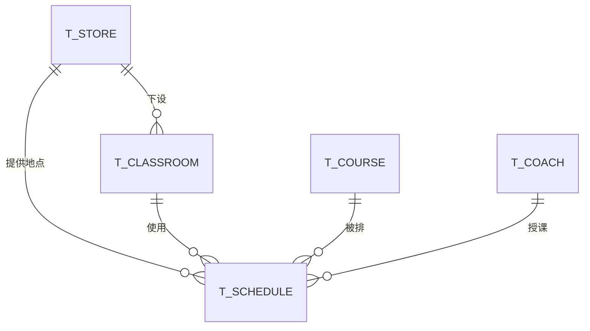
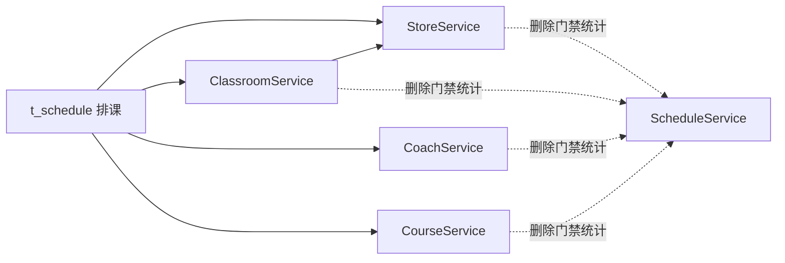

# 瑜伽普拉提详细设计总览

**版本：v2.0（重置版）**（2026-10-01）
**范围：** 一期 —— 门店、教室、教练、课程、排课 ＋ 用户端（免登录浏览）＋ 管理端（登录与五个管理模块）

> **依据：**
> 1. [`业务规则.md`](../../需求文档/业务规则.md) v2.1（**业务口径依据**，本文只引用 `BR-*` 编号）；
> 2. [`需求分析.md`](../../需求分析/需求分析.md) v2.0 与 [`用例/`](../../需求分析/用例/)（UC-001 ~ UC-009）；
> 3. [`概要设计.md`](../../概要设计/概要设计.md) v2.0；
> 4. [`backend/AGENTS.md`](../../../backend/AGENTS.md)（后端技术栈与横切能力的**现行口径**）、[`frontend/uni-app/AGENTS.md`](../../../frontend/uni-app/AGENTS.md)。
>
> **说明：** 本套详细设计是**重置版**，与旧版（会员／会员卡／预约／私教排班／数据范围那一套）没有继承关系。旧版仍在 git 历史与归档分支 `archive/pre-reset` 中。

---

# 1、文档地图

| # | 文档 | 覆盖的数据对象 | 覆盖的接口 |
|---:|---|---|---|
| 1 | [门店管理详细设计](门店管理详细设计.md) | `t_store` | `/admin/stores` 增删查改 |
| 2 | [教室管理详细设计](教室管理详细设计.md) | `t_classroom` | `/admin/classrooms` 增删查改 |
| 3 | [教练管理详细设计](教练管理详细设计.md) | `t_coach` | `/admin/coaches` 增删查改 |
| 4 | [课程管理详细设计](课程管理详细设计.md) | `t_course` | `/admin/courses` 增删查改 |
| 5 | [排课管理详细设计](排课管理详细设计.md) | `t_schedule` | `/admin/schedules` 增删查改 ＋ 状态流转 |
| 6 | [用户端接口详细设计](用户端接口详细设计.md) | —（汇总） | `/api/*` 三个免登录接口 |

> **没有《账号与登录详细设计》**：一期**用户端免登录**、**管理端登录完全复用若依脚手架**，**没有任何新的设计内容**（没有新表、没有新接口、没有新类）——相关口径统一写在 §2.1。

> **分工：** 各模块文档只写**管理端**接口；**用户端**的 3 个接口统一在《用户端接口详细设计》里定义，**不两处重复定义**。
> 每份文档沿用同一套小节：**1 数据架构 → 2 接口 → 3 开发架构 → 4 运行流程 → 5 菜单与 SQL 交付**。

---

# 2、全局技术约定

沿用 [`backend/AGENTS.md`](../../../backend/AGENTS.md) 第 6、8 节，**不另起一套**：

| 项 | 约定 |
|---|---|
| 包名 | `com.techplant.yoga.<模块>` |
| 表名 | `t_` ＋ 业务名（`t_store` / `t_classroom` / `t_coach` / `t_course` / `t_schedule`） |
| 主键 | `bigint unsigned`，雪花 ID，**应用侧生成**，不用数据库自增 |
| **删除** | **一律物理删除**。本期 5 张业务表**不建 `deleted` 字段、不使用 `@TableLogic`** |
| 审计字段 | `create_by / create_time / update_by / update_time`，由公共审计处理器填充（`AuditMetaObjectHandler`） |
| 字符集 | `utf8mb4` / `utf8mb4_unicode_ci` |
| 统一响应 | 单条用 `AjaxResult{code,msg,data}`；列表用 `TableDataInfo{total,rows,code,msg}`；**HTTP 固定 200，业务结果看 `code`** |
| 统一异常 | 业务失败抛 `ServiceException("提示语", 业务码)`，交给框架唯一的全局异常处理器 |
| ID 序列化 | `com.techplant.yoga` 返回对象中**字段名为 `id` 或以 `Id` 结尾**的 `Long` 自动序列化为字符串 |
| **枚举返回** | **枚举码与名称必须成对返回**：`courseType` ＋ `courseTypeName`、`regionCode` ＋ `regionName`、`status` ＋ `statusText`。**前端不自己维护"码 → 名"的映射。** |
| 分页 | `Query` → MyBatis-Plus `IPage` → `PageResult` → controller 装配 `TableDataInfo`；**分页必须有稳定排序** |
| 鉴权 | 管理端接口**只要求已登录**，**不发明权限串**（`BR-全局-003`）；用户端接口标 `@Anonymous` |
| 请求模型粒度 | 请求字段 ≤ 2 个时直接用基本类型／查询参数，不建 DTO；> 2 个才建 DTO |
| 跨模块调用 | **不跨模块读表、不另立 QueryService**；直接依赖对方模块的 Service（见 §6） |

**业务码口径：**

| code | 用在 |
|---:|---|
| 200 | 成功 |
| 401 | 未登录／登录态失效（框架返回） |
| 404 | 资源不存在或已被删除 |
| 409 | 状态冲突、唯一性冲突、删除门禁未通过（提示语里给出数量） |
| 500 | 参数校验失败、系统异常（框架既有行为） |

## 2.1 登录与鉴权（一期不做独立账号设计）

| 端 | 是否需要登录 | 怎么实现 |
|---|---|---|
| **用户端** | ❌ **免登录** | 3 个接口标 `@Anonymous`，进入 permitAll 白名单，**只读** |
| **管理端** | ✅ **用户名 ＋ 密码** | **完全复用若依脚手架**：`sys_user` 表 ＋ `/login`、`/getInfo`、`/getRouters`、`/logout`——**本期不新增、不修改这些接口** |
| 教练端 | — | 已整体删除，不存在教练登录 |

- **登录态**：JWT（jjwt）＋ Redis（`TokenService`，key 前缀 `login_tokens:`）；未登录／失效由 `AuthenticationEntryPointImpl` 返回 **401 业务码**（HTTP 仍是 200）。
- **不发明权限串**：业务 controller 上**不加** `@PreAuthorize`（`BR-全局-003`）；若依的 `@ss.hasPermi` 只用于 `sys_*` 自己的接口。
- **账号来源**：若依种子账号（`backend/sql/ry_20260417.sql`），默认 `admin/admin123`——**发布前必须改密**。
- **若依自带的「系统管理」菜单一期保留不动**（含用户管理、**字典管理**）。其中**字典管理是业务实际要用的**：门店"所在区域"的 16 条 `store_region` 记在 `sys_dict_data`（见 [门店管理详细设计](门店管理详细设计.md) §5）。角色／菜单／部门／岗位一期**不使用**（不做 RBAC），保留只是不给脚手架做无谓的裁剪。
- **不要改 `sys_*` 表结构与历史 SQL**（见 `backend/AGENTS.md` §9）。

---

# 3、数据对象总表

| 表 | 业务对象 | 关键约束 | 状态字段 |
|---|---|---|---|
| `t_store` | 门店 | **名称唯一** | **无** |
| `t_classroom` | 教室 | 归属门店；**同一门店内名称唯一** | **无** |
| `t_coach` | 教练 | 平台级；名称**可重名**；相册 ≤ 5 张 | **无** |
| `t_course` | 课程 | 平台级；**名称全平台唯一** | **无** |
| `t_schedule` | 排课 | 见《排课管理详细设计》 | 待上架／已上架／已取消 |

**关系：**

**一期不建的表**（`BR-全局-005`）：会员、会员卡、预约、私教排班、教练×门店关联、教练技能、营业时间登记、会员等级／权益、优惠券、礼包、积分、合同、体测、公告、消息、活动。

---

# 4、接口总览

## 4.1 管理端（需登录）

| 模块 | 方法 | 路径 | 功能 |
|---|---|---|---|
| 门店 | GET | `/admin/stores` | 查询门店列表 |
| 门店 | GET | `/admin/stores/{storeId}` | 查询门店详情 |
| 门店 | POST | `/admin/stores` | 新增门店 |
| 门店 | PUT | `/admin/stores/{storeId}` | 修改门店 |
| 门店 | DELETE | `/admin/stores/{storeId}` | 删除门店（物理，带门禁） |
| 教室 | GET | `/admin/classrooms` | 查询教室列表 |
| 教室 | POST | `/admin/classrooms` | 新增教室 |
| 教室 | PUT | `/admin/classrooms/{classroomId}` | 修改教室（只改名称） |
| 教室 | DELETE | `/admin/classrooms/{classroomId}` | 删除教室（物理，带门禁） |
| 教练 | GET | `/admin/coaches` | 查询教练列表 |
| 教练 | GET | `/admin/coaches/{coachId}` | 查询教练详情 |
| 教练 | POST | `/admin/coaches` | 新增教练 |
| 教练 | PUT | `/admin/coaches/{coachId}` | 修改教练 |
| 教练 | DELETE | `/admin/coaches/{coachId}` | 删除教练（物理，带门禁） |
| 课程 | GET | `/admin/courses` | 查询课程列表 |
| 课程 | GET | `/admin/courses/{courseId}` | 查询课程详情 |
| 课程 | POST | `/admin/courses` | 新增课程 |
| 课程 | PUT | `/admin/courses/{courseId}` | 修改课程 |
| 课程 | DELETE | `/admin/courses/{courseId}` | 删除课程（物理，带门禁） |
| 排课 | GET | `/admin/schedules` | 查询排课列表 |
| 排课 | GET | `/admin/schedules/{scheduleId}` | 查询排课详情 |
| 排课 | POST | `/admin/schedules` | 新增排课 |
| 排课 | PUT | `/admin/schedules/{scheduleId}` | 修改排课（**仅待上架可改**） |
| 排课 | PUT | `/admin/schedules/{scheduleId}/status?status=` | 排课状态流转（上架／下架／取消） |
| 排课 | DELETE | `/admin/schedules/{scheduleId}` | 删除排课（物理；仅待上架） |
| 登录 | POST | `/login` | 管理端登录（沿用脚手架） |
| 登录 | GET | `/getInfo`、`/getRouters` | 登录后取用户信息与菜单（沿用脚手架） |

## 4.2 用户端（免登录，全部只读）

| 方法 | 路径 | 功能 | 详见 |
|---|---|---|---|
| GET | `/api/stores` | 门店列表（供首页切换门店） | [用户端接口详细设计](用户端接口详细设计.md) |
| GET | `/api/schedules` | 排课列表（按当前门店 ＋ 课种 ＋ 日期，**分页**） | 同上 |
| GET | `/api/schedules/{scheduleId}` | 排课详情（课程详情页） | 同上 |

---

# 5、关键设计决策登记

> 本套详细设计**不单独建"设计记录／评审记录"文档**，需要长期留存的设计结论集中登记在这里。

| # | 决策 | 依据 |
|---:|---|---|
| 1 | **本期 5 张业务表一律物理删除**，不建 `deleted`、不用 `@TableLogic` | `BR-门店-009`、`BR-教室-006`、`BR-教练-006`、`BR-课程-008`、`BR-排课-014`（与 `backend/AGENTS.md` §6 的旧约定**有意不同**） |
| 2 | **"已结束"不落库**，由 `结束时间 <= 当前时间` 推导；**在 service 层判定**（返回 controller 前一次判定，产出 `finished`/`statusText`/`bookable`），**只用于展示与删除门禁**，不是用户端过滤条件。**唯一例外**：删除门禁的 count 查询把 `end_time > 当前时间` 写在 SQL 条件里 | `BR-排课-010`、`BR-排课-013`、`BR-排课-015`、`BR-全局-009` |
| 3 | **课种在排课时做快照**（`t_schedule.course_type`）：用户端**课种 Tab 筛选不回读课程**；**新增排课与更换课程时写入／刷新**；难度／封面／介绍仍实时取课程 | `BR-课程-009`、`BR-排课-021` |
| 4 | 教练**不建**技能、头衔、金牌、手动排序字段，**不建**教练×门店关联表 | `BR-教练-001`、`BR-教练-005` |
| 5 | 门店、教室、课程**都不建状态字段** | `BR-门店-008`、`BR-教室-003`、`BR-课程-007` |
| 6 | 排课状态**只有 3 个落库值**：待上架／已上架／已取消；没有"已下架"（下架＝回到待上架） | `BR-排课-010`、`BR-排课-012` |
| 7 | **删除门禁口径**：只统计"未结束、且状态为待上架或已上架"的排课；已取消／已结束**不阻塞**；统计失败**不降级放行**（fail-closed）；删除后历史排课上的对象显示为空 | `BR-全局-007`、`BR-全局-009` |
| 8 | **不做 RBAC**（菜单、按钮、数据范围都不做），但管理端菜单**仍走 `sys_menu`**（若依路由由数据库驱动） | `BR-全局-003` |
| 9 | 门店"所在区域"**存行政区划 code**（`region_code`），取值校验与区名翻译都走**字典表**（`sys_dict_data`，`dict_type = 'store_region'`）；**不另维护 Java 枚举** | `BR-门店-005` |
| 10 | 用户端"当前门店"**只存小程序本地**，不落服务端、不登录 | `BR-全局-010` |
| 11 | "已预约人数"字段**先建并固定为 0**，管理端表单只读 | `BR-排课-019` |
| 12 | 排课**状态用 tinyint 编码**（`1` 待上架／`2` 已上架／`3` 已取消），**不存字符串** | `BR-排课-010`、`BR-排课-012` |
| 13 | 门店**不设"联系人"**字段，只留联系电话（真实产品证据里也没有联系人） | 门店字段口径 |
| 14 | **用户端可见口径 ＝ 状态不是「待上架」**：已上架、**已结束**、**已取消**在用户端都可见，卡片与详情页都要带出状态；只有待上架不可见 | `BR-排课-015`、`BR-排课-016`、`BR-排课-020` |
| 15 | **排课只有「待上架」可编辑**：已上架须**先下架**再改，改完重新上架；已取消与已结束是终态 | `BR-排课-013` |
| 16 | 排课保存**独立的日期列** `schedule_date`（由开始时间推导、服务端写入）；**日期筛选一律按它**，不用开始/结束时间拼条件 | `BR-排课-022` |

---

# 6、跨模块调用清单

**排课**是唯一同时依赖四个对象的模块；**主数据删除**反向依赖排课模块的统计接口。

| 调用方 | 被调方 | 用途 |
|---|---|---|
| 教室 | `StoreService` | 校验所属门店存在 |
| 排课 | `StoreService` / `CourseService` / `CoachService` / `ClassroomService` | 校验四个对象存在、且教室归属门店 = 排课门店 |
| 门店 / 教室 / 教练 / 课程 | `ScheduleService` | 删除门禁：统计"未结束且待上架或已上架"的排课引用数 |

> 跨模块调用一律走**对方的 Service**，**不直接读对方的表、不另立 QueryService**；调用失败按 fail-closed 处理。

---

# 7、SQL 与菜单交付清单

| # | 交付物 | 位置 |
|---:|---|---|
| 1 | 建表语句 ＋ 示例数据 | `backend/sql/yoga.sql`（在现有内容上追加 `t_store` / `t_classroom` / `t_coach` / `t_course` / `t_schedule`） |
| 2 | 管理端菜单 SQL | 同脚本，`sys_menu` 增加"门店管理／教室管理／教练管理／课程管理／排课管理"五个菜单，绑定内置管理员角色 |
| 3 | 管理端页面 | `frontend/pc/src/views/{store,classroom,coach,course,schedule}/index.vue` |
| 4 | 管理端接口封装 | `frontend/pc/src/api/{store,classroom,coach,course,schedule}/*.js` |
| 5 | 用户端页面 | `frontend/uni-app/pages/home`（首页，门店切换）、`pages/booking`（约课页）、新增课程详情页 |
| 6 | 用户端接口封装 | `frontend/uni-app/api/*.js` |
| 7 | 账号相关 SQL | **不新增**——账号沿用若依种子（`ry_20260417.sql`）。**但门店区域字典是本期新增**：`sys_dict_type` 1 条（`store_region`）＋ `sys_dict_data` 16 条，见 [门店管理详细设计](门店管理详细设计.md) §5 |

> 一期**没有**定时任务、消息队列与缓存业务数据（Redis 仅用于登录态）。
