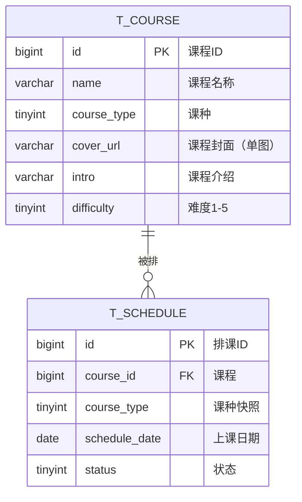
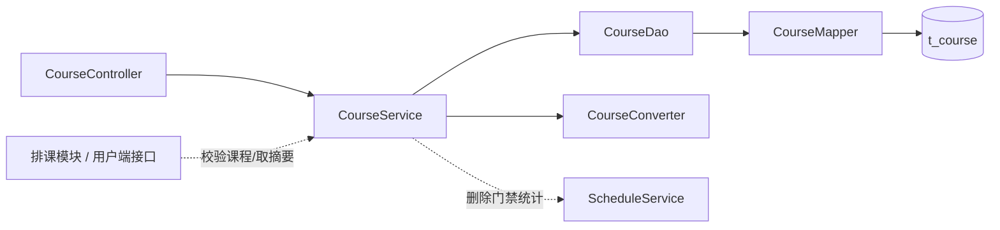

# 瑜伽普拉提课程管理详细设计文档

**版本：v2.0（重置版）**（2026-10-01）
**对应业务规则：** `BR-课程-001` ~ `BR-课程-010`、`BR-全局-006`、`BR-全局-007`、`BR-全局-009`
**上游文档：** [详细设计总览](详细设计总览.md)、[概要设计](../概要设计/概要设计.md) v2.0

---

# 1、数据架构

## 1.1 数据库 ER 模型

### 1.1.1 建模口径

| 项目 | 约定 |
|---|---|
| 表名 | `t_course` |
| 主键 | `id bigint unsigned`，雪花 ID，**应用侧生成** |
| 字符集 | `utf8mb4` / `utf8mb4_unicode_ci` |
| **删除** | **物理删除**：**不建 `deleted` 字段、不使用 `@TableLogic`**（`BR-课程-008`） |
| **状态** | **本表没有状态字段**，下架通过删除实现（`BR-课程-007`） |
| 审计字段 | `create_by / create_time / update_by / update_time`，公共审计处理器填充 |
| 唯一约束 | `uk_course_name(name)`：**名称全平台唯一**（`BR-课程-002`） |
| 关系 | 课程 1—N 排课（`t_schedule.course_id`）；**不建**门店字段 |

### 1.1.2 表清单

| 表名 | 中文名 | 所属模块 | 本版状态 |
|---|---|---|---|
| `t_course` | 课程 | 课程管理 | **本版实现** |
| `t_schedule` | 排课 | 排课管理 | 本版实现；**课程删除门禁的统计对象** |

### 1.1.3 ER 模型图



## 1.2 数据库逻辑模型

### 1.2.1 `t_course` 字段定义

| 字段 | 中文名 | 类型 | 必填 | 默认值 | 说明 |
|---|---|---:|:---:|---:|---|
| `id` | 课程ID | bigint unsigned | 是 | — | 雪花 ID，应用侧生成 |
| `name` | 课程名称 | varchar(64) | 是 | — | **全平台唯一** |
| `course_type` | 课种 | tinyint | 是 | — | `1` 团课；`2` 精品课；`3` 私教课；`4` 特色课 |
| `cover_url` | 课程封面 | varchar(255) | 否 | NULL | **单图**，存 URL |
| `intro` | 课程介绍 | varchar(1024) | 否 | NULL | 纯文本 |
| `difficulty` | 课程难度 | tinyint | 是 | — | `1` ~ `5` 星 |
| `create_by` | 创建人 | bigint unsigned | 否 | NULL | 公共审计填充 |
| `create_time` | 创建时间 | datetime | 是 | CURRENT_TIMESTAMP | 公共审计填充 |
| `update_by` | 更新人 | bigint unsigned | 否 | NULL | 公共审计填充 |
| `update_time` | 更新时间 | datetime | 是 | CURRENT_TIMESTAMP | ON UPDATE |

**本表刻意不建的字段**：

| 不建的字段 | 原因 |
|---|---|
| `store_id` | 课程是**平台级**、**不归属门店**（`BR-课程-001`）；不做"排课门店 = 课程门店"的一致性校验 |
| `status` | 课程**没有启用／停用状态**（`BR-课程-007`） |
| `sort_no`（展示排序） | 一期**不设**展示排序，用户端没有首页热门区（`BR-课程-010`） |
| `deleted` | **物理删除**（`BR-课程-008`） |
| 课程多图 | 封面**只保留单图**（`BR-课程-005`） |

### 1.2.2 枚举值

| 枚举 | 值 | 文案 | 一期是否使用 |
|---|---:|---|:--:|
| `course_type` | 1 | 团课 | ✅ |
| `course_type` | 2 | 精品课 | ✅ |
| `course_type` | 3 | 私教课 | **枚举保留、一期不使用**（无任何排课数据，用户端该 Tab 显示空态） |
| `course_type` | 4 | 特色课 | ✅ |

| 枚举 | 取值 |
|---|---|
| `difficulty` | 1、2、3、4、5（星） |

### 1.2.3 字段规则

1. 新增与修改按**全量提交**：`name`、`course_type`、`difficulty` 必填，`cover_url`、`intro` 可空。请求字段前后空格由转换层去除。
2. **名称全平台唯一**：新增与修改都校验（修改时排除自身）；数据库层用 `uk_course_name` 兜底。**不区分课种、不区分是否"在用"**——只要重名就拒绝。
3. `course_type` 必须是 1~4；`difficulty` 必须是 1~5；越界即拒绝。
4. `cover_url` 只保存**一个** URL，不建多图。
5. **课种在排课时做快照**：排课自己保存 `course_type`（`BR-排课-021`），因此**修改课种不会改变既有排课的课种**；但**难度、封面、介绍仍实时取课程**，**改难度会改变既有排课的展示**（`BR-课程-009`）。
6. 请求中不允许携带审计字段。

## 1.3 数据库物理模型

### 1.3.1 建表语句

```sql
CREATE TABLE `t_course` (
  `id`          bigint unsigned NOT NULL COMMENT '课程ID',
  `name`        varchar(64)   NOT NULL COMMENT '课程名称（全平台唯一）',
  `course_type` tinyint       NOT NULL COMMENT '课种：1团课 2精品课 3私教课 4特色课',
  `cover_url`   varchar(255)  DEFAULT NULL COMMENT '课程封面URL（单图）',
  `intro`       varchar(1024) DEFAULT NULL COMMENT '课程介绍',
  `difficulty`  tinyint       NOT NULL COMMENT '课程难度：1~5星',
  `create_by`   bigint unsigned DEFAULT NULL COMMENT '创建人ID',
  `create_time` datetime NOT NULL DEFAULT CURRENT_TIMESTAMP COMMENT '创建时间',
  `update_by`   bigint unsigned DEFAULT NULL COMMENT '更新人ID',
  `update_time` datetime NOT NULL DEFAULT CURRENT_TIMESTAMP ON UPDATE CURRENT_TIMESTAMP COMMENT '更新时间',
  PRIMARY KEY (`id`),
  UNIQUE KEY `uk_course_name` (`name`)
) ENGINE=InnoDB DEFAULT CHARSET=utf8mb4 COLLATE=utf8mb4_unicode_ci COMMENT='课程基础信息表';
```

> **注意：** 本表**没有** `deleted`、`status`、`store_id`、`sort_no` 字段；删除是对行执行 `DELETE`，删除后课程名称随即释放、可再次使用。

---

# 2、接口

## 2.1 通用约定

1. 管理端接口前缀 `/admin`，**依赖登录态**；HTTP 状态码固定 200，业务结果看响应 `code`。
2. 列表用 `TableDataInfo`；详情、新增、修改、删除用 `AjaxResult`。
3. 主键在返回对象中序列化为**字符串**。
4. 本模块**没有状态接口**（课程无状态）。
5. 课程的**用户端**读取（约课卡片、课程详情页）见 [用户端接口详细设计](用户端接口详细设计.md)，**不在本文重复定义**。

## 2.2 课程管理接口

| # | 方法 | 路径 | 功能 | 登录 |
|---:|---|---|---|:---:|
| 1 | GET | `/admin/courses` | 查询课程列表 | 是 |
| 2 | GET | `/admin/courses/{courseId}` | 查询课程详情 | 是 |
| 3 | POST | `/admin/courses` | 新增课程 | 是 |
| 4 | PUT | `/admin/courses/{courseId}` | 修改课程 | 是 |
| 5 | DELETE | `/admin/courses/{courseId}` | 删除课程（物理，带门禁） | 是 |

### 2.2.1 查询课程列表

**请求：** `GET /admin/courses?name=瑜伽&courseType=1&pageNum=1&pageSize=10`

| 参数 | 位置 | 类型 | 必填 | 说明 |
|---|---|---|---|:---:|---|
| `name` | query | string | 否 | 课程名称，模糊匹配，最长 64 |
| `courseType` | query | integer | 否 | `1`~`4`，不传不限 |
| `pageNum` | query | integer | 否 | 默认 1 |
| `pageSize` | query | integer | 否 | 默认 10，最大 100 |

**返回示例：**

```json
{
  "total": 1,
  "rows": [
    {
      "id": "1856739201475238001",
      "name": "哈他瑜伽",
      "courseType": 1,
      "courseTypeName": "团课",
      "coverUrl": "https://cdn.example.com/course/1.jpg",
      "difficulty": 2,
      "createTime": "2026-10-01 10:00:00",
      "updateTime": "2026-10-01 10:00:00"
    }
  ],
  "code": 200,
  "msg": "查询成功"
}
```

列表**不返回** `intro`（大字段），按 `course_type ASC, id DESC` **稳定排序**。

### 2.2.2 查询课程详情

**请求：** `GET /admin/courses/{courseId}`

成功时 `data` 为 `CourseDetailVO`（在列表项字段之上多一个 `intro`）。课程不存在时返回 `404`，提示"课程不存在或已被删除"。

### 2.2.3 新增课程

**请求：** `POST /admin/courses`

```json
{
  "name": "哈他瑜伽",
  "courseType": 1,
  "coverUrl": "https://cdn.example.com/course/1.jpg",
  "intro": "适合初学者的基础课程",
  "difficulty": 2
}
```

| 情形 | 处理 |
|---|---|
| 课程名称已存在 | `409`，"课程名称已存在" |
| `courseType` 不在 1~4 | `500`（参数校验），提示取值非法 |
| `difficulty` 不在 1~5 | `500`（参数校验），提示取值非法 |

成功只返回 `{ "code": 200, "msg": "操作成功" }`，**不返回新建课程 ID**。

### 2.2.4 修改课程

**请求：** `PUT /admin/courses/{courseId}`，请求体与新增一致（全量编辑）。

- 课程不存在 → `404`；
- 名称与其它课程重复 → `409`；
- 不做引用检查：**已被排课引用时仍允许修改**；
- ⚠️ **改课种不影响既有排课的课种**（课种已快照在排课上，`BR-课程-009`）；但**改难度会影响既有排课的展示**。前端提示文案按这两句分开写。

成功返回更新后的 `CourseDetailVO`。

### 2.2.5 删除课程

**请求：** `DELETE /admin/courses/{courseId}`

**物理删除**，删除前依次校验：

| # | 校验 | 不通过时 |
|---:|---|---|
| 1 | 课程存在 | `404` |
| 2 | 没有**未结束、且状态为待上架或已上架**的排课引用（调 `ScheduleService`） | `409`："该课程仍有 N 节未结束的排课，无法删除" |
| 3 | 上述统计**调用失败** | 拒绝删除，**不降级放行**（fail-closed） |

通过后执行 `DELETE FROM t_course WHERE id = ?`。

> **已取消、已结束的历史排课不阻塞删除**；删除后这些历史排课上的课程显示为空，管理端做空值兜底（`BR-全局-009`）。

## 2.3 数据模型

### 2.3.1 `CourseListItemVO` / `CourseDetailVO`

| 字段 | 类型 | 列表 | 详情 | 说明 |
|---|---|:--:|:--:|---|
| `id` | string | ✅ | ✅ | 课程ID |
| `name` | string | ✅ | ✅ | 课程名称 |
| `courseType` | integer | ✅ | ✅ | `1`~`4` |
| `courseTypeName` | string | ✅ | ✅ | 课种名称（如「团课」「私教课」），由 `CourseTypeEnum` 翻译 |
| `coverUrl` | string | ✅ | ✅ | 课程封面 URL（单图，可空） |
| `difficulty` | integer | ✅ | ✅ | `1`~`5` |
| `intro` | string | ❌ | ✅ | 课程介绍（列表不返回大字段） |
| `createTime` / `updateTime` | string | ✅ | ✅ | 时间字段 |

### 2.3.2 `CourseCreateDTO` / `CourseUpdateDTO`

两个请求模型字段相同：`name`（必填）、`courseType`（必填，1~4）、`coverUrl`、`intro`、`difficulty`（必填，1~5）。使用 `@Valid` 校验非空、长度与取值范围。

### 2.3.3 `CourseQuery`

列表筛选与分页：`name`、`courseType`、`pageNum`、`pageSize`（上限 100）。

## 2.4 错误码

| code | 场景 | 文案 |
|---:|---|---|
| 200 | 成功 | 查询成功／操作成功 |
| 404 | 课程不存在 | 课程不存在或已被删除 |
| 409 | 名称重复 | 课程名称已存在 |
| 409 | 仍有未结束的排课 | 该课程仍有 N 节未结束的排课，无法删除 |
| 409 | 引用统计失败 | 引用检查未完成，已拒绝本次删除 |
| 500 | 参数校验失败／系统异常 | 由统一异常处理器返回具体字段提示 |

---

# 3、开发架构

## 3.1 包结构

```text
com.techplant.yoga.course
├─ controller/CourseController.java
├─ service/CourseService.java            （同时供跨模块校验课程存在）
├─ service/impl/CourseServiceImpl.java
├─ dao/CourseDao.java、CourseDaoImpl.java
├─ mapper/CourseMapper.java
├─ domain/CourseDO.java
├─ dto/CourseCreateDTO.java、CourseUpdateDTO.java
├─ query/CourseQuery.java
├─ vo/CourseListItemVO.java、CourseDetailVO.java
├─ enums/CourseTypeEnum.java
└─ convert/CourseConverter.java
```

## 3.2 类与职责

| 类 | 职责 |
|---|---|
| `CourseController` | 接收请求、触发校验、装配响应；**不写业务规则** |
| `CourseService` / `CourseServiceImpl` | 名称唯一校验、存在性校验、**删除门禁编排**、事务边界；并**对外**提供「校验课程存在」与「批量取课程摘要」供排课与用户端接口使用（**全项目统一不另立 QueryService**） |
| `CourseDao` / `CourseDaoImpl` | 组装筛选、分页、稳定排序 |
| `CourseMapper` | 继承 `BaseMapper<CourseDO>` |
| `CourseDO` | 与 `t_course` 对应；**无逻辑删除、无状态、无门店字段** |
| `CourseCreateDTO` / `CourseUpdateDTO` | 新增／修改入参 |
| `CourseQuery` | 列表筛选与分页 |
| `CourseListItemVO` / `CourseDetailVO` | 接口出参 |
| `CourseTypeEnum` | 课种固定枚举：**取值校验（1~4）与「码 → 名称」翻译都在这一个类里** |
| `CourseConverter` | DTO、DO、VO 转换 |

## 3.3 调用关系



## 3.4 关键实现约定

1. **物理删除**：`CourseDO` **不加** `@TableLogic`。
2. 名称唯一校验为**全平台**（不分课种），`uk_course_name` 作并发兜底。
3. **课种快照由排课侧持有**：本模块**不负责**维护排课的 `course_type`；新增排课与更换课程时由**排课模块**从课程复制。用户端课种 Tab 的筛选也因此**不回读课程表**（`BR-排课-021`）。
4. 列表固定 `course_type ASC, id DESC` 排序，且**不查询** `intro`。
5. **课种的枚举校验与名称翻译都只在 `CourseTypeEnum` 一处**，不要在 controller、DTO、SQL 里各写一遍；**更不要让前端硬编码 `1 = 团课`**。列表与详情都必须**成对返回** `courseType` ＋ `courseTypeName`（[详细设计总览](详细设计总览.md) §2 的「枚举返回」约定）。

---

# 4、运行流程

## 4.1 查询列表
1. Controller 校验 `CourseQuery`（`pageSize` 上限 100、`courseType` 取值范围）。
2. Service 调 DAO 分页查询（只 select `id/name/course_type/cover_url/difficulty/审计时间`），按 `course_type ASC, id DESC` 排序。
3. 转 `CourseListItemVO` 返回。

## 4.2 查询详情
1. Service 按 ID 查询；不存在 → `404`。
2. 转 `CourseDetailVO`（含 `intro`）返回。

## 4.3 新增课程
1. Controller 校验必填、长度与取值范围（`courseType` ∈ 1~4；`difficulty` ∈ 1~5）。
2. Service 按 `name` 查重；重复 → `409`。
3. 转 DO 插入；主键与审计字段由公共机制处理。

## 4.4 修改课程
1. Service 按 ID 查询；不存在 → `404`。
2. 按 `name` 查重（**排除自身**）；重复 → `409`。
3. 全量覆盖业务字段并更新；返回最新详情。
4. **不做引用检查**；**不刷新既有排课的课种快照**（快照只在排课侧写入）。

## 4.5 删除课程
1. Service 按 ID 查询；不存在 → `404`。
2. 调 `ScheduleService` 统计"未结束且状态为待上架或已上架"的排课数；> 0 → `409`（带数量）。
3. 统计抛异常 → 直接以 `ServiceException` 终止，**不继续删除**。
4. 执行物理删除。

---

# 5、菜单与 SQL 交付

1. `backend/sql/yoga.sql` 增加 `t_course` 建表语句（含 `uk_course_name`）与四条示例数据（覆盖团课／精品课／特色课各一，外加一条**私教课**示范"枚举保留但一期不排课"）。
2. 同脚本在 `sys_menu` 增加"课程管理"菜单，绑定内置管理员角色。
3. 管理端页面：`frontend/pc/src/views/course/index.vue`，支持按名称／课种查询、新增、修改、删除；课种与难度都用下拉；**改课种不影响既有排课（已快照），改难度才会影响既有排课展示**——页面按这两句给出提示文案。
4. 管理端接口封装：`frontend/pc/src/api/course/course.js`。
5. 排课表单的课程下拉来自 `GET /admin/courses`（**不限门店**，一期课程不归属门店）。
