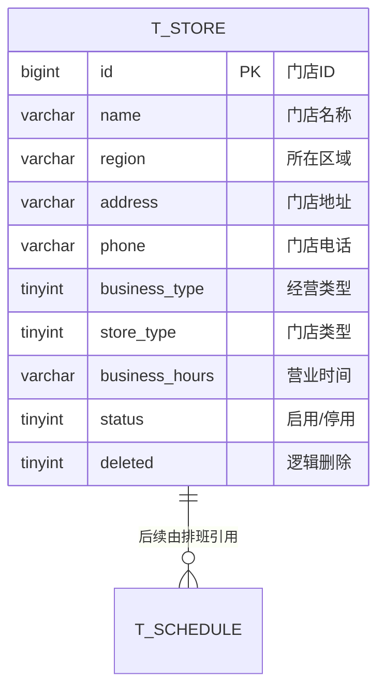
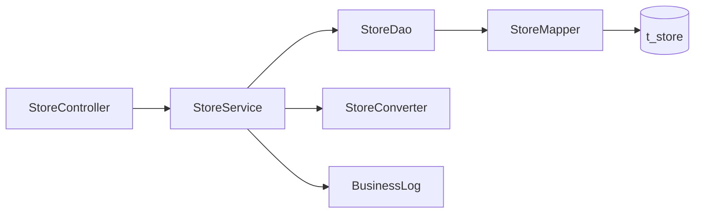

# 一水·瑜伽普拉提门店管理详细设计文档

**本版范围：管理端经营基础——门店管理。**

> 本文按《详细设计文档模板》组织，覆盖门店表结构、管理端接口、后端分层、运行流程、测试用例和业务日志。
> 本版只根据用户提供的字段与现有管理端功能清单落地最小闭环。

## 上游依据与设计边界

| 来源 | 用途 |
|---|---|
| 用户提供字段清单 | 确认门店名称、区域、地址、电话、经营类型、门店类型、营业时间 |
| `docs/需求文档/管理端/管理端功能清单.md` | 确认查询、新增、修改、设置门店状态四项管理能力 |
| `docs/需求文档/管理端/管理端页面结构图.md` | 确认列表筛选项与详情展示项 |
| `docs/产品分析/用户端页面与跳转梳理.md` | 说明“地址”用于用户端首页/切换门店页面；本版与“门店地址”共用同一字段 |
| `backend/AGENTS.md` | 确认 `ruoyi-yoga`、MyBatis-Plus、VO、逻辑删除和统一响应约定 |

### 本版明确纳入

1. 管理端门店分页列表、详情、新增、修改、启用/停用。
2. 门店名称、所在区域、地址、电话、经营类型、门店类型、营业时间七个业务字段。
3. `status`、`deleted`、审计字段等系统字段。

### 本版明确不纳入

1. “地址”和“门店地址”不重复建列，统一使用 `address`；页面文案可以分别显示为地址或门店地址。
2. 不新增联系人、门店图片、地图经纬度、门店编码、负责人、容量等用户未提供的字段。
3. 不提供物理删除或管理端删除接口；`deleted` 只保留项目统一的逻辑删除能力。
4. 不在本版设计用户端切换门店查询接口、默认门店保存接口，以及门店与排班/预约的联动门禁规则；相关接口待用户端接口范围确认后补充。
5. 管理端权限串暂不自行发明，先沿用项目当前“登录即可调用”的业务模块约定；权限矩阵确认后再补 `@PreAuthorize` 与按钮菜单。

# 1、数据架构

## 1.1 数据库 ER 模型

### 1.1.1 建模口径

| 项目 | 约定 |
|---|---|
| 表名 | `t_store`，业务表统一使用 `t_` 前缀 |
| 主键 | `id bigint unsigned`，MyBatis-Plus `ASSIGN_ID` 生成雪花 ID，不使用数据库自增 |
| 字符集 | `utf8mb4` / `utf8mb4_general_ci` |
| 逻辑删除 | `deleted tinyint`，`0` 正常、`1` 已删除；DO 使用 `@TableLogic` |
| 业务状态 | `status tinyint`，`1` 启用、`0` 停用；状态与逻辑删除分开 |
| 审计字段 | `create_by/create_time/update_by/update_time`，由公共审计处理器填充 |
| 关系 | 本版不新增门店子表；后续排班通过 `t_schedule.store_id` 形成引用 |

### 1.1.2 表清单

| 表名 | 中文名 | 所属模块 | 本版状态 |
|---|---|---|---|
| `t_store` | 门店 | 经营基础 / 门店管理 | 本版细化并实现 |
| `t_schedule` | 排班 | 经营基础 / 排班管理 | 后续模块；本版不做引用检查 |
| `t_booking` | 预约 | 经营基础 / 预约管理 | 后续模块；本版不做引用检查 |

### 1.1.3 ER 模型图



> `T_SCHEDULE` 仅用于表达后续逻辑关系，不代表本版已创建排班表或已实现跨模块校验。

## 1.2 数据库逻辑模型

### 1.2.1 `t_store` 字段定义

| 字段 | 中文名 | 类型 | 必填 | 默认值 | 说明 |
|---|---|---:|:---:|---:|---|
| `id` | 门店ID | bigint | 是 | — | 雪花 ID，应用侧生成 |
| `name` | 门店名称 | varchar(64) | 是 | — | 管理端与用户端展示名称 |
| `region` | 所在区域 | varchar(64) | 是 | — | 用于列表筛选和切换门店区域展示 |
| `address` | 地址/门店地址 | varchar(255) | 是 | — | 用户端“地址”与管理端“门店地址”的统一存储字段 |
| `phone` | 门店电话 | varchar(32) | 是 | — | 允许座机、手机号及分机等文本格式 |
| `business_type` | 经营类型 | tinyint | 是 | — | `1` 直营连锁；`2` 加盟 |
| `store_type` | 门店类型 | tinyint | 是 | — | `1` 主力店；`2` 精品店 |
| `business_hours` | 营业时间 | varchar(128) | 是 | — | 先按展示文本保存，如“周一至周日 09:00-22:00” |
| `status` | 门店状态 | tinyint | 是 | `1` | `1` 启用；`0` 停用 |
| `deleted` | 逻辑删除 | tinyint | 是 | `0` | `0` 正常；`1` 已删除 |
| `create_by` | 创建人 | bigint | 否 | NULL | 当前登录用户 ID |
| `create_time` | 创建时间 | datetime | 是 | CURRENT_TIMESTAMP | 公共审计填充 |
| `update_by` | 更新人 | bigint | 否 | NULL | 当前登录用户 ID |
| `update_time` | 更新时间 | datetime | 是 | CURRENT_TIMESTAMP | 公共审计填充 |

### 1.2.2 枚举值

| 枚举 | 值 | 文案 |
|---|---:|---|
| `business_type` | 1 | 直营连锁 |
| `business_type` | 2 | 加盟 |
| `store_type` | 1 | 主力店 |
| `store_type` | 2 | 精品店 |
| `status` | 1 | 启用 |
| `status` | 0 | 停用 |

### 1.2.3 字段规则

1. 新增和修改均按全量提交处理，七个业务字段均不能为空；请求中的前后空格由转换层去除。
2. `business_hours` 本版按展示文本保存，不把营业时间拆成多个时段，也不做跨日、节假日和特殊营业日规则。
3. 不对门店名称建立唯一索引；是否允许同名门店由后续业务确认。当前列表以区域、名称、ID 稳定排序。
4. 电话与地址属于联系方式/位置数据，业务日志只记录“有/无”和字段名，不记录完整值。

## 1.3 数据库物理模型

### 1.3.1 建表语句

```sql
CREATE TABLE `t_store` (
  `id`             bigint unsigned NOT NULL COMMENT '门店ID',
  `name`           varchar(64)  NOT NULL COMMENT '门店名称',
  `region`         varchar(64)  NOT NULL COMMENT '所在区域',
  `address`        varchar(255) NOT NULL COMMENT '门店地址',
  `phone`          varchar(32)  NOT NULL COMMENT '门店电话',
  `business_type`  tinyint      NOT NULL COMMENT '经营类型：1直营连锁 2加盟',
  `store_type`     tinyint      NOT NULL COMMENT '门店类型：1主力店 2精品店',
  `business_hours` varchar(128) NOT NULL COMMENT '营业时间',
  `status`         tinyint      NOT NULL DEFAULT 1 COMMENT '门店状态：1启用 0停用',
  `deleted`        tinyint      NOT NULL DEFAULT 0 COMMENT '逻辑删除：0正常 1已删除',
  `create_by`      bigint unsigned DEFAULT NULL COMMENT '创建人ID',
  `create_time`    datetime NOT NULL DEFAULT CURRENT_TIMESTAMP COMMENT '创建时间',
  `update_by`      bigint unsigned DEFAULT NULL COMMENT '更新人ID',
  `update_time`    datetime NOT NULL DEFAULT CURRENT_TIMESTAMP ON UPDATE CURRENT_TIMESTAMP COMMENT '更新时间',
  PRIMARY KEY (`id`),
  KEY `idx_name` (`name`),
  KEY `idx_region_type_status` (`region`, `store_type`, `status`),
  KEY `idx_business_type_status` (`business_type`, `status`)
) ENGINE=InnoDB DEFAULT CHARSET=utf8mb4 COLLATE=utf8mb4_unicode_ci COMMENT='门店基础信息表';
```

### 1.3.2 索引设计

| 索引 | 字段 | 用途 |
|---|---|---|
| `PRIMARY` | `id` | 主键定位 |
| `idx_name` | `name` | 门店名称前缀/模糊检索的基础索引 |
| `idx_region_type_status` | `region, store_type, status` | 管理端按区域、门店类型、状态筛选 |
| `idx_business_type_status` | `business_type, status` | 管理端按经营类型和状态筛选 |

> 实际 SQL 计划应在门店数据量上升后结合查询日志复核；本版不新增统计索引和全文索引。

# 2、接口

## 2.1 通用约定

1. 管理端接口前缀为 `/admin`，依赖登录态；HTTP 状态码沿用若依约定固定为 200，业务结果看响应 `code`。
2. 列表使用 `TableDataInfo`：`{total, rows, code, msg}`；详情、新增、修改、状态变更使用 `AjaxResult`：`{code, msg, data}`。
3. `Long` 主键在 `com.techplant.yoga` 返回对象中由统一 Jackson 配置序列化为字符串；请求路径中的 `storeId` 也按字符串传递。
4. 新增和修改请求不提交 `status`、`deleted` 和审计字段；新增默认启用，状态只走独立接口。
5. 本版不提供删除接口。

## 2.2 门店管理接口

| # | 方法 | 路径 | 功能 | 登录 |
|---:|---|---|---|:---:|
| 1 | GET | `/admin/stores` | 查询门店列表 | 是 |
| 2 | GET | `/admin/stores/{storeId}` | 查询门店详情 | 是 |
| 3 | POST | `/admin/stores` | 新增门店 | 是 |
| 4 | PUT | `/admin/stores/{storeId}` | 修改门店 | 是 |
| 5 | PUT | `/admin/stores/{storeId}/status` | 设置门店状态 | 是 |

### 2.2.1 查询门店列表

**请求：** `GET /admin/stores?name=店&region=徐汇&storeType=1&status=1&pageNum=1&pageSize=10`

| 参数 | 位置 | 类型 | 必填 | 说明 |
|---|---|---|:---:|---|
| `name` | query | string | 否 | 门店名称，模糊匹配，最长 64 |
| `region` | query | string | 否 | 所在区域，模糊匹配，最长 64 |
| `businessType` | query | integer | 否 | `1` 直营连锁；`2` 加盟 |
| `storeType` | query | integer | 否 | `1` 主力店；`2` 精品店 |
| `status` | query | integer | 否 | `1` 启用；`0` 停用；不传不限 |
| `pageNum` | query | integer | 否 | 默认 1 |
| `pageSize` | query | integer | 否 | 默认 10，最大 100 |

**返回示例：**

```json
{
  "total": 2,
  "rows": [
    {
      "id": "1856739201475235901",
      "name": "徐汇店",
      "region": "上海市徐汇区",
      "address": "漕溪北路 88 号",
      "phone": "021-12345678",
      "businessType": 1,
      "storeType": 1,
      "businessHours": "周一至周日 09:00-22:00",
      "status": 1
    }
  ],
  "code": 200,
  "msg": "查询成功"
}
```

列表按 `region ASC, name ASC, id DESC` 排序，只查 `deleted = 0` 的门店，不返回审计字段。

### 2.2.2 查询门店详情

**请求：** `GET /admin/stores/{storeId}`

成功时 `data` 为 `StoreDetailVO`，包含七个业务字段、`id`、`status`、`createTime`、`updateTime`；不返回 `deleted`、`createBy`、`updateBy`。

资源不存在或已逻辑删除时返回业务码 `404`，提示“门店不存在或已被删除”。

### 2.2.3 新增门店

**请求：** `POST /admin/stores`

```json
{
  "name": "徐汇店",
  "region": "上海市徐汇区",
  "address": "漕溪北路 88 号",
  "phone": "021-12345678",
  "businessType": 1,
  "storeType": 1,
  "businessHours": "周一至周日 09:00-22:00"
}
```

成功返回 `{ "code": 200, "msg": "操作成功", "data": { "id": "..." } }`。服务端固定写入 `status = 1`、`deleted = 0`，主键和审计字段由公共机制处理。

### 2.2.4 修改门店

**请求：** `PUT /admin/stores/{storeId}`，请求体与新增一致，为全量编辑；不含 `status`。

成功返回更新后的 `StoreDetailVO`。门店不存在时返回 `404`。本版不做名称唯一性检查，也不因门店已被后续排班引用而阻止编辑基础资料。

### 2.2.5 设置门店状态

**请求：** `PUT /admin/stores/{storeId}/status`

```json
{ "status": 0 }
```

`status = 0` 停用门店，`status = 1` 启用门店。重复提交同一状态按成功处理。本版尚未确认排班/预约的引用规则，停用只修改门店自身状态；未来若要求“有未完成排班不可停用”，应在 service 层增加跨模块查询与 `409` 规则。

## 2.3 数据模型

### 2.3.1 `StoreListItemVO`

| 字段 | 类型 | 说明 |
|---|---|---|
| `id` | string | 门店ID |
| `name` | string | 门店名称 |
| `region` | string | 所在区域 |
| `address` | string | 地址 |
| `phone` | string | 门店电话 |
| `businessType` | integer | 经营类型 |
| `storeType` | integer | 门店类型 |
| `businessHours` | string | 营业时间 |
| `status` | integer | 门店状态 |
| `createTime` / `updateTime` | string | 时间字段 |

### 2.3.2 `StoreDetailVO`

字段与 `StoreListItemVO` 相同。本版详情不额外返回图片、联系人和地图信息。

### 2.3.3 `StoreCreateDTO` / `StoreUpdateDTO`

两个请求模型均包含 `name`、`region`、`address`、`phone`、`businessType`、`storeType`、`businessHours`；新增和修改均使用 `@Valid` 校验非空、长度和枚举范围。

### 2.3.4 `StoreStatusDTO` / `StoreCreatedVO`

`StoreStatusDTO` 只包含 `status`，取值为 0 或 1；`StoreCreatedVO` 只返回新建门店的 `id`。

## 2.4 错误码

| code | 场景 | 文案 |
|---:|---|---|
| 200 | 成功 | 查询成功/操作成功 |
| 404 | 门店不存在或已删除 | 门店不存在或已被删除 |
| 500 | 参数校验失败或系统异常 | 由统一异常处理器返回具体字段提示 |

# 3、开发架构

## 3.1 包结构

```text
com.techplant.yoga.store
├─ controller/StoreController.java
├─ service/StoreService.java
├─ service/impl/StoreServiceImpl.java
├─ dao/StoreDao.java、StoreDaoImpl.java
├─ mapper/StoreMapper.java
├─ domain/StoreDO.java
├─ dto/StoreCreateDTO.java、StoreUpdateDTO.java、StoreStatusDTO.java
├─ query/StoreQuery.java
├─ vo/StoreListItemVO.java、StoreDetailVO.java、StoreCreatedVO.java
└─ convert/StoreConverter.java
```

## 3.2 类与职责

| 类 | 职责 |
|---|---|
| `StoreController` | 接收请求、触发校验、装配 `AjaxResult` / `TableDataInfo`；不写业务规则 |
| `StoreService` / `StoreServiceImpl` | 资源存在性、事务、状态变更与业务日志；不向外暴露 DO/IPage |
| `StoreDao` / `StoreDaoImpl` | 组装筛选、分页、稳定排序和显式更新列；屏蔽 Mapper 细节 |
| `StoreMapper` | 继承 MyBatis-Plus `BaseMapper<StoreDO>` |
| `StoreDO` | 与 `t_store` 对应，包含逻辑删除和审计字段 |
| `StoreCreateDTO` / `StoreUpdateDTO` / `StoreStatusDTO` | 接口入参 |
| `StoreQuery` | 列表筛选与分页参数 |
| `StoreListItemVO` / `StoreDetailVO` / `StoreCreatedVO` | 接口出参，不返回持久化审计实体 |
| `StoreConverter` | DTO、DO、VO 转换及脱敏日志摘要 |

## 3.3 调用关系



## 3.4 关键实现约定

1. 列表 service 使用 MyBatis-Plus `IPage`，转换为 `PageResult` 后由 controller 装配若依 `TableDataInfo`。
2. `@TableLogic` 自动追加未删除条件，业务代码不手写 `deleted = 0`。
3. 写操作事务放在 service；当前状态变更没有跨模块门禁，后续增加排班/预约校验时必须保持失败关闭。
4. `StoreDO` 不直接作为接口返回值，避免把审计字段、逻辑删除字段带给管理端前端。

# 4、运行流程

## 4.1 查询列表

1. Controller 接收并校验 `StoreQuery`。
2. Service 调用 DAO；DAO 选择列表字段、追加筛选条件和稳定排序。
3. MyBatis-Plus 自动追加逻辑删除条件并执行分页查询。
4. Service 将 DO 转成 `StoreListItemVO`，Controller 返回 `TableDataInfo`。

## 4.2 新增门店

1. Controller 校验七个业务字段。
2. Service 转换为 DO，固定写入启用和未删除状态。
3. DAO 插入，MyBatis-Plus 生成雪花 ID，公共审计处理器填充创建字段。
4. 返回新门店 ID，并记录不含电话/地址原文的成功日志。

## 4.3 修改门店

1. Service 先按 ID 查询未删除门店；不存在返回 404。
2. 转换层把全量请求覆盖到 DO，Service 写入更新人。
3. DAO 显式更新七个业务字段；更新后再次读取最新记录。
4. 返回最新详情并记录变更字段名。

## 4.4 启用/停用

1. Service 校验门店存在。
2. DAO 只更新 `status`、`update_by`、`update_time`。
3. 重复提交同状态按成功处理。
4. 后续如加入排班/预约引用校验，应在写库前调用对应查询服务，失败不得放行。

# 5、测试用例设计

| 编号 | 场景 | 预期 |
|---|---|---|
| 5.1 | 无筛选查询列表 | 返回未删除门店，分页结构为 `total/rows/code/msg` |
| 5.2 | 按名称、区域筛选 | 使用模糊匹配，结果只包含匹配记录 |
| 5.3 | 按经营类型、门店类型、状态筛选 | 只接受枚举值 1/2、0/1 |
| 5.4 | 页码小于 1 或条数大于 100 | 参数校验失败，不进入 service |
| 5.5 | 新增完整门店 | 返回字符串化门店 ID，默认状态为启用 |
| 5.6 | 新增缺少名称/地址/电话 | 返回字段校验提示 |
| 5.7 | 新增传入非法类型 | 返回经营类型或门店类型取值提示 |
| 5.8 | 查询存在门店详情 | 返回七个业务字段和状态，不返回审计/删除字段 |
| 5.9 | 查询不存在或已删除门店 | 返回业务码 404 |
| 5.10 | 修改完整门店 | 返回最新详情，七个业务字段全部覆盖 |
| 5.11 | 启用/停用门店 | 只改变状态；重复提交仍成功 |
| 5.12 | 列表稳定分页 | 相同区域、名称下按 ID 降序补充排序 |
| 5.13 | 业务日志脱敏 | 日志不出现完整电话和地址 |

# 6、日志设计

1. 查询接口不写普通业务日志；慢查询按项目公共约定处理。
2. 新增记录 `CREATE` 的 `START`、`SUCCESS`；修改记录 `UPDATE` 的开始和字段变化；状态变更记录 `CHANGE_STATUS` 的旧状态与新状态。
3. `BusinessLog` 的 `target` 使用 `store:{id}`；日志明细只保留区域、枚举值、字段是否存在和字段名变化，不写电话/地址原文。
4. 门店不存在记录 `WARN`；非预期异常交由统一异常体系处理，不在 Controller 捕获并拼装响应。

## 6.1 菜单与 SQL 交付

1. `backend/sql/yoga.sql` 增加门店管理菜单 `2003`，挂在经营基础目录 `2000` 下，并绑定内置管理员角色 `role_id = 1`。
2. 同一脚本增加 `t_store` 表和两条示例数据；脚本保留现有课程、教练初始化内容。
3. 管理端页面路由约定为 `store/index`，后续前端页面实现与本版接口路径 `/admin/stores` 对接。

## 6.2 TODO-待确认

| 编号 | 事项 | 影响 |
|---|---|---|
| TODO-STORE-01 | 用户端切换门店是否需要匿名门店列表、默认门店持久化和当前门店接口 | 影响 `/api/stores` 等用户端接口 |
| TODO-STORE-02 | 地址是否需要拆分省/市/区、经纬度和地图导航信息 | 影响表字段与地图接口 |
| TODO-STORE-03 | 营业时间是否存在分段、节假日和特殊日期规则 | 影响 `business_hours` 是否拆表或 JSON 化 |
| TODO-STORE-04 | 门店停用时是否阻断未完成排班、预约或体验申请 | 影响状态变更的跨模块引用校验与 409 错误码 |
| TODO-STORE-05 | 门店图片和联系人是否纳入下一版字段 | 本版不预留隐式字段 |

