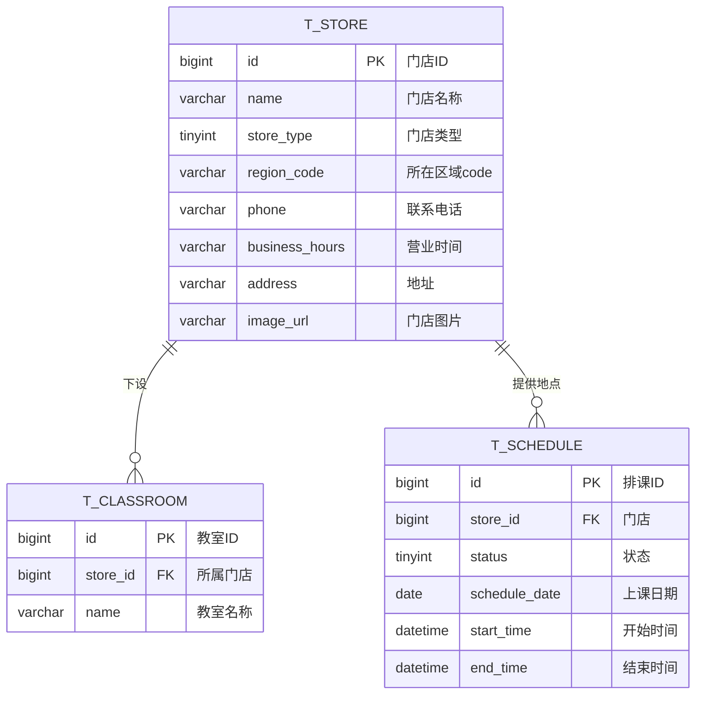
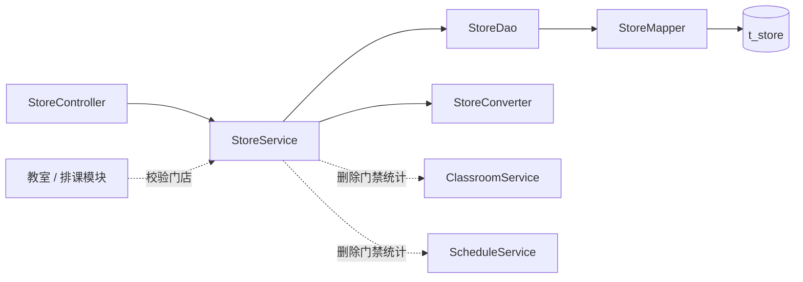

# 瑜伽普拉提门店管理详细设计文档

**版本：v2.0（重置版）**（2026-10-01）
**对应业务规则：** `BR-门店-001` ~ `BR-门店-010`、`BR-全局-006`、`BR-全局-007`、`BR-全局-009`
**上游文档：** [详细设计总览](详细设计总览.md)、[概要设计](../概要设计/概要设计.md) v2.0

---

# 1、数据架构

## 1.1 数据库 ER 模型

### 1.1.1 建模口径

| 项目 | 约定 |
|---|---|
| 表名 | `t_store`，业务表统一 `t_` 前缀 |
| 主键 | `id bigint unsigned`，雪花 ID，**应用侧生成** |
| 字符集 | `utf8mb4` / `utf8mb4_unicode_ci` |
| **删除** | **物理删除**：本表**不建 `deleted` 字段、不使用 `@TableLogic`**（`BR-门店-009`） |
| **状态** | **本表没有状态字段**（`BR-门店-008`） |
| 审计字段 | `create_by / create_time / update_by / update_time`，由公共审计处理器填充 |
| 字典 | `store_region`：`region_code` 的取值与区名翻译（若依 `sys_dict_data`） |
| 唯一约束 | `uk_store_name(name)`：门店名称唯一（`BR-门店-003`） |
| 关系 | 门店 1—N 教室（`t_classroom.store_id`）；门店 1—N 排课（`t_schedule.store_id`） |

### 1.1.2 表清单

| 表名 | 中文名 | 所属模块 | 本版状态 |
|---|---|---|---|
| `t_store` | 门店 | 门店管理 | **本版实现** |
| `t_classroom` | 教室 | 教室管理 | 本版实现；**门店删除门禁的统计对象** |
| `t_schedule` | 排课 | 排课管理 | 本版实现；**门店删除门禁的统计对象** |

### 1.1.3 ER 模型图



## 1.2 数据库逻辑模型

### 1.2.1 `t_store` 字段定义

| 字段 | 中文名 | 类型 | 必填 | 默认值 | 说明 |
|---|---|---:|:---:|---:|---|
| `id` | 门店ID | bigint unsigned | 是 | — | 雪花 ID，应用侧生成 |
| `name` | 门店名称 | varchar(64) | 是 | — | **全平台唯一** |
| `store_type` | 门店类型 | tinyint | 是 | — | `1` 主力店；`2` 精品店 |
| `region_code` | 所在区域 | varchar(6) | 是 | — | 上海市市辖区的**行政区划代码**，取值由字典 `store_region` 校验 |
| `phone` | 联系电话 | varchar(32) | 是 | — | 允许座机、手机号与分机等文本格式 |
| `business_hours` | 营业时间 | varchar(64) | 是 | — | 固定保存一段展示文本 |
| `address` | 地址 | varchar(255) | 是 | — | 用户端门店卡展示 |
| `image_url` | 门店图片 | varchar(255) | 否 | NULL | **单图**，存 URL |
| `create_by` | 创建人 | bigint unsigned | 否 | NULL | 公共审计填充 |
| `create_time` | 创建时间 | datetime | 是 | CURRENT_TIMESTAMP | 公共审计填充 |
| `update_by` | 更新人 | bigint unsigned | 否 | NULL | 公共审计填充 |
| `update_time` | 更新时间 | datetime | 是 | CURRENT_TIMESTAMP | ON UPDATE |

**本表刻意不建的字段**（与旧版设计的差别）：

| 不建的字段 | 原因 |
|---|---|
| `status`（启用／停用） | 门店**没有状态**（`BR-门店-008`） |
| `business_type`（经营类型） | 一期只做直营连锁，**不纳入**（`BR-全局-005`） |
| `province_code` / `city_code` | 一期**不做**地址跳地图（属前端能力，本版不考虑）；只保留**区级** code（即 `region_code`） |
| `contact_name`（联系人） | 门店**只留联系电话**，不设联系人 |
| `deleted` | **物理删除**（`BR-门店-009`） |

### 1.2.2 枚举值

| 枚举 | 值 | 文案 |
|---|---:|---|
| `store_type` | 1 | 主力店 |
| `store_type` | 2 | 精品店 |

**`region_code` 的取值与翻译由字典表维护**（若依 `sys_dict_data`，`dict_type = 'store_region'`）：

| code | 区名 | code | 区名 |
|---|---|---|---|
| 310101 | 黄浦区 | 310114 | 嘉定区 |
| 310104 | 徐汇区 | 310115 | 浦东新区 |
| 310105 | 长宁区 | 310116 | 金山区 |
| 310106 | 静安区 | 310117 | 松江区 |
| 310107 | 普陀区 | 310118 | 青浦区 |
| 310109 | 虹口区 | 310120 | 奉贤区 |
| 310110 | 杨浦区 | 310151 | 崇明区 |
| 310112 | 闵行区 | | |
| 310113 | 宝山区 | | |

> **存 code、不存区名**：数据库只落 6 位行政区划代码；**区名由字典表翻译**——后端返回时补 `regionName`，前端下拉也从字典取。
> 取值合法性**以字典为准**，代码里**不再另维护 Java 枚举**（[详细设计总览](详细设计总览.md) §5 决策 9）。

### 1.2.3 字段规则

1. 新增与修改都按**全量提交**处理：`name`、`store_type`、`region_code`、`phone`、`business_hours`、`address` 必填，`image_url` 可空。请求字段前后空格由转换层去除。
2. **名称唯一**：新增与修改都校验（修改时**排除自身**）；数据库层用 `uk_store_name` 兜底。
3. `business_hours` 只保存**一段展示文本**：不拆分时段，不做跨日、节假日与特殊营业日规则（`BR-门店-006`）。
4. `region_code` 必须是字典 `store_region` 中存在的 code，越界即拒绝。
5. 请求中**不允许**携带审计字段，一律由公共机制填充。
6. `image_url` 只保存**一个** URL，不建多图。

## 1.3 数据库物理模型

### 1.3.1 建表语句

```sql
CREATE TABLE `t_store` (
  `id`             bigint unsigned NOT NULL COMMENT '门店ID',
  `name`           varchar(64)  NOT NULL COMMENT '门店名称（全平台唯一）',
  `store_type`     tinyint      NOT NULL COMMENT '门店类型：1主力店 2精品店',
  `region_code`    varchar(6)   NOT NULL COMMENT '所在区域：上海市市辖区行政区划代码（字典 store_region）',
  `phone`          varchar(32)  NOT NULL COMMENT '联系电话',
  `business_hours` varchar(64)  NOT NULL COMMENT '营业时间展示文本',
  `address`        varchar(255) NOT NULL COMMENT '地址',
  `image_url`      varchar(255) DEFAULT NULL COMMENT '门店图片URL（单图）',
  `create_by`      bigint unsigned DEFAULT NULL COMMENT '创建人ID',
  `create_time`    datetime NOT NULL DEFAULT CURRENT_TIMESTAMP COMMENT '创建时间',
  `update_by`      bigint unsigned DEFAULT NULL COMMENT '更新人ID',
  `update_time`    datetime NOT NULL DEFAULT CURRENT_TIMESTAMP ON UPDATE CURRENT_TIMESTAMP COMMENT '更新时间',
  PRIMARY KEY (`id`),
  UNIQUE KEY `uk_store_name` (`name`)
) ENGINE=InnoDB DEFAULT CHARSET=utf8mb4 COLLATE=utf8mb4_unicode_ci COMMENT='门店基础信息表';
```

> **注意：** 本表**没有** `deleted` 与 `status` 字段；删除是对行执行 `DELETE`，删除后门店名称随即释放、可再次使用。

---

# 2、接口

## 2.1 通用约定

1. 管理端接口前缀 `/admin`，**依赖登录态**；HTTP 状态码固定 200，业务结果看响应 `code`。
2. 列表用 `TableDataInfo{total,rows,code,msg}`；详情、新增、修改、删除用 `AjaxResult{code,msg,data}`。
3. 主键在返回对象中由统一 Jackson 配置序列化为**字符串**；请求路径中的 `storeId` 也按字符串传递。
4. 新增与修改**不提交**审计字段；一期**没有状态字段**，因此本模块**没有状态接口**。
5. 请求字段 > 2 个时建 DTO（新增／修改），否则用查询参数。

## 2.2 门店管理接口

| # | 方法 | 路径 | 功能 | 登录 |
|---:|---|---|---|:---:|
| 1 | GET | `/admin/stores` | 查询门店列表 | 是 |
| 2 | GET | `/admin/stores/{storeId}` | 查询门店详情 | 是 |
| 3 | POST | `/admin/stores` | 新增门店 | 是 |
| 4 | PUT | `/admin/stores/{storeId}` | 修改门店 | 是 |
| 5 | DELETE | `/admin/stores/{storeId}` | 删除门店（物理，带门禁） | 是 |

> 用户端的门店列表见 [用户端接口详细设计](用户端接口详细设计.md) 的 `GET /api/stores`，**不在本文重复定义**。

### 2.2.1 查询门店列表

**请求：** `GET /admin/stores?name=徐汇&regionCode=310104&storeType=1&pageNum=1&pageSize=10`

| 参数 | 位置 | 类型 | 必填 | 说明 |
|---|---|---|---|:---:|---|
| `name` | query | string | 否 | 门店名称，模糊匹配，最长 64 |
| `regionCode` | query | string | 否 | 所在区域 code，**精确匹配**（字典 `store_region` 中的 code） |
| `storeType` | query | integer | 否 | `1` 主力店；`2` 精品店 |
| `pageNum` | query | integer | 否 | 默认 1 |
| `pageSize` | query | integer | 否 | 默认 10，最大 100 |

**返回示例：**

```json
{
  "total": 1,
  "rows": [
    {
      "id": "1856739201475235901",
      "name": "徐汇店",
      "storeType": 1,
      "regionCode": "310104",
      "regionName": "徐汇区",
      "phone": "021-12345678",
      "businessHours": "周一至周日 09:00-22:00",
      "address": "漕溪北路 88 号",
      "imageUrl": "https://cdn.example.com/store/1856739201475235901.jpg",
      "createTime": "2026-10-01 10:00:00",
      "updateTime": "2026-10-01 10:00:00"
    }
  ],
  "code": 200,
  "msg": "查询成功"
}
```

列表按 `store_type ASC, id DESC` **稳定排序**。

### 2.2.2 查询门店详情

**请求：** `GET /admin/stores/{storeId}`

成功时 `data` 为 `StoreDetailVO`，字段与列表项一致。门店不存在时返回业务码 `404`，提示"门店不存在或已被删除"。

### 2.2.3 新增门店

**请求：** `POST /admin/stores`

```json
{
  "name": "徐汇店",
  "storeType": 1,
  "regionCode": "310104",
  "phone": "021-12345678",
  "businessHours": "周一至周日 09:00-22:00",
  "address": "漕溪北路 88 号",
  "imageUrl": "https://cdn.example.com/store/1.jpg"
}
```

服务端先按 `name` 查重，重复则返回 `409`，提示"门店名称已存在"。成功只返回 `{ "code": 200, "msg": "操作成功" }`，**不返回新建门店 ID**。

### 2.2.4 修改门店

**请求：** `PUT /admin/stores/{storeId}`，请求体与新增一致（全量编辑）。

| 情形 | 处理 |
|---|---|
| 门店不存在 | `404` |
| 名称与**其它**门店重复 | `409` |
| 门店已被排课引用 | **仍允许修改**（`BR-门店-010`）：本接口**不做**引用检查 |

成功返回更新后的 `StoreDetailVO`。

### 2.2.5 删除门店

**请求：** `DELETE /admin/stores/{storeId}`

**物理删除**，删除前依次校验：

| # | 校验 | 不通过时 |
|---:|---|---|
| 1 | 门店存在 | `404` |
| 2 | 名下**没有教室**（调 `ClassroomService`） | `409`："该门店下仍有 N 间教室，无法删除" |
| 3 | 没有**未结束、且状态为待上架或已上架**的排课（调 `ScheduleService`） | `409`："该门店仍有 N 节未结束的排课，无法删除" |
| 4 | 上述统计**调用失败** | 拒绝删除，**不降级放行**（fail-closed，`BR-全局-007`） |

全部通过后执行 `DELETE FROM t_store WHERE id = ?`，返回统一成功响应。

> **已取消、已结束的历史排课不阻塞删除**；删除后这些历史排课上的门店显示为空，管理端做空值兜底（`BR-全局-009`）。

## 2.3 数据模型

### 2.3.1 `StoreListItemVO` / `StoreDetailVO`

| 字段 | 类型 | 说明 |
|---|---|---|
| `id` | string | 门店ID |
| `name` | string | 门店名称 |
| `storeType` | integer | `1` 主力店；`2` 精品店 |
| `regionCode` | string | 所在区域 code（字典 `store_region`） |
| `regionName` | string | 所在区域名称（后端按字典翻译后返回） |
| `phone` | string | 联系电话 |
| `businessHours` | string | 营业时间 |
| `address` | string | 地址 |
| `imageUrl` | string | 门店图片 URL（单图，可空） |
| `createTime` / `updateTime` | string | 时间字段 |

两个 VO 字段相同（门店字段不多，列表不裁剪）。

### 2.3.2 `StoreCreateDTO` / `StoreUpdateDTO`

两个请求模型字段相同：`name`、`storeType`、`regionCode`、`phone`、`businessHours`、`address`、`imageUrl`；使用 `@Valid` 校验非空与长度；`storeType` 与 `regionCode` 的取值范围另行校验；`imageUrl` 可空。

### 2.3.3 `StoreQuery`

列表筛选与分页：`name`、`regionCode`、`storeType`、`pageNum`、`pageSize`（上限 100）。

## 2.4 错误码

| code | 场景 | 文案 |
|---:|---|---|
| 200 | 成功 | 查询成功／操作成功 |
| 404 | 门店不存在 | 门店不存在或已被删除 |
| 409 | 名称重复 | 门店名称已存在 |
| 409 | 名下有教室 | 该门店下仍有 N 间教室，无法删除 |
| 409 | 仍有未结束的排课 | 该门店仍有 N 节未结束的排课，无法删除 |
| 409 | 引用统计失败 | 引用检查未完成，已拒绝本次删除 |
| 500 | 参数校验失败／系统异常 | 由统一异常处理器返回具体字段提示 |

---

# 3、开发架构

## 3.1 包结构

```text
com.techplant.yoga.store
├─ controller/StoreController.java
├─ service/StoreService.java              （同时供跨模块校验门店存在）
├─ service/impl/StoreServiceImpl.java
├─ dao/StoreDao.java、StoreDaoImpl.java
├─ mapper/StoreMapper.java
├─ domain/StoreDO.java
├─ dto/StoreCreateDTO.java、StoreUpdateDTO.java
├─ query/StoreQuery.java
├─ vo/StoreListItemVO.java、StoreDetailVO.java
├─ enums/StoreTypeEnum.java                （所在区域不建 Java 枚举，取值以字典 store_region 为准）
└─ convert/StoreConverter.java
```

## 3.2 类与职责

| 类 | 职责 |
|---|---|
| `StoreController` | 接收请求、触发校验、装配 `AjaxResult` / `TableDataInfo`；**不写业务规则** |
| `StoreService` / `StoreServiceImpl` | 名称唯一校验、存在性校验、**删除门禁编排**（调教室与排课的统计）、事务边界；并**对外**提供「校验门店存在」供教室与排课模块使用（**全项目统一不另立 QueryService**） |
| `StoreDao` / `StoreDaoImpl` | 组装筛选、分页、稳定排序；屏蔽 Mapper 细节 |
| `StoreMapper` | 继承 MyBatis-Plus `BaseMapper<StoreDO>` |
| `StoreDO` | 与 `t_store` 一一对应；**无逻辑删除字段、无状态字段** |
| `StoreCreateDTO` / `StoreUpdateDTO` | 新增／修改入参 |
| `StoreQuery` | 列表筛选与分页参数 |
| `StoreListItemVO` / `StoreDetailVO` | 接口出参，不暴露持久化实体 |
| `StoreTypeEnum` | 门店类型的固定枚举及其校验；**所在区域不建 Java 枚举**，取值校验与区名翻译都走字典 |
| `StoreConverter` | DTO、DO、VO 转换 |

## 3.3 调用关系



## 3.4 关键实现约定

1. **物理删除**：`StoreDO` **不加** `@TableLogic`；删除走 `DELETE`；业务代码**不要**手写 `deleted = 0`。
2. 列表 service 使用 `IPage`，转 `PageResult` 后由 controller 装配 `TableDataInfo`；排序固定 `store_type ASC, id DESC`。
3. 名称唯一校验放在 service（给出友好提示），`uk_store_name` 作并发兜底；捕获唯一键冲突时同样返回 `409`。
4. **删除门禁**：service 先调统计接口再删；统计异常一律抛 `ServiceException`，**不吞异常、不降级放行**。
5. `StoreDO` 不直接作为接口出参，避免把审计字段带给前端。

---

# 4、运行流程

## 4.1 查询列表

1. Controller 接收并校验 `StoreQuery`（`pageSize` 上限 100）。
2. Service 调 DAO；DAO 选择字段、追加筛选条件与稳定排序。
3. Service 将 DO 转为 `StoreListItemVO`，Controller 装配 `TableDataInfo`。

## 4.2 查询详情

1. Service 按 ID 查询；不存在 → `404`。
2. 转 `StoreDetailVO` 返回。

## 4.3 新增门店

1. Controller 校验必填、长度与枚举（`storeType` ∈ {1,2}；`regionCode` ∈ 字典 `store_region`）。
2. Service 按 `name` 查重；重复 → `409`。
3. 转 DO 插入；主键由雪花 ID 生成，审计字段由公共处理器填充。
4. 只返回统一成功响应，不返回新 ID。

## 4.4 修改门店

1. Service 按 ID 查询；不存在 → `404`。
2. 按 `name` 查重（**排除自身**）；重复 → `409`。
3. 全量覆盖业务字段并更新；返回最新详情。
4. **不做引用检查**——已被排课引用时仍允许修改。

## 4.5 删除门店

1. Service 按 ID 查询；不存在 → `404`。
2. 调 `ClassroomService` 统计名下教室数；> 0 → `409`（带数量）。
3. 调 `ScheduleService` 统计"未结束且状态为待上架或已上架"的排课数；> 0 → `409`（带数量）。
4. 任一次统计抛异常 → 直接以 `ServiceException` 终止，**不继续删除**。
5. 执行物理删除，返回成功。

---

# 5、菜单与 SQL 交付

1. `backend/sql/yoga.sql` 增加 `t_store` 建表语句（含 `uk_store_name`）与两条示例数据。
2. **同脚本增加字典数据**：`sys_dict_type` 一条（`dict_type = 'store_region'`、名称"门店所在区域"），`sys_dict_data` 十六条（`dict_value` = 6 位行政区划代码，`dict_label` = 区名），`dict_sort` 按上表顺序。
3. 同脚本在 `sys_menu` 增加"门店管理"菜单（挂在经营基础目录下），并绑定内置管理员角色。
4. 管理端页面：`frontend/pc/src/views/store/index.vue`，支持查询（名称／区域／类型）、新增、修改、删除；删除被拒时把服务端提示语（含数量）原样展示。
5. 管理端接口封装：`frontend/pc/src/api/store/store.js`。
6. 表单中"所在区域"用**字典下拉**（`store_region`，16 个区）、"门店类型"用下拉（主力店／精品店）；两者都**不允许手填**。列表与详情展示区域时，优先用后端返回的 `regionName`（不依赖前端翻译）。
