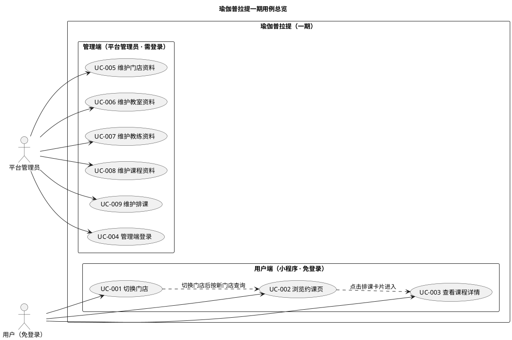

# 用例总览

**文档版本：v2.0（重置版）**（2026-10-01）

> **口径依据：** [`业务规则.md`](../需求文档/业务规则.md) v2.1（业务规则）、`docs/产品分析/`（对标真实 App 的用户端实测截图与页面跳转记录）、`docs/需求文档/{用户端,管理端}/`（功能范围）。三者都是需求依据，**没有"唯一权威"**；冲突时**回到讨论确认**，以当次结论为准。
>
> 本文件给出**总用例图**与**用例清单**；每条用例的详细描述见同目录 `用例/` 下的独立 Markdown（**一条用例一个文件**）。本文件与各用例文件**只引用规则编号，不复制规则条文**。

---

## 1. 总用例图

> **说明：** 一期**只有一个管理角色（平台管理员）**，不设菜单／按钮权限与数据范围（`BR-全局-003`）。**管理端登录**（UC-004）是其余管理端用例的前置条件，同时单独成用例。用户端**免登录**，不存在"游客／会员"的区分（`BR-全局-002`）。

## 2. 参与者

| 参与者 | 类型 | 说明 |
|---|---|---|
| **用户** | 人员（**未登录**） | 用户端使用者。**不需要登录**即可浏览门店、排课与课程详情（`BR-全局-002`）；一期不提供任何写操作 |
| **平台管理员** | 人员（需登录） | 管理端唯一角色（`BR-全局-003`）。用**用户名 ＋ 密码**登录（`BR-全局-004`），维护门店、教室、教练、课程与排课 |

## 3. 用例清单

| 编号 | 用例名称 | 端 | 主要参与者 | 包含的业务功能 | 详细描述 |
|---|---|---|---|---|---|
| UC-001 | 切换门店 | 用户端 | 用户 | 门店列表（只返回未删除、**分页**、**按区域筛选与名称／地址关键字搜索**）、默认选中第一家、切换并记住当前门店、无门店空态 | [UC-001](用例/UC-001-切换门店.md) |
| UC-002 | 浏览约课页 | 用户端 | 用户 | 门店 ＋ 日期查询、14 天日期条默认今天、固定过滤条件（排除「待上架」）、课种 Tab 四类、排课卡片要素（含状态）、空态 | [UC-002](用例/UC-002-浏览约课页.md) |
| UC-003 | 查看课程详情 | 用户端 | 用户 | 课程资料（封面／课种／难度／介绍）、本次上课信息（时间／教练姓名头像**简介**／门店／教室）、状态、最大人数、最低开课人数、预约人员、剩余名额、「立即预约」提示敬请期待 | [UC-003](用例/UC-003-查看课程详情.md) |
| UC-004 | 管理端登录 | 管理端 | 平台管理员 | 用户名 ＋ 密码登录、必须登录才能访问管理端 | [UC-004](用例/UC-004-管理端登录.md) |
| UC-005 | 维护门店资料 | 管理端 | 平台管理员 | 查询、新增、修改、删除门店；名称唯一；门店类型枚举、所在区域走字典；**不设「联系人」**；无状态；删除门禁（名下教室、未结束的排课） | [UC-005](用例/UC-005-维护门店资料.md) |
| UC-006 | 维护教室资料 | 管理端 | 平台管理员 | 查询、新增、修改（只改名称）、删除教室；同门店内不重名；无状态；删除门禁 | [UC-006](用例/UC-006-维护教室资料.md) |
| UC-007 | 维护教练资料 | 管理端 | 平台管理员 | 查询、新增、修改、删除教练；名称允许重名；相册上限 5 张；不设技能／头衔／金牌；删除门禁 | [UC-007](用例/UC-007-维护教练资料.md) |
| UC-008 | 维护课程资料 | 管理端 | 平台管理员 | 查询、新增、修改、删除课程；名称全平台唯一；课种四类；难度 1~5 星；封面单图；**课种由排课做快照**；删除门禁 | [UC-008](用例/UC-008-维护课程资料.md) |
| UC-009 | 维护排课 | 管理端 | 平台管理员 | 查询、新增、修改、删除排课；四项要素与人数校验；教练时间不重叠；同门店＋课程＋完全相同起止时间不重复；14 天窗口；待上架／已上架／已取消的流转与删除限制；**课种快照**；**只有「待上架」可编辑**；已预约人数只读 | [UC-009](用例/UC-009-维护排课.md) |

> **编号规则：** `UC-<三位序号>`，本版为重置版，编号**从 001 重新开始**。
> **文件命名：** `用例/UC-<三位序号>-<用例名称>.md`，与上表一一对应。

## 4. 一条用例包含哪些小节

| 小节 | 内容 |
|---|---|
| 概览 | 用例编号、用例名称、主要参与者、参与方、业务目标、涉及模块、状态 |
| 前置条件 | 用例开始前必须已经成立的事实 |
| 主成功场景 | 参与者操作与应用响应的业务步骤，只写影响业务结果的步骤 |
| 替代流程 | 条件不满足、冲突等分支及处理结果 |
| 后置条件 | 成功后与失败后各自必须成立的状态 |
| 业务规则 | 本用例引用的《业务规则》编号及各自在本用例中的作用 |

**写法口径：** 用中文业务语言描述，**不写**接口路径、表名、类名与 SQL；**不复制**《业务规则》条文，只引用编号。

## 5. 与其它文档的关系

| 文档 | 关系 |
|---|---|
| [`docs/需求文档/业务规则.md`](../需求文档/业务规则.md) | **业务口径依据之一**；本用例集只引用其编号 |
| [`docs/产品分析/`](../../产品分析/) | **用户端界面与跳转的依据**（对标真实 App 的实测截图与页面跳转梳理） |
| [`docs/需求文档/{用户端,管理端}/*功能清单.md`](../需求文档/) | 功能范围来源 |
| [`docs/需求分析/需求分析.md`](需求分析.md) | 功能结构图、功能简介与领域类图的所在；其用例章节由本用例集展开 |

> **口径说明：** 本用例集只以需求文档、产品分析与需求分析为依据。`docs/详细设计/`、`docs/概要设计/` 属**旧设计**，**不作为依据**，也不在本用例集中引用。
