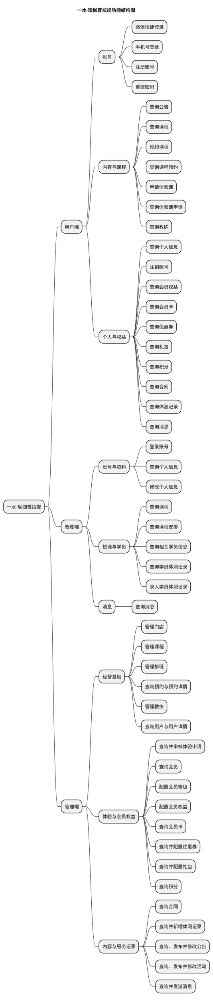
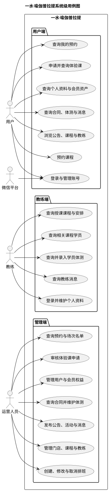
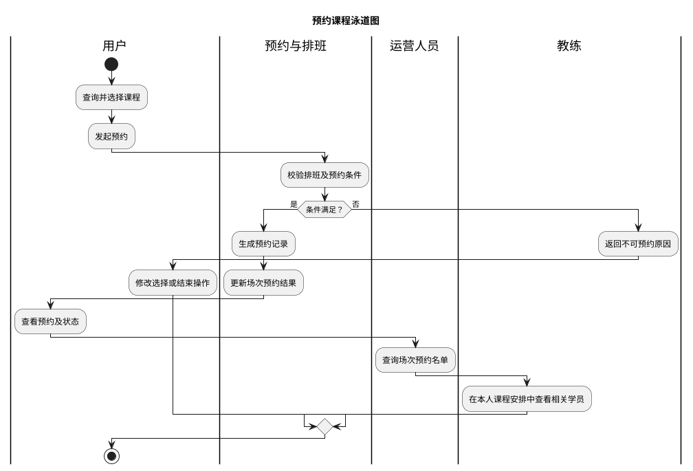
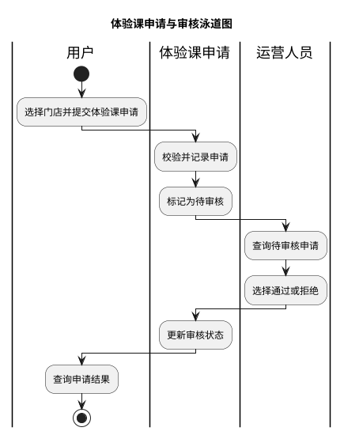
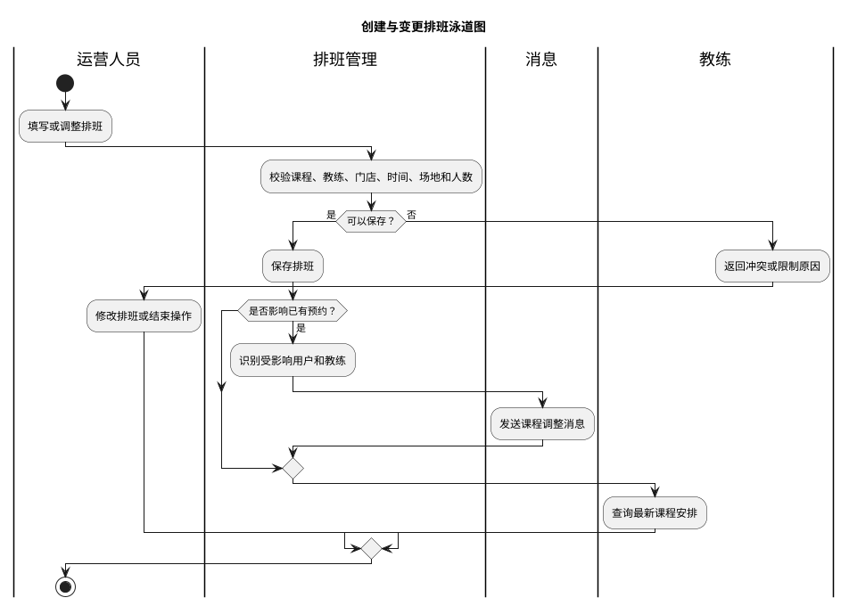
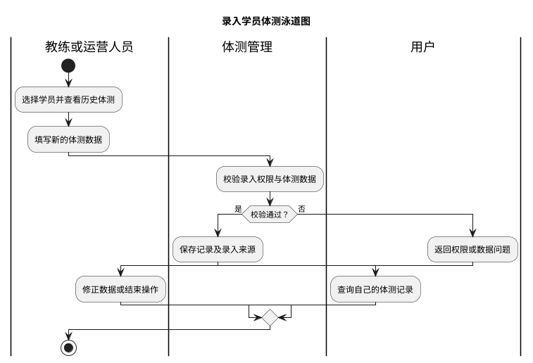
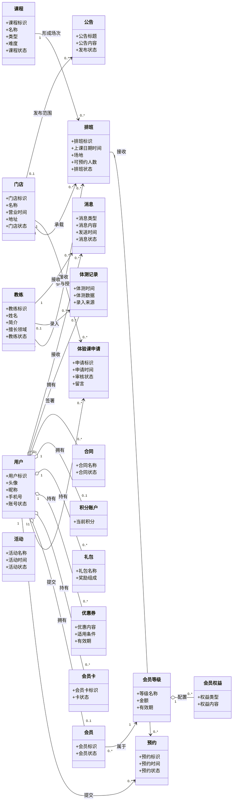

# 一水·瑜伽普拉提需求分析文档

**版本：v0.2**（2026-09-22）
**范围：用户端、教练端、管理端**

> 本文按照 `docs/模板/需求分析文档模板.md` 编写。
> 功能范围以 2026-09-20 的三份 v1 功能清单为当前基线；现有小程序证据以 `docs/产品分析/页面与跳转梳理.md` v2.1 及其截图为准。
> 教练端和管理端目前有功能清单及结构草稿，但没有与用户端同等级的真机或成品页面证据；结构草稿可用于辅助推断，不能单独证明功能已确认或已实现。

## 0. 口径与证据说明

### 0.1 状态标记

| 标记 | 含义 | 使用规则 |
|---|---|---|
| **已确认事实** | 三份最新功能清单明确列出的能力，或现有小程序已经实测的行为 | 可以作为当前需求基线，但“清单已列出”不等于“已经实现” |
| **建议方案** | 为使三端形成完整业务闭环而提出的流程、职责或状态建议 | 需要产品确认后才能转为正式需求 |
| **TODO-待确认** | 清单没有说明、不同资料不一致，或缺少实现证据的事项 | 不应据此直接开展详细设计或验收 |
| **证据不一致** | 推断或清单范围与现有小程序实测证据不一致 | 必须先决定“沿用现状”还是“按新需求改造” |

### 0.2 当前需求基线

| 端别 | 基线文件 | 已确认功能数 | 实现证据 |
|---|---|---:|---|
| 用户端 | `docs/需求文档/用户端/用户端功能清单.md` v1 | 21 | 有现有微信小程序截图和真机跳转梳理，但只覆盖部分功能 |
| 教练端 | `docs/需求文档/教练端/教练端功能清单.md` v1 | 9 | 暂无真机或成品页面证据 |
| 管理端 | `docs/需求文档/管理端/管理端功能清单.md` v1 | 42 | 暂无真机或成品页面证据 |

### 0.3 证据优先级与辅助推断来源

发生冲突时按以下顺序判断：

1. **最新功能清单**：决定当前目标功能范围；
2. **现有小程序实测与截图**：证明用户端现状，但不自动决定新版本是否保留；
3. **产品结构图、功能结构图、页面结构图**：用于补充页面分组、状态、字段和参与者边界，只作为建议或 TODO；
4. **需求分析中的业务补全**：用于连通跨端流程，必须明确标记为建议方案。

| 推断编号 | 辅助来源 | 可支持的推断 | 采用方式 |
|---|---|---|---|
| I01 | `用户端产品结构图.md` | 门店、活动、打卡、协议、会员资产明细、预约状态和登录方式的候选页面结构 | 与现有小程序一致的部分作为现状佐证；超出最新清单的部分仍列 TODO |
| I02 | `教练端功能结构图.md` | 教练课程可按待上课/今日/已完成组织；可能需要课程详情、搜索筛选、课程统计、系统通知和公告 | 作为教练端信息架构建议，不直接扩展已确认功能 |
| I03 | `教练端功能结构图.md` | 工号密码、手机验证码、一键登录是教练登录方式候选；“取消课程”可能是教练动作 | 登录方式和取消权限均列 TODO；尤其取消课程与最新清单不一致 |
| I04 | `管理端页面结构图.md` | 工作台指标、列表筛选项、业务状态、详情字段、后台账号/角色/权限是候选后台结构 | 与功能清单一致的部分用于细化用例；超出清单的系统管理仍列 TODO |
| I05 | `用户端功能结构图.md`、`管理端功能结构图.md` | 两个文件当前为空 | 不形成任何需求证据 |

### 0.4 与现有小程序证据不一致或缺少证据的推断

| 编号 | 状态 | 推断或范围项 | 现有证据 | 本文处理 |
|---|---|---|---|---|
| E01 | **证据不一致** | 用户端应包含“浏览活动/活动详情” | 现有小程序实测有活动列表入口；最新用户端清单未列活动查询，而管理端清单保留发布、修改活动 | 不把用户活动查询写成已确认用例；列为 TODO-待确认 |
| E02 | **证据不一致** | “我要打卡”属于本期用户功能 | 现有小程序实测为静态分享海报轮播、保存和转发；三份最新清单均未列打卡或海报 | 从已确认范围移除；列为存量能力去留 TODO |
| E03 | **证据不一致** | 用户可以取消预约、查看预约详情 | 现有小程序只有空态页面，详情与取消从未实测；最新用户端清单只确认“查询课程预约及状态” | 不再作为已确认用例；取消规则列为 TODO |
| E04 | **证据不一致** | 用户端包含门店切换和地图导航 | 现有小程序实测有“换店”入口和微信内置地图；最新用户端清单没有门店模块 | 仅作为存量能力记录，不纳入当前已确认范围 |
| E05 | **证据不一致** | 用户端完整保留密码登录、协议页等现状 | 现有小程序实测有手机号+密码登录、注册、忘记密码、用户协议、隐私协议；最新清单只确认微信快捷登录、手机号登录、注册和重置密码，未明确协议及手机号登录方式 | 登录方式细节和协议承载方式列为 TODO |
| E06 | **证据不一致** | 管理端发布的活动一定在用户小程序展示 | 管理端清单确认活动发布；用户端清单没有活动查询 | 活动发布对象、展示渠道和上下线规则列为 TODO |
| E07 | **缺少证据** | 教练可以取消课程、处理签到或修改预约 | 教练端最新清单只确认查询课程/安排/学员、维护个人资料、查询与录入体测、查询消息 | 明确排除在教练当前边界之外 |
| E08 | **缺少证据** | 运营人员可以代用户预约、取消预约或调整会员资产 | 管理端最新清单没有这些操作 | 明确排除在运营当前边界之外，若需要须新增需求 |
| E09 | **缺少证据** | 后台已包含账号、角色和权限管理 | 管理端页面结构草稿存在这些页面，但最新管理端功能清单未列出 | 不纳入已确认范围；列为 TODO |
| E10 | **部分一致** | 教练详情中的相册由后台维护 | 现有小程序能看到教练相册区域但无内容；用户端清单确认可查询相册，管理端清单的“修改教练”描述未明确相册 | 作为建议方案，待确认相册维护责任 |
| E11 | **证据不一致** | 用户端产品结构图将手机号通道写为“手机验证码登录” | 现有小程序实测为手机号+密码登录；短信验证码用于注册和重置密码 | 最新清单只写“手机号登录”，具体认证方式列为 TODO |
| E12 | **证据不一致** | 用户端产品结构图将约课分类写为团课、私教课、体验课、特色课 | 现有小程序实测分类为团课、精品课、私教课、特色课；体验课是独立申请审核流程 | 不沿用“体验课 Tab”推断，课程分类列为 TODO |
| E13 | **证据不一致** | 用户端产品结构图把教练详情中的课程描述为“可预约课程” | 现有小程序的约教练页是只读课表，课程卡无响应且没有预约入口 | 当前只确认查询教练及相关课程；是否从教练详情发起预约列为 TODO |

---

# 1. 功能分析

## 1.1 功能结构图

下图只展开三份最新功能清单中的已确认功能。现有小程序独有但未进入清单的活动浏览、打卡海报、门店切换和地图导航不混入基线。

**已确认事实：** 三端共同围绕课程、排班、预约、体验课、体测和消息协作；用户端负责消费与查询，教练端负责查看授课信息并录入学员体测，管理端负责经营资料配置和审核。

**建议方案：** 后续功能结构图继续以业务能力组织，不把页面、接口或数据库操作作为功能层级。

**TODO-待确认：** 管理端账号、角色、权限、预约人工处理、签到、课程核销等能力是否属于本期。

## 1.2 功能简介

本节与 1.1 功能结构图保持一致，只介绍三份最新功能清单已经确认的业务能力。现有小程序独有但未进入最新清单的功能，以及由结构草稿推断的候选能力，仍按 0.3、0.4 节的口径处理。

### 1.2.1 用户端

用户端主要面向瑜伽及普拉提服务的用户，用于完成账号访问、课程与教练查询、课程预约、体验课申请，以及个人资料和会员资产查询。

#### 1.2.1.1 账号

账号模块用于建立和维护用户的登录身份，使用户能够进入需要身份识别的个人业务。

- **微信快捷登录**：支持用户通过微信授权完成登录。
- **手机号登录**：支持用户使用手机号完成登录；具体认证方式仍按 E05、E11 列为 TODO-待确认。
- **注册账号**：支持新用户通过手机号创建账号。
- **重置密码**：支持用户验证身份后重新设置密码。

#### 1.2.1.2 内容与课程

内容与课程模块用于帮助用户了解门店服务内容、查找合适的课程与教练，并完成正式课程预约或体验课申请。

- **查询公告**：支持用户查看平台或门店发布的公告。
- **查询课程**：支持用户按门店、日期和课程类型等条件查询课程及课程信息。
- **预约课程**：支持用户选择符合条件的课程并提交预约。
- **查询课程预约**：支持用户查询自己的课程预约及状态。
- **申请体验课**：支持用户向指定门店提交体验课申请。
- **查询体验课申请**：支持用户查询自己提交的体验课申请及审核状态。
- **查询教练**：支持用户查询教练资料、相册及相关课程；是否可从教练详情直接预约仍按 E13 列为 TODO-待确认。

#### 1.2.1.3 个人与权益

个人与权益模块用于集中展示用户身份信息、会员权益、个人资产和服务记录，并支持用户管理自己的账号。

- **查询个人信息**：支持用户查看头像、昵称、会员等级和手机号等个人资料。
- **注销账号**：支持用户发起本人账号注销申请。
- **查询会员权益**：支持用户查看会员等级及各等级对应的权益内容。
- **查询会员卡**：支持用户查询自己持有的会员卡及状态。
- **查询优惠券**：支持用户查询自己拥有的优惠券。
- **查询礼包**：支持用户查询自己拥有的礼包及礼包内容。
- **查询积分**：支持用户查询自己的积分及相关记录。
- **查询合同**：支持用户查询自己的合同及合同状态。
- **查询体测记录**：支持用户查询自己的历史体测记录。
- **查询消息**：支持用户查询收到的业务通知和运营消息。

### 1.2.2 教练端

教练端主要面向承担授课和体测工作的教练，用于维护允许自主管理的个人资料、查看本人课程安排与相关学员，并完成学员体测记录的查询和录入。

#### 1.2.2.1 账号与资料

账号与资料模块用于识别教练身份，并维护对用户和运营人员展示的教练基础资料。

- **登录账号**：支持教练登录教练端；工号密码、手机验证码或一键登录等候选方式仍按 I03 列为 TODO-待确认。
- **查询个人信息**：支持教练查看自己的头像、姓名、简介和擅长领域等资料。
- **修改个人信息**：支持教练修改允许自行维护的个人资料；具体可编辑字段仍需确认。

#### 1.2.2.2 授课与学员

授课与学员模块用于帮助教练掌握本人授课任务、查看与课程相关的学员，并在授权范围内维护学员体测数据。

- **查询课程**：支持教练查询自己负责或参与授课的课程。
- **查询课程安排**：支持教练查询自己的上课日期、时间、门店、教室和预约情况。
- **查询相关学员信息**：支持教练查询与本人课程相关的学员基本信息，不提供全量用户查询。
- **查询学员体测记录**：支持教练查询相关学员已有的体测记录。
- **录入学员体测记录**：支持教练为相关学员录入新的体测数据。

#### 1.2.2.3 消息

消息模块用于向教练传递与授课工作相关的信息。

- **查询消息**：支持教练查询课程调整、预约变化等消息通知。

### 1.2.3 管理端

管理端主要面向运营人员，用于维护瑜伽业务的基础经营资料和排班，处理体验课申请，配置会员权益，并管理面向用户和教练的内容与消息。

#### 1.2.3.1 经营基础

经营基础模块用于维护门店、课程、排班、教练和用户等核心经营资料，并为课程履约提供预约查询能力。

- **管理门店**：支持运营人员查询、新增、修改门店，并设置门店是否正常对外提供服务。
- **管理课程**：支持运营人员查询、新增、修改课程，并设置课程是否可继续用于排班或展示。
- **管理排班**：支持运营人员查询排班，为课程创建和修改具体安排，并取消尚未完成的排班。
- **查询预约与预约详情**：支持运营人员查询预约记录，以及指定课程场次的预约人数和预约用户。
- **管理教练**：支持运营人员查询、新增、修改教练，并设置教练是否可继续参与排班和授课。
- **查询用户与用户详情**：支持运营人员查询平台注册用户，并查看用户的会员、会员卡、积分、合同和体测等关联信息。

#### 1.2.3.2 体验与会员权益

体验与会员权益模块用于处理体验课申请，并维护会员等级以及面向会员发放或展示的权益资产。

- **查询并审核体验申请**：支持运营人员查询用户提交的体验课申请，并设置通过或拒绝结果。
- **查询会员**：支持运营人员查询用户的会员等级和会员状态。
- **配置会员等级**：支持运营人员配置会员等级名称、金额和有效期等规则。
- **配置会员权益**：支持运营人员配置不同会员等级对应的折扣、优惠券和礼包等权益。
- **查询会员卡**：支持运营人员查询用户持有的会员卡及状态。
- **查询并配置优惠券**：支持运营人员查询优惠券配置和用户持券情况，并维护优惠内容、适用条件和有效期。
- **查询并配置礼包**：支持运营人员查询礼包及礼包内容，并维护礼包名称、组成和奖励信息。
- **查询积分**：支持运营人员查询用户积分及相关记录。

#### 1.2.3.3 内容与服务记录

内容与服务记录模块用于查询用户服务记录，维护体测数据，并向用户或教练发布业务内容和消息。

- **查询合同**：支持运营人员查询用户合同及合同状态。
- **查询并新增体测记录**：支持运营人员查询用户已有体测记录，并为用户新增体测数据。
- **查询、发布并修改公告**：支持运营人员维护面向平台或门店的公告内容。
- **查询、发布并修改活动**：支持运营人员维护活动内容；活动在用户端的展示渠道仍按 E01、E06 列为 TODO-待确认。
- **查询并发送消息**：支持运营人员查询系统产生或发送的消息，并向指定用户、教练或用户群体发送消息。

---

# 2. 用例分析

## 2.1 应用用例图

由于三端合计 72 项功能，一张图逐项展开会影响阅读。系统级用例图按业务目标合并简单增删改查，并保留三类核心参与者及微信平台。

> **已确认事实：** 微信平台只作为微信快捷登录的外部依赖出现在当前基线中。现有小程序还调用微信位置、地图、保存和转发能力，但对应业务功能未进入最新清单，见 E02、E04。

## 2.2 参与者与核心用例边界

| 参与者 | 已确认职责 | 当前不属于该参与者的职责 | 建议方案 / TODO-待确认 |
|---|---|---|---|
| 用户 | 登录/注册/重置密码；浏览公告、课程和教练；预约并查询自己的课程；申请并查询自己的体验课；查询自己的资料、权益、资产、合同、体测和消息；申请注销账号 | 维护课程、排班、教练或会员规则；审核体验课；查看其他用户资料 | **TODO：** 预约取消、签到、支付/扣卡、预约成功条件、注销审批与数据保留规则 |
| 教练 | 登录；查询和修改允许自维护的个人资料；查询自己负责或参与的课程和课程安排；查询与当前课程相关的学员；查询及录入学员体测；查询课程与预约变化消息 | 创建或修改排班；取消课程；审核体验课；修改预约状态；配置会员权益；查看与本人课程无关的学员 | **建议：** 以“授课关系”作为学员数据访问边界。**TODO：** 可见时间范围、体测字段和历史记录修改权限 |
| 运营人员 | 维护门店、课程、排班、教练；查询用户、预约及场次名单；审核体验课；配置会员等级、权益、优惠券、礼包；查询会员卡、积分、合同；查询/新增体测；发布公告、活动和消息 | 以教练身份授课；代替用户完成个人端操作；修改教练自行维护字段（除非后台明确拥有覆盖权） | **建议：** 将运营细分为内容运营、课程运营、会员运营等角色。**TODO：** RBAC、数据范围、敏感信息脱敏、人工改约/取消权限 |
| 微信平台 | 为微信快捷登录提供授权能力 | 决定课程、预约、会员或审核业务规则 | **TODO：** 手机号登录是否也使用微信手机号能力，还是账号密码/验证码方案 |

### 2.2.1 教练参与者的边界结论

- **已确认事实：** 教练是授课执行者和体测录入者，不是课程、排班和预约规则的配置者。
- **已确认事实：** 教练只能查询“与当前课程相关”的学员基本信息；最新清单没有授权其查询全部用户。
- **建议方案：** 学员可见范围由“教练参与授课的排班场次”派生，课程结束后保留只读历史，避免教练端变成通用用户查询入口。
- **TODO-待确认：** 教练可以修改哪些个人字段；能否修改或作废本人录入的体测；能否查看学员手机号、会员卡、合同等敏感信息。
- **证据说明：** `教练端功能结构图.md` 草稿包含“取消课程”，但最新教练端功能清单没有该功能，因此本文不确认教练取消课程能力（E07）。

### 2.2.2 运营参与者的边界结论

- **已确认事实：** 运营人员负责基础经营资料、排班、体验审核、会员权益和内容消息配置；其预约能力仅确认“查询预约/详情”，未确认修改预约。
- **已确认事实：** 管理端与教练端都能新增/录入体测记录，存在职责重叠。
- **建议方案：** 教练负责授课场景的体测录入，运营负责线下补录、纠错或非课程场景录入；每条记录保留来源和录入人。
- **TODO-待确认：** 运营能否修改/删除体测，能否人工改约或取消预约，能否调整积分/会员卡/合同状态，是否需要审批与操作日志。
- **证据说明：** 管理端页面结构草稿包含后台账号、角色和权限，但最新管理端功能清单未列出，不能作为已确认范围（E09）。

## 2.3 用例描述

简单查询与配置功能以三份功能清单和 2.1 用例图为准。以下只详写跨端核心流程和边界尚需澄清的用例。

### 2.3.1 预约课程

#### （1）简要说明

**已确认事实：** 用户查询课程后选择课程并完成预约，之后可以查询自己的预约及状态；运营人员可以查询预约记录和某一课程场次的预约人数、预约用户；教练可以查看自己的课程安排及相关学员。

**建议方案：** 将“课程基础信息”和“可预约排班场次”区分，预约实际指向排班场次。

**TODO-待确认：** 预约是否需要会员卡、次数、余额或支付；名额占用时点；重复预约限制；取消、签到、爽约和候补规则。

#### （2）事件流

1. 用户按门店、日期、课程类型等条件查询课程；
2. 应用展示满足条件的课程及可预约信息；
3. 用户选择课程并发起预约；
4. 应用生成预约结果；
5. 用户在“我的预约”中查询预约及状态；
6. 运营人员在管理端查询预约和场次名单；
7. 教练在自己的课程安排中查看与该课程相关的学员。

**异常或分支事件流（建议方案）：**

1. 当排班已取消、已结束或名额不足时，应用拒绝预约并说明原因；
2. 当用户不满足预约资格时，应用提示缺少的会员权益、会员卡或其他条件；
3. 预约提交结果不明确时，应用以服务端最终预约记录为准，避免重复预约。

#### （3）泳道图

> 泳道中的“校验预约条件”和“更新场次预约结果”是为表达完整业务主线提出的**建议方案**；具体规则仍为 TODO，不代表已由现有小程序证实。

### 2.3.2 申请并审核体验课

#### （1）简要说明

**已确认事实：** 用户向指定门店提交体验课申请并查询审核状态，运营人员查询申请并设置通过或拒绝结果。现有小程序也实测到“申请待审核 / 审核通过 / 审核拒绝”状态。

**建议方案：** 审核结果通过消息通知用户，并保留审核人、审核时间和意见。

**TODO-待确认：** 是否必须登录、重复申请限制、审核通过后是否自动形成课程预约、拒绝是否必须填写原因。

#### （2）事件流

1. 用户选择门店并提交体验课申请；
2. 应用记录申请并将其置为待审核；
3. 运营人员查询待审核申请；
4. 运营人员审核并选择通过或拒绝；
5. 应用更新审核状态；
6. 用户查询体验课申请及审核状态。

**异常或分支事件流（建议方案）：**

1. 当必填信息不完整时，应用不接受提交并提示补充；
2. 当存在未结束的重复申请时，应用提示用户查看原申请；
3. 审核拒绝时记录原因，供用户和运营人员后续查询。

#### （3）泳道图

### 2.3.3 创建与变更排班

#### （1）简要说明

**已确认事实：** 运营人员为指定课程设置教练、门店、时间、场地、人数等安排，可以查询、修改和取消尚未完成的排班；教练只能查询自己的课程与安排。

**建议方案：** 排班变更影响已有预约时，应用产生消息并同步给受影响用户和教练。

**TODO-待确认：** 时间冲突规则、修改截止时间、取消排班后的预约处理、通知渠道和失败补偿。

#### （2）事件流

1. 运营人员选择课程、教练、门店、日期时间、场地和人数创建排班；
2. 应用校验排班所需信息；
3. 应用保存排班，供用户查询课程、供教练查询课程安排；
4. 运营人员按需要修改或取消尚未完成的排班；
5. 教练查询更新后的课程安排。

**异常或分支事件流（建议方案）：**

1. 教练、场地或时间冲突时，应用拒绝保存并指出冲突项；
2. 已有预约的排班被修改或取消时，应用标记受影响预约并发送消息；
3. 已完成的排班不允许直接修改或取消。

#### （3）泳道图

> “冲突校验、识别受影响预约并发送消息”属于**建议方案**；功能清单只确认排班维护和消息能力，没有确认二者已经自动联动。

### 2.3.4 录入学员体测

#### （1）简要说明

**已确认事实：** 教练可以查询相关学员已有体测并录入新体测；运营人员可以查询用户体测并新增体测；用户只能查询自己的体测记录。

**建议方案：** 教练仅能为其授课相关学员录入，运营人员用于补录和纠错；记录需要保存来源与录入人。

**TODO-待确认：** 体测指标、单位、附件、修改/删除规则、用户可见时点、敏感健康数据授权与保存期限。

#### （2）事件流

1. 教练从本人课程的相关学员中选择学员，或运营人员从用户详情中选择用户；
2. 录入人查询学员已有体测记录；
3. 录入人填写新的体测数据并提交；
4. 应用校验并保存体测记录；
5. 用户在用户端查询自己的体测记录。

**异常或分支事件流（建议方案）：**

1. 教练与学员不存在有效授课关系时，应用拒绝访问或录入；
2. 指标缺失、单位不合法或数据明显异常时，应用提示确认；
3. 已发布给用户的记录需要更正时，保留更正前后痕迹。

#### （3）泳道图

---

# 3. 领域类图

## 3.1 领域对象边界

**已确认事实：** 三份功能清单能够直接识别门店、课程、排班、预约、体验课申请、教练、用户、会员、会员等级、会员权益、会员卡、优惠券、礼包、积分、合同、体测记录、公告、活动和消息等业务对象。

**建议方案：** “排班”承载具体上课时间、门店、教练、场地和人数；“预约”关联用户与排班，而不是直接关联课程。体测记录保留录入者与录入来源。

**TODO-待确认：** 会员与用户是否一对一；会员卡是否承担预约资格或扣次；合同、会员卡与会员等级的关系；活动是否面向用户端；消息由业务事件自动产生还是仅由运营人工发送。

## 3.2 Mermaid 领域类图

> 活动暂未连接用户，因为“管理端发布活动”和“用户端是否展示活动”存在 E01/E06 的范围不一致；待确认展示渠道后再补关联。

## 3.3 待确认事项汇总

| 优先级 | TODO-待确认 | 影响范围 |
|---|---|---|
| P0 | 预约资格、名额占用、支付/扣卡、重复预约、取消、签到、爽约和候补规则 | 用户预约、排班、预约管理、教练学员名单 |
| P0 | 排班修改/取消对已有预约的处理与通知规则 | 管理端排班、用户消息、教练消息 |
| P0 | 教练查看学员的授权范围及手机号、体测等敏感数据边界 | 教练端、隐私合规 |
| P0 | 体验课是否要求登录、是否允许重复申请、审核通过后是否自动转预约 | 用户端、管理端审核 |
| P1 | 教练和运营都能录入体测时的分工、修改/作废权限及审计要求 | 教练端、管理端、用户端 |
| P1 | 活动是否继续面向用户小程序展示；若展示，详情、报名和上下线规则是什么 | E01、E06，用户端与管理端 |
| P1 | 现有小程序的打卡海报、门店切换、地图导航、协议页是否保留 | E02、E04、E05 |
| P1 | 会员等级、权益、会员卡、优惠券、礼包、积分、合同之间的业务关系 | 会员资产领域和预约资格 |
| P1 | 管理端是否需要后台账号、角色、权限和数据范围控制 | E09，管理端安全边界 |
| P2 | 公告和消息的目标范围、自动触发场景、已读状态及发送失败处理 | 用户端、教练端、管理端 |
| P2 | 注销账号的验证、审批、冷静期、数据保留和恢复规则 | 用户端账号管理 |
