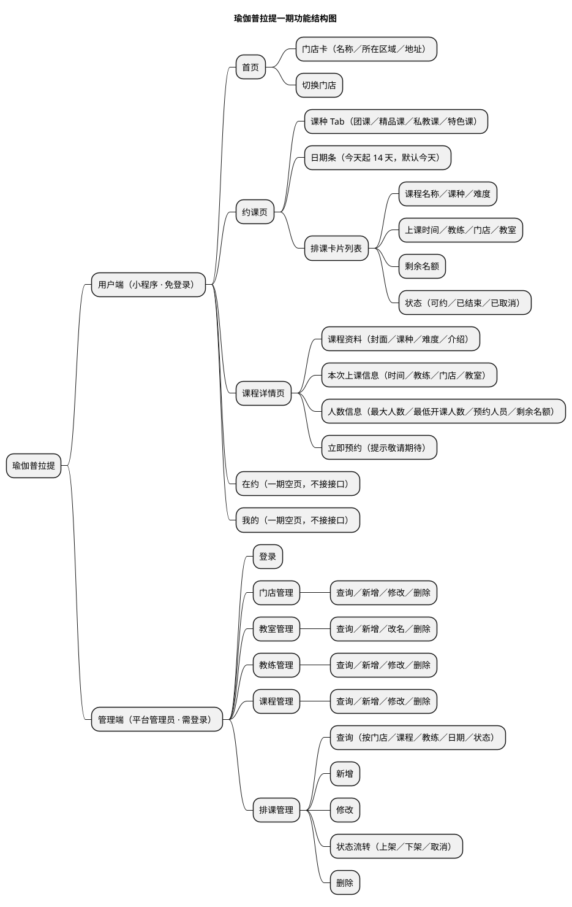
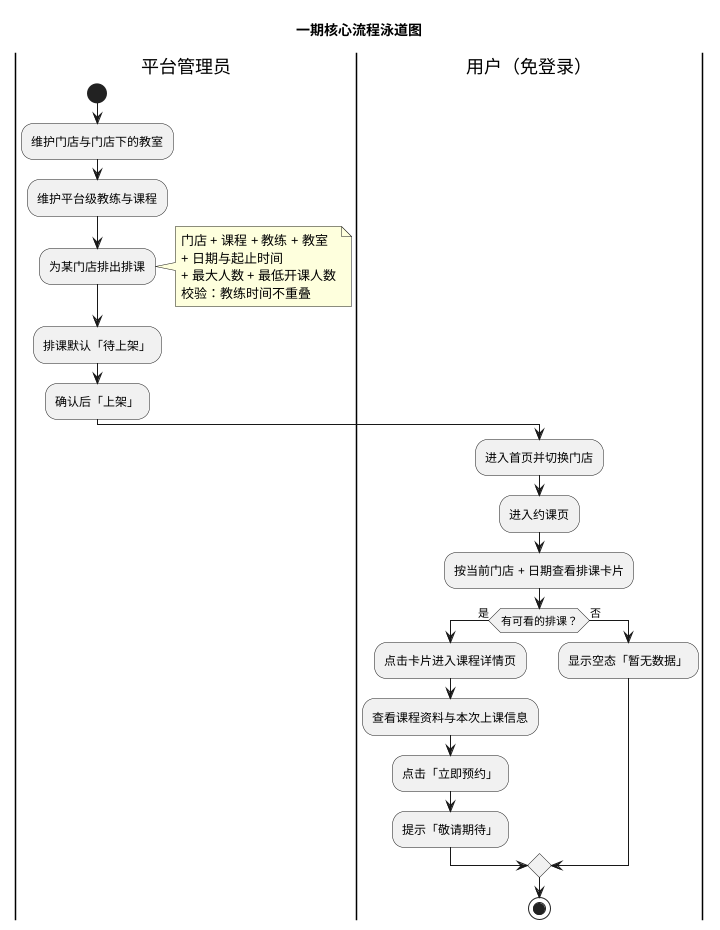
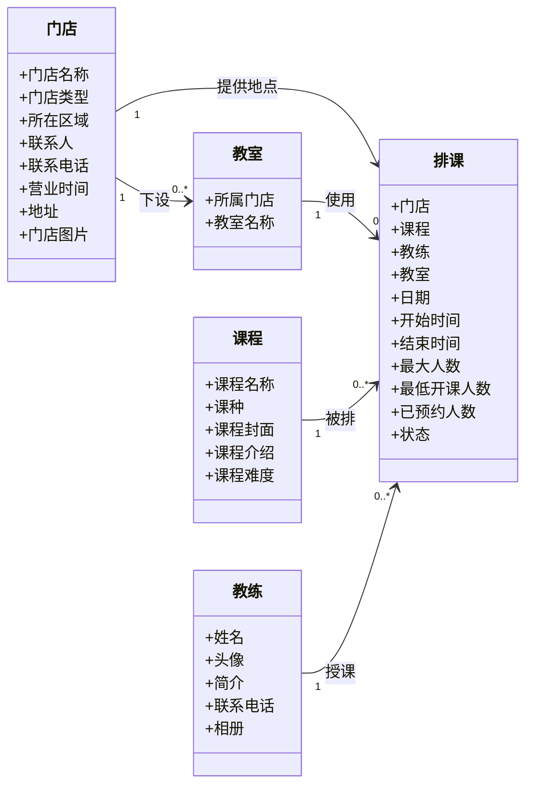

# 瑜伽普拉提需求分析文档

**文档版本：v2.0（重置版）**（2026-10-01）
**范围：** 用户端（小程序，免登录）与管理端（平台管理员）

> **依据来源（三个平行依据，没有"唯一权威"）：**
> 1. [`业务规则.md`](../需求文档/业务规则.md) v2.1 —— 业务口径；
> 2. **`docs/产品分析/`** —— **对标真实 App 的用户端实测截图**（`用户端小程序截图/`）、`用户端页面与对象.md`、`用户端页面与跳转梳理.md`，是**用户端界面、信息结构与页面跳转的第一手证据**；
> 3. `docs/需求文档/{用户端,管理端}/` —— 功能范围来源。
>
> **冲突处理：** 三者不一致时**不预设优先级，回到讨论确认**，以当次结论为准并回写文档。
> **口径说明：** `docs/概要设计/`、`docs/详细设计/` 描述的是**旧设计**（含会员、会员卡、预约、数据范围等已不在本期范围的能力），**不作为本分析的依据**。
> **用例分析由 [`用例总览.md`](用例总览.md) 与 [`用例/`](用例/) 承载**（9 条用例、一条一个文件）；本文 §2 只给索引、参与者边界与核心泳道图。

## 0. 口径与说明

### 0.1 本版范围一览

| 端 | 本版范围 |
|---|---|
| **用户端**（小程序，**免登录**） | **首页**（只做门店切换）→ **约课页**（按当前门店 ＋ 日期看排课；课种 Tab 四类）→ **课程详情页**（课程资料 ＋ 本次上课信息；「立即预约」提示敬请期待） |
| **管理端**（**平台管理员**，用户名 ＋ 密码登录） | **门店管理**、**教室管理**、**教练管理**、**课程管理**、**排课管理** |

业务主流程：

```text
平台管理员维护门店（含门店类型与所在区域）→ 在门店下维护教室
→ 维护平台级教练与平台级课程
→ 为某门店排出排课（门店＋课程＋教练＋教室＋日期与起止时间＋最大人数＋最低开课人数）
→ 排课默认「待上架」，确认后「上架」
→ 用户在首页切换门店 → 进入约课页按门店＋日期看排课卡片 → 点卡片看课程详情
```

**本版明确不纳入（`BR-全局-005`）：** 用户端登录与账号、会员、会员卡、预约与取消预约、签到、通知与短信、私教排课与私教预约、教练端、体验课、优惠券、积分、礼包、合同、体测、公告、消息、活动、候补排队、角色与数据权限、统计看板、最低开课人数的自动取消、门店经营类型。它们可以留作后续候选能力，但**不进入本版功能结构图、用例集与领域类图**。

### 0.2 当前需求基线

| 端别 | 基线文件 | 说明 |
|---|---|---|
| 用户端 | `docs/需求文档/用户端/用户端功能清单.md` | 旧版清单仍包含会员卡、优惠券、积分、合同、体测等本期范围外的能力；**本版范围以本文 §0.1 与 `BR-全局-005` 为准** |
| 管理端 | `docs/需求文档/管理端/管理端功能清单.md` | 同上；本版只做门店、教室、教练、课程、排课五个模块 |
| 业务口径 | [`业务规则.md`](../需求文档/业务规则.md) v2.1 | 70 条，全部已确认；覆盖全局、门店、教室、教练、课程、排课与用户端页面 |
| 用户端现状证据 | `docs/产品分析/` | 对标真实 App 的 30 张截图、22 个自研页面的页面与跳转梳理 |

### 0.3 需要留意的三处"有意偏离真实 App"

真实 App（`docs/产品分析/`）与本版有三处**有意不同**，实现时不要按截图改回来：

| # | 真实 App | 本版 | 原因 |
|---|---|---|---|
| 1 | 门店切换在首页，但**未登录点「换店」会被拦截到登录页** | **不拦截**，直接切换 | 一期用户端**免登录**（`BR-全局-002`） |
| 2 | 约课页有「排队」状态、详情页有"不可取消预约时间／停止排队加入预约时间／排队上限" | 全部不做 | 一期**没有预约与排队**（`BR-全局-005`） |
| 3 | 首页有公告栏、体验课、我要打卡、活动专区、今日可约、热门课程、金牌教练、门店实景图 | **首页只做门店切换** | 上述能力均不纳入一期（`BR-用户端-003`） |

**已与真实 App 对上的关键口径：** 约课页日期条为**今天起 14 天**（截图一致）；课程详情页展示**「开课人数」**即本版的最低开课人数（`BR-排课-004`、`BR-用户端-009`）；约课页的场次状态包含**已取消与已结束**（截图里就是四种状态），因此本版**用户端可见"非待上架"的排课**（`BR-排课-015`）。

---

# 1. 功能分析

## 1.1 功能结构图



**已确认（范围）：** 一期围绕**门店、教室、教练、课程、排课**五个对象展开：管理端负责维护主数据并排出排课，用户端免登录浏览门店、排课与课程详情。**一期不产生任何预约数据。**

**已确认（口径）：** 课程与教练都是**平台级主数据**，**不归属门店**；用户端切换门店后看到的"课程列表"实质是该门店的**排课列表**（`BR-课程-001`、`BR-教练-001`）。

**已确认（状态）：** 门店、教室、课程都**没有状态**；一期唯一有状态流转的是**排课**（待上架／已上架／已取消，外加按时间推导的"已结束"）（`BR-门店-008`、`BR-教室-003`、`BR-课程-007`、`BR-排课-010`）。

**已确认（人数）：** 排课配置**最大人数**与**最低开课人数**；一期没有预约，所以"已预约人数"恒为 0、"剩余名额"恒等于最大人数；**最低开课人数只录入、校验范围与展示，不触发任何自动行为**（`BR-排课-005`、`BR-排课-018`）。

**已确认（删除保护）：** 门店、教室、教练、课程被**未结束、且状态为待上架或已上架**的排课引用时，一律**拒绝删除**；已取消与已结束的历史排课**不阻塞**删除，删除后这些历史排课上的对应对象显示为空（`BR-全局-009`）。

## 1.2 功能简介

### 1.2.1 用户端（小程序 · 免登录）

- **首页（只做门店切换）**：展示当前门店的**门店卡**——门店名称、**所在区域**（上海市的 16 个市辖区之一）、门店地址，以及「换店」入口。点击「换店」进入门店列表（只返回未删除的门店，**支持按所在区域筛选与按名称／地址关键字搜索**，列表分页加载），选择后立即成为当前门店。首次进入默认选中门店列表的**第一家**；切换结果由客户端记住，**不登录、不落服务端**。无门店时显示空态。
- **约课页**：按**当前门店 ＋ 日期**展示排课卡片。页面提供**课种 Tab 四类**（团课／精品课／私教课／特色课）与**日期条（今天起 14 天，默认选中今天）**。每张卡片展示课程名称、课种、难度、上课时间、教练、门店、教室、剩余名额与**状态**。服务端固定施加过滤条件：**未删除、状态不等于「待上架」、门店等于当前门店**；因此**已取消与已结束的排课也会出现**（卡片上标注状态），只有**待上架不可见**。一期没有私教排课数据，「私教课」Tab 显示空态。该门店该日期没有可看的排课时显示空态「暂无数据」。
- **课程详情页**：从排课卡片进入。展示**课程资料**（课程封面、课种、难度、介绍）与**本次上课信息**（时间、教练**姓名／头像／简介**、门店、教室），并展示**状态、最大人数、最低开课人数、预约人员、剩余名额**；预约人员一期为空。页面提供「**立即预约**」入口，一期点击后提示「**敬请期待**」，**不产生任何数据**。**课种取排课保存的快照**；**难度、封面、介绍取课程当前值**，因此课程被修改后本页展示随之变化。

- **在约 / 我的（一期空页）**：底部 tabBar 的另外两个 tab。一期**不接任何接口**——用户端免登录、没有预约、没有会员，所以「我的」里也没有会员卡／优惠券／积分／合同／体测，**这两个 tab 只占位**。

### 1.2.2 管理端（平台管理员）

- **登录**：用户名 ＋ 密码。一期只有一个管理角色，**不设菜单权限、按钮权限与数据范围**，登录后即可读写全部数据。
- **门店管理**：门店的增、删、查、改。名称**全平台唯一**；**门店类型**为固定枚举（主力店／精品店）；**所在区域**存上海市市辖区的**行政区划代码**、区名由字典翻译；营业时间只保存一段固定展示文本；有**单图**门店图片；**没有启用／停用状态**；删除为**物理删除**，且名下**有教室**或仍被**未结束、待上架或已上架**的排课引用时**拒绝删除**。已被排课引用时仍允许编辑资料。
- **教室管理**：教室的增、删、查、改。归属门店、**同一门店内名称唯一**；只允许**改名称**（不允许换门店）；**没有状态**；不承载容量、设备、图片等扩展信息；删除为**物理删除**，被未结束且待上架／已上架的排课引用时拒绝删除。
- **教练管理**：教练是**平台级主数据**，**不归属门店、不与门店关联**。字段只有姓名、头像、简介、联系电话、相册（上限 5 张）；**名称允许重名**；**不设**技能（可授课程）、头衔与金牌标记、手动排序值；可**物理删除**，被未结束且待上架／已上架的排课引用时拒绝删除。
- **课程管理**：课程是**平台级主数据**，**不归属门店**。字段只有名称、课种、封面（单图）、介绍、难度（1~5 星）；名称**全平台唯一**；课种四类（团课／精品课／私教课／特色课，其中私教课一期不使用）；**没有启用／停用状态**，下架通过删除实现；可**物理删除**，被未结束且待上架／已上架的排课引用时拒绝删除。**课种在排课时做快照**（改课种不追溯，改难度会改变既有排课展示），不设展示排序。
- **排课管理**：为某门店排出排课，指定**课程、教练、教室**，设置**日期、开始时间、结束时间、最大人数与最低开课人数**（默认 2 人）。校验：门店／课程／教练存在且未删除；教室存在且**归属门店与排课门店一致**；开始早于结束且**不跨自然日**；最大人数 > 0；1 ≤ 最低开课人数 ≤ 最大人数；日期在**今天起 14 天内**；同一门店 ＋ 同一课程 ＋ **完全相同的日期与起止时间**不得重复；**同一教练任意两节排课的时间不得重叠**（重叠即拒绝）。新增排课默认**待上架**，管理员可**上架**、**下架**（回到待上架）、**取消**；**只有「待上架」的排课可编辑**（已上架须先下架再改），且只允许删除**待上架**的排课。排课另存一个**上课日期**列（由开始时间推导），用户端日期条与管理端日期区间都按它筛选。排课保存所选课程的**课种快照**（新增与更换课程时写入，客户端不可提交）。「已预约人数」字段一期固定为 0 且在表单中**只读**。

### 1.2.3 本期明确不做

见 §0.1 的"本版明确不纳入"与 `BR-全局-005`。**特别提醒**：真实 App 上存在的排队、取消预约、会员卡、优惠券、积分、礼包、合同、体测、公告、消息、活动、教练页、体验课、打卡与分享，本版**全部不做**。

---

# 2. 用例分析

> 本节只给**索引、参与者边界与核心泳道图**。总用例图与 9 条用例清单见 [`用例总览.md`](用例总览.md)；每条用例的详细描述（概览、前置条件、主成功场景、替代流程、后置条件、业务规则）见 [`用例/`](用例/)，**一条用例一个文件**。

## 2.1 用例索引

| 分组 | 用例 |
|---|---|
| 用户端（免登录） | [UC-001 切换门店](用例/UC-001-切换门店.md)、[UC-002 浏览约课页](用例/UC-002-浏览约课页.md)、[UC-003 查看课程详情](用例/UC-003-查看课程详情.md) |
| 管理端（基础数据） | [UC-004 管理端登录](用例/UC-004-管理端登录.md)、[UC-005 维护门店资料](用例/UC-005-维护门店资料.md)、[UC-006 维护教室资料](用例/UC-006-维护教室资料.md)、[UC-007 维护教练资料](用例/UC-007-维护教练资料.md)、[UC-008 维护课程资料](用例/UC-008-维护课程资料.md) |
| 管理端（排课） | [UC-009 维护排课](用例/UC-009-维护排课.md) |

## 2.2 参与者与边界

| 参与者 | 已确认职责 | 不属于该参与者的职责 | 依据 |
|---|---|---|---|
| **用户**（未登录） | 在首页切换门店；在约课页按门店与日期查看排课；查看课程详情 | 预约、取消、签到；任何写操作 | `BR-全局-002`、`BR-用户端-001`~`010` |
| **平台管理员** | 登录管理端；维护门店、教室、教练、课程；创建与维护排课及其状态 | 不负责用户端任何浏览动作；一期不区分角色与数据范围 | `BR-全局-003`、`BR-全局-004` |

**不在本版参与者边界内：** 会员、教练端使用者、微信开放平台、定时任务。一期没有会员体系、没有教练端、没有定时任务、也没有需要微信授权的用户端登录。

## 2.3 核心用例的泳道图

下图只表达**交互顺序与责任边界**；业务口径以 `业务规则.md` 与各用例文件为准（管理端 = [UC-005](用例/UC-005-维护门店资料.md)~[UC-009](用例/UC-009-维护排课.md)；用户端 = [UC-001](用例/UC-001-切换门店.md)~[UC-003](用例/UC-003-查看课程详情.md)）。



---

# 3. 领域类图

## 3.1 领域对象边界

**已确认事实：** 本版只有五个业务对象：**门店、教室、教练、课程、排课**。地点由门店与教室承载。

**已确认口径：** **课程与教练都是平台级主数据、不归属门店**（`BR-课程-001`、`BR-教练-001`）；教室归属门店；排课同时关联门店、课程、教练与教室，是唯一的"有状态"对象（`BR-排课-010`）。

**建议方案：** 图中的关联是需求阶段的概念关联，不等同于数据库表关系或外键。用户不是领域对象——一期**没有账号与会员**，用户端免登录。

**仍开放的事项：**

| 优先级 | 事项 | 状态 |
|---|---|---|
| — | 用户端**导航形态** | **已定：底部 tabBar 四个 tab（首页／约课／在约／我的）**，其中**在约与我的是一期空页**；约课页是一级 tab 页，**不做二级页**、不需要返回箭头 |
| — | 门店图片的张数节奏 | **已定：单图**，不建多图 |
| — | 二期预约、会员与会员卡的对象关系 | **本期不涉及**，后续版本再定 |

## 3.2 Mermaid 领域类图



> **说明：** 门店、教室、课程都**没有状态**；**排课**有状态（待上架／已上架／已取消，外加按时间推导的"已结束"）。教练既不属于门店，也不通过课程建立资质关系——**排课只校验"同一教练的时间不重叠"**（`BR-排课-008`）。一期没有预约对象，"已预约人数"字段保留但固定为 0（`BR-排课-019`）。
