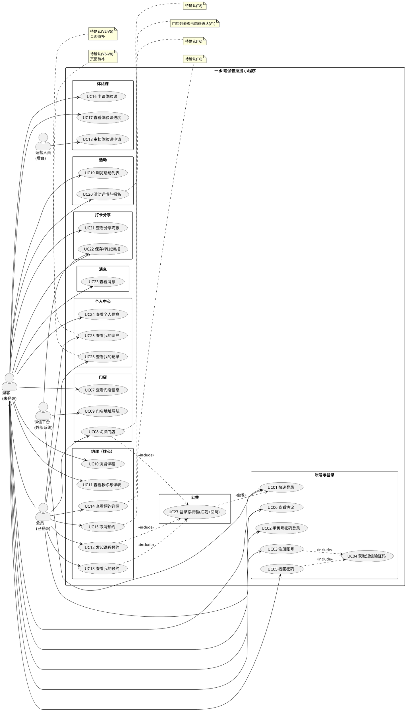

# 一水·瑜伽普拉提（小程序）· 需求分析

**版本：v0.1**（2026-09-20）｜**当前范围：用例图**

> 依据：`docs/需求文档/功能清单.md`（功能口径）、`docs/产品分析/页面与跳转梳理.md`（页面与跳转证据）。
> 本版**只做用例**，先把"有哪些用例、谁在用"对齐；功能结构图、领域类图待本版确认后再写。
> 约定沿用 `页面与跳转梳理.md` §0.3：**先文字稿，后出图**——下面的 PlantUML 源码就是文字稿，定稿后再渲染。

---

## 1. 参与者

| 参与者 | 说明 | 关键约束 |
|---|---|---|
| **游客**（未登录用户） | 首次进入小程序的用户，可浏览门店、课程、教练、活动、海报、消息 | 浏览不拦；**履约与个人资产拦** |
| **会员**（已登录用户） | 完成登录后的用户，在游客能力之上增加预约与个人中心能力 | 由游客登录态升级而来（继承游客全部用例） |
| **运营人员** | 后台侧角色：体验课申请审核、课程/教练/门店/海报等内容与数据配置 | **不在小程序内**，是本产品的后台需求 |
| **微信平台** | 外部系统参与者：手机号快速验证、位置授权、内置地图导航、转发/保存相册 | 非本产品开发，只作为依赖标注 |

> **登录态是本产品最重的分支**：游客与会员是**同一个人**的两种状态，用例图里用「会员 ← 游客」的泛化表示。

---

## 2. 用例清单

### 2.1 账号与登录（6 个）

| 编号 | 用例 | 主要参与者 | 需登录 | 说明 |
|---|---|---|---|---|
| UC01 | 快速登录（微信一键登录） | 游客、微信平台 | — | 拉起微信手机号授权，确认即完成登录并回跳来源页 |
| UC02 | 手机号 + 密码登录 | 游客 | — | 备选登录通道，密码可显示/隐藏 |
| UC03 | 注册账号 | 游客 | — | 手机号 + 短信验证码 + 密码，与登录同页 Tab 切换 |
| UC04 | 获取短信验证码 | 游客 | — | **被 UC03 / UC05 include** |
| UC05 | 找回密码（修改密码） | 游客 | — | 手机号 + 验证码 + 新密码（二次确认） |
| UC06 | 查看协议 | 游客、会员 | 否 | 用户协议 / 隐私协议两份长文；3 处入口共用 |

### 2.2 门店（3 个）

| 编号 | 用例 | 主要参与者 | 需登录 | 说明 |
|---|---|---|---|---|
| UC07 | 查看门店信息 | 游客 | 否 | 门店头图（可滑动）、门店名、门店地址 |
| UC08 | 切换门店 | 会员 | **是** | 游客点击「换店」→ 登录校验；**门店列表页形态待确认（V1）** |
| UC09 | 门店地址导航 | 游客、微信平台 | 否 | 调起微信内置地图，导航 / 打车 |

### 2.3 约课（核心，6 个）

| 编号 | 用例 | 主要参与者 | 需登录 | 说明 |
|---|---|---|---|---|
| UC10 | 浏览课程 | 游客 | 否 | 按品类（团课/精品课/私教课/特色课）+ 日期筛选；空态「暂无数据」 |
| UC11 | 查看教练与教练课表 | 游客 | 否 | 约课页教练列表 + 约教练页只读课表（**无预约入口**） |
| UC12 | 发起课程预约 | 会员 | **是** | 私教课「立即预约」；游客触发登录校验 |
| UC13 | 查看我的预约 | 会员 | **是** | 按状态（全部/已预约/已取消/已签到）+ 课种 + 卡种筛选 |
| UC14 | 查看预约详情 | 会员 | **是** | ⚠️ **待确认（T6）**：有数据时的页面形态未知 |
| UC15 | 取消预约 | 会员 | **是** | ⚠️ **待确认（T6）**：是否存在、入口在哪均未实测 |

### 2.4 体验课（3 个，走审核制，与正式约课是两套流程）

| 编号 | 用例 | 主要参与者 | 需登录 | 说明 |
|---|---|---|---|---|
| UC16 | 申请体验课 | 游客 | 否 | 选门店（必填，上海）+ 姓名 / 手机号 / 留言，提交后进入人工审核 |
| UC17 | 查看体验课申请进度 | 游客 | 否 | 4 状态筛选：全部 / 申请待审核 / 审核通过 / 审核拒绝 |
| UC18 | 审核体验课申请 | 运营人员 | — | **后台用例**：审核通过 / 拒绝，结果回流到 UC17 |

### 2.5 活动（2 个）

| 编号 | 用例 | 主要参与者 | 需登录 | 说明 |
|---|---|---|---|---|
| UC19 | 浏览活动列表 | 游客 | 否 | 当前无数据，空态「暂无数据」 |
| UC20 | 查看活动详情并报名 | 游客 | 否 | ⚠️ **待确认（T8）**：详情页与报名流程未实测 |

### 2.6 打卡分享（2 个）

| 编号 | 用例 | 主要参与者 | 需登录 | 说明 |
|---|---|---|---|---|
| UC21 | 查看分享海报 | 游客 | 否 | 海报轮播（图片静态，**非动态生成**） |
| UC22 | 保存 / 转发海报 | 游客、微信平台 | 否 | 保存到相册、转发给微信好友 |

### 2.7 消息（1 个）

| 编号 | 用例 | 主要参与者 | 需登录 | 说明 |
|---|---|---|---|---|
| UC23 | 查看消息 | 游客 | 否 | 当前无数据；未读标记与分类待确认 |

### 2.8 个人中心（3 个）

| 编号 | 用例 | 主要参与者 | 需登录 | 说明 |
|---|---|---|---|---|
| UC24 | 查看个人信息 | 游客 | 否 | 头像、昵称、会员等级（V0 普通会员）、手机号绑定状态 |
| UC25 | 查看我的资产 | 会员 | **是** | 会员卡 / 优惠券 / 礼包 / 积分（四宫格，**页面待确认 V2–V5**） |
| UC26 | 查看我的记录 | 会员 | **是** | 合同 / 已约课程 / 体测（列表组一，**页面待确认 V6–V8**） |

### 2.9 公共（1 个）

| 编号 | 用例 | 主要参与者 | 需登录 | 说明 |
|---|---|---|---|---|
| UC27 | 登录态校验（拦截 + 回跳） | 游客 | — | **被 UC08 / UC12 / UC13 include**；含登录成功后 `navigateBack` 回来源页 |

### 2.10 用例计数

| 模块 | 用例数 | 备注 |
|---|---|---|
| 账号与登录 | 6 | UC04 为被包含用例 |
| 门店 | 3 | UC08 落点待确认 |
| 约课 | 6 | **核心业务闭环**（UC10 → UC12 → UC13） |
| 体验课 | 3 | 含 1 个后台用例（UC18） |
| 活动 | 2 | UC20 待确认 |
| 打卡分享 | 2 | — |
| 消息 | 1 | — |
| 个人中心 | 3 | UC25 / UC26 共 7 个待确认子页面 |
| 公共 | 1 | UC27 登录态校验 |
| **合计** | **27** | 其中 **26 个前台业务用例 + 1 个后台用例**，UC04 / UC27 为被包含用例 |

**一句话读法**：**27 个用例里，真正撑起业务主线的只有 3 个**（UC10 浏览课程 → UC12 发起预约 → UC13 查看我的预约）；**登录相关的却有 7 个**（UC01–UC06 + UC27）——「页面极少、入口极多、登录很重」的结构特征在用例层面同样成立。

---

## 3. 用例图（PlantUML 源码）

> 源码已按本地 PlantUML jar（`.agents/skills/plantuml-salt-wireframe/jar/plantuml.jar`）的语法书写，定稿后可直接渲染出图。

---

## 4. 待确认口径（本版留下的问题）

| # | 问题 | 影响 |
|---|---|---|
| 1 | **游客与会员是否画成两个参与者（泛化）**，还是只画一个「用户」+ 用登录要求区分 | 影响用例图整体形态 |
| 2 | **运营人员是否需要作为参与者**：体验课审核（UC18）与内容配置目前只从界面状态反推，无后台证据 | 影响用例总数（27 或 26） |
| 3 | **微信平台是否作为参与者**：UC01 / UC09 / UC22 其实是微信原生能力 | 影响图的复杂度 |
| 4 | UC14 / UC15 / UC20 及 V1–V8 均在"登录门"后面，**用例存在但细节无证据** | 影响后续详细用例描述 |

---

## 5. 下一步

1. **确认本版用例口径**（尤其第 4 节的 1–3 条）
2. 用例定稿后补：**功能结构图**（按模块 → 子模块 → 功能三层，可直接对齐 `功能清单.md` 的模块列）
3. 再补：**领域类图**（门店 / 课程 / 教练 / 排课 / 预约 / 体验课申请 / 会员 / 卡券 / 消息）
4. 出图（PlantUML，本地 jar 已验证可用），V1–V9 待确认页面只保留占位节点
