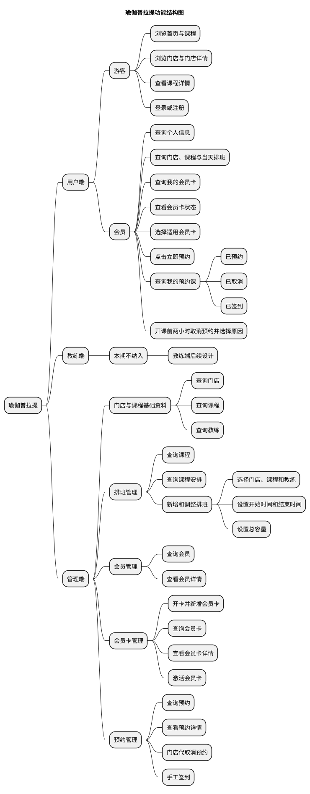
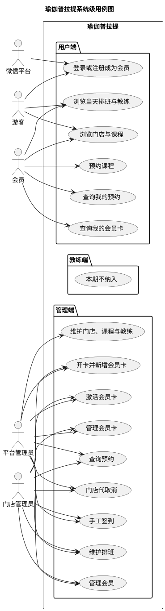
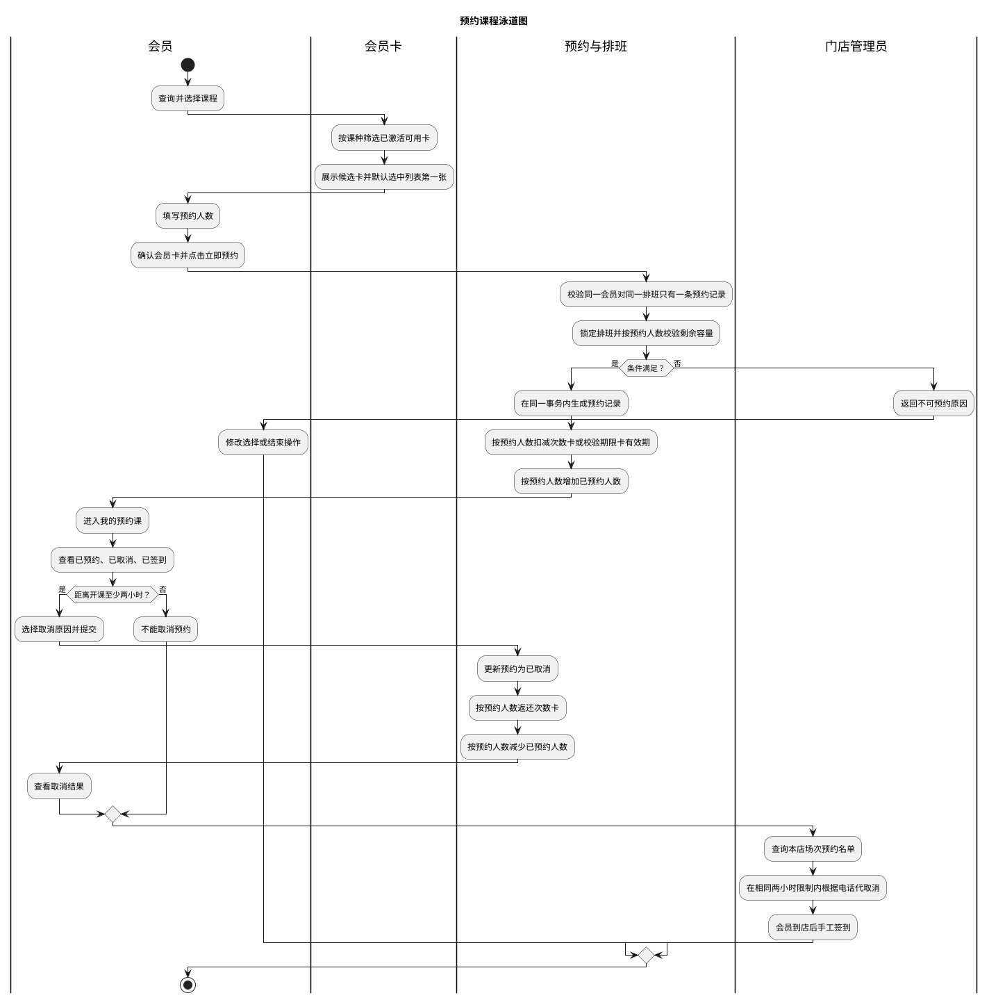
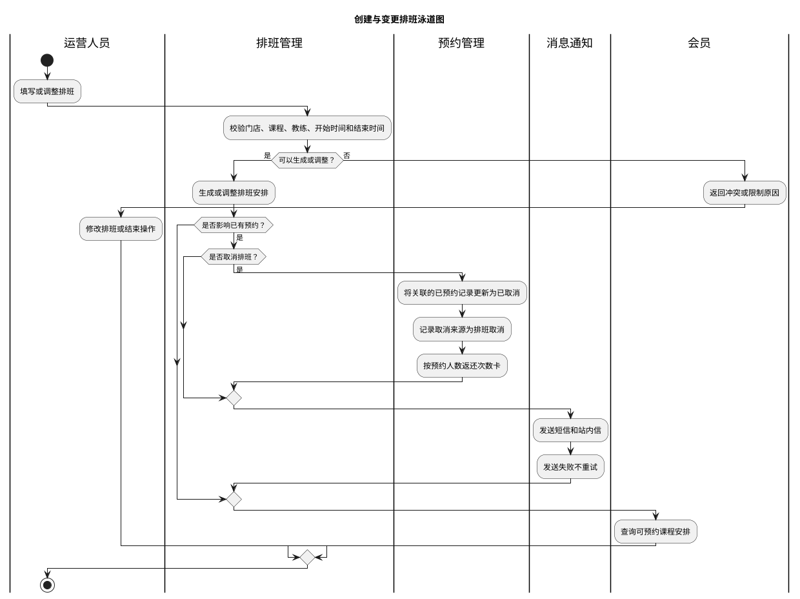
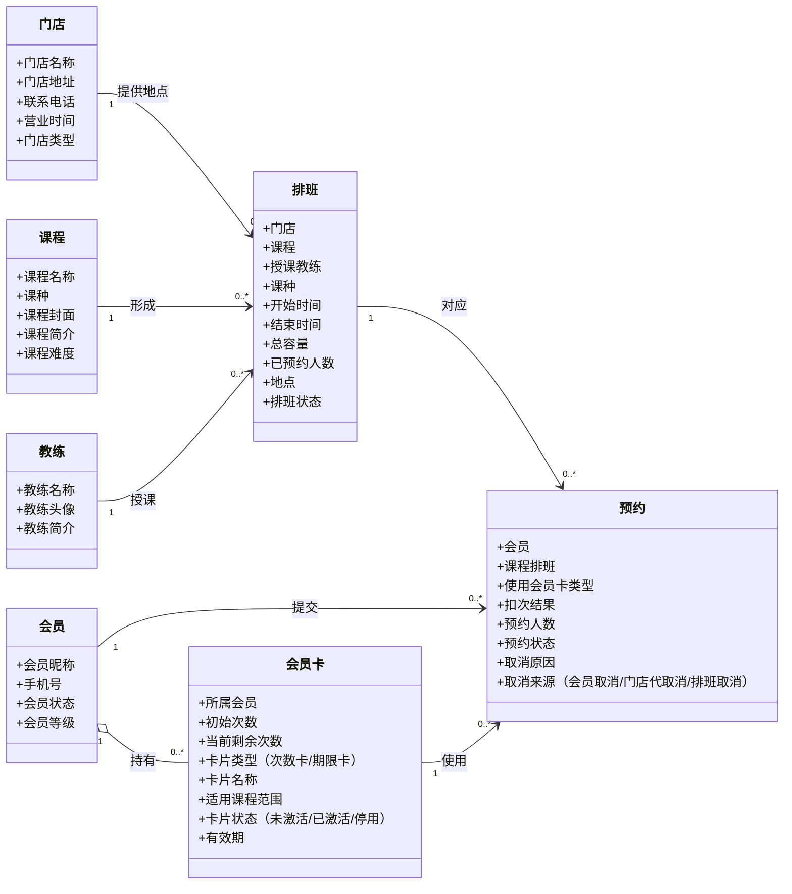

# 瑜伽普拉提需求分析文档

**版本：v0.9**（2026-09-29）
**范围：用户端、教练端、管理端**

> 本文按照 `docs/模板/需求分析文档模板.md` 编写。
> 功能范围以 2026-09-20 的三份 v1 功能清单为当前基线；现有小程序证据以 `docs/产品分析/页面与跳转梳理.md` v2.1 及其截图为准。
> 教练端和管理端目前有功能清单及结构草稿，但没有与用户端同等级的真机或成品页面证据；结构草稿可用于辅助推断，不能单独证明功能已确认或已实现。
> 本版新增管理端原型验证范围：会员管理、会员卡管理、排班管理、预约管理。四个模块先完成业务对象与数据关系收敛，页面中的业务数据可以先使用 Mock 数据验证；会员卡适用范围、扣次、有效期、取消处理和排班容量控制按本版已确认口径执行。
> 本版身份口径：未登录访问小程序的是游客；游客完成登录后成为会员，初始会员等级为 0。`用户端`只表示小程序这一端的产品渠道，不作为领域对象名称。

## 0. 口径与证据说明

### 0.1 状态标记

| 标记 | 含义 | 使用规则 |
|---|---|---|
| **已确认事实** | 三份最新功能清单明确列出的能力，或现有小程序已经实测的行为 | 可以作为当前需求基线，但“清单已列出”不等于“已经实现” |
| **建议方案** | 为使三端形成完整业务闭环而提出的流程、职责或状态建议 | 需要产品确认后才能转为正式需求 |
| **TODO-待确认** | 清单没有说明、不同资料不一致，或缺少实现证据的事项 | 不应据此直接开展详细设计或验收 |
| **证据不一致** | 推断或清单范围与现有小程序实测证据不一致 | 必须先决定“沿用现状”还是“按新需求改造” |

### 0.2 当前需求基线

| 端别 | 基线文件 | 已确认功能数 | 实现证据 |
|---|---|---:|---|
| 用户端 | `docs/需求文档/用户端/用户端功能清单.md` v1 | 21 | 有现有微信小程序截图和真机跳转梳理，但只覆盖部分功能 |
| 教练端 | `docs/需求文档/教练端/教练端功能清单.md` v1 | 9 | 暂无真机或成品页面证据 |
| 管理端 | `docs/需求文档/管理端/管理端功能清单.md` v1 | 42 | 暂无真机或成品页面证据 |

### 0.3 本版 MVP 范围

本版先验证一条最小可运行闭环，不以现有页面数量作为本期范围。业务主流程为：

```text
游客浏览门店和课程 → 登录成为会员（初始等级 0） → 管理端完成首次开卡和激活 → 会员查看当天课程排班 → 选择符合课种的会员卡 → 点击立即预约 → 进入我的预约课
```

| 范围 | 本期处理 |
|---|---|
| 游客 | 浏览首页门店、门店详情、课程和公开排班；登录、注册或找回登录凭证 |
| 会员 | 初始会员等级为 0；查询本人会员卡；预约时从符合课种、已激活且可用的会员卡中选择；在我的预约课查看已预约、已取消、已签到，并在开课前两小时或更早取消预约 |
| 门店 | 作为游客和会员浏览的服务地点；与课程排班关联，展示门店地址等基础信息 |
| 课程 | 提供课程名称、课种、介绍等可浏览内容；课程管理只保留支撑 MVP 的最小数据 |
| 教练 | 提供排班关联的教练信息，并支持前端查看教练基础资料 |
| 排班 | 表示某门店在某时间开设某课程并指定教练的可预约安排；关联门店、课程和授课教练，设置开始时间、结束时间、总容量，展示已预约人数和地点；预约时必须校验剩余容量并防止并发超卖 |
| 预约 | 同一会员对同一排班只能有一条预约记录；一条记录可以填写两人或多人同行的预约人数。状态包括已预约、已取消、已签到；期限卡只校验有效期，预约记录本身代表本次使用 |
| 会员卡 | 管理端首次为会员开卡后，卡片初始为未激活；激活后可持续使用。本期支持普拉提次数卡、私教次数卡和期限卡等适用范围，月卡 30 个自然日、年卡 365 天，期限卡到期后停用 |
| 管理端 | 概念上分为平台管理员和门店管理员；平台管理员面向全部门店，门店管理员面向所属门店。本期先完成会员、会员卡、门店、课程、教练、排班和预约页面，不实现菜单、按钮和数据权限 |

**本期明确不纳入：** 合同、积分、积分流水、活动、体验课申请、优惠券、礼包、复杂会员权益、退款、转卡、续期、候补、刷脸自动签到、爽约、人工改约、门店自定义取消时限和细粒度角色权限。它们可以保留为后续候选能力，但不进入本版功能简介、领域类图、Mock 验收或开发验收。

### 0.4 证据优先级与辅助推断来源

发生冲突时按以下顺序判断：

1. **最新功能清单**：决定当前目标功能范围；
2. **现有小程序实测与截图**：证明用户端现状，但不自动决定新版本是否保留；
3. **产品结构图、功能结构图、页面结构图**：用于补充页面分组、状态、字段和参与者边界，只作为建议或 TODO；
4. **需求分析中的业务补全**：用于连通跨端流程，必须明确标记为建议方案。

| 推断编号 | 辅助来源 | 可支持的推断 | 采用方式 |
|---|---|---|---|
| I01 | `用户端产品结构图.md` | 门店、活动、打卡、协议、会员资产明细、预约状态和登录方式的候选页面结构 | 与现有小程序一致的部分作为现状佐证；超出最新清单的部分仍列 TODO |
| I02 | `教练端功能结构图.md` | 教练课程可按待上课/今日/已完成组织；可能需要课程详情、搜索筛选、课程统计、系统通知和公告 | 作为教练端信息架构建议，不直接扩展已确认功能 |
| I03 | `教练端功能结构图.md` | 工号密码、手机验证码、一键登录是教练登录方式候选；“取消课程”可能是教练动作 | 登录方式和取消权限均列 TODO；尤其取消课程与最新清单不一致 |
| I04 | `管理端页面结构图.md` | 工作台指标、列表筛选项、业务状态、详情字段、后台账号/角色/权限是候选后台结构 | 与功能清单一致的部分用于细化用例；超出清单的系统管理仍列 TODO |
| I05 | `用户端功能结构图.md`、`管理端功能结构图.md` | 两个文件当前为空 | 不形成任何需求证据 |

### 0.5 与现有小程序证据不一致或缺少证据的推断

| 编号 | 状态 | 推断或范围项 | 现有证据 | 本文处理 |
|---|---|---|---|---|
| E01 | **证据不一致** | 用户端应包含“浏览活动/活动详情” | 现有小程序实测有活动列表入口；最新用户端清单未列活动查询，而管理端清单保留发布、修改活动 | 不把用户活动查询写成已确认用例；列为 TODO-待确认 |
| E02 | **证据不一致** | “我要打卡”属于本期用户功能 | 现有小程序实测为静态分享海报轮播、保存和转发；三份最新清单均未列打卡或海报 | 从已确认范围移除；列为存量能力去留 TODO |
| E03 | **需求补充** | 会员可以在“我的预约课”查看状态并取消预约 | 现有小程序证据不足，但本轮业务确认补充了已预约、已取消、已签到及取消规则 | 按本轮确认纳入 MVP；开课前两小时内不可由会员取消 |
| E04 | **证据不一致** | 用户端包含门店切换和地图导航 | 现有小程序实测有“换店”入口和微信内置地图；最新用户端清单没有门店模块 | 仅作为存量能力记录，不纳入当前已确认范围 |
| E05 | **证据不一致** | 用户端完整保留密码登录、协议页等现状 | 现有小程序实测有手机号+密码登录、注册、忘记密码、用户协议、隐私协议；最新清单只确认微信快捷登录、手机号登录、注册和重置密码，未明确协议及手机号登录方式 | 登录方式细节和协议承载方式列为 TODO |
| E06 | **证据不一致** | 管理端发布的活动一定在用户小程序展示 | 管理端清单确认活动发布；用户端清单没有活动查询 | 活动发布对象、展示渠道和上下线规则列为 TODO |
| E07 | **缺少证据** | 教练可以取消课程、处理签到或修改预约 | 教练端最新清单只确认查询课程/安排/学员、维护个人资料、查询与录入体测、查询消息 | 明确排除在教练当前边界之外 |
| E08 | **需求补充** | 门店可以根据会员电话在管理端代取消预约 | 管理端最新清单没有这些操作，但本轮业务确认存在门店代操作场景 | 纳入 MVP；门店代取消同样不能突破开课前两小时限制 |
| E09 | **缺少证据** | 后台已包含账号、角色和权限管理 | 管理端页面结构草稿存在这些页面，但最新管理端功能清单未列出 | 不纳入已确认范围；列为 TODO |
| E10 | **部分一致** | 教练详情中的相册由后台维护 | 现有小程序能看到教练相册区域但无内容；用户端清单确认可查询相册，管理端清单的“修改教练”描述未明确相册 | 作为建议方案，待确认相册维护责任 |
| E11 | **证据不一致** | 用户端产品结构图将手机号通道写为“手机验证码登录” | 现有小程序实测为手机号+密码登录；短信验证码用于注册和重置密码 | 最新清单只写“手机号登录”，具体认证方式列为 TODO |
| E12 | **证据不一致** | 用户端产品结构图将约课分类写为团课、私教课、体验课、特色课 | 现有小程序实测分类为团课、精品课、私教课、特色课；体验课是独立申请审核流程 | 不沿用“体验课 Tab”推断，课程分类列为 TODO |
| E13 | **证据不一致** | 用户端产品结构图把教练详情中的课程描述为“可预约课程” | 现有小程序的约教练页是只读课表，课程卡无响应且没有预约入口 | 当前只确认查询教练及相关课程；是否从教练详情发起预约列为 TODO |

---

# 1. 功能分析

## 1.1 功能结构图

下图只展开本版 MVP 的已确认范围。现有小程序中的活动、打卡、门店切换、地图导航，以及合同、积分、体验课等候选能力不进入本版闭环。



**已确认事实：** 本版围绕门店、课程、教练、排班、预约、会员和会员卡形成最小闭环；游客可浏览门店和课程排班，管理端负责开卡、激活和排班维护，会员点击立即预约并在我的预约课中查看或取消预约。

**建议方案：** 后续功能结构图继续以业务能力组织，不把页面、接口或数据库操作作为功能层级；排班只保留业务概念，具体生成方式放到详细设计。

**已确认规则：** 会员和门店管理员都不能突破开课前两小时的取消限制；门店管理员在预约管理中手工签到；预约时必须校验容量并防止并发超卖。

**已确认规则：** 同一会员对同一排班只能有一条预约记录；预约记录可以填写预约人数；多张候选会员卡按列表第一张预选；取消原因包括“临时有事”“请假”“身体不适”；排班修改或取消后通过短信和站内信通知受影响会员。

**已确认规则：** 排班取消后，关联的“已预约”记录自动变为“已取消”，取消来源记为“排班取消”；次数卡按各预约记录的预约人数立即返还，期限卡不处理次数。

## 1.2 功能简介

本节与 1.1 功能结构图保持一致，只介绍本版 MVP 的业务能力。现有小程序独有但未进入本版范围的功能，以及由结构草稿推断的候选能力，仍按 0.3、0.4 节的口径处理。

### 1.2.1 用户端

用户端（小程序）本期只面向一条游客到会员的预约闭环：游客浏览首页、门店、课程和当天排班，登录后成为初始等级为 0 的会员；管理端完成首次开卡和激活后，会员从符合课种的可用会员卡中选择一张完成预约。会员卡激活后，后续预约不再需要运营人员介入。

#### 1.2.1.1 游客访问与会员登录

- **浏览首页与课程**：游客可以查看首页和公开课程内容。
- **浏览门店**：游客和会员可以查看门店列表、门店详情、地址和营业信息。
- **查看课程详情**：游客可以查看课程名称、课种、难度、介绍和可预约排班。
- **浏览当天排班**：游客和会员可以按门店查看当天课程、课种、上课时间、容量、地点和授课教练。
- **登录或注册**：游客通过登录或注册建立会员身份；新会员初始等级为 0。

#### 1.2.1.2 会员预约

- **查询课程安排**：会员按课程、门店和时间查看可预约安排。
- **查询会员卡**：会员查询本人会员卡、卡片类型、适用课程范围、卡片状态和可用信息。
- **会员卡激活**：管理端发卡后，平台管理员或门店管理员点击激活按钮，未激活会员卡变为已激活；激活前不能用于预约。
- **选择会员卡**：系统先按课种筛选已激活且可用的会员卡。团课和精品课可以使用普拉提次数卡或适用的期限卡；私教课只能使用私教次数卡。只有一张候选卡时自动选中；有多张候选卡时展示全部候选卡并默认选中列表第一张，会员可以切换。
- **填写预约人数**：同一会员对同一排班只能提交一条预约记录，但可以在记录中填写本人及亲朋好友同行的预约人数。
- **立即预约**：会员确认预约人数和候选会员卡后点击“立即预约”；次数卡按预约人数扣减次数，例如预约两人扣两次；期限卡只校验有效期，预约记录本身代表本次使用。
- **预约课程**：系统锁定排班记录后按预约人数校验剩余容量，并在同一事务内生成一条预约记录、按预约人数扣减次数卡和增加已预约人数；任一步失败整体回滚，避免并发超卖。
- **我的预约课**：会员按“已预约、已取消、已签到”查看预约状态；已预约记录在开课前两小时或更早显示取消按钮。
- **取消预约**：会员从“临时有事、请假、身体不适”中选择取消原因后提交；会员和门店管理员在开课前两小时内都不能取消。取消次数卡预约时按预约人数返还次数并释放相同容量；期限卡不处理会员卡次数。
- **查询我的预约**：会员查询本人预约记录及预约状态。

### 1.2.2 教练端

教练端不纳入本期 MVP，只保留后续扩展方向。本期不设计教练登录、教练个人资料、学员查询、体测和教练消息。

### 1.2.3 管理端

管理端本期只服务于课程预约闭环，保留门店、课程、教练、排班、会员、会员卡和预约的最小管理能力。

- **门店管理**：提供门店列表和详情的最小维护能力，为首页浏览和排班关联提供基础资料。
- **课程与教练基础资料**：提供课种、课程内容和教练基础信息的最小查询与维护能力。
- **排班管理**：新增或调整某门店、某课程、某教练在指定开始时间和结束时间的排班，设置总容量，查看已预约人数和地点。
- **会员管理**：按昵称、手机号和状态查询会员，查看会员基础资料、初始等级 0 和关联会员卡。
- **会员卡管理**：为会员开卡并新增会员卡；新卡初始为未激活，支持次数卡和期限卡，支持查询详情并点击激活。
- **预约管理**：按会员、课程、门店、日期和预约状态查询预约，查看预约详情；门店管理员可以根据电话请求代取消，但同样受开课前两小时限制；会员到店后由门店管理员手工签到，将预约从“已预约”更新为“已签到”。
- **管理角色**：概念上区分平台管理员和门店管理员，店长、前台等更细角色暂合并为门店管理员；本期先完成页面，不设计菜单、按钮和数据权限。

本期不纳入合同、积分、积分流水、活动、体验课申请、优惠券、礼包、复杂会员权益、退款、转卡、续期、候补、刷脸自动签到、爽约、人工改约、门店自定义取消时限和细粒度角色权限。

---

# 2. 用例分析

## 2.1 应用用例图

本图只表达本版 MVP 的核心参与者和预约闭环，不展开后续合同、积分、活动、体验课等候选能力。



> **已确认事实：** 微信平台只作为微信快捷登录的外部依赖出现在当前基线中。现有小程序还调用微信位置、地图、保存和转发能力，但对应业务功能未进入最新清单，见 E02、E04。

## 2.2 参与者与核心用例边界

| 参与者 | 已确认职责 | 当前不属于该参与者的职责 | 建议方案 / TODO-待确认 |
|---|---|---|---|
| 游客 | 浏览首页和公开课程；发起登录或注册 | 预约课程、查询会员资产和个人预约 | **已确认：** 登录成功后建立会员身份；**TODO：** 登录方式和游客可浏览范围 |
| 会员 | 浏览门店和课程排班；从符合课种的候选卡中选择会员卡并预约；查询我的预约课；取消预约 | 维护课程、排班、会员卡规则或其他会员资料 | **已确认：** 新会员初始等级为 0；只有已激活且适用的会员卡可选；开课前两小时内不可取消 |
| 教练 | 本期不纳入 | 本期不纳入教练端登录、授课查询和学员管理 | 后续版本再设计 |
| 平台管理员 | 参与跨门店运营管理 | 不负责会员端预约操作 | **本期边界：** 先完成管理页面，菜单、按钮和数据权限后续设计 |
| 门店管理员 | 处理门店排班、会员卡、预约代取消和手工签到 | 不突破开课前两小时取消限制 | **本期边界：** 店长和前台等角色统一按门店管理员处理；具体数据权限后续设计 |
| 微信平台 | 为微信快捷登录提供授权能力 | 决定课程、预约、会员或审核业务规则 | **TODO：** 手机号登录是否也使用微信手机号能力，还是账号密码/验证码方案 |

### 2.2.1 非 MVP 参与者边界

教练端、体测、合同、积分、活动审核、体验课和复杂运营权限均不属于本版 MVP。相关参与者和职责不在本版继续展开，避免把后续候选能力误当成当前需求。

## 2.3 用例描述

简单查询与配置功能以三份功能清单和 2.1 用例图为准。以下只详写跨端核心流程和边界尚需澄清的用例。

### 2.3.1 预约课程

#### （1）简要说明

**已确认事实：** 游客可以浏览门店、课程和排班；会员预约时只展示与课种匹配、已激活且可用的会员卡；会员可在“我的预约课”查看已预约、已取消、已签到，并在开课前两小时或更早取消；门店管理员可以查询本店预约、在相同时间限制内代取消并手工签到。

**建议方案：** 将“课程基础信息”和“可预约排班场次”区分，预约实际指向排班场次。

**已确认规则：** 团课和精品课可以使用普拉提次数卡或适用的期限卡，私教课只能使用私教次数卡；多张候选卡默认选中列表第一张。同一会员对同一排班只能有一条预约记录，一条记录可以包含多人；期限卡只校验有效期，预约记录本身代表本次使用。预约必须原子完成容量校验、预约创建、次数卡处理和人数更新，防止并发超卖。

**本期不处理：** 接口幂等、刷脸自动签到、爽约和候补规则。

#### （2）事件流

1. 游客或会员按课程、门店和日期等条件查询课程安排；
2. 应用展示课种、开始时间、结束时间、总容量、已预约人数、地点和教练；
3. 系统按课种、激活状态、剩余次数或有效期筛选候选会员卡；只有一张时自动选中，多张时默认选中列表第一张，会员可以切换；
4. 会员填写预约人数并点击“立即预约”；系统确认该会员对当前排班没有其他预约记录，锁定排班并按预约人数校验剩余容量，在同一事务内生成一条“已预约”记录、按预约人数扣减次数卡并增加已预约人数；期限卡只校验有效期；
5. 会员进入“我的预约课”，按已预约、已取消、已签到查看状态；
6. 会员在开课前两小时或更早点击取消，选择取消原因并提交；
7. 门店管理员在管理端查询本店预约和场次名单，可以在相同的两小时限制内代取消，并在会员到店后手工签到。

**异常或分支事件流（建议方案）：**

1. 当排班不可预约或已达到总容量时，应用拒绝预约并说明原因；
2. 当没有与课种匹配的已激活可用会员卡时，应用拒绝预约并说明原因；
3. 预约、会员卡处理或人数更新任一步失败时，整个事务回滚；
4. 距离开课不足两小时，会员端不显示取消按钮或拒绝取消；
5. 取消成功后更新为“已取消”并按预约人数释放排班容量；次数卡按预约人数返还次数，期限卡不处理会员卡次数；
6. 预约提交结果不明确时，应用以服务端最终预约记录为准，避免重复预约。

#### （3）泳道图



> 泳道中的会员卡筛选、预约人数、容量锁定、失败回滚、取消和手工签到属于本版已确认主线；同一会员对同一排班只能有一条预约记录，但一条记录可以包含多人。会员和门店管理员都不能突破开课前两小时的取消限制。系统必须保证容量校验和预约写入的原子性，防止并发超卖。

### 2.3.2 申请并审核体验课（本期不纳入）

体验课申请、审核、通知和后续预约均为后续候选能力，本期不进入 MVP 功能、领域类图、Mock 数据、后端 SQL 或验收范围。

### 2.3.3 创建与变更排班

#### （1）简要说明

**已确认事实：** 管理端排班时选择门店、课程和教练，设置开始时间、结束时间和本次排班总容量；用户端课程列表展示总容量和已预约人数。排班关联门店、课程和教练。

**已确认规则：** 排班作为课程的可预约安排独立维护；预约成功或取消时同步已预约人数；预约时必须原子校验剩余容量并防止并发超卖。排班修改影响已有预约时发送短信和站内信；排班取消时，将关联的“已预约”记录自动更新为“已取消”，取消来源记为“排班取消”，并按预约人数立即返还次数卡。

**TODO-待确认：** 时间冲突规则；允许修改或取消排班的截止时间。

#### （2）事件流

1. 运营人员选择门店、课程和教练，设置开始时间、结束时间和总容量；
2. 应用保存排班并初始化已预约人数；
3. 应用形成可供会员查询的课程安排；
4. 运营人员按需要修改或取消排班；修改排班时向受影响会员发送短信和站内信；取消排班时自动取消关联的“已预约”记录，按预约人数返还次数卡，再发送短信和站内信。消息发送只尝试一次，失败不重试。

**异常或分支事件流（建议方案）：**

1. 教练、场地或时间冲突时，应用拒绝生成或调整并指出冲突项；
2. 已有预约的排班被修改时保留预约并发送通知；排班被取消时自动取消预约并按预约人数返还次数卡；
3. 已完成的安排不允许直接修改或取消。

#### （3）泳道图



> 本泳道图只保留排班管理的业务概念；总容量和已预约人数按预约人数统计，预约时必须控制容量并防止并发超卖。

### 2.3.4 录入学员体测（本期不纳入）

体测记录、教练录入、运营补录和会员查询均为后续候选能力，本期不进入 MVP 功能、领域类图、Mock 数据、后端 SQL 或验收范围。

---

# 3. 领域类图

## 3.1 领域对象边界

**已确认事实：** 本版只保留 MVP 预约闭环所需的会员、会员卡、课程、排班、预约、门店和教练等领域对象；地点先由门店承载，不单独展开教室对象；合同、积分、活动、体验课申请、优惠券、礼包、私教场次和复杂会员权益不进入本版领域类图。

**建议方案：** 领域类图按业务对象和页面属性表达业务概念；课程通过排班承载可预约安排，门店和教练是排班的支撑对象，预约关联会员、会员卡和课程安排。游客不是领域对象，登录后成为初始等级为 0 的会员。图中的关联是需求阶段的概念关联，不等同于数据库表关系或外键。

**TODO-待确认：** 会员与登录凭证的技术关联方式；教练与排班的其他扩展关系。已确认同一会员对同一排班只能有一条预约记录，预约人数在事务内同步，多张候选卡默认选中列表第一张，次数卡按预约人数扣减，期限卡只校验有效期；排班取消时自动取消预约并立即返还次数卡。

## 3.2 Mermaid 领域类图



> 游客不是持久化业务对象，因此不在领域类图中出现；游客登录后成为会员。排班当前只表达可预约安排这一业务概念，具体由预约记录生成或汇总的规则留到详细设计阶段。

## 3.3 MVP 待确认事项汇总

| 优先级 | TODO-待确认 | 影响范围 |
|---|---|---|
| P1 | 会员卡激活按钮的具体页面入口和重复激活处理 | 会员卡管理 |
| P1 | 教练与排班的其他扩展关系 | 排班管理、课程展示 |
