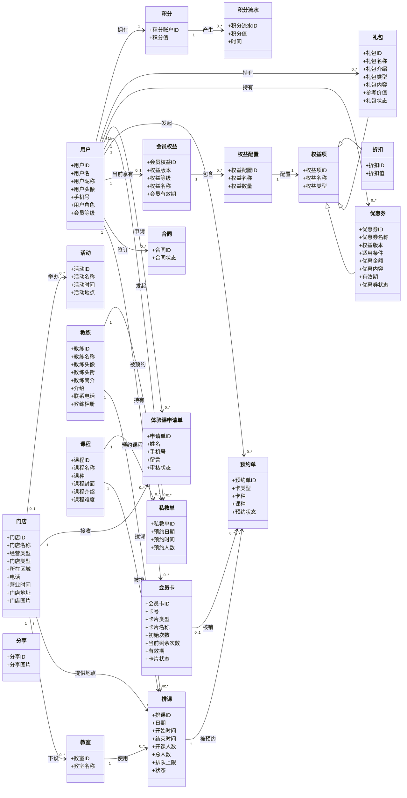

# 瑜伽普拉提需求分析文档

## 领域类图

```mermaid
classDiagram
    direction LR

    %% =========================
    %% 用户与会员
    %% =========================

    class 用户 {
        +用户ID
        +用户名
        +用户昵称
        +用户头像
        +手机号
        +用户角色
        +会员等级
    }

    class 会员卡 {
        +会员卡ID
        +卡号
        +卡片类型
        +卡片名称
        +初始次数
        +当前剩余次数
        +有效期
        +卡片状态
    }

    class 会员权益 {
        +会员权益ID
        +权益版本
        +权益等级
        +权益名称
        +会员有效期
    }

    class 合同 {
        +合同ID
        +合同状态
    }

    用户 "1" --> "0..*" 会员卡 : 持有
    用户 "1" --> "0..*" 合同 : 签订
    用户 "1" --> "0..1" 会员权益 : 当前享有


    %% =========================
    %% 门店与课程资源
    %% =========================

    class 门店 {
        +门店ID
        +门店名称
        +经营类型
        +门店类型
        +所在区域
        +电话
        +营业时间
        +门店地址
        +门店图片
    }

    class 教室 {
        +教室ID
        +教室名称
    }

    class 教练 {
        +教练ID
        +教练名称
        +教练头像
        +教练头衔
        +教练简介
        +介绍
        +联系电话
        +教练相册
    }

    class 课程 {
        +课程ID
        +课程名称
        +课种
        +课程封面
        +课程介绍
        +课程难度
    }

    门店 "1" --> "0..*" 教室 : 下设


    %% =========================
    %% 排课
    %% =========================

    class 排课 {
        +排课ID
        +日期
        +开始时间
        +结束时间
        +开课人数
        +总人数
        +排队上限
        +状态
    }

    门店 "1" --> "0..*" 排课 : 提供地点
    教室 "1" --> "0..*" 排课 : 使用
    课程 "1" --> "0..*" 排课 : 被排
    教练 "1" --> "0..*" 排课 : 授课


    %% =========================
    %% 预约
    %% =========================

    class 预约单 {
        +预约单ID
        +卡类型
        +卡种
        +课种
        +预约状态
    }

    class 私教单 {
        +私教单ID
        +预约日期
        +预约时间
        +预约人数
    }

    class 体验课申请单 {
        +申请单ID
        +姓名
        +手机号
        +留言
        +审核状态
    }

    用户 "1" --> "0..*" 预约单 : 发起
    排课 "1" --> "0..*" 预约单 : 被预约
    会员卡 "0..1" --> "0..*" 预约单 : 核销

    用户 "1" --> "0..*" 私教单 : 发起
    教练 "1" --> "0..*" 私教单 : 被预约
    课程 "1" --> "0..*" 私教单 : 预约课程

    用户 "1" --> "0..*" 体验课申请单 : 申请
    门店 "1" --> "0..*" 体验课申请单 : 接收


    %% =========================
    %% 会员权益
    %% =========================

    class 权益配置 {
        +权益配置ID
        +权益名称
        +权益数量
    }

    class 权益项 {
        +权益项ID
        +权益名称
        +权益类型
    }

    class 优惠券 {
        +优惠券ID
        +优惠券名称
        +权益版本
        +适用条件
        +优惠金额
        +优惠内容
        +有效期
        +优惠券状态
    }

    class 礼包 {
        +礼包ID
        +礼包名称
        +礼包介绍
        +礼包类型
        +礼包内容
        +参考价值
        +礼包状态
    }

    class 折扣 {
        +折扣ID
        +折扣值
    }

    会员权益 "1" --> "0..*" 权益配置 : 包含
    权益配置 "1" --> "1" 权益项 : 配置

    权益项 <|-- 优惠券
    权益项 <|-- 礼包
    权益项 <|-- 折扣

    用户 "1" --> "0..*" 优惠券 : 持有
    用户 "1" --> "0..*" 礼包 : 持有


    %% =========================
    %% 积分
    %% =========================

    class 积分 {
        +积分账户ID
        +积分值
    }

    class 积分流水 {
        +积分流水ID
        +积分值
        +时间
    }

    用户 "1" --> "1" 积分 : 拥有
    积分 "1" --> "0..*" 积分流水 : 产生


    %% =========================
    %% 活动
    %% =========================

    class 活动 {
        +活动ID
        +活动名称
        +活动时间
        +活动地点
    }

    门店 "0..1" --> "0..*" 活动 : 举办


    %% =========================
    %% 分享
    %% =========================

    class 分享 {
        +分享ID
        +分享图片
    }
```