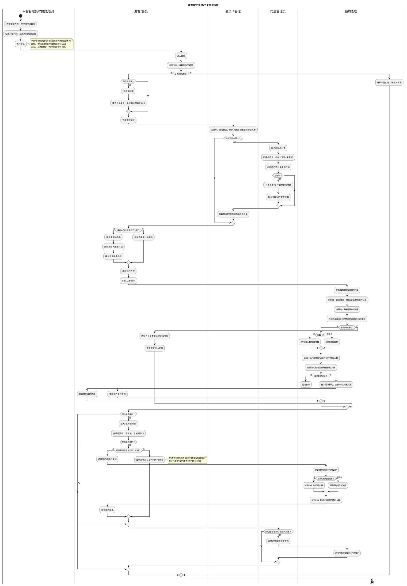

# MVP 业务流程图

**版本：v0.4**（2026-09-29）
**适用范围：** 门店、课程、教练、排班、会员、会员卡和预约的 MVP 闭环

## 1. 业务说明

本流程描述一次完整的 MVP 预约闭环：管理端先为排班选择门店、课程、教练并设置开始时间、结束时间和总容量；游客浏览门店和课程排班，登录后成为初始等级为 0 的会员。会员首次没有可用卡时，由门店管理员先开卡并激活；会员卡激活后可以持续使用，后续预约不再需要管理员介入。

预约时，系统先根据课种筛选已激活且可用的会员卡：团课和精品课可以使用普拉提次数卡或适用的期限卡，私教课只能使用私教次数卡。只有一张候选卡时自动选中；有多张候选卡时展示全部候选卡并默认选中列表第一张，会员可以切换。

同一会员对同一排班只能生成一条预约记录，但一条记录可以填写两人或多人同行的预约人数。提交预约后，系统通过 MySQL 行级锁锁定排班记录，按预约人数校验剩余容量，并在同一事务内完成预约创建、次数卡按预约人数扣减、已预约人数增加；期限卡只校验有效期，预约记录本身代表本次使用。

## 2. 业务流程图

## 3. 已确认规则

- 只有已激活、未过期或次数充足，并且适用当前课种的会员卡才能参与选择。
- 团课和精品课可以使用普拉提次数卡或适用的期限卡；私教课只能使用私教次数卡。
- 多张候选卡全部展示并默认选中列表第一张，会员可以切换。
- 同一会员对同一排班只能有一条预约记录，但预约记录可以填写多人同行的预约人数。
- 次数卡按预约人数扣减，例如预约两人扣两次；期限卡只校验有效期，预约记录本身代表本次使用。
- 预约使用 MySQL 排班记录行级锁和事务控制容量，必须防止并发超卖。
- 取消次数卡预约时按预约人数返还次数；取消期限卡预约时不处理会员卡次数。
- 会员和门店管理员均不能在开课前两小时内取消预约；MVP 不支持门店单独配置取消时限。
- 门店管理员在预约管理中手工签到；支付宝刷脸等自动签到方式不纳入 MVP。
- 取消原因包括“临时有事”“请假”“身体不适”。
- 排班修改或取消后，通过短信和站内信通知受影响会员。
- 排班取消后，关联的“已预约”记录自动变为“已取消”，取消来源为“排班取消”；次数卡按预约人数立即返还，期限卡不处理次数。
- 短信和站内信只尝试发送一次，发送失败不重试。
- 平台管理员、门店管理员及店长、前台等细分权限本期暂不设计，先完成管理页面。
