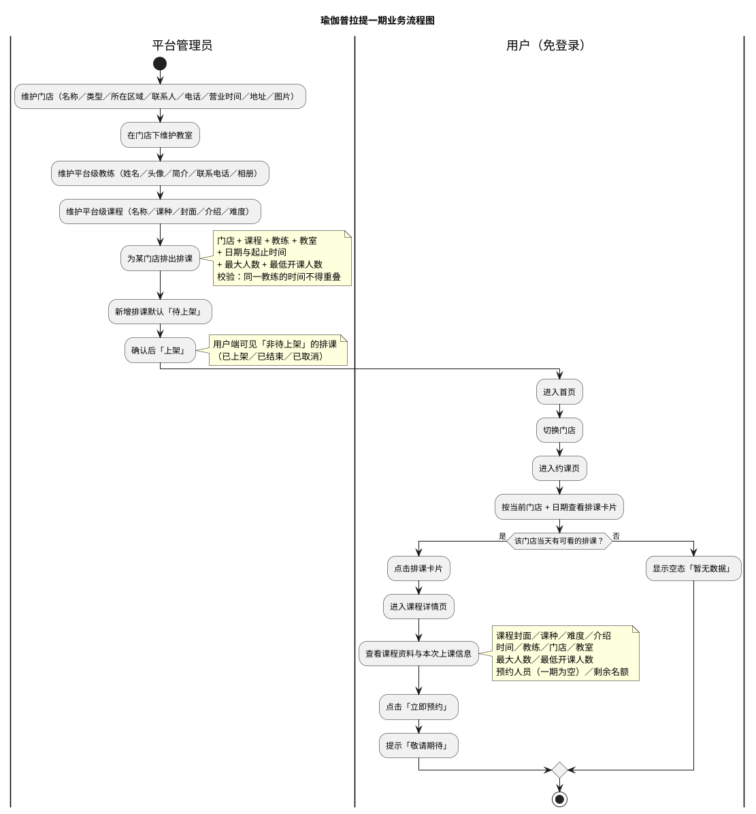

# MVP 业务流程图

**文档版本：v2.0（重置版）**（2026-10-01）
**适用范围：** 一期 —— 门店、教室、教练、课程的维护，排课的创建与上架，以及用户端免登录浏览。
**依据：** [`业务规则.md`](业务规则.md) v2.1；用户端界面与跳转以 `docs/产品分析/` 的实测截图与跳转梳理为准（见《依据来源》）。

## 1. 业务说明

管理端由**平台管理员**先维护**门店**（含门店类型与所在区域），再在门店下维护**教室**；**教练**与**课程**都是**平台级主数据、不归属门店**——"这家门店有这个课"只是因为这**家门店排了这门课的班**。

然后管理员为某门店排出**排课**：门店 ＋ 课程 ＋ 教练 ＋ 教室 ＋ 日期与起止时间 ＋ 最大人数 ＋ 最低开课人数。新增的排课默认处于**待上架**，管理员确认后**上架**，用户端才看得到。

用户端**免登录**：进入**首页**切换门店，进入**约课页**按当前门店与日期查看排课卡片，点击卡片进入**课程详情页**。一期**不提供预约**，详情页的「立即预约」点击后提示"敬请期待"。

## 2. 业务流程图

## 3. 一期已确认的关键口径

| # | 口径 | 依据 |
|---|---|---|
| 1 | 课程是**平台级**、不归属门店；用户端切换门店后看到的「课程列表」实质是该门店的**排课列表** | `BR-课程-001` |
| 2 | 教练是**平台级**，不归属门店、不与门店关联；排课时直接选 | `BR-教练-001` |
| 3 | 新增排课默认**待上架**，用户端不可见；**上架**后才可见；**取消后仍在用户端可见（标注已取消）**，**下架（回到待上架）后不可见** | `BR-排课-011`、`BR-排课-015` |
| 4 | **同一教练任意两节排课的时间不得重叠**，重叠即拒绝保存 | `BR-排课-008` |
| 5 | 排课只能排**今天起 14 天内**；用户端日期条同为 14 天 | `BR-排课-009`、`BR-排课-017` |
| 6 | 一期**没有预约**：「已预约人数」恒为 0，「剩余名额」恒等于最大人数 | `BR-排课-018` |
| 7 | 最低开课人数只**录入、校验范围与展示**，一期**不做自动取消**、不设定时任务 | `BR-排课-005` |
| 8 | 门店／教室／教练／课程被**未结束且待上架或已上架**的排课引用时**拒绝删除**；已取消与已结束的排课不阻塞 | `BR-全局-009` |
| 9 | 用户端**免登录**，一期只到"看"，不产生任何业务写操作 | `BR-全局-002` |
