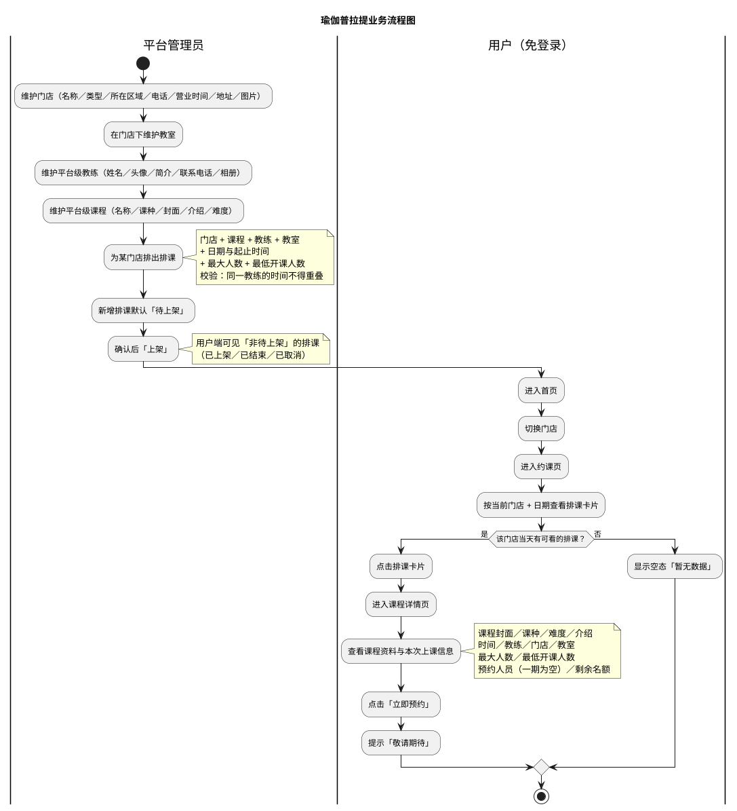

# MVP 业务流程图

## 业务流程图

```plantuml
@startuml
title 瑜伽普拉提业务流程图

|平台管理员|
start
:维护门店（名称／类型／所在区域／电话／营业时间／地址／图片）;
:在门店下维护教室;
:维护平台级教练（姓名／头像／简介／联系电话／相册）;
:维护平台级课程（名称／课种／封面／介绍／难度）;
:为某门店排出排课;
note right
  门店 + 课程 + 教练 + 教室
  + 日期与起止时间
  + 最大人数 + 最低开课人数
  校验：同一教练的时间不得重叠
end note
:新增排课默认「待上架」;
:确认后「上架」;
note right
  用户端可见「非待上架」的排课
  （已上架／已结束／已取消）
end note

|用户（免登录）|
:进入首页;
:切换门店;
:进入约课页;
:按当前门店 + 日期查看排课卡片;
if (该门店当天有可看的排课？) then (是)
  :点击排课卡片;
  :进入课程详情页;
  :查看课程资料与本次上课信息;
  note right
    课程封面／课种／难度／介绍
    时间／教练／门店／教室
    最大人数／最低开课人数
    预约人员（一期为空）／剩余名额
  end note
  :点击「立即预约」;
  :提示「敬请期待」;
else (否)
  :显示空态「暂无数据」;
endif
stop
@enduml
```