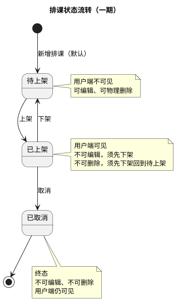

# 状态流转图

**文档版本：v2.0（重置版）**（2026-10-01）

> **一期门店、教室、课程都没有状态**（`BR-门店-008`、`BR-教室-003`、`BR-课程-007`），需要状态流转的只有**排课**。
> 本文件原名「课程状态流转图」，现描述**排课状态流转**；建议更名为 `排课状态流转图.md`。

## 1. 落库状态只有三个

**待上架 / 已上架 / 已取消**。「已结束」**不落库**，由「结束时间不晚于当前时间」推导（`BR-排课-010`）。

**没有「已下架」这个状态**：下架 = 回到「待上架」（`BR-排课-012`）。

## 2. 派生的「已结束」

| 项 | 说明 |
|---|---|
| 怎么来的 | **不落库**。结束时间不晚于当前时间即视为已结束（`BR-排课-010`） |
| 用户端 | **展示**（用户端可见口径＝「非待上架」，`BR-排课-015`） |
| 能否编辑 | **不能**（`BR-排课-013`） |
| 能否删除 | **不能**（`BR-排课-014`） |
| 是否阻塞主数据删除 | **不阻塞**——门店／教室／教练／课程的删除门禁只统计「未结束」的排课（`BR-全局-009`） |

## 3. 各状态能做什么（速查）

| 状态 | 编辑 | 物理删除 | 上架 | 下架 | 取消 | 用户端可见 |
|---|:--:|:--:|:--:|:--:|:--:|:--:|
| 待上架 | ✅ | ✅ | ✅ | — | — | ❌ |
| 已上架（未结束） | ❌ | ❌ | — | ✅ | ✅ | ✅ |
| 已上架（已结束） | ❌ | ❌ | — | — | — | ✅ |
| 已取消 | ❌ | ❌ | — | — | — | ✅ |

## 4. 相关规则

`BR-排课-010` ~ `BR-排课-016`、`BR-全局-009`
